# How ROS 2 fits together

The missions teach one building block at a time. This page shows how they fit together:
what a ROS 2 system looks like from above, the four ways nodes talk, how to choose between them,
how tf2 keeps track of where everything is, and the patterns that turn a handful of nodes into a robot.

Read it once after [mission 3](missions/03-mission-control.md), when you know topics and services, and come back after missions 7 and 12.
It makes more sense each time.

For the parts on their own (what each one is, which mission teaches it, and what the course leaves out), see [CONCEPTS.md](CONCEPTS.md).

---

## The big picture: a robot is a graph

A ROS 2 system is a set of nodes (programs, each doing one job) connected by named channels.
No node calls another node's functions; they only agree on channel names and message types.
Here is the course during mission 8:

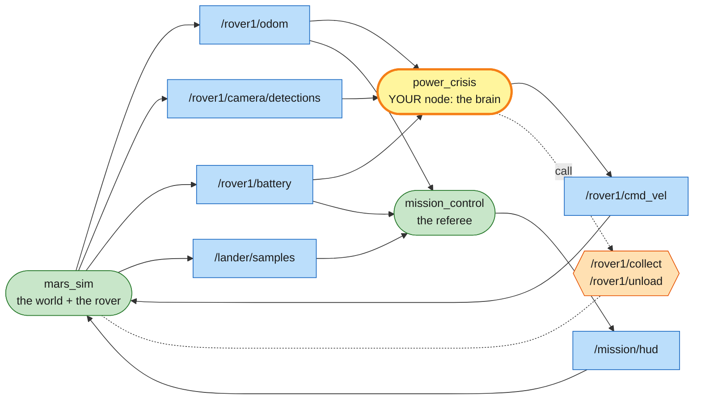

Every arrow goes through a named channel. `power_crisis` has no idea `mission_control` exists, and doesn't need to.

One topic can have many readers. `/rover1/odom` feeds both your node and the referee; add a third reader (`ros2 topic echo`) and nothing else changes.

You can swap any box and the rest keeps working. Replace `mars_sim` with a real rover that offers the same topics and services, and `power_crisis` drives it unchanged. That's why ROS 2 is built this way, and why the simulator uses the standard message types (`Odometry`, `LaserScan`, `BatteryState`, `JointState`) that real robots use.

You can draw this graph live, at any time, with `rqt_graph` (`sudo apt install ros-$ROS_DISTRO-rqt-graph`).

## How to read the maps

Every mission has a system map drawn in this style:


| Shape | Colour | Meaning |
|---|---|---|
| rounded pill | 🟩 green | a node that already exists (simulator, mission control, teleop) |
| rounded pill, thick border | 🟨 yellow | you: your own node, or a `ros2 ...` command you type (the CLI runs a temporary node) |
| rectangle, solid arrows | 🟦 blue | a topic; arrows show which way the data flows |
| hexagon, dotted lines | 🟧 orange | a service; the dotted arrow comes from the client, the plain dotted line goes to the server that offers it |
| box with side bars, thick lines | 🟪 purple | an action |
| cylinder | ⬜ grey | a parameter stored inside a node |

---

## The four ways nodes talk

### 1. Topics: a stream of messages

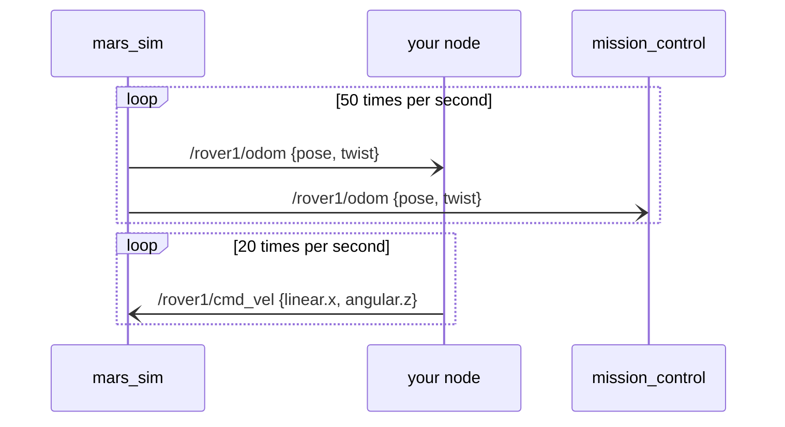

A topic is one-way, fire and forget. The publisher never learns who, if anyone, received the message. Any number of publishers and subscribers can share a topic. Two publishers on one `cmd_vel` fight each other, which is how mission_control spots your teleop running next to your node.

Use topics for data that keeps flowing: sensor readings, positions, velocity commands, joint states.
Missions: 1, 2 (CLI) · 4 (publisher) · 5 (subscriber) · every mission after that.

### 2. Services: one question, one answer

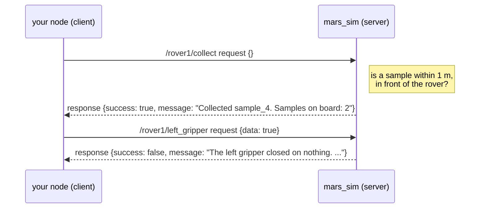

A service is two-way: the client sends a request and gets exactly one response back. Each service name has one server and any number of clients.

Use services for short jobs where you want to know the outcome, like spawn, take a photo, collect or grab. Don't use them for anything slow, because the client is left waiting. In code, always use `call_async` and never block inside a callback (mission 6).
Missions: 3 (CLI) · 6, 8, 11, 12 (clients in code).

### 3. Actions: a long job you can watch and cancel

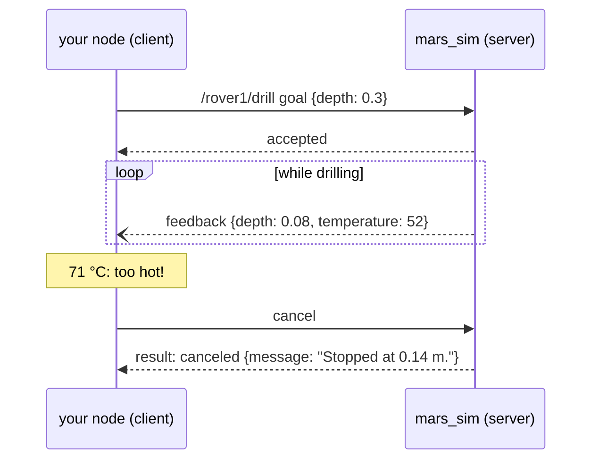

An action is a service for long tasks. The client sends a goal, the server accepts it, sends feedback while it works and finally a result, and the client can cancel at any time. In mission 11 the drill heats up while it works: without the feedback you couldn't know when to stop, and without cancel you couldn't stop it. Under the hood an action is just 3 services and 2 topics (`send_goal`, `cancel_goal`, `get_result` + `feedback`, `status`). You can list them with `ros2 service list --include-hidden-services` and `ros2 topic list --include-hidden-topics`.

Use actions for navigating somewhere, moving an arm along a path, drilling: anything that takes seconds and might need stopping.
Missions: 11 (CLI and client in code), 12. Real robots use actions everywhere: Nav2's `navigate_to_pose`, MoveIt's `move_action`.

### 4. Parameters: a node's settings

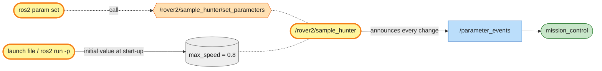

Parameters are named values inside a node (`max_speed`, `sand_slip`) that can be set at start-up and changed while it runs. Under the hood every node offers services such as `get_parameters` / `set_parameters` (you saw them in `ros2 service list` in mission 3), and changes are announced on the `/parameter_events` topic. That's how mission_control ticks the "change a parameter" objective in mission 7.

Use parameters for configuration and tuning: speeds, gains, ranges, which robot to control.
Missions: 7 (and every `key:=value` you pass to `ros2 launch`).

### Which one do I need?

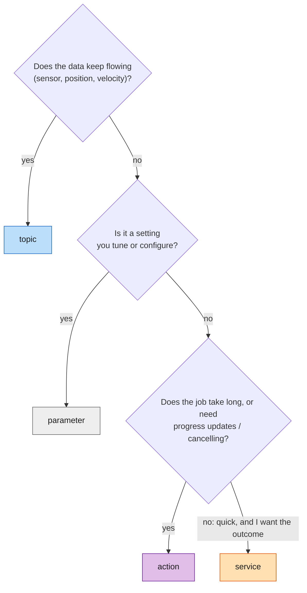

| Job | Choice | In this course | On a real robot |
|---|---|---|---|
| where am I | topic | `/rover1/odom`, `/tf` | `/odom`, `/tf`, exactly the same |
| what do I see | topic | `/rover1/scan`, `/rover1/camera/detections` | `/scan` (LiDAR), `/camera/image_raw`, `vision_msgs` detections |
| move | topic | `/rover1/cmd_vel` | `/cmd_vel`, exactly the same |
| how full is the battery | topic | `/rover1/battery` | `/battery_state`, exactly the same type |
| joint angles | topic | `/rover1/joint_states` | `/joint_states`, exactly the same |
| grab / release, collect, take a photo | service | `/rover1/left_gripper`, `/rover1/collect` | gripper services or actions |
| spawn / reset | service | `/spawn_rover` | `/reset_odometry`, `/clear_costmap` |
| drill, go somewhere far | action | `/rover1/drill` · *(driving: you write a node instead)* | Nav2 `/navigate_to_pose` |
| top speed, how slippery sand is | parameter | `max_speed`, `sand_slip` | `max_vel_x`, `inflation_radius` |

---

## tf2: where everything is

Robots are full of coordinate frames: the map, the rover's body, the laser, each arm joint, the gripper. A point "1 m in front of the rover" means something different in every frame. tf2 keeps a tree of frames and how each one is placed relative to its parent, and answers "where is X, seen from Y?" for you.

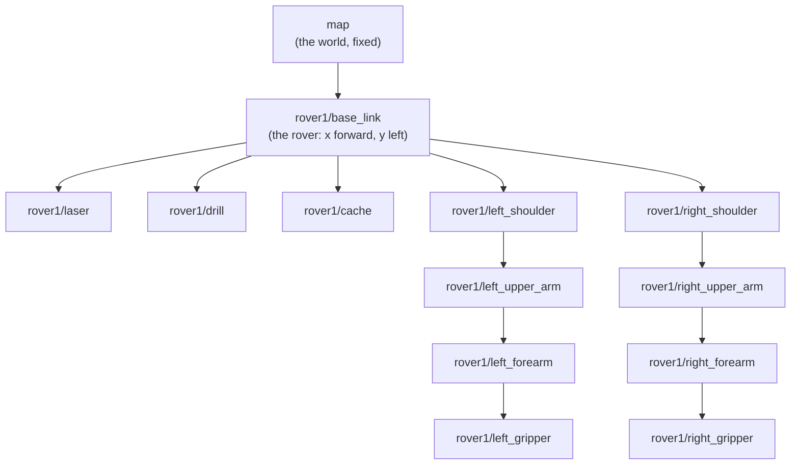

It is built on two plain topics: `/tf` for frames that move (the rover in the map, the arm links), published by mars_sim 50 times a second, and `/tf_static` for frames that never move relative to their parent (the laser, the shoulders). Any node can listen with a `TransformListener` and ask its `Buffer`. One line then turns a target given in the map into a point seen from the shoulder, which is exactly what inverse kinematics needs (mission 10):

```python
p = self.tf_buffer.transform(point_in_map, 'rover1/left_shoulder').point
```

Without tf2 every node would carry its own copy of the rover's geometry and its own frame maths, and they would drift apart. With it, the geometry lives in one place, the node that publishes the frames.
Look at the tree with `ros2 run tf2_tools view_frames` or in RViz (add the TF display, fixed frame `map`), and at one transform with `ros2 run tf2_ros tf2_echo map rover1/left_gripper`.
Missions: 9 (`tf2_echo`) · 10, 11 (in code).

---

## Putting them together: design patterns

The four channels are the parts. These patterns are the usual ways to put them together into a robot.

### Pattern 1: sense, think, act

Almost every robot node has the same shape. Topics come in (sensors), the node decides, and topics, services and actions go out (actuators).

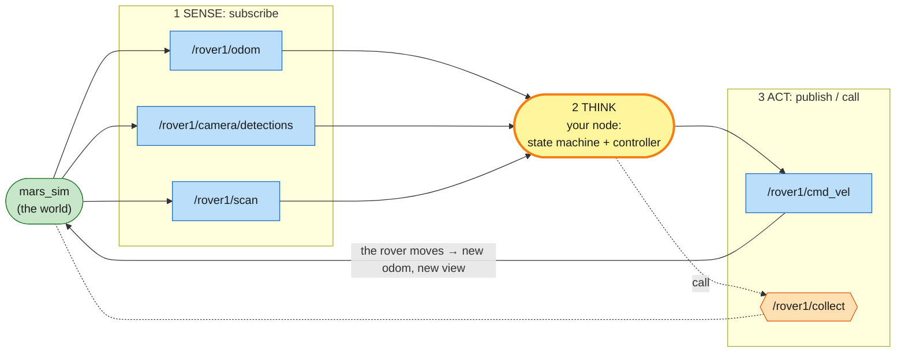

The arrow from the world back to SENSE is what makes it a closed loop (mission 5): every action changes what the sensors report next.

### Pattern 2: inside a node, callbacks remember and a timer decides

A node is one process with one executor (`rclpy.spin()`), which runs callbacks one at a time as things arrive:

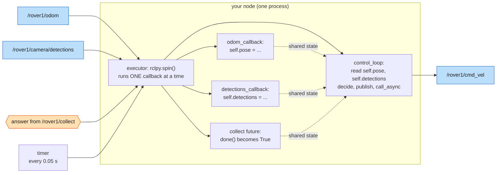

Subscriber callbacks only store the latest data, so they stay short and fast. One timer makes all the decisions at a steady rate, using whatever is latest.

Nothing may wait inside a callback (`sleep`, a blocking service call). While it waits, the executor can't deliver anything else, including the answer you're waiting for, and the node is stuck in a **deadlock** (mission 6). Use `call_async` and check `future.done()` on the next tick; for actions, use `send_goal_async` and done-callbacks (mission 11).

### Pattern 3: one node, many robots (namespaces + parameters + launch)

Write the node once with relative names, then start it as often as you like:

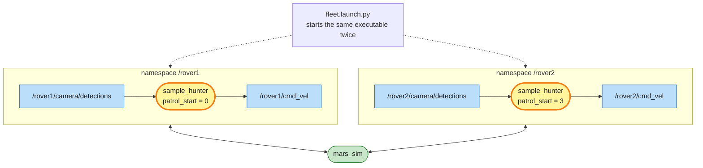

Same code, two robots, no copy-paste. Real fleets work the same way (mission 7).

### Pattern 4: split big jobs into small nodes

In mission 12 one node (`meteorite_mover`) does everything: driving, IK, gripping, deciding. That's fine for a mission,
but real robot software splits a big job into layers, each a node with a small, clear interface:

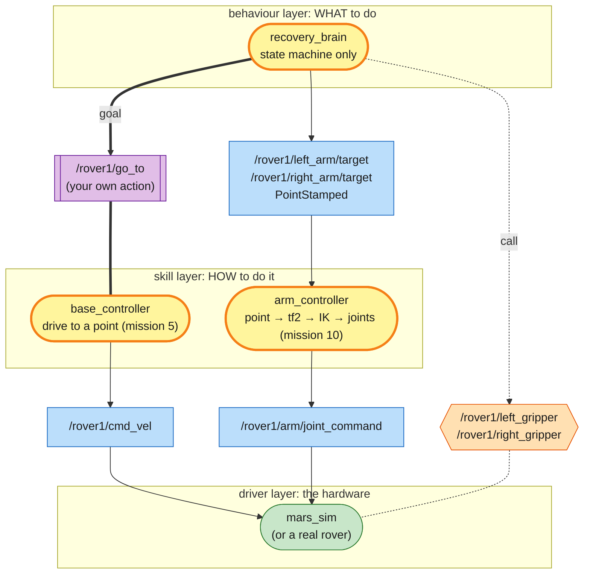

This is a design sketch: the `go_to` action and the `*/target` topics don't exist until you write these nodes (CONCEPTS.md shows how to write an action server). To keep it readable, the diagram leaves out that all three also read `/rover1/odom` or tf, and that the brain reads `/mission/items` and the battery.

| You gain | You pay |
|---|---|
| reuse: `base_controller` also solves missions 5, 6, 8 and 11 | more files, more launch-file wiring |
| test parts alone: `ros2 action send_goal /rover1/go_to ...` drives the rover without the brain | messages add a little delay |
| replace parts: a smarter IK or a real rover, nothing else changes | you must design the interfaces (names + types) carefully |
| teamwork: one person per node | |

A rule of thumb: give a job its own node when you'd want to reuse, test, replace or restart it on its own.
`base_controller` is an action because driving takes seconds and you want feedback and cancel. That is exactly Nav2's `navigate_to_pose`.

### Pattern 5: watch the system from outside

`mission_control` is a node like any other. It never reads the simulator's memory or your code, only ROS interfaces.

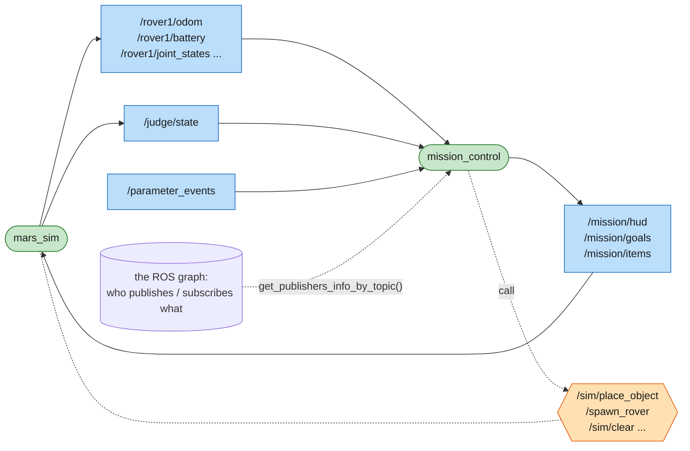

Monitoring, logging (`ros2 bag record`), dashboards and safety supervisors on real robots are built the same way. They're just more subscribers, so you can add them without touching the robot's code.

---

## Under the hood: how messages actually travel

ROS 2 has no central server. Each node finds the others by itself (discovery) and they talk directly, through a middleware called **DDS**:

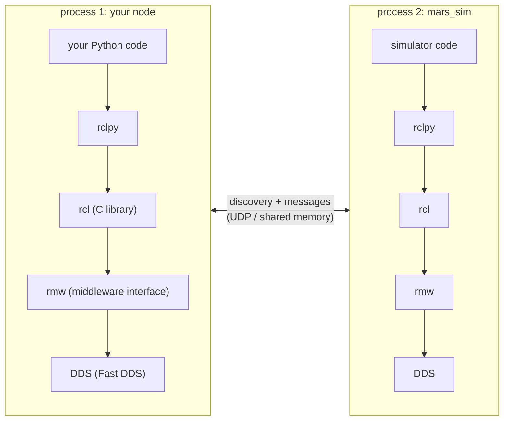

In practice:

| Fact | Where you meet it |
|---|---|
| nodes in different processes, even different computers, talk the same way | run `sample_hunter` on one laptop, the simulator on another (TEACHER.md) |
| everyone with the same `ROS_DOMAIN_ID` on the network can see each other | why each learner in a classroom needs their own number |
| a node that starts late still finds the others; there's no start-up order | start your node before or after the mission, both work |
| the `10` in `create_publisher(..., 10)` is a QoS setting: keep the last 10 messages if the reader is slow | every publisher and subscriber you write |
| message types are the contract; both sides must use the same type, or they never connect | `ros2 topic info` shows the type before you publish |

---

## Tools to see the architecture

| Question | Command |
|---|---|
| draw the whole graph | `rqt_graph` |
| which nodes exist | `ros2 node list` |
| everything one node publishes, subscribes, serves | `ros2 node info /mars_sim` |
| who is on this topic | `ros2 topic info -v /rover1/cmd_vel` |
| what's inside a message / service / action type | `ros2 interface show mars_interfaces/action/Drill` |
| a node's settings | `ros2 param list /rover2/sample_hunter` |
| the frame tree | `ros2 run tf2_tools view_frames` · RViz with the TF display |
| record everything and replay it later | `ros2 bag record -a` · `ros2 bag play <folder>` |

## The building blocks, mission by mission

| Mission | New in the map |
|---|---|
| [0](missions/00-landing.md) | nodes and topics exist (teleop → simulator → mission control); remapping a topic name |
| [1](missions/01-telemetry.md) | you join the graph from the CLI: subscribe (`echo`), publish (`pub`) |
| [2](missions/02-manual-drive.md) | many publishers on one topic (`cmd_vel`) |
| [3](missions/03-mission-control.md) | services; a service can create new topics and services (`/spawn_rover`) |
| [4](missions/04-survey-square.md) | your own node: package → executable → node; a timer and a publisher |
| [5](missions/05-waypoints.md) | subscribers; standard robot messages (`Odometry`); the closed loop |
| [6](missions/06-sample-hunter.md) | several sensors at once; a service client in code, `call_async` |
| [7](missions/07-rover-fleet.md) | namespaces, parameters, launch files: one node, many robots |
| [8](missions/08-boss-power-crisis.md) | sense, think, act with several topics and services; a state machine |
| [9](missions/09-arm-check.md) | the standard arm interfaces: `JointState`, `SetBool`; looking up frames with tf2 |
| [10](missions/10-frames.md) | tf2 in code: let the frame tree do the coordinate maths, then IK |
| [11](missions/11-drill-and-stow.md) | actions in code: goal, feedback, cancel, result; waiting on events, not on time |
| [12](missions/12-boss-meteorite-recovery.md) | two control loops in one node, and how you would split them (pattern 4) |
