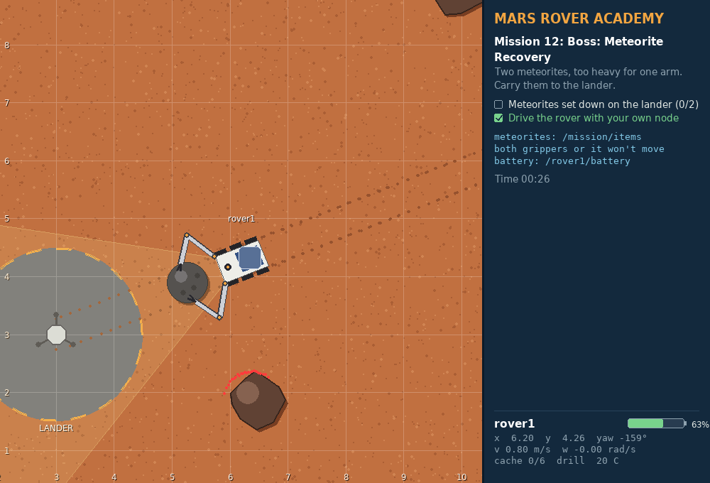

# Mars Rover Academy: learn ROS 2 by driving a rover on Mars



A beginner ROS 2 course with no wall of theory up front. You launch a mission, get the rover to do the job, and mission control checks your work and hands out stars.
Each mission adds one piece of ROS 2, from driving the rover with the keyboard to a rover that drills core samples and carries meteorites home on its own.

Everything runs in a small 2D simulator written for this course, `mars_sim`. It runs on any laptop, and it speaks the same ROS interfaces as real robots:

- `nav_msgs/Odometry` for where the rover is, `sensor_msgs/LaserScan` for the laser, `sensor_msgs/BatteryState` for the battery, `sensor_msgs/JointState` for the arms, and a real tf2 tree you can open in RViz.
- A camera that reports what it sees (samples, rocks, landmarks) as range and bearing.
- Physics that matter: the rover speeds up and slows down gradually, slips on sand, stops when it hits a rock, and runs out of battery.
- Two 2-link arms with grippers, a sample cache on its back, and a drill that is a ROS 2 **action** with feedback and cancel.
- `mission_control` sets up each mission, shows the objectives in the window, checks them live and gives stars for speed. Coding missions notice if you sneak in the keyboard or `ros2 topic pub`, by reading the real ROS graph.

## Mission map

### Part 1: the rover

| # | Mission | You learn | Tools |
|---|---|---|---|
| 0 | [Landing](missions/00-landing.md) | workspace, build, launch, teleop, remapping | terminal |
| 1 | [Telemetry](missions/01-telemetry.md) | nodes, topics, messages | `ros2 topic` |
| 2 | [Manual Drive](missions/02-manual-drive.md) | publishing `Twist`, speeds and angles (radians) | `ros2 topic pub` |
| 3 | [Mission Control](missions/03-mission-control.md) | services (request/response) | `ros2 service` |
| 4 | [Survey Square](missions/04-survey-square.md) | creating a package, a Python publisher | Python |
| 5 | [Waypoints](missions/05-waypoints.md) | subscribers, `Odometry` and quaternions, closed-loop control | Python |
| 6 | [Sample Hunter](missions/06-sample-hunter.md) | camera and laser, service clients in code | Python |
| 7 | [Rover Fleet](missions/07-rover-fleet.md) | namespaces, parameters, launch files | Python + launch |
| 8 | [Boss: Power Crisis](missions/08-boss-power-crisis.md) | all of the above + state machines, battery | Python |

### Part 2: the arms

| # | Mission | You learn | Tools |
|---|---|---|---|
| 9 | [Arm Check](missions/09-arm-check.md) | joints, `sensor_msgs/JointState`, `SetBool` grippers, `tf2_echo` | `ros2 topic pub`, `ros2 service call` |
| 10 | [Frames](missions/10-frames.md) | coordinate frames with tf2, inverse kinematics | Python |
| 11 | [Drill & Stow](missions/11-drill-and-stow.md) | actions in code: goal, feedback, cancel, result + pick and place | Python |
| 12 | [Boss: Meteorite Recovery](missions/12-boss-meteorite-recovery.md) | mobile manipulation, two arms together | Python |

Missions 0–3 and 9 use terminal commands only; the others are your own Python nodes.

Every mission has a system map: a diagram of the nodes, topics, services and actions involved, so you can see how the pieces connect
and not only what to type. [ARCHITECTURE.md](ARCHITECTURE.md) puts it all together: how ROS 2 systems are designed,
when to use a topic, a service, an action or a parameter, and what happens under the hood.
[CONCEPTS.md](CONCEPTS.md) goes the other way: it lists every part of ROS 2, shows which mission teaches it,
explains each one with an example, and ends with a self-check and the topics to learn after the course.

## Quick start (5 minutes)

You need ROS 2 on Ubuntu. We recommend **ROS 2 Jazzy** (Ubuntu 24.04) or newer ([install guide](https://docs.ros.org/en/jazzy/Installation/Ubuntu-Install-Debs.html)).
The course is tested on Jazzy and Humble (Ubuntu 22.04). With another distro, put its name wherever you see `jazzy`.

```bash
source /opt/ros/jazzy/setup.bash
sudo apt install python3-pygame python3-numpy ros-$ROS_DISTRO-teleop-twist-keyboard
git clone <url of this repo> ~/mars_rover
cd ~/mars_rover
colcon build --symlink-install
source install/setup.bash
ros2 launch mission_control mission.launch.py mission:=0
```

Then go to [Mission 0: Landing](missions/00-landing.md).

To see your stars so far:

```bash
ros2 run mission_control progress
```

## How every mission works

```bash
# Terminal 1: start the mission (the simulator window + mission control)
ros2 launch mission_control mission.launch.py mission:=<number>

# Terminal 2, 3, ...: do the work (remember to source every new terminal!)
source ~/mars_rover/install/setup.bash
```

The objectives are listed in the panel on the right and tick themselves off when done. Finish them all and you get stars based on your time (coding missions start the clock when the rover first moves). Some missions can also fail, for example when the battery runs flat; the panel tells you why. To start over, close the window (or press Ctrl+C) and launch again.

## What's in this repo

```text
missions/               mission guides 0-12 (start here)
CHEATSHEET.md           ROS 2 commands + Python snippets on one page
ARCHITECTURE.md         how ROS 2 systems fit together: the big picture, diagrams, design patterns
CONCEPTS.md             every part of ROS 2, which mission teaches it, with examples and a self-check
CHECKLIST.md            progress checklist for learners: objectives, steps and skills of every mission
slides/                 teaching slides (Marp): the whole course in one deck, a one-hour intro, per-mission decks
TEACHER.md              instructor guide: lesson plan, classroom contests, writing new missions
src/
  mars_sim/             the simulator (world.py: physics, render.py: drawing, node.py: the ROS interface)
  mars_interfaces/      its messages, services and the Drill action
  mission_control/      mission_control, all missions, the star board
```

The earlier version of this course, built on a turtle simulator, is kept at the git tag `turtle-quest-v1`.

## License

Apache-2.0, see [LICENSE](LICENSE).
