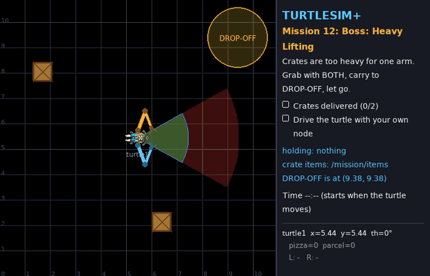

# Turtle Quest: learn ROS 2 by playing with turtles



A beginner ROS 2 course with no wall of theory up front. You launch a mission, get the turtle to the goal, and the game checks your work and hands out stars.
Each mission adds one piece of ROS 2, from driving a turtle by hand to a two-armed turtle that carries crates on its own.

The course is built on [turtlesim_plus](https://github.com/tchoopojcharoen/turtlesim_plus),
a turtlesim whose turtles have sensors, eat pizza and deliver parcels. This repo adds:

- A quest master, `quest_master`, that sets up the world, shows the objectives in the window, checks them live and gives stars for speed.
- Talking turtles: `ros2 topic pub /turtle1/say ...` puts a speech bubble over the turtle.
- Dual-arm turtles with two 2-link arms and grippers, driven with the standard `sensor_msgs/JointState`. Heavy crates need both hands.
- Goal flags, a coordinate grid and a status panel, so you can always see where the turtle is (x, y, θ).
- Cheat detection. Coding missions notice if you sneak in teleop or `ros2 topic pub`, by reading the real ROS graph.

## Mission map

### Part 1: the turtle

| # | Mission | You learn | Tools |
|---|---|---|---|
| 0 | [Boot Camp](missions/00-boot-camp.md) | workspace, build, launch, your first nodes | terminal |
| 1 | [Spy Turtle](missions/01-spy.md) | nodes, topics, messages | `ros2 topic` |
| 2 | [Steering Wheel](missions/02-steering.md) | publishing `Twist`, speeds and angles (radians) | `ros2 topic pub` |
| 3 | [Service Hotline](missions/03-hotline.md) | services (request/response) | `ros2 service` |
| 4 | [My First Node](missions/04-first-node.md) | creating a package, a Python publisher | Python |
| 5 | [Turtle Eyes](missions/05-eyes.md) | subscribers, closed-loop control | Python |
| 6 | [Pizza Hunter](missions/06-pizza-hunter.md) | reading a sensor, service clients in code | Python |
| 7 | [Turtle Team](missions/07-team.md) | namespaces, parameters, launch files | Python + launch |
| 8 | [Boss: Turtle Express](missions/08-boss-delivery.md) | all of the above + thinking in state machines | Python |

### Part 2: the arms

| # | Mission | You learn | Tools |
|---|---|---|---|
| 9 | [Arm Day](missions/09-arm-day.md) | joints, `sensor_msgs/JointState`, `SetBool` grippers | `ros2 topic pub`, `ros2 service call` |
| 10 | [Long Reach](missions/10-long-reach.md) | coordinate frames, forward & inverse kinematics | Python |
| 11 | [Pick & Place](missions/11-pick-place.md) | manipulation as a state machine, waiting for motion | Python |
| 12 | [Boss: Heavy Lifting](missions/12-boss-heavy-lifting.md) | mobile manipulation, two-arm coordination | Python |

Missions 0–3 and 9 use terminal commands only; the others are your own Python nodes.

Every mission has a system map: a diagram of the nodes, topics, services and actions involved, so you can see how the pieces connect
and not only what to type. [ARCHITECTURE.md](ARCHITECTURE.md) puts it all together: how ROS 2 systems are designed,
when to use a topic, a service, an action or a parameter, and what happens under the hood.

## Quick start (5 minutes)

You need Ubuntu 22.04 and ROS 2 Humble ([install guide](https://docs.ros.org/en/humble/Installation/Ubuntu-Install-Debs.html)).

```bash
sudo apt install python3-pygame python3-numpy ros-humble-turtlesim
git clone <url of this repo> ~/turtle_quest
cd ~/turtle_quest
source /opt/ros/humble/setup.bash
colcon build --symlink-install
source install/setup.bash
ros2 launch turtle_quest mission.launch.py mission:=0
```

Then go to [Mission 0: Boot Camp](missions/00-boot-camp.md).

To see your stars so far:

```bash
ros2 run turtle_quest progress
```

## How every mission works

```bash
# Terminal 1 — start the mission (turtle window + quest master)
ros2 launch turtle_quest mission.launch.py mission:=<number>

# Terminal 2, 3, ... — do the work (remember to source every new terminal!)
source ~/turtle_quest/install/setup.bash
```

The objectives are listed in the panel on the right and tick themselves off when done. Finish them all and you get stars based on your time (coding missions start the clock when the turtle first moves). To start over, close the window (or press Ctrl+C) and launch again.

## What's in this repo

```text
missions/                 mission guides 0-12 (start here)
CHEATSHEET.md             ROS 2 commands + Python snippets on one page
ARCHITECTURE.md           how ROS 2 systems fit together: the big picture, diagrams, design patterns
TEACHER.md                instructor guide: lesson plan, classroom contests, writing new missions
src/
  turtlesim_plus/            the simulator (adapted from the original, see its README)
  turtlesim_plus_interfaces/ messages/services/actions of turtlesim_plus
  turtle_quest/              quest_master, all missions, the star board
```

## Credits and license

- `turtlesim_plus` and `turtlesim_plus_interfaces` are adapted from
  [tchoopojcharoen/turtlesim_plus](https://github.com/tchoopojcharoen/turtlesim_plus)
  by Pi Thanacha Choopojcharoen. The changes are listed in [src/turtlesim_plus/README.md](src/turtlesim_plus/README.md).
- All code in this repository is licensed GPL-3.0, like the original (see [LICENSE](src/turtlesim_plus/LICENSE)).
