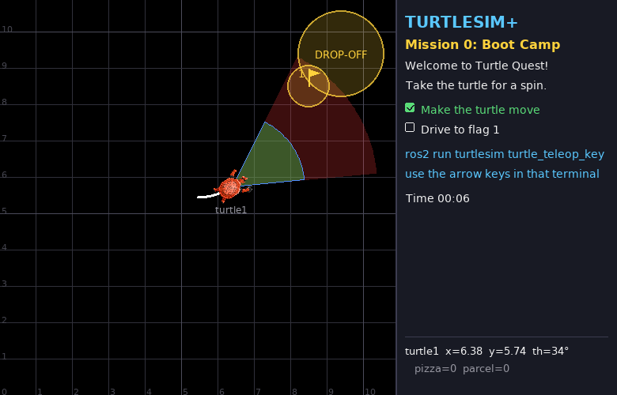
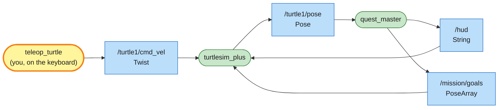

# Mission 0: Boot Camp

Your first turtle is waiting in an 11 × 11 metre world. Install the software, start it up and drive the turtle to the flag.



**Objectives**
- [ ] Make the turtle move
- [ ] Drive to flag 1

**Stars:** ≤ 30 s = ⭐⭐⭐ · ≤ 90 s = ⭐⭐ · slower = ⭐

---

## Step 1: Install what you need

You need Ubuntu 22.04 and ROS 2 Humble. Then add:

```bash
sudo apt install python3-pygame python3-numpy ros-humble-turtlesim
```

`pygame` draws the turtle window, and `turtlesim` provides the keyboard teleop and some message types.

## Step 2: Build the workspace

```bash
git clone <url of this repo> ~/turtle_quest
cd ~/turtle_quest
source /opt/ros/humble/setup.bash      # (1) wake up ROS 2 in this terminal
colcon build --symlink-install         # (2) build every package in src/
source install/setup.bash              # (3) tell this terminal about the packages you just built
```

A **package** is a box of code plus a `package.xml` that gives its name and what it depends on. `src/` holds three: `turtlesim_plus`, `turtlesim_plus_interfaces` and `turtle_quest`. A **workspace** is the folder that collects packages under `src/`. `colcon build` builds every package and puts the results in `build/`, `install/` and `log/`. Running `source` plugs the new commands and packages into your terminal.

You have to `source` again in every new terminal. Forgetting it is the most common cause of "Package not found".

> Note: if that gets tedious, add both lines to `~/.bashrc` once:
> ```bash
> echo "source /opt/ros/humble/setup.bash" >> ~/.bashrc
> echo "source ~/turtle_quest/install/setup.bash" >> ~/.bashrc
> ```

## Step 3: Launch the mission

```bash
ros2 launch turtle_quest mission.launch.py mission:=0
```

The TURTLESIM+ window opens. Here's what's on it:

| What you see | What it is |
|---|---|
| grey grid + numbers on the edges | x (horizontal) and y (vertical) coordinates in metres; (0, 0) is the bottom-left corner |
| the turtle + its name | `turtle1` starts in the middle (5.44, 5.44) facing right (θ = 0°) |
| big red cone | what the scanner can see (4 m, 60° wide), used in mission 6 |
| small green cone | where the turtle can eat pizza (2 m) |
| DROP-OFF circle | parcel delivery zone, used in the boss missions |
| panel on the right | mission objectives, time, and live status of every turtle (x, y, th, pizzas/parcels) |

## Step 4: Drive

Open a new terminal and leave the first one running:

```bash
source ~/turtle_quest/install/setup.bash
ros2 run turtlesim turtle_teleop_key
```

Click into this terminal so it has keyboard focus, then use the arrow keys:
- up / down: forward / backward
- left / right: turn left / right

Touch flag 1. The panel shows *Mission complete* with your stars, and the turtle cheers.

---

## System map

You've just used a real ROS 2 system without noticing. This picture is its system map. Every mission has one, and the yellow box is always you:



> 🟩 existing node · 🟨 you · 🟦 topic · 🟧 service · 🟪 action · ⬜ parameter — [how to read the maps](../ARCHITECTURE.md#how-to-read-the-maps)

Each program here (teleop, the simulator, the quest master) is a **node**. They never call each other directly. They send messages over named channels called **topics**. Teleop doesn't even know who's listening; it just puts velocity commands onto `/turtle1/cmd_vel`.

`quest_master` doesn't look at the screen either. It listens to the turtle's position on `/turtle1/pose`, sends the objectives back to the window on `/hud`, and sends the flag on `/mission/goals`.

In the next mission you'll listen in on these topics yourself.

## Troubleshooting

| Symptom | Fix |
|---|---|
| `Package 'turtle_quest' not found` | you forgot `source install/setup.bash` in this terminal |
| `ModuleNotFoundError: No module named 'pygame'` | `sudo apt install python3-pygame` |
| arrow keys do nothing | click into the teleop terminal first (it needs focus, not the turtle window) |
| `colcon build` says `error: option --editable not recognized` | your pip-installed setuptools is too new: `pip3 install "setuptools<80"`, or build without `--symlink-install` |

## Extras

No stars for these.

- Clicking on the map does nothing here. Start free-play mode with
  `ros2 launch turtlesim_plus turtlesim_plus.launch.py` and click again.
- Hide the grid: `ros2 launch turtle_quest mission.launch.py mission:=0 show_grid:=false`

---

**Next:** [Mission 1: Spy Turtle](01-spy.md)
