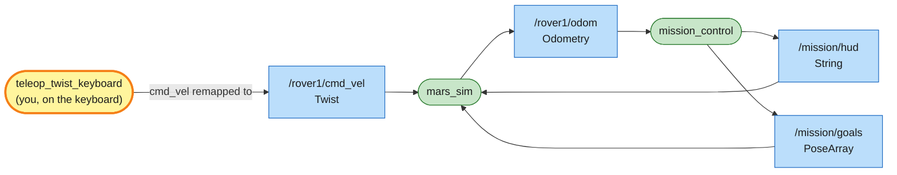

# Mission 0: Landing

rover1 has just touched down on Mars, a 20 × 20 metre patch of it. Install the software, start it up and drive the rover off the lander to the beacon.


**Objectives**
- [ ] Make the rover move
- [ ] Drive to beacon 1

**Stars:** ≤ 60 s = ⭐⭐⭐ · ≤ 2.5 min = ⭐⭐ · slower = ⭐

---

## Step 1: Install what you need

You need ROS 2 on Ubuntu. Jazzy (Ubuntu 24.04) or newer is recommended; Humble (Ubuntu 22.04) works too.
The commands here use `jazzy`; on another distro, use its name instead. Then add:

```bash
source /opt/ros/jazzy/setup.bash
sudo apt install python3-pygame python3-numpy ros-$ROS_DISTRO-teleop-twist-keyboard
```

`pygame` draws the simulator window, `numpy` does the sensor maths, and `teleop_twist_keyboard` lets you drive with the keyboard. It's the same teleop tool people use on real robots.

## Step 2: Build the workspace

```bash
git clone <url of this repo> ~/mars_rover
cd ~/mars_rover
source /opt/ros/jazzy/setup.bash       # (1) wake up ROS 2 in this terminal
colcon build --symlink-install         # (2) build every package in src/
source install/setup.bash              # (3) tell this terminal about the packages you just built
```

A **package** is a box of code plus a `package.xml` that gives its name and what it depends on. `src/` holds three: `mars_sim` (the simulator), `mars_interfaces` (the rover's own message and service types) and `mission_control` (the referee). A **workspace** is the folder that collects packages under `src/`. `colcon build` builds every package and puts the results in `build/`, `install/` and `log/`. Running `source` plugs the new commands and packages into your terminal.

You have to `source` again in every new terminal. Forgetting it is the most common cause of "Package not found".

> Note: if that gets tedious, add both lines to `~/.bashrc` once:
> ```bash
> echo "source /opt/ros/jazzy/setup.bash" >> ~/.bashrc
> echo "source ~/mars_rover/install/setup.bash" >> ~/.bashrc
> ```

## Step 3: Launch the mission

```bash
ros2 launch mission_control mission.launch.py mission:=0
```

The Mars Rover Academy window opens. Here's what's on it:

| What you see | What it is |
|---|---|
| grid + numbers on the edges | x (horizontal) and y (vertical) coordinates in metres; (0, 0) is the bottom-left corner, the map is 20 × 20 m |
| grey pad marked LANDER | the lander at (3, 3), 3 m across (radius 1.5 m). Later the rover charges its battery and drops off samples here |
| the rover + its name | `rover1` starts on the lander at (3, 3), facing right (+x, east, yaw = 0°) |
| pale cone in front of the rover | what the camera can see (6 m, 60° wide), used from mission 3 on |
| red dots on rocks | where the laser scanner hits something, used in mission 6 |
| dark rocks | the rover can't drive through them: it stops and counts a bump |
| pale ground with ripples | sand: the wheels slip, which matters from mission 5 |
| round pit | a crater: you can drive through it, slowly |
| flag with a number and a circle | a beacon; anywhere inside its circle counts |
| panel on the right | the mission: objectives, hints, time, and live status of every rover (x, y, yaw, speed v, turn rate w, battery) |

## Step 4: Drive

Open a new terminal and leave the first one running:

```bash
source ~/mars_rover/install/setup.bash
ros2 run teleop_twist_keyboard teleop_twist_keyboard --ros-args -r cmd_vel:=/rover1/cmd_vel
```

Click into this terminal so it has keyboard focus, then use these keys:
- `i`: forward (hold it down to keep going), `,`: backward
- `j` / `l`: turn left / right
- `k`: stop
- `q` / `z`: faster / slower

Beacon 1 is at (9, 7): up and to the right of the lander. Turn a little to the left, drive, and correct as you go. Touch the beacon and the panel shows *Mission complete* with your stars.

### What was that `-r cmd_vel:=...` part?

Teleop sends its driving commands to a topic called `cmd_vel`. The simulator listens on `/rover1/cmd_vel`, because every rover gets its own set of names, and there can be more than one rover. The part after `--ros-args -r` **remaps** the name when the program starts: "where you would have used `cmd_vel`, use `/rover1/cmd_vel`". You change the wiring without touching teleop's code. You'll meet remapping again in mission 7.

Without it, teleop talks to `/cmd_vel`, nobody is listening there, and the rover doesn't move.

---

## System map

You've just used a real ROS 2 system without noticing. This picture is its system map. Every mission has one, and the yellow box is always you:



> 🟩 existing node · 🟨 you · 🟦 topic · 🟧 service · 🟪 action · ⬜ parameter — [how to read the maps](../ARCHITECTURE.md#how-to-read-the-maps)

Each program here (teleop, the simulator, mission control) is a **node**. They never call each other directly. They send messages over named channels called **topics**. Teleop doesn't even know who's listening; it just puts velocity commands onto `/rover1/cmd_vel`.

`mission_control` doesn't look at the screen either. It listens to the rover's position on `/rover1/odom`, sends the objectives back to the window on `/mission/hud`, and sends the beacon on `/mission/goals`.

In the next mission you'll listen in on these topics yourself.

## Troubleshooting

| Symptom | Fix |
|---|---|
| `Package 'mission_control' not found` | you forgot `source install/setup.bash` in this terminal |
| `ModuleNotFoundError: No module named 'pygame'` | `sudo apt install python3-pygame` |
| `Package 'teleop_twist_keyboard' not found` | `sudo apt install ros-$ROS_DISTRO-teleop-twist-keyboard` |
| keys do nothing | click into the teleop terminal first (it needs focus, not the simulator window) |
| teleop prints the speed but the rover doesn't move | the `--ros-args -r cmd_vel:=/rover1/cmd_vel` part is missing or misspelled |
| `colcon build` says `error: option --editable not recognized` | a setuptools installed with pip is too new: `pip3 install --user "setuptools<80"` (Ubuntu 24.04 also needs `--break-system-packages`), or build without `--symlink-install` |

## Extras

No stars for these.

- Drive into a rock and watch the rover stop. Back off with `,`.
- Drive through the sand and the crater and compare the speed (`v` in the panel) with what teleop says it sends.
- Hide the grid: `ros2 launch mission_control mission.launch.py mission:=0 show_grid:=false`
- Some missions pick things at random (a code, beacon positions). To get the same world as a friend, both add `seed:=42` (any number) to the launch command.
- See all your stars so far: `ros2 run mission_control progress`

---

**Previous:** [README](../README.md) · **Next:** [Mission 1: Telemetry](01-telemetry.md)
