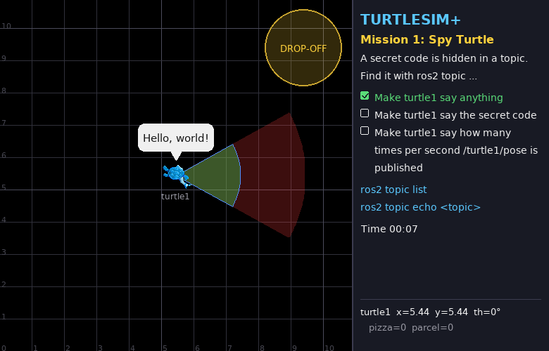

# Mission 1: Spy Turtle 🕵️

> **Briefing:** A spy has hidden a **secret code** somewhere in our ROS 2 system.
> Nobody will tell you where — use the `ros2 topic` tools to track it down, then make the turtle say it out loud.



**🎯 Objectives**
- [ ] Make turtle1 say anything
- [ ] Make turtle1 say the secret code
- [ ] Make turtle1 say how many times per second `/turtle1/pose` is published

**⭐ Stars:** ≤ 3 min = ⭐⭐⭐ · ≤ 7 min = ⭐⭐

```bash
# Terminal 1
ros2 launch turtle_quest mission.launch.py mission:=1
```

---

## 🧠 Concept card: nodes, topics, messages

Think of a **group chat**:

| ROS 2 | Group chat |
|---|---|
| **node** | one person in the chat (one program) |
| **topic** | one chat room with a name, e.g. `/turtle1/pose` |
| **publisher** | someone posting into the room |
| **subscriber** | someone reading the room |
| **message type** | the "form" every post in that room must use, e.g. `turtlesim/msg/Pose` has x, y, theta |

Posters don't need to know who reads; readers don't need to know who posts — they only agree on the **room name** and the **form**.
That's the heart of ROS 2: the parts of a robot talk through topics without being wired to each other.

---

## Step 1: Who's in the system?

Open a new terminal (don't forget `source ~/turtle_quest/install/setup.bash`):

```bash
ros2 node list
```

```text
/quest_master
/turtlesim_plus
```

Two nodes: the simulator and the quest master. What can `turtlesim_plus` do?

```bash
ros2 node info /turtlesim_plus
```

Long, right? It lists every topic the node **subscribes** to and **publishes**, plus its services and actions.

## Step 2: Eavesdrop on the turtle's position

```bash
ros2 topic list
```

Dozens of topics. Listen to `/turtle1/pose`:

```bash
ros2 topic echo /turtle1/pose
```

```text
x: 5.440000057220459
y: 5.440000057220459
theta: 0.0
linear_velocity: 0.0
angular_velocity: 0.0
---
```

It never stops! Press `Ctrl+C`. To see just one message:

```bash
ros2 topic echo --once /turtle1/pose
```

> 💡 Start `turtle_teleop_key` from mission 0, drive around and watch x, y, theta change

## Step 3: Make the turtle talk 💬

The turtle has a topic called `/turtle1/say` — send it text and it speaks. But which "form" does it use?

```bash
ros2 topic info /turtle1/say
```

```text
Type: std_msgs/msg/String
Publisher count: 0
Subscription count: 2
```

The message type is `std_msgs/msg/String`. What fields does it have?

```bash
ros2 interface show std_msgs/msg/String
```

```text
# This was originally provided as an example message.
# ...(lines starting with # are comments, skip them)
string data
```

One field called `data` of type `string` (text). Let's send it!

```bash
ros2 topic pub --once /turtle1/say std_msgs/msg/String "{data: 'Hello, world!'}"
```

The pattern is:

```text
ros2 topic pub --once  <topic name>  <message type>  "<data as YAML>"
```

The data is YAML, `{field: value}` — first objective done ✅

> ⚠️ If the text is only digits, wrap it in `'...'`, e.g. `"{data: '100'}"`, otherwise YAML reads it as a number and ROS complains that a number doesn't fit a text field

## Step 4: Hunt down the secret code 🔐

Your turn — no direct hints, just the commands you've learned:

1. List all topics. Does one look suspicious?
2. Eavesdrop on it
3. Make the turtle say the code

<details>
<summary>💡 Hint</summary>

```bash
ros2 topic list | grep mission
```

</details>

<details>
<summary>🔓 Solution</summary>

```bash
ros2 topic echo --once /mission/secret_code
# data: PIZZA-123   (yours will differ: it's random every time)
ros2 topic pub --once /turtle1/say std_msgs/msg/String "{data: 'PIZZA-123'}"
```

</details>

## Step 5: Measure the rate ⏱️

How fast is `/turtle1/pose` published? ROS 2 has a tool for that:

```bash
ros2 topic hz /turtle1/pose
```

Wait for the number to settle, `Ctrl+C`, then make the turtle say it (rounding is fine, it only needs to be close):

```bash
ros2 topic pub --once /turtle1/say std_msgs/msg/String "{data: '<the rate you measured>'}"
```

🎉 Mission complete!

---

## 🔍 Commands you now know

| Command | What it does |
|---|---|
| `ros2 node list` / `ros2 node info <node>` | who's in the system / what a node sends and receives |
| `ros2 topic list` | which topics exist |
| `ros2 topic echo <topic>` | eavesdrop (`--once` = one message) |
| `ros2 topic info <topic>` | its type + how many publishers/subscribers (`-v` = with names) |
| `ros2 interface show <type>` | the fields of a message |
| `ros2 topic pub --once <topic> <type> "<yaml>"` | send a message yourself |
| `ros2 topic hz <topic>` | measure the rate |

## 🧩 Check yourself

<details>
<summary>1. You leave <code>ros2 topic echo /turtle1/say</code> running and make the turtle talk. What happens?</summary>

The echo terminal shows the message too, because a topic is like a chat room — everyone listening hears it (right now `/turtle1/say` has 3 listeners: the simulator, quest_master and your echo)

</details>

<details>
<summary>2. What does <code>ros2 topic info -v /turtle1/cmd_vel</code> show that plain <code>ros2 topic info</code> doesn't?</summary>

The **node names** of the publishers and subscribers — exactly how quest_master catches you using teleop in later missions 😏

</details>

## 🏆 Side quests

- See the whole system as a diagram: `rqt_graph` (if missing: `sudo apt install ros-humble-rqt-graph`)
- Multi-line speech: `'{data: "first line\nsecond line"}'` (note the swapped quotes — in YAML `\n` only works inside `"..."`)
- Make the turtle chatter every second: replace `--once` with `--rate 1` (stop with `Ctrl+C`)

---

**← Previous** [Mission 0](00-boot-camp.md) · **Next →** [Mission 2: Steering Wheel](02-steering.md)
