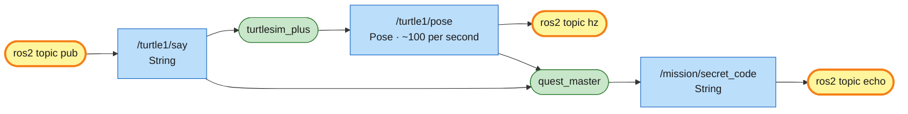

# Mission 1: Spy Turtle

Someone has hidden a secret code somewhere in the ROS 2 system. Find it with the `ros2 topic` tools and make the turtle say it out loud.


**Objectives**
- [ ] Make turtle1 say anything
- [ ] Make turtle1 say the secret code
- [ ] Make turtle1 say how many times per second `/turtle1/pose` is published

**Stars:** ≤ 3 min = ⭐⭐⭐ · ≤ 7 min = ⭐⭐

```bash
# Terminal 1
ros2 launch turtle_quest mission.launch.py mission:=1
```

---

## Nodes, topics and messages

A topic works like a group chat:

| ROS 2 | Group chat |
|---|---|
| **node** | one person in the chat (one program) |
| **topic** | one chat room with a name, e.g. `/turtle1/pose` |
| **publisher** | someone posting into the room |
| **subscriber** | someone reading the room |
| **message type** | the "form" every post in that room must use, e.g. `turtlesim/msg/Pose` has x, y, theta |

Whoever posts doesn't know who's reading, and readers don't know who posted. Both sides only agree on the room's name and on the message format. That's how the parts of a robot stay independent of each other: nothing is wired directly to anything else.

---

## Step 1: Who's in the system?

Open a new terminal (and run `source ~/turtle_quest/install/setup.bash` in it):

```bash
ros2 node list
```

```text
/quest_master
/turtlesim_plus
```

There are two nodes, the simulator and the quest master. To see what `turtlesim_plus` offers:

```bash
ros2 node info /turtlesim_plus
```

It's a long list: every topic the node subscribes to and publishes, plus its services and actions. You'll meet most of them over the next few missions.

## Step 2: Listen to the turtle's position

```bash
ros2 topic list
```

There are dozens. Listen to `/turtle1/pose`:

```bash
ros2 topic echo /turtle1/pose
```

```text
x: 5.440000057220459
y: 5.440000057220459
theta: 0.0
linear_velocity: 0.0
angular_velocity: 0.0
---
```

It keeps printing until you press `Ctrl+C`. For a single message:

```bash
ros2 topic echo --once /turtle1/pose
```

If you start `turtle_teleop_key` from mission 0 in another terminal and drive around, you can watch x, y and theta change.

## Step 3: Make the turtle talk

The turtle listens on `/turtle1/say` and shows whatever text arrives there. First find out which message type the topic uses:

```bash
ros2 topic info /turtle1/say
```

```text
Type: std_msgs/msg/String
Publisher count: 0
Subscription count: 2
```

The type is `std_msgs/msg/String`. Its fields:

```bash
ros2 interface show std_msgs/msg/String
```

```text
# This was originally provided as an example message.
# ...(lines starting with # are comments, skip them)
string data
```

One field, `data`, holding text. Send it:

```bash
ros2 topic pub --once /turtle1/say std_msgs/msg/String "{data: 'Hello, world!'}"
```

The general form is:

```text
ros2 topic pub --once  <topic name>  <message type>  "<data as YAML>"
```

The data is written as YAML, `{field: value}`. That ticks the first objective.

> Careful: if the text is only digits, wrap it in quotes, e.g. `"{data: '100'}"`. Otherwise YAML reads it as a number and ROS refuses to put a number into a text field.

## Step 4: Find the secret code

No step-by-step this time. You already have the commands you need:

1. List all topics and look for one that doesn't belong to the simulator.
2. Listen to it.
3. Make the turtle say what you heard.

<details>
<summary>Hint</summary>

```bash
ros2 topic list | grep mission
```

</details>

<details>
<summary>Solution</summary>

```bash
ros2 topic echo --once /mission/secret_code
# data: PIZZA-123   (yours will differ: it's random every time)
ros2 topic pub --once /turtle1/say std_msgs/msg/String "{data: 'PIZZA-123'}"
```

</details>

## Step 5: Measure the rate

ROS 2 can measure how often a topic is published:

```bash
ros2 topic hz /turtle1/pose
```

Let the number settle for a few seconds, press `Ctrl+C`, and have the turtle say it. It only needs to be roughly right.

```bash
ros2 topic pub --once /turtle1/say std_msgs/msg/String "{data: '<the rate you measured>'}"
```

That's the last objective. The panel shows *Mission complete* and your stars.

---

## System map



> 🟩 existing node · 🟨 you · 🟦 topic · 🟧 service · 🟪 action · ⬜ parameter — [how to read the maps](../ARCHITECTURE.md#how-to-read-the-maps)

Each `ros2 topic` command you ran was briefly a node itself (named `_ros2cli_...`). It joined the graph, did its job and left.

`/turtle1/say` has two subscribers. The simulator draws the speech bubble and quest_master checks your answer, so one message reached both. `/turtle1/pose` has even more readers, and the simulator neither knows nor cares how many. Nobody had to tell you about `/mission/secret_code` in advance either: quest_master publishes it, and anyone who knows the name can listen.

## Commands you now know

| Command | What it does |
|---|---|
| `ros2 node list` / `ros2 node info <node>` | who's in the system / what a node sends and receives |
| `ros2 topic list` | which topics exist |
| `ros2 topic echo <topic>` | eavesdrop (`--once` = one message) |
| `ros2 topic info <topic>` | its type + how many publishers/subscribers (`-v` = with names) |
| `ros2 interface show <type>` | the fields of a message |
| `ros2 topic pub --once <topic> <type> "<yaml>"` | send a message yourself |
| `ros2 topic hz <topic>` | measure the rate |

## Check yourself

<details>
<summary>1. You leave <code>ros2 topic echo /turtle1/say</code> running and make the turtle talk. What happens?</summary>

The echo terminal prints the message as well. Everyone subscribed to a topic gets every message, so right now `/turtle1/say` has three listeners: the simulator, quest_master and your echo.

</details>

<details>
<summary>2. What does <code>ros2 topic info -v /turtle1/cmd_vel</code> show that plain <code>ros2 topic info</code> doesn't?</summary>

The node names of the publishers and subscribers. That's how quest_master will catch you using teleop in later missions.

</details>

## Extras

- See the whole system as a diagram with `rqt_graph` (if it's missing: `sudo apt install ros-humble-rqt-graph`).
- Multi-line speech: `'{data: "first line\nsecond line"}'`. The quotes are swapped on purpose, because YAML only understands `\n` inside double quotes.
- Make the turtle repeat itself every second by replacing `--once` with `--rate 1`. Stop it with `Ctrl+C`.

---

**Previous:** [Mission 0](00-boot-camp.md) · **Next:** [Mission 2: Steering Wheel](02-steering.md)
