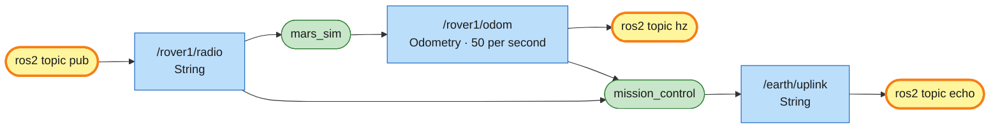

# Mission 1: Telemetry

Earth is sending rover1 a message, but nobody told you on which channel. Find it with the `ros2 topic` tools, answer on the rover's radio, and report how fast the rover sends its position.


**Objectives**
- [ ] Send anything on rover1's radio
- [ ] Confirm the code from Earth on the radio
- [ ] Radio how many times per second /rover1/odom is published

**Stars:** ≤ 3 min = ⭐⭐⭐ · ≤ 7 min = ⭐⭐

```bash
# Terminal 1
ros2 launch mission_control mission.launch.py mission:=1
```

---

## Nodes, topics and messages

A topic works like a group chat:

| ROS 2 | Group chat |
|---|---|
| **node** | one person in the chat (one program) |
| **topic** | one chat room with a name, e.g. `/rover1/odom` |
| **publisher** | someone posting into the room |
| **subscriber** | someone reading the room |
| **message type** | the "form" every post in that room must use, e.g. `std_msgs/msg/String` has one text field |

Whoever posts doesn't know who's reading, and readers don't know who posted. Both sides only agree on the room's name and on the message format. That's how the parts of a robot stay independent of each other: nothing is wired directly to anything else.

---

## Step 1: Who's in the system?

Open a new terminal (and run `source ~/mars_rover/install/setup.bash` in it):

```bash
ros2 node list
```

```text
/mars_sim
/mission_control
```

There are two nodes, the simulator and mission control. To see what `mars_sim` offers:

```bash
ros2 node info /mars_sim
```

It's a long list: every topic the node subscribes to and publishes, plus its services and actions. You'll meet most of them over the next missions.

## Step 2: Listen to the rover's position

```bash
ros2 topic list
```

There are quite a few. Everything that belongs to rover1 starts with `/rover1/`. Its position is on `/rover1/odom` ("odometry"):

```bash
ros2 topic echo /rover1/odom
```

That scrolls past very fast, and each message is long: a header, the position, the orientation, the velocity and two blocks of 36 numbers called `covariance`. Press `Ctrl+C`. For a single message:

```bash
ros2 topic echo --once /rover1/odom
```

For only the part you care about, add `--field`:

```bash
ros2 topic echo --once /rover1/odom --field pose.pose.position
```

```text
x: 3.0
y: 3.0
z: 0.0
---
```

The type is `nav_msgs/msg/Odometry`, the standard message real robots use for "where am I and how fast am I going". You'll read it from your own code in mission 5. If you start teleop from mission 0 in another terminal and drive around, you can watch x and y change.

## Step 3: Use the radio

The rover listens on `/rover1/radio` and shows whatever text arrives there in a speech bubble. First find out which message type the topic uses:

```bash
ros2 topic info /rover1/radio
```

```text
Type: std_msgs/msg/String
Publisher count: 0
Subscription count: 2
```

The type is `std_msgs/msg/String`. Its fields:

```bash
ros2 interface show std_msgs/msg/String
```

```text
# This was originally provided as an example message.
# ...(lines starting with # are comments, skip them)
string data
```

One field, `data`, holding text. Send it:

```bash
ros2 topic pub --once /rover1/radio std_msgs/msg/String "{data: 'Hello from rover1'}"
```

The general form is:

```text
ros2 topic pub --once  <topic name>  <message type>  "<data as YAML>"
```

The data is written as YAML, `{field: value}`. That ticks the first objective.

> Careful: put options like `--once` right after `pub`, before the topic name. If one lands between the type and the data, you get `error: unrecognized arguments`.

## Step 4: Find the message from Earth

No step-by-step this time. You already have the commands you need:

1. List all topics and look for one that doesn't belong to a rover.
2. Listen to it.
3. Send what Earth asks for on the radio.

<details>
<summary>Hint</summary>

```bash
ros2 topic list | grep earth
```

</details>

<details>
<summary>Solution</summary>

```bash
ros2 topic echo --once /earth/uplink
# data: 'Earth to rover1: please confirm code DEIMOS-682 on your radio.'   (yours will differ: it's random)
ros2 topic pub --once /rover1/radio std_msgs/msg/String "{data: 'DEIMOS-682'}"
```

</details>

## Step 5: Measure the rate

ROS 2 can measure how often a topic is published:

```bash
ros2 topic hz /rover1/odom
```

Let the number settle for a few seconds, press `Ctrl+C`, and radio it. It only needs to be roughly right (within 10%).

```bash
ros2 topic pub --once /rover1/radio std_msgs/msg/String "{data: '<the rate you measured>'}"
```

> Careful: wrap a number in quotes inside the YAML, e.g. `"{data: '50'}"`. The field holds text, and the quotes make sure YAML reads it as text.

That's the last objective. The panel shows *Mission complete* and your stars.

---

## System map



> 🟩 existing node · 🟨 you · 🟦 topic · 🟧 service · 🟪 action · ⬜ parameter — [how to read the maps](../ARCHITECTURE.md#how-to-read-the-maps)

Each `ros2 topic` command you ran was briefly a node itself (named `_ros2cli_...`). It joined the graph, did its job and left.

`/rover1/radio` has two subscribers. The simulator draws the speech bubble and mission_control checks your answer, so one message reached both. `/rover1/odom` has even more readers while your `echo` or `hz` runs, and the simulator neither knows nor cares how many. Nobody had to tell you about `/earth/uplink` in advance either: mission_control publishes it, and anyone who knows the name can listen.

## Commands you now know

| Command | What it does |
|---|---|
| `ros2 node list` / `ros2 node info <node>` | who's in the system / what a node sends and receives |
| `ros2 topic list` | which topics exist |
| `ros2 topic echo <topic>` | eavesdrop (`--once` = one message, `--field` = one part of it) |
| `ros2 topic info <topic>` | its type + how many publishers/subscribers (`-v` = with names) |
| `ros2 interface show <type>` | the fields of a message |
| `ros2 topic pub --once <topic> <type> "<yaml>"` | send a message yourself |
| `ros2 topic hz <topic>` | measure the rate |

## Check yourself

<details>
<summary>1. You leave <code>ros2 topic echo /rover1/radio</code> running and send something on the radio. What happens?</summary>

The echo terminal prints the message as well. Everyone subscribed to a topic gets every message, so right now `/rover1/radio` has three listeners: the simulator, mission_control and your echo.

</details>

<details>
<summary>2. What does <code>ros2 topic info -v /rover1/cmd_vel</code> show that plain <code>ros2 topic info</code> doesn't?</summary>

The node names of the publishers and subscribers. That's how mission_control will catch you using teleop in later missions.

</details>

## Extras

- See the whole system as a diagram with `rqt_graph` (if it's missing: `sudo apt install ros-$ROS_DISTRO-rqt-graph`).
- The rover has more to say. Try `ros2 topic echo --once /rover1/battery --field percentage` (1.0 = full) and `ros2 topic hz /rover1/scan` (the laser scanner).
- Multi-line radio: `'{data: "first line\nsecond line"}'`. The quotes are swapped on purpose, because YAML only understands `\n` inside double quotes.
- Make the rover repeat itself every second by replacing `--once` with `--rate 1`. Stop it with `Ctrl+C`.

---

**Previous:** [Mission 0](00-landing.md) · **Next:** [Mission 2: Manual Drive](02-manual-drive.md)
