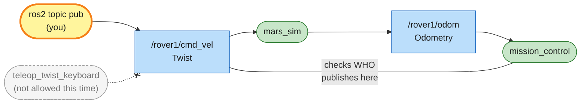

# Mission 2: Manual Drive

The keyboard link is down, and teleop is off-limits this time (mission control will notice if you use it). All you have left is sending velocity commands by hand with `ros2 topic pub`, so do the maths and reach all the beacons.


**Objectives**
- [ ] Reach the beacons in order 1 → 2 → 3
- [ ] Drive one full circle around the crater

**Stars:** ≤ 4 min = ⭐⭐⭐ · ≤ 8 min = ⭐⭐ · using teleop = ⭐ only

```bash
# Terminal 1
ros2 launch mission_control mission.launch.py mission:=2
```

---

## Twist: how robots describe velocity

When you pressed keys in mission 0, teleop sent messages to `/rover1/cmd_vel`. Here's what it sent:

```bash
ros2 topic info /rover1/cmd_vel          # Type: geometry_msgs/msg/Twist
ros2 interface show geometry_msgs/msg/Twist
```

```text
# This expresses velocity in free space broken into its linear and angular parts.

Vector3  linear
	float64 x
	float64 y
	float64 z
Vector3  angular
	float64 x
	float64 y
	float64 z
```

`Twist` works for any robot, 3-D drones included, but a rover on the ground only uses two fields:

| Field | Meaning | Unit | Positive | Negative |
|---|---|---|---|---|
| `linear.x` | forward speed | metres/second | forward | backward |
| `angular.z` | turning speed | radians/second | turn left ↺ | turn right ↻ |

A **radian** is the angle unit ROS uses everywhere. One full turn is 2π ≈ 6.2832 radians.

| degrees | 45° | 90° | 180° | 360° |
|---|---|---|---|---|
| radians | 0.7854 | 1.5708 | 3.1416 | 6.2832 |

The panel shows yaw in degrees to make it easier to read, but everything you send is in radians.

### The rover's limits

rover1 is a real vehicle, not a cursor. Its top speed is 1.0 m/s forward and 2.0 rad/s turning. Ask for more and it simply drives at its top speed.

It also speeds up and slows down gradually, the way a heavy vehicle does. Speeding up and slowing down take the same time, so what the rover loses at the start it makes up while rolling to a stop. The distance still comes out as speed × the seconds you commanded.

### The 1-second rule

The rover keeps following the last command for 1 more second, then stops by itself. Real robots have the same safety feature, called a **watchdog**: if the program sending commands crashes, the robot doesn't drive off forever.

That means a single `--once` message gives exactly 1 second of commanded motion:

- `linear.x: 1.0` once moves 1 metre.
- `angular.z: 1.5708` once turns 90°.

Because of the top speed, you can't move 5 metres with one message. Send five, one per second:

```bash
ros2 topic pub --rate 1 --times 5 /rover1/cmd_vel geometry_msgs/msg/Twist "{linear: {x: 1.0}}"
```

`--rate 1` means one message per second and `--times 5` means stop after five. That's 5 seconds at 1 m/s, so 5 metres.

> Careful: the options (`--once`, `--rate`, `--times`) go right after `pub`, before the topic name. If one lands between the type and the data, you get `error: unrecognized arguments`.

---

## Step 1: Take it for a spin

```bash
ros2 topic pub --once /rover1/cmd_vel geometry_msgs/msg/Twist "{linear: {x: 1.0}}"
```

The rover moves 1 metre forward, and x in the panel grows by 1.00. Any field you leave out is 0.

Now turn:

```bash
ros2 topic pub --once /rover1/cmd_vel geometry_msgs/msg/Twist "{angular: {z: 1.5708}}"
```

That's 90° left (yaw = 90°). Send `-1.5708` to turn back.

The rover is still rolling for a moment after the command ends. Wait until `v` and `w` in the panel are back to 0.00 before you send the next command, or the two moves blend together.

To save typing, press the up arrow to recall the last command and edit the number. If tab completion is enabled in your terminal, you can also type `ros2 topic pub --once /rover1/cmd_vel geometry_msgs/msg/Twist ` and press `Tab` twice to get an empty template.

## Step 2: Plan the route to the beacons

If you moved the rover in step 1, close and relaunch the mission first so it starts on the lander at (3, 3) facing right (0°).

| Beacon | Position |
|---|---|
| 1 | (8, 3) |
| 2 | (8, 8) |
| 3 | (4, 8) |

Sketch the route on paper and work out which commands to send, in order. Anywhere inside a beacon's circle counts.

<details>
<summary>Hint for beacon 1</summary>

Beacon 1 is straight ahead, 8 − 3 = 5 m away, and the rover already faces right. Five messages at 1 m/s, one per second.

</details>

<details>
<summary>Full route</summary>

```bash
T="/rover1/cmd_vel geometry_msgs/msg/Twist"
ros2 topic pub --rate 1 --times 5 $T "{linear: {x: 1.0}}"   # to beacon 1 (8 - 3 = 5 m)
ros2 topic pub --once $T "{angular: {z: 1.5708}}"           # turn left 90° (now facing up)
ros2 topic pub --rate 1 --times 5 $T "{linear: {x: 1.0}}"   # to beacon 2 (8 - 3 = 5 m)
ros2 topic pub --once $T "{angular: {z: 1.5708}}"           # turn left another 90° (now facing left)
ros2 topic pub --rate 1 --times 4 $T "{linear: {x: 1.0}}"   # to beacon 3 (8 - 4 = 4 m)
```

`T` holds the topic and the type so you don't have to type them every time. Send the commands one at a time and wait for the rover to stop before the next.

</details>

## Step 3: Drive a circle around the crater

If you drive and turn at the same time, the rover drives a circle with radius `linear.x / angular.z`.

The 1-second rule gets in the way here: one `--once` lasts 1 second, which isn't a full circle. So keep sending with `--rate` and leave out `--times`:

```bash
ros2 topic pub --rate 1 /rover1/cmd_vel geometry_msgs/msg/Twist "{linear: {x: 1.0}, angular: {z: 0.5}}"
```

That runs until you press `Ctrl+C`. The radius is 1.0 / 0.5 = 2 m, and a full circle is 2π radians, so at 0.5 rad/s it takes about 12.6 seconds. Then press `Ctrl+C`.

The crater is at (4, 6), 2 m south of beacon 3. Before you start, check which way the rover is facing: if it turns left, which side of it will the circle be on? Keep going without stopping: if the rover stands still, the count starts over.

That completes the mission. The panel shows *Mission complete* and your stars.

---

## System map



> 🟩 existing node · 🟨 you · 🟦 topic · 🟧 service · 🟪 action · ⬜ parameter — [how to read the maps](../ARCHITECTURE.md#how-to-read-the-maps)

A topic can have several publishers. `mars_sim` obeys whatever arrives on `/rover1/cmd_vel` and can't tell who sent it. So mission_control doesn't read the messages to catch teleop. It asks the ROS graph who publishes there, which is exactly what `ros2 topic info -v` shows.

The grey dashed box is teleop: fine in mission 0, forbidden here.

## Summary

Driving a mobile robot means publishing `geometry_msgs/msg/Twist` to `cmd_vel`. Real robots like TurtleBot work exactly the same way. `linear.x` is forward speed in m/s and `angular.z` is turning left in rad/s.

`--once` sends one message, `--rate N` sends N per second until you stop it, and `--times N` sends N messages and exits.

Real vehicles have a top speed, can't change speed instantly, and stop on their own when the commands stop coming. Your commands have to fit those limits.

## Check yourself

<details>
<summary>1. You send <code>{linear: {x: 5.0}}</code> once. How far does the rover go?</summary>

1 metre. The rover's top speed is 1.0 m/s, so it drives at 1.0 m/s for the 1 second the command lasts. To go 5 m, send `x: 1.0` five times with `--rate 1 --times 5`.

</details>

<details>
<summary>2. How do you turn 180°?</summary>

`angular.z: 3.1416` once would need 3.14 rad/s, but the rover turns at most 2.0 rad/s, so you'd only get 2 radians (about 115°).
Send 90° twice in a row instead: `ros2 topic pub --rate 1 --times 2 /rover1/cmd_vel geometry_msgs/msg/Twist "{angular: {z: 1.5708}}"`.

</details>

<details>
<summary>3. How does mission control know you're using teleop?</summary>

Run `ros2 topic info -v /rover1/cmd_vel` while teleop is running and you'll see a publisher named `teleop_twist_keyboard`.
mission_control asks ROS 2 the same question every 0.1 s. (`ros2 topic pub` shows up as `_ros2cli_...`.)

</details>

## Extras

- Watch the rover speed up and slow down: run `ros2 topic echo /rover1/odom --field twist.twist.linear.x` in one terminal and send one `--once` command from another.
- Draw a figure 8: one circle left, then one circle right (negative `angular.z`).
- Back up with a negative `linear.x`. Can you drive a circle backwards?

---

**Previous:** [Mission 1](01-telemetry.md) · **Next:** [Mission 3: Mission Control](03-mission-control.md)
