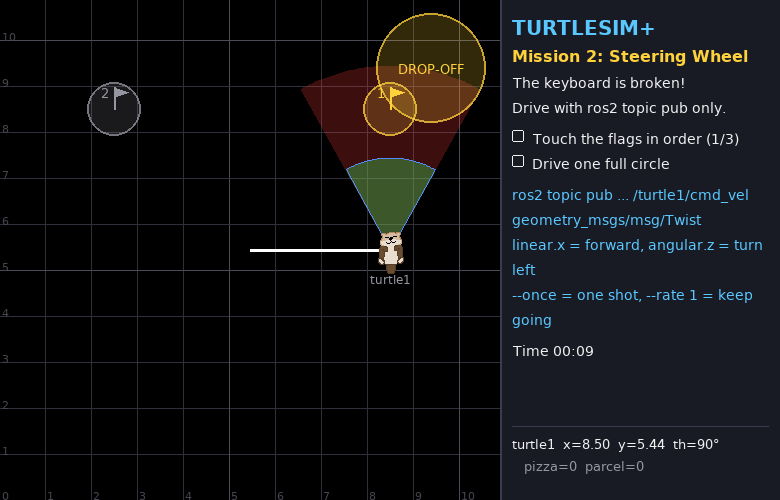
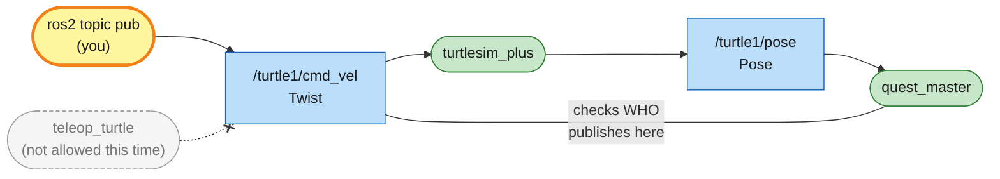

# Mission 2: Steering Wheel 🕹️

> **Briefing:** The keyboard is broken! Teleop is off-limits (use it and the quest master will know 👀).
> All you have left is **sending velocity commands by hand** with `ros2 topic pub` — do the maths and plant all the flags.



**🎯 Objectives**
- [ ] Touch the flags in order 1 → 2 → 3
- [ ] Drive one full circle

**⭐ Stars:** ≤ 4 min = ⭐⭐⭐ · ≤ 8 min = ⭐⭐ · using teleop = ⭐ only

```bash
# Terminal 1
ros2 launch turtle_quest mission.launch.py mission:=2
```

---

## 🧠 Concept card: Twist — how robots talk about velocity

When you pressed arrow keys in mission 0, teleop sent messages to `/turtle1/cmd_vel`. What did it send?

```bash
ros2 topic info /turtle1/cmd_vel          # Type: geometry_msgs/msg/Twist
ros2 interface show geometry_msgs/msg/Twist
```

```text
# This expresses velocity in free space broken into its linear and angular parts.

Vector3  linear
	float64 x
	float64 y
	float64 z
Vector3  angular
	float64 x
	float64 y
	float64 z
```

`Twist` works for any robot (even 3-D drones), but a ground turtle only uses two fields:

| Field | Meaning | Unit | Positive | Negative |
|---|---|---|---|---|
| `linear.x` | forward speed | metres/second | forward | backward |
| `angular.z` | turning speed | **radians**/second | turn left ↺ | turn right ↻ |

**What's a radian?** The angle unit ROS uses everywhere — one full turn = 2π ≈ 6.2832 radians

| degrees | 45° | 90° | 180° | 360° |
|---|---|---|---|---|
| radians | 0.7854 | 1.5708 | 3.1416 | 6.2832 |

### ⏲️ The 1-second rule

The turtle keeps following the last command for **1 more second**, then stops by itself (like the original turtlesim — so a crashed controller can't send the robot running off forever).

So a single `--once` message = exactly 1 second of motion:

> **distance = speed × 1 s** → to move 3 metres, send `linear.x: 3.0` 🤯
> **angle turned = turning speed × 1 s** → to turn 90°, send `angular.z: 1.5708`

---

## Step 1: Take it for a spin

```bash
ros2 topic pub --once /turtle1/cmd_vel geometry_msgs/msg/Twist "{linear: {x: 1.0}}"
```

The turtle moves 1 metre forward (watch x in the panel grow by about 1.00). Fields you leave out are 0.

Now turn:

```bash
ros2 topic pub --once /turtle1/cmd_vel geometry_msgs/msg/Twist "{angular: {z: 1.5708}}"
```

90° left (th = 90°). Try `-1.5708` to turn back.

> 💡 Tired of typing? Press the up arrow to recall the last command and just edit the number.
> Or type `ros2 topic pub --once /turtle1/cmd_vel geometry_msgs/msg/Twist ` and press `Tab` twice to get an empty template (if tab completion is enabled in your terminal)

## Step 2: Plan the route to the flags 🚩

If you moved the turtle in step 1, close and relaunch the mission first so it starts at (5.44, 5.44) facing right (0°).

| Flag | Position |
|---|---|
| 1 | (8.5, 5.44) |
| 2 | (8.5, 8.5) |
| 3 | (2.5, 8.5) |

Sketch it on paper and work out which commands to send, in order (anywhere inside the flag's circle counts).

<details>
<summary>💡 Hint: flag 1</summary>

Flag 1 is straight ahead, 8.5 − 5.44 = **3.06** m away, and the turtle already faces right. Just go forward.

</details>

<details>
<summary>🔓 Full route</summary>

```bash
P="ros2 topic pub --once /turtle1/cmd_vel geometry_msgs/msg/Twist"
$P "{linear: {x: 3.06}}"        # to flag 1
$P "{angular: {z: 1.5708}}"     # turn left 90° (now facing up)
$P "{linear: {x: 3.06}}"        # to flag 2 (8.5 - 5.44 = 3.06)
$P "{angular: {z: 1.5708}}"     # turn left another 90° (now facing left)
$P "{linear: {x: 6.0}}"         # to flag 3 (8.5 - 2.5 = 6.0)
```

(send them one by one, waiting for the turtle to stop before the next)

</details>

## Step 3: Drive a circle ⭕

Drive **and** turn at the same time and the turtle drives a circle with radius = `linear.x / angular.z`.

But with the 1-second rule a single `--once` only lasts 1 second, not a full circle... so keep sending with `--rate`:

```bash
ros2 topic pub --rate 1 /turtle1/cmd_vel geometry_msgs/msg/Twist "{linear: {x: 2.0}, angular: {z: 1.0}}"
```

`--rate 1` = send it once per second, forever, until `Ctrl+C`.

A full circle is 2π radians; at 1 rad/s that takes about **6.3 seconds**, then `Ctrl+C`.

> ⚠️ Watch out for the edge of the world — a 2 m radius circle needs room. Hit the edge and the turtle slides along it instead of circling.
> (Which way is the turtle facing right now? If it turns left, which side of the turtle will the circle be on?)

🎉 Mission complete!

---

## 🕸️ System map: what you just did



> 🟩 existing node · 🟨 you · 🟦 topic · 🟧 service · 🟪 action · ⬜ parameter — [how to read the maps](../ARCHITECTURE.md#how-to-read-the-maps)

- A topic can have **several publishers**. `turtlesim_plus` obeys whatever arrives on `/turtle1/cmd_vel`; it can't tell who sent it
- So quest_master doesn't read the messages to catch teleop: it asks the ROS graph **who** publishes there (exactly what `ros2 topic info -v` shows)
- The grey dashed box is teleop: fine in mission 0, forbidden here

## 🔍 Summary

- Driving a mobile robot = **publishing `geometry_msgs/msg/Twist` to `cmd_vel`** — real robots like TurtleBot work exactly the same
- `linear.x` = forward (m/s), `angular.z` = turn left (rad/s)
- `--once` sends once · `--rate N` sends N times per second until stopped · `--times N` sends N times then exits

## 🧩 Check yourself

<details>
<summary>1. You send <code>{linear: {x: 2.0}, angular: {z: 3.1416}}</code> once. Where does the turtle end up?</summary>

It drives half a circle (π = 180° in 1 s) with radius 2/3.1416 ≈ 0.64 m,
ending 2 × 0.64 ≈ 1.27 m to the turtle's left, facing the opposite way

</details>

<details>
<summary>2. How does the quest master know you're using teleop?</summary>

Run `ros2 topic info -v /turtle1/cmd_vel` while teleop is running: you'll see a publisher named `teleop_turtle`.
quest_master asks ROS 2 the same question every 0.1 s (`ros2 topic pub` shows up as `_ros2cli_...`)

</details>

## 🏆 Side quests

- Draw a figure 8: one circle left, then one circle right (negative `angular.z`)
- Change the pen colour before drawing — see the next mission 😉

---

**← Previous** [Mission 1](01-spy.md) · **Next →** [Mission 3: Service Hotline](03-hotline.md)
