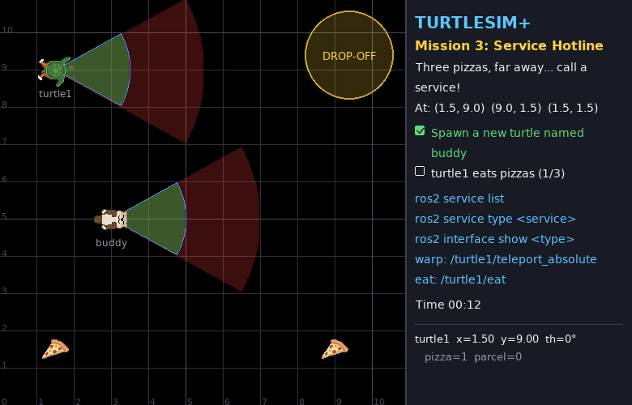
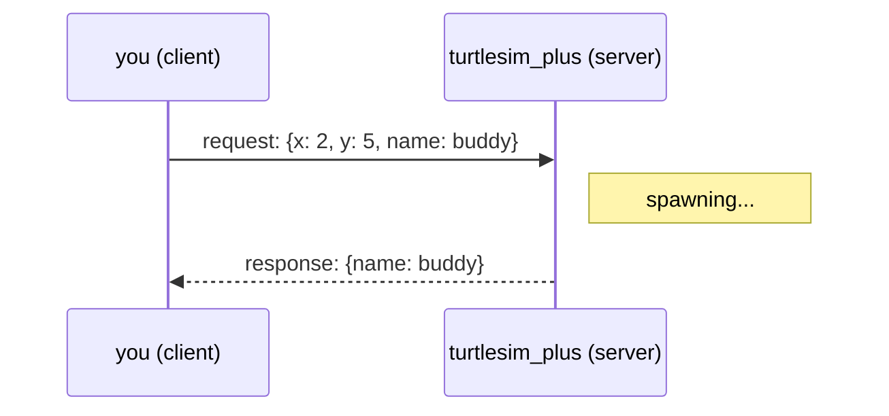

# Mission 3: Service Hotline ☎️

> **Briefing:** Three pizzas sit in three far corners of the map — driving there is a slog...
> Good news: the simulator offers **special services** you can call — spawn turtles, teleport, eat! Use them well and this takes just a few commands.



**🎯 Objectives**
- [ ] Spawn a new turtle named `buddy`
- [ ] turtle1 eats all 3 pizzas — at (1.5, 9.0), (9.0, 1.5), (1.5, 1.5)

**⭐ Stars:** ≤ 4 min = ⭐⭐⭐ · ≤ 8 min = ⭐⭐

```bash
# Terminal 1
ros2 launch turtle_quest mission.launch.py mission:=3
```

---

## 🧠 Concept card: services — call and wait for the answer

A topic is like **radio / a group chat**: messages flow, nobody replies.
Sometimes you want an **answer**: "please spawn a turtle — what's its name?" That's a **service**.



| | topic | service |
|---|---|---|
| shape | one-way, continuous | one question → one answer |
| get a reply? | no | yes |
| good for | data that keeps flowing (position, sensors, velocity) | one-off jobs (spawn, reset, eat) |
| examples here | `/turtle1/pose`, `/turtle1/cmd_vel` | `/spawn_turtle`, `/turtle1/eat` |

---

## Step 1: Open the phone book

```bash
ros2 service list
```

Lots of services! Some belong to the world (`/spawn_turtle`, `/spawn_pizza`, `/clear` ...), others to each turtle (`/turtle1/eat`, `/turtle1/teleport_absolute` ...).

> (The ones ending in `/describe_parameters`, `/get_parameters` ... exist on every node — they're about parameters, which you'll meet in mission 7. Skip them for now.)

## Step 2: Spawn a friend 🐢

Before calling, find out which **form (type)** the service uses:

```bash
ros2 service type /spawn_turtle
# turtlesim/srv/Spawn

ros2 interface show turtlesim/srv/Spawn
```

```text
float32 x
float32 y
float32 theta
string name # Optional.  A unique name will be created and returned if this is empty
---
string name
```

The `---` line splits the form in two: **above = what you send (request)** · **below = what you get back (response)**

Call it:

```bash
ros2 service call /spawn_turtle turtlesim/srv/Spawn "{x: 2.0, y: 5.0, theta: 0.0, name: 'buddy'}"
```

```text
requester: making request: turtlesim.srv.Spawn_Request(x=2.0, y=5.0, theta=0.0, name='buddy')

response:
turtlesim.srv.Spawn_Response(name='buddy')
```

A new turtle appears ✅ and it gets the full set of topics and services, just like turtle1:

```bash
ros2 topic list | grep buddy
ros2 topic pub --once /buddy/say std_msgs/msg/String "{data: 'Hi turtle1!'}"
```

## Step 3: Teleport to the pizzas 🍕

You could drive there... or **teleport**:

```bash
ros2 interface show turtlesim/srv/TeleportAbsolute
```

```text
float32 x
float32 y
float32 theta
---
```

The response is empty — this service returns nothing, it just says "done".

And the **eat** service `/turtle1/eat` (type `std_srvs/srv/Empty` — you send nothing at all).
The turtle eats a pizza that's inside its green cone (in front, within 2 m); with no pizza in the cone nothing happens.

Work out how to eat all three yourself!

<details>
<summary>🔓 Solution</summary>

```bash
ros2 service call /turtle1/teleport_absolute turtlesim/srv/TeleportAbsolute "{x: 1.5, y: 9.0, theta: 0.0}"
ros2 service call /turtle1/eat std_srvs/srv/Empty

ros2 service call /turtle1/teleport_absolute turtlesim/srv/TeleportAbsolute "{x: 9.0, y: 1.5, theta: 0.0}"
ros2 service call /turtle1/eat std_srvs/srv/Empty

ros2 service call /turtle1/teleport_absolute turtlesim/srv/TeleportAbsolute "{x: 1.5, y: 1.5, theta: 0.0}"
ros2 service call /turtle1/eat std_srvs/srv/Empty
```

Teleporting right on top of a pizza always works, whichever way you face.

</details>

🎉 Mission complete!

---

## 🔍 Commands you now know

| Command | What it does |
|---|---|
| `ros2 service list` | which services exist (`-t` = with types) |
| `ros2 service type <service>` | the form a service uses |
| `ros2 interface show <type>` | show the form (above `---` = request, below = response) |
| `ros2 service call <service> <type> "<yaml>"` | call the service |

## 🧩 Check yourself

<details>
<summary>1. What happens if you call <code>/spawn_turtle</code> with name: 'buddy' again?</summary>

Try it! Names must be unique, so the simulator picks `buddy_1` and **tells you in the response** — that's why services answer back. With a topic you'd never find out.

</details>

<details>
<summary>2. Should "turn the turtle" be a topic or a service? And "reset the map"?</summary>

Turning = a continuous stream of velocities → **topic** (`cmd_vel`)
Resetting = a one-off job where you want to know it's done → **service** (e.g. `/clear`)

</details>

## 🏆 Side quest: turtle artist 🎨

```bash
# red pen, width 5
ros2 service call /turtle1/set_pen turtlesim/srv/SetPen "{r: 255, g: 0, b: 0, width: 5, 'off': 0}"
# lift the pen (move without drawing)
ros2 service call /turtle1/set_pen turtlesim/srv/SetPen "{r: 255, g: 255, b: 255, width: 3, 'off': 1}"
# erase all lines
ros2 service call /clear std_srvs/srv/Empty
# spawn another pizza / remove a turtle
ros2 service call /spawn_pizza turtlesim_plus_interfaces/srv/GivePosition "{x: 5.0, y: 3.0}"
ros2 service call /remove_turtle turtlesim/srv/Kill "{name: 'buddy'}"
```

> ⚠️ Why does `'off'` need quotes? In YAML the word `off` (like `yes`/`no`) means the boolean `false`, not a field name

Combine it with mission 2: switch colours and draw rainbow circles 🌈

---

**← Previous** [Mission 2](02-steering.md) · **Next →** [Mission 4: My First Node](04-first-node.md)
