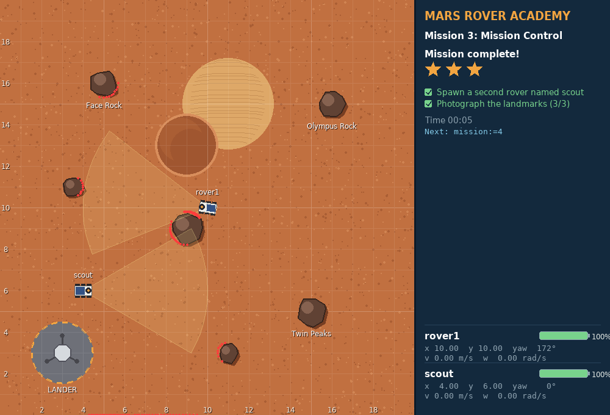
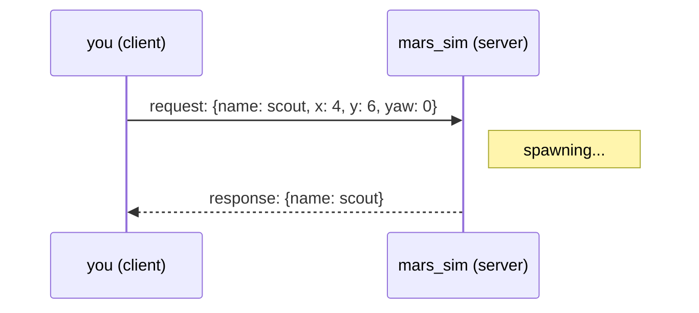
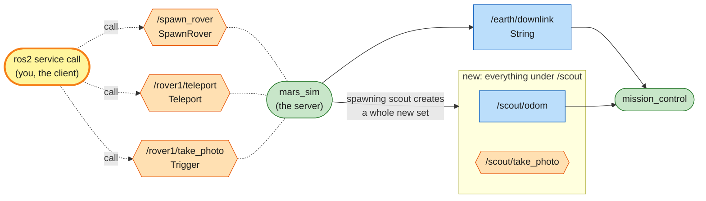

# Mission 3: Mission Control

Earth wants photos of three landmarks, all at the far ends of the map. Driving to each one is a slog. The simulator offers services you can call to land a second rover, move a rover instantly and take photos, and with those the job takes a handful of commands.



**Objectives**
- [ ] Spawn a second rover named scout
- [ ] Photograph the landmarks: Olympus Rock (16, 15), Twin Peaks (15, 5) and Face Rock (5, 16)

**Stars:** ≤ 5 min = ⭐⭐⭐ · ≤ 10 min = ⭐⭐

```bash
# Terminal 1
ros2 launch mission_control mission.launch.py mission:=3
```

---

## Services: ask and wait for the answer

A topic is like radio or a group chat. Messages flow and nobody replies. Sometimes you need an answer, though: "please land a rover, and tell me its name", or "take a photo, and tell me whether it worked". For that ROS 2 has the **service**.



| | topic | service |
|---|---|---|
| shape | one-way, continuous | one question → one answer |
| get a reply? | no | yes |
| good for | data that keeps flowing (position, sensors, velocity) | one-off jobs (spawn, take a photo, reset) |
| examples here | `/rover1/odom`, `/rover1/cmd_vel` | `/spawn_rover`, `/rover1/take_photo` |

---

## Step 1: Open the phone book

```bash
ros2 service list
```

Some services belong to the world (`/spawn_rover`) and others to each rover (`/rover1/take_photo`, `/rover1/teleport` ...).

The ones starting with `/sim/` are how mission_control builds each mission's world. They're not part of the rover, so leave them alone.

The ones ending in `/describe_parameters`, `/get_parameters` ... exist on every node. They're for parameters, which come up in mission 7, so skip them for now.

## Step 2: Spawn a second rover

Before calling a service, find out which type (the form it uses):

```bash
ros2 service type /spawn_rover
# mars_interfaces/srv/SpawnRover

ros2 interface show mars_interfaces/srv/SpawnRover
```

```text
# Put a new rover into the world. An empty or taken name gets a free one.
string name
float64 x
float64 y
float64 yaw
---
string name        # the name the new rover actually got
```

The `---` line splits the form in two. Above it is what you send (the **request**); below it is what you get back (the **response**).

Call it:

```bash
ros2 service call /spawn_rover mars_interfaces/srv/SpawnRover "{name: scout, x: 4.0, y: 6.0, yaw: 0.0}"
```

```text
requester: making request: mars_interfaces.srv.SpawnRover_Request(name='scout', x=4.0, y=6.0, yaw=0.0)

response:
mars_interfaces.srv.SpawnRover_Response(name='scout')
```

A new rover appears, and it gets the same full set of topics and services as rover1:

```bash
ros2 topic list | grep scout
ros2 topic pub --once /scout/radio std_msgs/msg/String "{data: 'Hi rover1!'}"
```

## Step 3: Take a photo

The camera is a service too:

```bash
ros2 service type /rover1/take_photo
# std_srvs/srv/Trigger

ros2 interface show std_srvs/srv/Trigger
```

```text
---
bool success   # indicate successful run of triggered service
string message # informational, e.g. for error messages
```

The request is empty: there's nothing to fill in, you only ask. The response has two fields, and that's the new part. `success` says whether it worked and `message` says what happened. Try it now, from the lander:

```bash
ros2 service call /rover1/take_photo std_srvs/srv/Trigger
```

```text
response:
std_srvs.srv.Trigger_Response(success=False, message='No landmark in the picture. Get within 3 m and point the camera at it (less than 30 deg off).')
```

The call itself worked fine; the photo didn't, and the message tells you why. `Trigger` is a common type in ROS 2 for "do this one thing and tell me how it went". Always read the answer.

## Step 4: Teleport to the landmarks

You could drive to each landmark, or you could teleport:

```bash
ros2 interface show mars_interfaces/srv/Teleport
```

```text
# Simulator debug tool: put the rover at a pose instantly (it also stops it).
float64 x
float64 y
float64 yaw
---
```

The response is empty. This service returns nothing; the call coming back just means it's done.

Teleporting isn't something a real rover can do. It's a simulator tool for testing, like `set_entity_state` in the Gazebo simulator. Later missions with your own code won't allow it.

Now put the two together. A photo works when the landmark is less than 3 m from the rover and less than 30° away from the direction the rover faces. `yaw` is in radians: 0 faces right (+x), 1.5708 faces up (+y).

| Landmark | Position |
|---|---|
| Olympus Rock | (16, 15) |
| Twin Peaks | (15, 5) |
| Face Rock | (5, 16) |

Work out where to put rover1 for each photo. The landmarks are solid rock, so stand next to them, not on top.

<details>
<summary>Hint</summary>

Stand 2 m west of the landmark (2 less in x) and face right (`yaw: 0.0`): for Olympus Rock that's x = 14, y = 15.

</details>

<details>
<summary>Solution</summary>

```bash
ros2 service call /rover1/teleport mars_interfaces/srv/Teleport "{x: 14.0, y: 15.0, yaw: 0.0}"
ros2 service call /rover1/take_photo std_srvs/srv/Trigger

ros2 service call /rover1/teleport mars_interfaces/srv/Teleport "{x: 13.0, y: 5.0, yaw: 0.0}"
ros2 service call /rover1/take_photo std_srvs/srv/Trigger

ros2 service call /rover1/teleport mars_interfaces/srv/Teleport "{x: 3.0, y: 16.0, yaw: 0.0}"
ros2 service call /rover1/take_photo std_srvs/srv/Trigger
```

Each photo answers `success=True, message='Photo of ... sent to Earth.'`.

</details>

Once the last photo is sent, the panel shows *Mission complete* and your stars.

---

## System map



> 🟩 existing node · 🟨 you · 🟦 topic · 🟧 service · 🟪 action · ⬜ parameter — [how to read the maps](../ARCHITECTURE.md#how-to-read-the-maps)

One node, `mars_sim`, is the **server** for many services, and you were the **client** of each call. Every call is a round trip: the request goes out, the response comes back, and that's the end of it. Unlike a topic, nothing keeps flowing afterwards.

A service can also change the graph. `/spawn_rover` created a whole new set of topics and services under `/scout/`, and mission_control noticed `/scout/odom` appear.

Services and topics work together. You took the photo with a service (`/rover1/take_photo`), and the photo went to Earth on a topic (`/earth/downlink`) that mission_control listens to.

Now that you know topics and services, it's a good time to read [ARCHITECTURE.md](../ARCHITECTURE.md) for the bigger picture of how ROS 2 systems fit together.

## Commands you now know

| Command | What it does |
|---|---|
| `ros2 service list` | which services exist (`-t` = with types) |
| `ros2 service type <service>` | the form a service uses |
| `ros2 interface show <type>` | show the form (above `---` = request, below = response) |
| `ros2 service call <service> <type> "<yaml>"` | call the service (leave out the data if the request is empty) |

## Check yourself

<details>
<summary>1. What happens if you call <code>/spawn_rover</code> with name: scout again?</summary>

Try it. Names must be unique, so the simulator picks `scout_2` and tells you in the response. That's why services answer back: with a topic you'd never find out.

</details>

<details>
<summary>2. Should "drive the rover" be a topic or a service? And "take a photo"?</summary>

Driving is a continuous stream of velocities, so it's a topic (`cmd_vel`).
A photo is a one-off job where you want to know whether it worked, so it's a service (`take_photo`, which answers with `success` and `message`).

</details>

<details>
<summary>3. A <code>Trigger</code> call comes back with <code>success=False</code>. Did the service call fail?</summary>

No. The call worked: the request reached the server and an answer came back. The *job* failed, and `message` says why. A call that really fails never gets an answer at all (for example, `ros2 service call` keeps printing `waiting for service to become available...` when nobody offers that service).

</details>

## Extras

- Drive scout: `ros2 topic pub --once /scout/cmd_vel geometry_msgs/msg/Twist "{linear: {x: 1.0}}"`. Can scout take a photo of a landmark too?
- Take a screenshot of the simulator: `ros2 service call /sim/screenshot std_srvs/srv/Trigger`. The `message` tells you where the file went.
- Spawn a rover with an empty name (`name: ''`) and see what it gets called.

---

**Previous:** [Mission 2](02-manual-drive.md) · **Next:** [Mission 4: Survey Square](04-survey-square.md)
