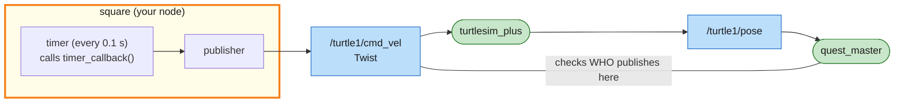
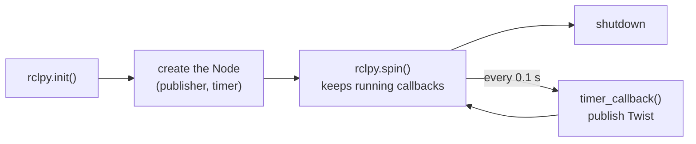
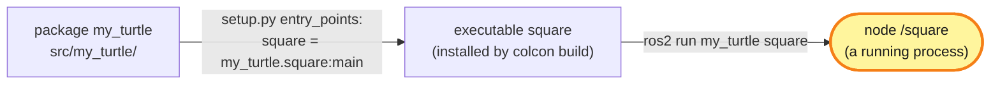

# Mission 4: My First Node

Typing commands one at a time gets old fast, so this time you write a program that drives the turtle for you. The first job is a square, 4 metres per side, passing all four flags in order.


**Objectives**
- [ ] Draw a square through the flags 1 → 2 → 3 → 4
- [ ] Drive the turtle with your own node (no teleop / `ros2 topic pub`)

**Stars:** ≤ 16 s = ⭐⭐⭐ · ≤ 30 s = ⭐⭐ · the clock starts when the turtle starts moving

```bash
# Terminal 1
ros2 launch turtle_quest mission.launch.py mission:=4
```

The turtle is teleported to (3, 3), facing right. The flags are at (7, 3), (7, 7), (3, 7) and (3, 3), in that order.

---

## System map



> 🟩 existing node · 🟨 you · 🟦 topic · 🟧 service · 🟪 action · ⬜ parameter — [how to read the maps](../ARCHITECTURE.md#how-to-read-the-maps)

Your node publishes on `/turtle1/cmd_vel`, the same topic `ros2 topic pub` used in mission 2, so the simulator can't tell the difference.

Inside the node, a timer drives a publisher. Nothing comes back into your node, so it can't see where the turtle is. More on that at the end.

quest_master checks the node name of whoever publishes on `cmd_vel`. Yours will be `square`, not `teleop_turtle` or `_ros2cli_...`.

---

## Step 1: Create a package

ROS 2 code always lives in a **package**. Create your own in `src/`:

```bash
cd ~/turtle_quest/src
ros2 pkg create --build-type ament_python my_turtle \
  --dependencies rclpy geometry_msgs std_msgs std_srvs sensor_msgs turtlesim turtlesim_plus_interfaces
```

`--build-type ament_python` makes it a Python package. `--dependencies ...` lists the other packages you'll use, and they get written into `package.xml` for you.

You get:

```text
src/my_turtle/
├── my_turtle/
│   └── __init__.py      ← your .py files go in this folder
├── package.xml          ← the package's ID card: name, maintainer, dependencies
├── setup.py             ← which programs `ros2 run` can start from this package
├── setup.cfg
├── resource/
└── test/
```

## Step 2: A first node that drives in circles

Create `src/my_turtle/my_turtle/square.py`:

```python
# my_turtle/my_turtle/square.py  (first version)
import rclpy
from rclpy.node import Node
from geometry_msgs.msg import Twist


class Square(Node):
    def __init__(self):
        super().__init__('square')  # node name (shows up in ros2 node list)
        # publisher: sends Twist to /turtle1/cmd_vel (10 = message queue size)
        self.publisher = self.create_publisher(Twist, '/turtle1/cmd_vel', 10)
        # timer: call timer_callback every 0.1 s
        self.timer = self.create_timer(0.1, self.timer_callback)

    def timer_callback(self):
        msg = Twist()
        msg.linear.x = 1.0   # 1 m/s forward
        msg.angular.z = 0.5  # 0.5 rad/s to the left
        self.publisher.publish(msg)


def main():
    rclpy.init()           # 1. start ROS 2
    node = Square()        # 2. create the node
    try:
        rclpy.spin(node)   # 3. "spin": wait for timers/messages and run their callbacks, forever
    except KeyboardInterrupt:
        pass               #    until Ctrl+C
    finally:
        node.destroy_node()
        rclpy.try_shutdown()  # 4. shut down


if __name__ == '__main__':
    main()
```

### Anatomy of a node



Every node is a class that inherits from `Node`. You don't write a `while True:` loop with `sleep()` yourself. You tell ROS to call a function every 0.1 s, and `spin()` takes care of it. The next mission shows why that matters: the node has to stay free to receive incoming messages.

It sends every 0.1 s because of the 1-second rule. Stop sending and the turtle stops.

## Step 3: Register the program

Open `src/my_turtle/setup.py`, find `entry_points` and add this line:

```python
    entry_points={
        'console_scripts': [
            'square = my_turtle.square:main',
        ],
    },
```

That reads as "the command `square` runs the `main` function in `my_turtle/square.py`". Here is how the three names fit together:



The package is the box of code, the executable is one program in it, and the node is what that program creates when it runs. One executable can be started many times as separate nodes, which is exactly what you'll do in mission 7.

## Step 4: Build and run

```bash
cd ~/turtle_quest              # always build at the workspace root, not inside src/
colcon build --symlink-install --packages-select my_turtle
source install/setup.bash
ros2 run my_turtle square
```

The turtle drives in circles. Stop it with `Ctrl+C`.

While it runs, check from another terminal:

```bash
ros2 node list                          # /square is there now
ros2 topic info -v /turtle1/cmd_vel     # the publisher is your node
```

With `--symlink-install`, the .py files in `install/` are only shortcuts back to `src/`, so you can edit your code and run it again without rebuilding. The exception is `setup.py`: if you change it (to add a new program, say), build and source again.

## Step 5: Draw the square

A square is four repeats of "drive 4 m straight, turn left 90°".

Instead of sending the same command forever, write a plan: a list of steps `(forward speed, turn speed, duration)`. The timer checks the clock to know which step it's in. Change `square.py` to:

```python
# my_turtle/my_turtle/square.py
import math

import rclpy
from rclpy.node import Node
from geometry_msgs.msg import Twist

SPEED = 1.0       # forward speed (m/s)
TURN_SPEED = 1.0  # turning speed (rad/s)
SIDE = 4.0        # side length (m)


class Square(Node):
    def __init__(self):
        super().__init__('square')
        self.publisher = self.create_publisher(Twist, '/turtle1/cmd_vel', 10)
        self.timer = self.create_timer(0.1, self.timer_callback)

        # the plan: (forward speed, turn speed, duration) x 4 sides
        one_side = [(SPEED, 0.0, SIDE / SPEED), (0.0, TURN_SPEED, (math.pi / 2) / TURN_SPEED)]
        self.plan = one_side * 4
        self.step = 0                    # which step of the plan we're in
        self.step_started = self.now()   # when this step started

    def now(self) -> float:
        return self.get_clock().now().nanoseconds / 1e9  # current time in seconds

    def timer_callback(self):
        if self.step >= len(self.plan):
            self.publisher.publish(Twist())  # an empty Twist() = zero velocity = stop
            return
        linear, angular, duration = self.plan[self.step]
        if self.now() - self.step_started >= duration:
            self.step += 1  # this step is over -> next step
            self.step_started += duration
            return
        msg = Twist()
        msg.linear.x = linear
        msg.angular.z = angular
        self.publisher.publish(msg)


def main():
    rclpy.init()
    node = Square()
    try:
        rclpy.spin(node)
    except KeyboardInterrupt:
        pass
    finally:
        node.destroy_node()
        rclpy.try_shutdown()


if __name__ == '__main__':
    main()
```

Close and relaunch the mission so the turtle goes back to its start, then run it. Thanks to `--symlink-install` there's no rebuild:

```bash
ros2 run my_turtle square
```

The panel shows *Mission complete*, most likely with two stars. The box below explains why.

<details>
<summary>Why only 2 stars?</summary>

Time = 4 × (drive 4 s + turn π/2 ≈ 1.57 s) ≈ 22 seconds, which is more than 16.
Try raising `SPEED` and `TURN_SPEED`. Does it get less accurate? Why?

</details>

---

## Summary

- **package**: created with `ros2 pkg create`. Code lives in `<pkg>/<pkg>/` and programs are registered in `setup.py`.
- **publisher**: `self.create_publisher(Type, 'topic', 10)`, then `.publish(msg)`.
- **timer**: `self.create_timer(seconds, function)`. ROS calls you periodically.
- Lifecycle: `rclpy.init()`, create the node, `rclpy.spin()`, shut down.
- Run `colcon build --symlink-install` once, then edit .py files freely. Changing `setup.py` needs a rebuild.

This node drives with its eyes closed. It has no idea where the turtle really is and only counts time, which is called **open loop**. If someone teleported the turtle halfway, it would carry on with the plan without noticing. In the next mission the turtle gets to look.

## Troubleshooting

| Symptom | Fix |
|---|---|
| `No executable found` | missing line in `setup.py` / forgot to rebuild after editing `setup.py` / forgot `source install/setup.bash` |
| `Package 'my_turtle' not found` | forgot `source install/setup.bash` (in the terminal where you `ros2 run`) |
| `error: option --editable not recognized` | pip setuptools too new: `pip3 install "setuptools<80"` |
| the square is a bit crooked | normal for open loop; if it's very crooked, slow down |
| 1 star + "teleop / ros2 topic pub detected" | teleop or `ros2 topic pub` is still running in another terminal; close them all and retry |

## Extras

- Draw a triangle or a 5-pointed star (a star turns 144° at each tip).
- Make the turtle announce the side it's drawing: add a publisher to `/turtle1/say` (type `std_msgs/msg/String`).

---

**Previous:** [Mission 3](03-hotline.md) · **Next:** [Mission 5: Turtle Eyes](05-eyes.md)
