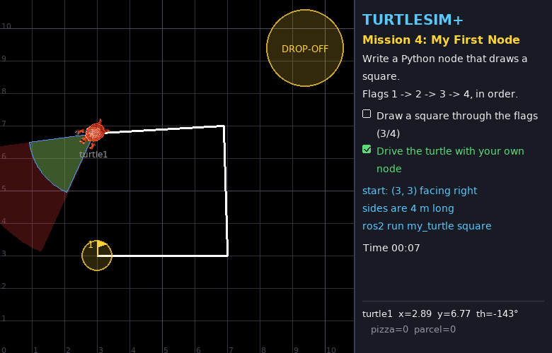
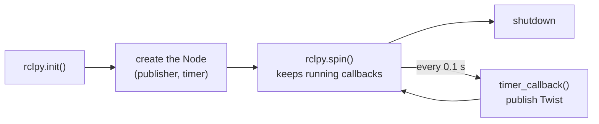

# Mission 4: My First Node 🐍

> **Briefing:** Typing commands one by one is exhausting... time to write **your own program** that drives the turtle for you!
> First job: draw a **square**, 4 metres per side, passing all 4 flags in order.



**🎯 Objectives**
- [ ] Draw a square through the flags 1 → 2 → 3 → 4
- [ ] Drive the turtle with your own node (no teleop / `ros2 topic pub`)

**⭐ Stars:** ≤ 16 s = ⭐⭐⭐ · ≤ 30 s = ⭐⭐ — the clock starts when the turtle starts moving

```bash
# Terminal 1
ros2 launch turtle_quest mission.launch.py mission:=4
```

The turtle is teleported to (3, 3) facing right. Flags: (7, 3) → (7, 7) → (3, 7) → (3, 3)

---

## Step 1: Create a package

ROS 2 code always lives in a **package**. Create your own box in `src/`:

```bash
cd ~/turtle_quest/src
ros2 pkg create --build-type ament_python my_turtle \
  --dependencies rclpy geometry_msgs std_msgs std_srvs sensor_msgs turtlesim turtlesim_plus_interfaces
```

- `--build-type ament_python` = a Python package
- `--dependencies ...` = other packages you'll use (written into `package.xml` for you)

You get:

```text
src/my_turtle/
├── my_turtle/
│   └── __init__.py      ← your .py files go in this folder
├── package.xml          ← the package's ID card: name, maintainer, dependencies
├── setup.py             ← which programs `ros2 run` can start from this package
├── setup.cfg
├── resource/
└── test/
```

## Step 2: A first node — just drive in circles

Create `src/my_turtle/my_turtle/square.py`:

```python
# my_turtle/my_turtle/square.py  (first version)
import rclpy
from rclpy.node import Node
from geometry_msgs.msg import Twist


class Square(Node):
    def __init__(self):
        super().__init__('square')  # node name (shows up in ros2 node list)
        # publisher: sends Twist to /turtle1/cmd_vel (10 = message queue size)
        self.publisher = self.create_publisher(Twist, '/turtle1/cmd_vel', 10)
        # timer: call timer_callback every 0.1 s
        self.timer = self.create_timer(0.1, self.timer_callback)

    def timer_callback(self):
        msg = Twist()
        msg.linear.x = 1.0   # 1 m/s forward
        msg.angular.z = 0.5  # 0.5 rad/s to the left
        self.publisher.publish(msg)


def main():
    rclpy.init()           # 1. start ROS 2
    node = Square()        # 2. create the node
    try:
        rclpy.spin(node)   # 3. "spin": wait for timers/messages and run their callbacks, forever
    except KeyboardInterrupt:
        pass               #    until Ctrl+C
    finally:
        node.destroy_node()
        rclpy.try_shutdown()  # 4. shut down


if __name__ == '__main__':
    main()
```

### 🧠 Concept card: anatomy of a node



- Every node is a class that inherits from `Node`
- You don't write `while True:` + `sleep()` yourself; you **tell ROS "call this function every 0.1 s"** and `spin()` takes care of it
  (next mission shows why this matters: the node must stay free to receive incoming messages)
- Why send every 0.1 s? Remember the 1-second rule — stop sending and the turtle stops

## Step 3: Register the program

Open `src/my_turtle/setup.py`, find `entry_points` and add this line:

```python
    entry_points={
        'console_scripts': [
            'square = my_turtle.square:main',
        ],
    },
```

Read it as: "the command `square` = run the `main` function in `my_turtle/square.py`"

## Step 4: Build and run

```bash
cd ~/turtle_quest              # always build at the workspace root, not inside src/
colcon build --symlink-install --packages-select my_turtle
source install/setup.bash
ros2 run my_turtle square
```

The turtle drives in circles 🎉 That's your first ROS 2 program! (`Ctrl+C` to stop)

Peek from another terminal:

```bash
ros2 node list                          # /square is there now
ros2 topic info -v /turtle1/cmd_vel     # the publisher is your node
```

> 💡 **What does `--symlink-install` buy you?** The .py files in install/ are just "shortcuts" back to src/
> → **edit your code and run it again, no rebuild needed**
> Except when you change `setup.py` (e.g. add a new program): then build + source again

## Step 5: Draw the square ⬜

A square = (go straight 4 m → turn left 90°) × 4

Instead of sending the same command forever, write a **plan**: a list of steps `(forward speed, turn speed, duration)`,
and let the timer check the clock to know which step we're in. Change `square.py` to:

```python
# my_turtle/my_turtle/square.py
import math

import rclpy
from rclpy.node import Node
from geometry_msgs.msg import Twist

SPEED = 1.0       # forward speed (m/s)
TURN_SPEED = 1.0  # turning speed (rad/s)
SIDE = 4.0        # side length (m)


class Square(Node):
    def __init__(self):
        super().__init__('square')
        self.publisher = self.create_publisher(Twist, '/turtle1/cmd_vel', 10)
        self.timer = self.create_timer(0.1, self.timer_callback)

        # the plan: (forward speed, turn speed, duration) x 4 sides
        one_side = [(SPEED, 0.0, SIDE / SPEED), (0.0, TURN_SPEED, (math.pi / 2) / TURN_SPEED)]
        self.plan = one_side * 4
        self.step = 0                    # which step of the plan we're in
        self.step_started = self.now()   # when this step started

    def now(self) -> float:
        return self.get_clock().now().nanoseconds / 1e9  # current time in seconds

    def timer_callback(self):
        if self.step >= len(self.plan):
            self.publisher.publish(Twist())  # an empty Twist() = zero velocity = stop
            return
        linear, angular, duration = self.plan[self.step]
        if self.now() - self.step_started >= duration:
            self.step += 1  # this step is over -> next step
            self.step_started += duration
            return
        msg = Twist()
        msg.linear.x = linear
        msg.angular.z = angular
        self.publisher.publish(msg)


def main():
    rclpy.init()
    node = Square()
    try:
        rclpy.spin(node)
    except KeyboardInterrupt:
        pass
    finally:
        node.destroy_node()
        rclpy.try_shutdown()


if __name__ == '__main__':
    main()
```

Close and relaunch the mission (the turtle goes back to its start), then run — no rebuild thanks to `--symlink-install`:

```bash
ros2 run my_turtle square
```

🎉 Mission complete! ...but how many stars? 🤔

<details>
<summary>🧮 Why only 2 stars?</summary>

Time = 4 × (drive 4 s + turn π/2 ≈ 1.57 s) ≈ **22 seconds** — more than 16.
Try raising `SPEED` and `TURN_SPEED`! (Does it get less accurate? Why?)

</details>

---

## 🔍 Summary

- **package**: created with `ros2 pkg create`; code lives in `<pkg>/<pkg>/`; programs are registered in `setup.py`
- **publisher**: `self.create_publisher(Type, 'topic', 10)` then `.publish(msg)`
- **timer**: `self.create_timer(seconds, function)` — ROS calls you periodically
- lifecycle: `rclpy.init()` → create the node → `rclpy.spin()` → shutdown
- `colcon build --symlink-install` once, then edit .py freely (changing `setup.py` needs a rebuild)

> 🤔 **Food for thought:** this node "walks with its eyes closed" — it has no idea where the turtle really is, it just counts time (that's called **open loop**).
> If someone teleported the turtle midway, it would carry on with the plan without noticing... next mission the turtle **opens its eyes** 👀

## 🛠️ Troubleshooting

| Symptom | Fix |
|---|---|
| `No executable found` | missing line in `setup.py` / forgot to rebuild after editing `setup.py` / forgot `source install/setup.bash` |
| `Package 'my_turtle' not found` | forgot `source install/setup.bash` (in the terminal where you `ros2 run`) |
| `error: option --editable not recognized` | pip setuptools too new: `pip3 install "setuptools<80"` |
| the square is a bit crooked | normal for open loop — if it's very crooked, slow down |
| 1 star + "teleop / ros2 topic pub detected" | teleop or `ros2 topic pub` is still running in another terminal — close them all and retry |

## 🏆 Side quests

- Draw a **triangle** or a **5-pointed star** (a star turns 144° at each tip)
- Make the turtle announce the side it's drawing: add a publisher to `/turtle1/say` (type `std_msgs/msg/String`)

---

**← Previous** [Mission 3](03-hotline.md) · **Next →** [Mission 5: Turtle Eyes](05-eyes.md)
