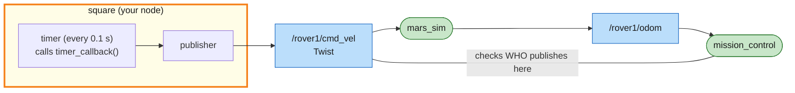
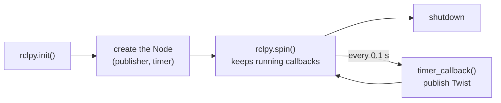
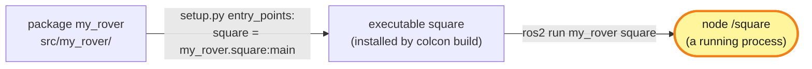

# Mission 4: Survey Square

Typing commands one at a time gets old fast, so this time you write a program that drives the rover for you. The first job is a survey square, 4 metres per side, passing all four beacons in order.


**Objectives**
- [ ] Drive a square through the beacons 1 → 2 → 3 → 4
- [ ] Drive the rover with your own node (no teleop / `ros2 topic pub`)

**Stars:** ≤ 30 s = ⭐⭐⭐ · ≤ 45 s = ⭐⭐ · the clock starts when the rover starts moving

```bash
# Terminal 1
ros2 launch mission_control mission.launch.py mission:=4
```

The rover starts on the lander at (3, 3), facing right. The beacons are at (7, 3), (7, 7), (3, 7) and (3, 3), in that order. The last one is where you started: the beacon only counts once the rover has left.

---

## System map



> 🟩 existing node · 🟨 you · 🟦 topic · 🟧 service · 🟪 action · ⬜ parameter — [how to read the maps](../ARCHITECTURE.md#how-to-read-the-maps)

Your node publishes on `/rover1/cmd_vel`, the same topic `ros2 topic pub` used in mission 2, so the simulator can't tell the difference.

Inside the node, a timer drives a publisher. Nothing comes back into your node, so it can't see where the rover is. More on that at the end.

mission_control checks the node name of whoever publishes on `cmd_vel`. Yours will be `square`, not `teleop_twist_keyboard` or `_ros2cli_...`.

---

## Step 1: Create a package

ROS 2 code always lives in a **package**. Create your own in `src/`:

```bash
cd ~/mars_rover/src
ros2 pkg create --build-type ament_python --license Apache-2.0 my_rover \
  --dependencies rclpy geometry_msgs nav_msgs sensor_msgs std_msgs std_srvs mars_interfaces
```

`--build-type ament_python` makes it a Python package. `--dependencies ...` lists the other packages you'll use, and they get written into `package.xml` for you. Today you only need `rclpy` and `geometry_msgs`; the rest are for later missions, and listing them now saves editing `package.xml` then.

> Careful: put the package name before `--dependencies`. Everything after `--dependencies` is read as a dependency, including a package name that ends up there by mistake.

You get:

```text
src/my_rover/
├── my_rover/
│   └── __init__.py      ← your .py files go in this folder
├── package.xml          ← the package's ID card: name, maintainer, dependencies
├── setup.py             ← which programs `ros2 run` can start from this package
├── setup.cfg
├── LICENSE
├── resource/
└── test/
```

## Step 2: A first node that drives in circles

Create `src/my_rover/my_rover/square.py`:

```python
# my_rover/my_rover/square.py  (first version)
import rclpy
from rclpy.executors import ExternalShutdownException
from rclpy.node import Node
from geometry_msgs.msg import Twist


class Square(Node):
    def __init__(self):
        super().__init__('square')  # node name (shows up in ros2 node list)
        # publisher: sends Twist to /rover1/cmd_vel (10 = message queue size)
        self.publisher = self.create_publisher(Twist, '/rover1/cmd_vel', 10)
        # timer: call timer_callback every 0.1 s
        self.timer = self.create_timer(0.1, self.timer_callback)

    def timer_callback(self):
        msg = Twist()
        msg.linear.x = 1.0   # 1 m/s forward
        msg.angular.z = 0.5  # 0.5 rad/s to the left
        self.publisher.publish(msg)


def main():
    rclpy.init()           # 1. start ROS 2
    node = Square()        # 2. create the node
    try:
        rclpy.spin(node)   # 3. "spin": wait for timers/messages and run their callbacks, forever
    except (KeyboardInterrupt, ExternalShutdownException):
        pass               #    until Ctrl+C
    finally:
        node.destroy_node()
        rclpy.try_shutdown()  # 4. shut down


if __name__ == '__main__':
    main()
```

### Anatomy of a node



Every node is a class that inherits from `Node`. You don't write a `while True:` loop with `sleep()` yourself. You tell ROS to call a function every 0.1 s, and `spin()` takes care of it. The next mission shows why that matters: the node has to stay free to receive incoming messages.

It sends every 0.1 s because of the 1-second rule. Stop sending and the rover stops.

Depending on the ROS 2 version, `Ctrl+C` arrives as a `KeyboardInterrupt` or as an `ExternalShutdownException`. Catching both lets the node exit quietly.

## Step 3: Register the program

Open `src/my_rover/setup.py`, find `entry_points` and add this line:

```python
    entry_points={
        'console_scripts': [
            'square = my_rover.square:main',
        ],
    },
```

That reads as "the command `square` runs the `main` function in `my_rover/square.py`". Here is how the three names fit together:



The package is the box of code, the executable is one program in it, and the node is what that program creates when it runs. One executable can be started many times as separate nodes, which is exactly what you'll do in mission 7.

## Step 4: Build and run

```bash
cd ~/mars_rover                # always build at the workspace root, not inside src/
colcon build --symlink-install --packages-select my_rover
source install/setup.bash
ros2 run my_rover square
```

The rover drives in circles with a 2 m radius (1.0 / 0.5, as in mission 2). Stop it with `Ctrl+C`.

While it runs, check from another terminal:

```bash
ros2 node list                          # /square is there now
ros2 topic info -v /rover1/cmd_vel      # the publisher is your node
```

With `--symlink-install`, the .py files in `install/` are only shortcuts back to `src/`, so you can edit your code and run it again without rebuilding. The exception is `setup.py`: if you change it (to add a new program, say), build and source again.

## Step 5: Drive the square

A square is four repeats of "drive 4 m straight, turn left 90°".

Instead of sending the same command forever, write a plan: a list of steps `(forward speed, turn speed, duration)`. The timer checks the clock to know which step it's in.

The rover needs a moment to roll to a stop after each move (up to 1 s from full speed, mission 2). If the next step started straight away, the rover would still be moving forward while it begins to turn. So the plan has short "wait" steps with zero speed between the moves. Change `square.py` to:

```python
# my_rover/my_rover/square.py
import math

import rclpy
from rclpy.executors import ExternalShutdownException
from rclpy.node import Node
from geometry_msgs.msg import Twist

SPEED = 0.5       # forward speed (m/s)
TURN_SPEED = 1.0  # turning speed (rad/s)
SIDE = 4.0        # side length (m)


class Square(Node):
    def __init__(self):
        super().__init__('square')
        self.publisher = self.create_publisher(Twist, '/rover1/cmd_vel', 10)
        self.timer = self.create_timer(0.1, self.timer_callback)

        # the plan: (forward speed, turn speed, duration) for one side, repeated 4 times
        one_side = [
            (SPEED, 0.0, SIDE / SPEED),                     # drive one side
            (0.0, 0.0, 1.0),                                # wait for the rover to roll to a stop
            (0.0, TURN_SPEED, (math.pi / 2) / TURN_SPEED),  # turn left 90 degrees
            (0.0, 0.0, 0.7),                                # wait for the turn to settle
        ]
        self.plan = one_side * 4
        self.step = 0                    # which step of the plan we're in
        self.step_started = self.now()   # when this step started

    def now(self) -> float:
        return self.get_clock().now().nanoseconds / 1e9  # current time in seconds

    def timer_callback(self):
        if self.step >= len(self.plan):
            self.publisher.publish(Twist())  # an empty Twist() = zero velocity = stop
            return
        linear, angular, duration = self.plan[self.step]
        if self.now() - self.step_started >= duration:
            self.step += 1  # this step is over -> next step
            self.step_started += duration
            return
        msg = Twist()
        msg.linear.x = linear
        msg.angular.z = angular
        self.publisher.publish(msg)


def main():
    rclpy.init()
    node = Square()
    try:
        rclpy.spin(node)
    except (KeyboardInterrupt, ExternalShutdownException):
        pass
    finally:
        node.destroy_node()
        rclpy.try_shutdown()


if __name__ == '__main__':
    main()
```

The circles from step 4 already started the mission clock. Close and relaunch the mission so the rover goes back to the lander, then run it. Thanks to `--symlink-install` there's no rebuild:

```bash
ros2 run my_rover square
```

The panel shows *Mission complete*, most likely with two stars. The box below explains why.

<details>
<summary>Why only 2 stars?</summary>

Each side takes 8 s of driving (4 m at 0.5 m/s), 1 s of waiting, about 1.6 s of turning (π/2 at 1.0 rad/s) and 0.7 s of settling. Three sides and most of the fourth come to about 40 seconds, which is more than 30.
Try the rover's top speeds, `SPEED = 1.0` and `TURN_SPEED = 2.0`. The square then takes about 23 seconds.
Does it get less accurate? Not much here, because the wait steps are long enough for the rover to stop even from its top speed.

</details>

---

## Summary

- **package**: created with `ros2 pkg create`. Code lives in `<pkg>/<pkg>/` and programs are registered in `setup.py`.
- **publisher**: `self.create_publisher(Type, 'topic', 10)`, then `.publish(msg)`.
- **timer**: `self.create_timer(seconds, function)`. ROS calls you periodically.
- Lifecycle: `rclpy.init()`, create the node, `rclpy.spin()`, shut down.
- Run `colcon build --symlink-install` once, then edit .py files freely. Changing `setup.py` needs a rebuild.

Look where the rover stopped: about 0.3 m away from where it started, even though every number in the plan is right. This node drives with its eyes closed. It has no idea where the rover really is and only counts time, which is called **open loop**. Every move ends a little off: the timer only looks at the clock every 0.1 s, so a side can run a few centimetres long or a turn a degree or two too far. The plan never finds out, so each corner starts from a slightly wrong place, and the errors add up around the square. If someone teleported the rover halfway, it would carry on with the plan without noticing either. In the next mission the rover reads its own position, and there's sand on the way.

## Troubleshooting

| Symptom | Fix |
|---|---|
| `No executable found` | missing line in `setup.py` / forgot to rebuild after editing `setup.py` / forgot `source install/setup.bash` |
| `Package 'my_rover' not found` | forgot `source install/setup.bash` (in the terminal where you `ros2 run`) |
| `error: option --editable not recognized` | a setuptools installed with pip is too new: `pip3 install --user "setuptools<80"` (Ubuntu 24.04 also needs `--break-system-packages`) |
| the square misses a beacon | did you relaunch the mission so the rover starts on the lander, facing right? |
| the clock was already running before you started | it starts the first time the rover moves; close and relaunch the mission |
| 1 star + "teleop / ros2 topic pub detected" | teleop or `ros2 topic pub` is still running in another terminal; close them all and retry |
| 1 star + "teleport detected" | you called `/rover1/teleport`; relaunch the mission and let your node do the driving |

## Extras

- Drive a triangle or a 5-pointed star (a star turns 144° at each tip).
- Take out the two wait steps and run it again. Watch the corners: the rover is still rolling forward when the turn starts, so they become curves.
- Make the rover announce the side it's driving: add a publisher to `/rover1/radio` (type `std_msgs/msg/String`).

---

**Previous:** [Mission 3](03-mission-control.md) · **Next:** [Mission 5: Waypoints](05-waypoints.md)
