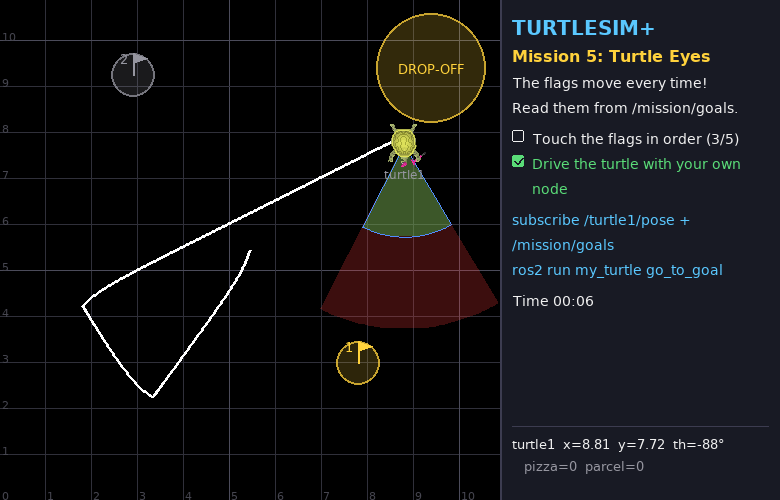
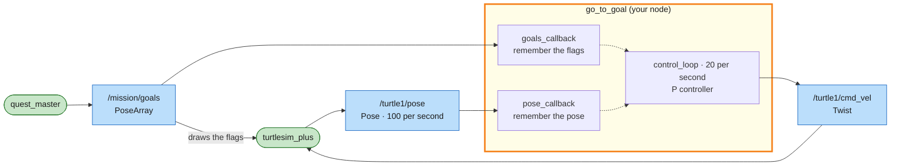

# Mission 5: Turtle Eyes 👀

> **Briefing:** Five flags at random positions, different every time — no memorising the route!
> The turtle has to **look** where it is, **look** where the flag is, and steer there by itself.



**🎯 Objectives**
- [ ] Touch all 5 flags in order
- [ ] Drive the turtle with your own node

**⭐ Stars:** ≤ 20 s = ⭐⭐⭐ · ≤ 40 s = ⭐⭐ — the clock starts when the turtle starts moving

```bash
# Terminal 1
ros2 launch turtle_quest mission.launch.py mission:=5
```

---

## 🧠 Concept card: subscribers and closed loop

In mission 4 your node only **sent** (a publisher) — like walking with your eyes shut, counting steps.
This time it also **receives** (a subscriber): every time a message arrives, ROS calls your **callback**.



> 🟩 existing node · 🟨 you · 🟦 topic · 🟧 service · 🟪 action · ⬜ parameter — [how to read the maps](../ARCHITECTURE.md#how-to-read-the-maps)

Look at the position → compute → steer → look at the new position → ... round and round: a **closed loop (feedback)**.
Almost every real robot works this way.

Inside the node, the **callbacks only remember** the latest data and a **timer decides** what to do with it. Step 3 explains why.

---

## Step 1: Listen first

Where are the flags? The quest master announces them on a topic:

```bash
ros2 topic echo --once /mission/goals
```

```text
header: ...
poses:
- position:
    x: 2.71
    y: 8.97
    z: 0.5        # ← the simulator uses z as the flag radius, ignore it
  orientation: ...
- position:
    ...
```

The type is `geometry_msgs/msg/PoseArray` — `poses` is a list of positions, and **the first one (`poses[0]`) is always the next flag**. Touch it and it disappears from the list.

Create `src/my_turtle/my_turtle/go_to_goal.py`:

```python
# my_turtle/my_turtle/go_to_goal.py  (first version: just listen)
import rclpy
from rclpy.node import Node
from geometry_msgs.msg import PoseArray
from turtlesim.msg import Pose


class GoToGoal(Node):
    def __init__(self):
        super().__init__('go_to_goal')
        # subscriber: when a message arrives on /turtle1/pose, call self.pose_callback
        self.create_subscription(Pose, '/turtle1/pose', self.pose_callback, 10)
        self.create_subscription(PoseArray, '/mission/goals', self.goals_callback, 10)

    def pose_callback(self, msg: Pose):
        # pose arrives 100 times/s -> throttle the log to once per second or it floods the screen
        self.get_logger().info(f'turtle at x={msg.x:.2f} y={msg.y:.2f} theta={msg.theta:.2f}',
                               throttle_duration_sec=1.0)

    def goals_callback(self, msg: PoseArray):
        if msg.poses:
            goal = msg.poses[0].position
            self.get_logger().info(f'next flag ({goal.x:.2f}, {goal.y:.2f}), {len(msg.poses)} left',
                                   throttle_duration_sec=1.0)


def main():
    rclpy.init()
    node = GoToGoal()
    try:
        rclpy.spin(node)
    except KeyboardInterrupt:
        pass
    finally:
        node.destroy_node()
        rclpy.try_shutdown()


if __name__ == '__main__':
    main()
```

Add it to `setup.py` (after the existing line — mind the comma):

```python
            'square = my_turtle.square:main',
            'go_to_goal = my_turtle.go_to_goal:main',
```

You changed `setup.py` → rebuild:

```bash
cd ~/turtle_quest
colcon build --symlink-install --packages-select my_turtle
source install/setup.bash
ros2 run my_turtle go_to_goal
```

```text
[INFO] [go_to_goal]: turtle at x=5.44 y=5.44 theta=0.00
[INFO] [go_to_goal]: next flag (2.71, 8.97), 5 left
```

The turtle has eyes now 👀

## Step 2: A little maths 📐

```text
                               G  flag (goal_x, goal_y)
                             / |
                 distance  /   |
                         /     |  dy = goal_y - y
                       /       |
                     /  a      |
   turtle (x, y)  T ------------+
                      dx = goal_x - x

     a     = angle we should face  = atan2(dy, dx)
     theta = angle we face now     (from /turtle1/pose)
     error = a - theta             (how far off we are)
```

- **distance** = `math.hypot(dx, dy)` (Pythagoras)
- **angle to face** = `math.atan2(dy, dx)` (in radians)
- **heading error** = angle to face − theta

⚠️ Trap: if we should face 170° but face −170°, error = 340° and the turtle spins almost a full turn, when −20° would do.
Fix it with the standard trick `math.atan2(math.sin(e), math.cos(e))`, which always squeezes an angle into −π..π

## Step 3: Decide — a P controller

A simple rule used all over the world (**Proportional controller**):

- **the further off we point → the harder we turn:** `angular.z = K_ANGULAR × error`
- **the further away → the faster we drive** (up to a top speed): `linear.x = min(K_LINEAR × distance, MAX_SPEED)`
- if we're still pointing way off, don't drive yet — turn first

Good structure: **callbacks only remember the latest data** and **a timer makes decisions** with whatever is latest.
Change `go_to_goal.py` to:

```python
# my_turtle/my_turtle/go_to_goal.py
import math

import rclpy
from rclpy.node import Node
from geometry_msgs.msg import PoseArray, Twist
from turtlesim.msg import Pose

MAX_SPEED = 1.5   # top speed (m/s)
K_LINEAR = 1.0    # further away -> faster
K_ANGULAR = 4.0   # pointing further off -> turn harder


class GoToGoal(Node):
    def __init__(self):
        super().__init__('go_to_goal')
        self.pose = None   # latest turtle pose (None = not received yet)
        self.goals = []    # remaining flags, the first one is the next target
        self.create_subscription(Pose, '/turtle1/pose', self.pose_callback, 10)
        self.create_subscription(PoseArray, '/mission/goals', self.goals_callback, 10)
        self.publisher = self.create_publisher(Twist, '/turtle1/cmd_vel', 10)
        self.create_timer(0.05, self.control_loop)  # decide 20 times per second

    def pose_callback(self, msg: Pose):
        self.pose = msg   # just remember it

    def goals_callback(self, msg: PoseArray):
        self.goals = [(p.position.x, p.position.y) for p in msg.poses]

    def control_loop(self):
        cmd = Twist()  # start from zero velocity
        if self.pose is not None and self.goals:
            goal_x, goal_y = self.goals[0]
            dx = goal_x - self.pose.x
            dy = goal_y - self.pose.y
            distance = math.hypot(dx, dy)
            # angle we should face minus angle we face = heading error (wrapped to -pi..pi)
            error = math.atan2(dy, dx) - self.pose.theta
            error = math.atan2(math.sin(error), math.cos(error))

            cmd.angular.z = K_ANGULAR * error
            if abs(error) < 0.5:  # only drive once we roughly face the goal
                cmd.linear.x = min(K_LINEAR * distance, MAX_SPEED)
        self.publisher.publish(cmd)


def main():
    rclpy.init()
    node = GoToGoal()
    try:
        rclpy.spin(node)
    except KeyboardInterrupt:
        pass
    finally:
        node.destroy_node()
        rclpy.try_shutdown()


if __name__ == '__main__':
    main()
```

```bash
ros2 run my_turtle go_to_goal
```

The turtle steers to each flag by itself 🎉 When the flags run out, `self.goals` is empty → zero Twist → the turtle parks.

<details>
<summary>🏎️ Want 3 stars?</summary>

The defaults take about 25 s (2 stars). Tune `MAX_SPEED`, `K_LINEAR`, `K_ANGULAR`:
- `K_ANGULAR` too high → the turtle wobbles (overshoot) · too low → sluggish turns
- `MAX_SPEED` too high → it may shoot past the flag and loop back

Your instructor has a 3-star reference version to demo — but try tuning first!

</details>

---

## 🔍 Summary

- **subscriber**: `self.create_subscription(Type, 'topic', callback, 10)` — ROS calls `callback(msg)` for every message
- callbacks should be **short and quick** — store the data, let a timer decide
- one node can be both publisher and subscriber
- **closed loop**: measure → compute the error → command → measure again · **P controller**: command = K × error

## 🧩 Check yourself

<details>
<summary>1. What happens if you put <code>time.sleep(5)</code> inside <code>pose_callback</code>?</summary>

`spin()` runs one callback at a time — while it sleeps for 5 s the timer doesn't run and no other message is read. The turtle stops (1-second rule) and moves in jerks.
Lesson: **never wait long inside a callback** — that's why mission 4 used a timer instead of `while` + `sleep`

</details>

<details>
<summary>2. If someone teleports the turtle mid-run, what does this node do? How is it different from square.py?</summary>

Try it! (`ros2 service call /turtle1/teleport_absolute ...` while the node runs)
go_to_goal reads the new position and steers back to the flag by itself — closed loop corrects itself, while square.py would blindly carry on with its plan

</details>

## 🏆 Side quests

- Live plot of the position: `ros2 run rqt_plot rqt_plot /turtle1/pose/x /turtle1/pose/y`
- Launch mission 5 with `seed:=42` and race a friend — the flags will be in exactly the same places

---

**← Previous** [Mission 4](04-first-node.md) · **Next →** [Mission 6: Pizza Hunter](06-pizza-hunter.md)
