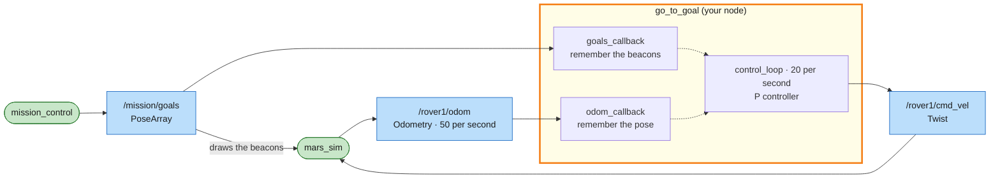

# Mission 5: Waypoints

Five beacons at random positions, different every run, so a plan written in advance won't help. There's sand on most of the way, too. The rover has to check where it is, check where the beacon is, and steer there by itself.


**Objectives**
- [ ] Reach the beacons in order (0/5)
- [ ] Drive the rover with your own node (no teleop, `ros2 topic pub` or teleport)

**Stars:** ≤ 1.3 × route length + 8 s = ⭐⭐⭐ · ≤ 2 × route length + 20 s = ⭐⭐ · the clock starts when the rover starts moving

The route is different every run, so the star times are too. Terminal 1 prints them when the mission starts:

```bash
# Terminal 1
ros2 launch mission_control mission.launch.py mission:=5
```

```text
[mission_control]: Route length 53.1 m: 3 stars within 77 s
```

---

## Subscribers and closed loop

In mission 4 your node only sent messages, through a publisher. It drove with its eyes closed and counted seconds. That can't work here: on sand the rover only gets about 60% of the speed you ask for, and craters slow it down too. A plan that says "drive 5 s at 1 m/s" comes up short every time it crosses a sand patch.

This time the node also receives messages, through a **subscriber**: every time a message arrives, ROS calls your **callback**.



> 🟩 existing node · 🟨 you · 🟦 topic · 🟧 service · 🟪 action · ⬜ parameter — [how to read the maps](../ARCHITECTURE.md#how-to-read-the-maps)

The node looks at the position, works out a command, steers, then looks at the new position and does it all again. That's a **closed loop**, also called feedback, and almost every real robot works this way. Sand doesn't fool it: the rover is slower there, so the distance shrinks more slowly, and the node simply keeps steering until it arrives.

Inside the node, the callbacks only remember the latest data and a timer decides what to do with it. Step 4 explains why.

---

## Step 1: Listen first

mission_control announces where the beacons are on a topic:

```bash
ros2 topic echo --once /mission/goals
```

```text
header:
  ...
  frame_id: map
poses:
- position:
    x: 3.78
    y: 15.91
    z: 0.6        # ← the simulator uses z as the beacon's drawing radius, ignore it
  orientation: ...
- position:
    ...
```

The type is `geometry_msgs/msg/PoseArray`. `poses` is a list of positions, and the first one (`poses[0]`) is always the next beacon. Reach it and it disappears from the list.

The rover's own position comes from its **odometry**:

```bash
ros2 topic echo --once /rover1/odom
```

```text
header:
  ...
  frame_id: map
child_frame_id: rover1/base_link
pose:
  pose:
    position:
      x: 3.0
      y: 3.0
      z: 0.0
    orientation:
      x: 0.0
      y: 0.0
      z: 0.0
      w: 1.0
  covariance: ...
twist:
  ...
```

The type is `nav_msgs/msg/Odometry`, the standard message that real robots use for "where am I and how fast am I going". `pose.pose.position` is where the rover is. `pose.pose.orientation` is which way it faces, but it isn't an angle: it has four numbers, x, y, z and w. That's a **quaternion**. Step 2 turns it into an angle.

Create `src/my_rover/my_rover/go_to_goal.py`:

```python
# my_rover/my_rover/go_to_goal.py  (first version: just listen)
import rclpy
from rclpy.executors import ExternalShutdownException
from rclpy.node import Node
from geometry_msgs.msg import PoseArray
from nav_msgs.msg import Odometry


class GoToGoal(Node):
    def __init__(self):
        super().__init__('go_to_goal')
        # subscriber: when a message arrives on /rover1/odom, call self.odom_callback
        self.create_subscription(Odometry, '/rover1/odom', self.odom_callback, 10)
        self.create_subscription(PoseArray, '/mission/goals', self.goals_callback, 10)

    def odom_callback(self, msg: Odometry):
        # odom arrives 50 times/s -> throttle the log to once per second or it floods the screen
        p = msg.pose.pose.position
        q = msg.pose.pose.orientation
        self.get_logger().info(f'rover at x={p.x:.2f} y={p.y:.2f}, orientation z={q.z:.2f} w={q.w:.2f}',
                               throttle_duration_sec=1.0)

    def goals_callback(self, msg: PoseArray):
        if msg.poses:
            goal = msg.poses[0].position
            self.get_logger().info(f'next beacon ({goal.x:.2f}, {goal.y:.2f}), {len(msg.poses)} left',
                                   throttle_duration_sec=1.0)


def main():
    rclpy.init()
    node = GoToGoal()
    try:
        rclpy.spin(node)
    except (KeyboardInterrupt, ExternalShutdownException):
        pass
    finally:
        node.destroy_node()
        rclpy.try_shutdown()


if __name__ == '__main__':
    main()
```

Add it to `setup.py` after the existing line. Mind the comma:

```python
            'square = my_rover.square:main',
            'go_to_goal = my_rover.go_to_goal:main',
```

You changed `setup.py`, so rebuild:

```bash
cd ~/mars_rover
colcon build --symlink-install --packages-select my_rover
source install/setup.bash
ros2 run my_rover go_to_goal
```

```text
[INFO] [go_to_goal]: rover at x=3.00 y=3.00, orientation z=0.00 w=1.00
[INFO] [go_to_goal]: next beacon (3.78, 15.91), 5 left
```

The node can see the rover and the next beacon now.

## Step 2: From quaternion to yaw

A quaternion describes any rotation in 3D: a drone can roll, pitch and yaw all at once, and three separate angles get into trouble when you combine them. ROS uses quaternions everywhere so that the same messages work for drones, arms and submarines as well as for rovers on flat ground.

The rover only ever turns about the vertical z axis. The angle it faces on the map is called **yaw**: 0 faces +x (right on the map), and it grows counter-clockwise, in radians. For a turn about z only, x and y stay 0 and the other two numbers are z = sin(yaw / 2) and w = cos(yaw / 2):

| Rover faces | yaw | z | w |
|---|---|---|---|
| right (+x) | 0 | 0.00 | 1.00 |
| up (+y) | π/2 (90°) | 0.71 | 0.71 |
| left (−x) | π (180°) | 1.00 | 0.00 |
| down (−y) | −π/2 (−90°) | −0.71 | 0.71 |

The standard formula gets the yaw back out of any quaternion:

```python
def yaw_from_quaternion(q) -> float:
    """The rover only turns about z, so this is all of the quaternion we need."""
    return math.atan2(2.0 * (q.w * q.z + q.x * q.y), 1.0 - 2.0 * (q.y * q.y + q.z * q.z))
```

Copy it as it is. You'll find the same function in almost every ROS project that drives on the ground.

## Step 3: A little maths

```text
                               B  beacon (goal_x, goal_y)
                             / |
                 distance  /   |
                         /     |  dy = goal_y - y
                       /       |
                     /  a      |
     rover (x, y)  R ------------+
                      dx = goal_x - x

     a     = angle we should face  = atan2(dy, dx)
     yaw   = angle we face now     (from /rover1/odom)
     error = a - yaw               (how far off we are)
```

- distance = `math.hypot(dx, dy)` (Pythagoras)
- angle to face = `math.atan2(dy, dx)` (in radians)
- heading error = angle to face − yaw

> Careful: if you should face 170° but face −170°, the error comes out as 340° and the rover spins almost a full turn when −20° would do. Fix it with the standard trick `math.atan2(math.sin(e), math.cos(e))`, which always squeezes an angle into −π..π.

## Step 4: Decide with a P controller

A **proportional controller** (P controller) is a simple rule used all over the world. The further off you point, the harder you turn: `angular.z = K_ANGULAR × error`. The further away you are, the faster you drive, up to a top speed: `linear.x = min(K_LINEAR × distance, MAX_SPEED)`. And if you're still pointing way off, don't drive yet. Turn first.

The structure matters as much as the rule. Callbacks only remember the latest data, and a timer makes decisions with whatever is latest. Change `go_to_goal.py` to:

```python
# my_rover/my_rover/go_to_goal.py
import math

import rclpy
from rclpy.executors import ExternalShutdownException
from rclpy.node import Node
from geometry_msgs.msg import PoseArray, Twist
from nav_msgs.msg import Odometry

MAX_SPEED = 0.7   # top speed (m/s); the rover can do 1.0
K_LINEAR = 1.0    # further away -> faster
K_ANGULAR = 2.0   # pointing further off -> turn harder


def yaw_from_quaternion(q) -> float:
    """The rover only turns about z, so this is all of the quaternion we need."""
    return math.atan2(2.0 * (q.w * q.z + q.x * q.y), 1.0 - 2.0 * (q.y * q.y + q.z * q.z))


class GoToGoal(Node):
    def __init__(self):
        super().__init__('go_to_goal')
        self.pose = None   # latest (x, y, yaw), None = not received yet
        self.goals = []    # remaining beacons, the first one is the next target
        self.create_subscription(Odometry, '/rover1/odom', self.odom_callback, 10)
        self.create_subscription(PoseArray, '/mission/goals', self.goals_callback, 10)
        self.publisher = self.create_publisher(Twist, '/rover1/cmd_vel', 10)
        self.create_timer(0.05, self.control_loop)  # decide 20 times per second

    def odom_callback(self, msg: Odometry):
        p = msg.pose.pose
        self.pose = (p.position.x, p.position.y, yaw_from_quaternion(p.orientation))  # just remember it

    def goals_callback(self, msg: PoseArray):
        self.goals = [(p.position.x, p.position.y) for p in msg.poses]

    def control_loop(self):
        cmd = Twist()  # start from zero velocity
        if self.pose is not None and self.goals:
            x, y, yaw = self.pose
            goal_x, goal_y = self.goals[0]
            dx = goal_x - x
            dy = goal_y - y
            distance = math.hypot(dx, dy)
            # angle we should face minus angle we face = heading error (wrapped to -pi..pi)
            error = math.atan2(dy, dx) - yaw
            error = math.atan2(math.sin(error), math.cos(error))

            cmd.angular.z = K_ANGULAR * error
            if abs(error) < 0.5:  # only drive once we roughly face the beacon
                cmd.linear.x = min(K_LINEAR * distance, MAX_SPEED)
        self.publisher.publish(cmd)


def main():
    rclpy.init()
    node = GoToGoal()
    try:
        rclpy.spin(node)
    except (KeyboardInterrupt, ExternalShutdownException):
        pass
    finally:
        node.destroy_node()
        rclpy.try_shutdown()


if __name__ == '__main__':
    main()
```

```bash
ros2 run my_rover go_to_goal
```

The rover steers to each beacon by itself, slows down on the sand and carries on. When the beacons run out, `self.goals` is empty, the node publishes a zero Twist and the rover parks.

<details>
<summary>Want 3 stars?</summary>

These values take about 1.7 seconds per metre of route, which is 2 stars. Tune `MAX_SPEED`, `K_LINEAR` and `K_ANGULAR`:
- The rover's top speed is 1.0 m/s and 2.0 rad/s. Asking for more does nothing.
- `K_ANGULAR` too high and the rover wobbles (overshoot); too low and the turns are sluggish.
- The rover can't stop instantly (it brakes at 1 m/s²). `K_LINEAR` decides how early it slows down for a beacon.

Your instructor has a 3-star reference version to demo, but try tuning first.

</details>

---

## Summary

- **subscriber**: `self.create_subscription(Type, 'topic', callback, 10)`. ROS calls `callback(msg)` for every message.
- Keep callbacks short and quick. Store the data and let a timer decide.
- One node can be both publisher and subscriber.
- `nav_msgs/Odometry` gives the position and a quaternion. For a rover on flat ground, `yaw_from_quaternion` turns it into the one angle you need.
- A closed loop measures, computes the error, sends a command and measures again. A P controller sets command = K × error.

## Check yourself

<details>
<summary>1. What happens if you put <code>time.sleep(5)</code> inside <code>odom_callback</code>?</summary>

`spin()` runs one callback at a time. While it sleeps for 5 s the timer doesn't run and no other message is read, so no `cmd_vel` goes out. After 1 s the rover stops (the 1-second rule), and it moves in jerks from then on.
Never wait long inside a callback. That's why mission 4 used a timer instead of `while` + `sleep`.

</details>

<details>
<summary>2. The rover crosses a sand patch at 60% speed. What does go_to_goal do about it? What would square.py from mission 4 do?</summary>

go_to_goal does nothing special. It keeps reading the real position, so it keeps driving until the distance to the beacon is small, however long that takes. A closed loop corrects itself.
square.py would drive for the planned number of seconds and stop short, then turn at the wrong spot. Every leg after that would miss too.

</details>

## Extras

- Watch the position change as you drive: `ros2 topic echo /rover1/odom --field pose.pose.position`
- Launch mission 5 with `seed:=42` and race a friend. The beacons and the sand will be in exactly the same places.

---

**Previous:** [Mission 4: Survey Square](04-survey-square.md) · **Next:** [Mission 6: Sample Hunter](06-sample-hunter.md)
