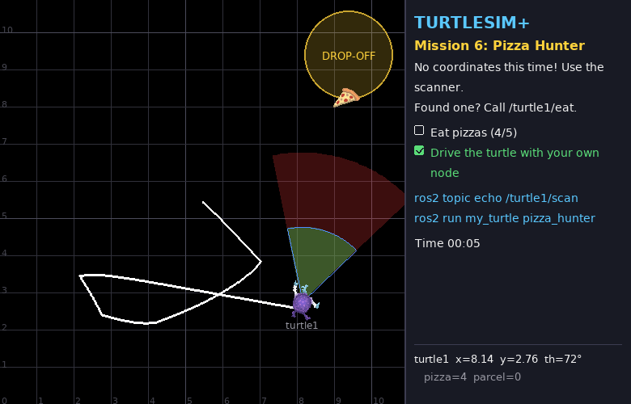
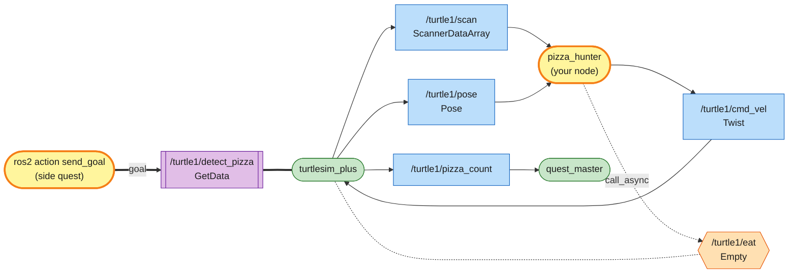
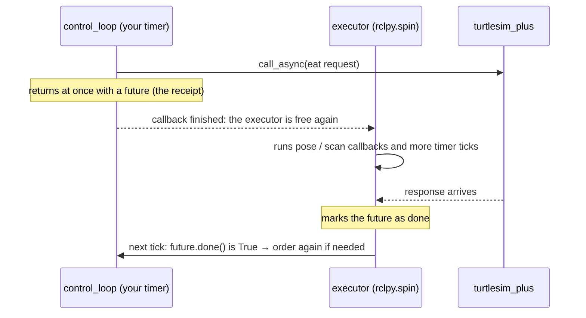
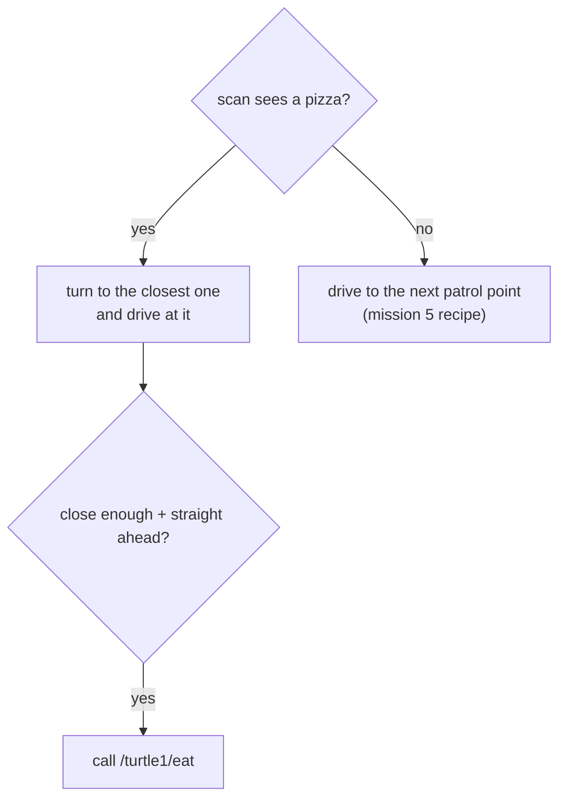

# Mission 6: Pizza Hunter 🍕

> **Briefing:** No more coordinates! Five pizzas are hidden at random spots on the map.
> The turtle has a **scanner** (the red cone) to look around — find a pizza, rush in, and **call the eat service** from your own code.



**🎯 Objectives**
- [ ] Eat 5 pizzas
- [ ] Drive the turtle with your own node (and no teleporting!)

**⭐ Stars:** ≤ 15 s = ⭐⭐⭐ · ≤ 40 s = ⭐⭐ — the clock starts when the turtle starts moving

```bash
# Terminal 1
ros2 launch turtle_quest mission.launch.py mission:=6
```

---

## 🧠 Concept card: the turtle's sensors

| Cone | Range | Used for |
|---|---|---|
| 🔴 red (big) | 4 m, 60° wide | the **scanner** — whatever is inside is reported on `/turtle1/scan` |
| 🟢 green (small) | 2 m, 60° wide | **eating range** — `/turtle1/eat` only works on a pizza inside this cone |

```bash
ros2 interface show turtlesim_plus_interfaces/msg/ScannerDataArray
```

```text
ScannerData[] data          ← list of things seen (empty = nothing in sight)
	string type             ← 'Pizza', 'Parcel', 'Crate' or 'Turtle'
	float64 angle           ← direction relative to where the turtle faces (radians: + left, − right)
	float64 distance        ← how many metres away
```

Notice the scanner **does not give x, y coordinates** — only "0.3 radians to the left, 2.5 m away",
just like real sensors (cameras, LiDAR) that report what they see **relative to the robot itself**.

> 🧪 **Want to see it first?** Start free-play mode `ros2 launch turtlesim_plus turtlesim_plus.launch.py`,
> click to drop pizzas in front of the turtle and run `ros2 topic echo /turtle1/scan` — drop them left/right and watch the angle change.
> (Experimenting inside mission 6 itself makes the cheat detector remember your `ros2 topic pub` — relaunch the mission before the real run.)

---

## 🕸️ System map: what you'll build



> 🟩 existing node · 🟨 you · 🟦 topic · 🟧 service · 🟪 action · ⬜ parameter — [how to read the maps](../ARCHITECTURE.md#how-to-read-the-maps)

- Two topics in, one topic out, and a **service**: your first node that uses both kinds of communication
- The scanner already did the hard part (perception); your node only decides. Topics bring the world in, your node thinks, topics and services act — this shape comes back in every mission from here on
- The purple box is an **action**; you'll only poke it from the terminal, in the side quest at the end

---

## Step 1: Look for pizza

Create `src/my_turtle/my_turtle/pizza_hunter.py`:

```python
# my_turtle/my_turtle/pizza_hunter.py  (first version: just look)
import rclpy
from rclpy.node import Node
from turtlesim_plus_interfaces.msg import ScannerDataArray


class PizzaHunter(Node):
    def __init__(self):
        super().__init__('pizza_hunter')
        self.create_subscription(ScannerDataArray, '/turtle1/scan', self.scan_callback, 10)

    def scan_callback(self, msg: ScannerDataArray):
        for thing in msg.data:
            if thing.type == 'Pizza':
                self.get_logger().info(f'pizza! angle {thing.angle:.2f} rad, {thing.distance:.2f} m away',
                                       throttle_duration_sec=0.5)


def main():
    rclpy.init()
    node = PizzaHunter()
    try:
        rclpy.spin(node)
    except KeyboardInterrupt:
        pass
    finally:
        node.destroy_node()
        rclpy.try_shutdown()


if __name__ == '__main__':
    main()
```

Add `'pizza_hunter = my_turtle.pizza_hunter:main',` to `setup.py`, then build + source + run as before.

If a pizza happens to be inside the red cone you'll see log lines; if not, silence — that's fine, next the turtle goes searching.

## Step 2: Rush in + eat 🍕

**Rushing in** is even easier than mission 5, because `angle` already *is* the heading error — no atan2 needed:

```python
cmd.angular.z = K_ANGULAR * target.angle
cmd.linear.x = min(K_LINEAR * target.distance, MAX_SPEED)
```

**Eating** = calling `/turtle1/eat`, but this time from **inside your code** — you need a **service client**:

```python
self.eat_client = self.create_client(Empty, '/turtle1/eat')     # when creating the node
...
self.eat_future = self.eat_client.call_async(Empty.Request())   # when you want to eat
```

### 🧠 Concept card: why `call_async`?

`call_async` = **place the order and hang up** — no waiting on the line. You get a "receipt" (a `future`) to check later (`future.done()`).



Why not wait on the line? Because your code is running **inside a callback** — if it waits, `spin()` is stuck with you,
nobody is left to receive the answer → both sides wait forever (**deadlock**) and the turtle freezes 🥶

To avoid spamming requests, only send a new one once the previous one has been answered.

## Step 3: Nothing in sight → patrol 🚶

If the scanner sees no pizza, the turtle has to go look. Simple and effective: **patrol around 4 waypoints**,
using exactly the "face the point and drive" recipe from mission 5 (so it also needs its own position → subscribe to `/turtle1/pose`).



## Put it all together

Change `pizza_hunter.py` to:

```python
# my_turtle/my_turtle/pizza_hunter.py
import math

import rclpy
from rclpy.node import Node
from geometry_msgs.msg import Twist
from std_srvs.srv import Empty
from turtlesim.msg import Pose
from turtlesim_plus_interfaces.msg import ScannerDataArray

MAX_SPEED = 1.5     # m/s
K_LINEAR = 1.0
K_ANGULAR = 4.0
EAT_DISTANCE = 1.5  # only order food when closer than this (and straight ahead); the real range is 2 m
# when no pizza is in sight, patrol around these points (a square around the map)
PATROL = [(2.5, 2.5), (8.4, 2.5), (8.4, 8.4), (2.5, 8.4)]


class PizzaHunter(Node):
    def __init__(self):
        super().__init__('pizza_hunter')
        self.scan = []      # what we saw last
        self.pose = None    # where we were last
        self.patrol_index = 0
        self.create_subscription(ScannerDataArray, '/turtle1/scan', self.scan_callback, 10)
        self.create_subscription(Pose, '/turtle1/pose', self.pose_callback, 10)
        self.publisher = self.create_publisher(Twist, '/turtle1/cmd_vel', 10)
        self.eat_client = self.create_client(Empty, '/turtle1/eat')
        self.eat_future = None
        self.create_timer(0.05, self.control_loop)

    def scan_callback(self, msg: ScannerDataArray):
        self.scan = msg.data

    def pose_callback(self, msg: Pose):
        self.pose = msg

    def steer_to(self, x: float, y: float) -> Twist:
        """Same recipe as mission 5: face the point (x, y) and drive to it"""
        cmd = Twist()
        error = math.atan2(y - self.pose.y, x - self.pose.x) - self.pose.theta
        error = math.atan2(math.sin(error), math.cos(error))
        cmd.angular.z = K_ANGULAR * error
        if abs(error) < 0.5:
            cmd.linear.x = MAX_SPEED
        return cmd

    def eat(self):
        # only send a new request once the previous one was answered, so we don't spam
        if self.eat_future is None or self.eat_future.done():
            self.eat_future = self.eat_client.call_async(Empty.Request())

    def control_loop(self):
        if self.pose is None:
            return
        pizzas = [thing for thing in self.scan if thing.type == 'Pizza']
        if pizzas:
            target = min(pizzas, key=lambda thing: thing.distance)  # the closest one
            cmd = Twist()
            cmd.angular.z = K_ANGULAR * target.angle   # angle: pizza is to the left (+) / right (-)
            cmd.linear.x = min(K_LINEAR * target.distance, MAX_SPEED)
            if target.distance < EAT_DISTANCE and abs(target.angle) < 0.4:
                self.eat()
        else:
            x, y = PATROL[self.patrol_index]
            if math.hypot(x - self.pose.x, y - self.pose.y) < 0.5:
                self.patrol_index = (self.patrol_index + 1) % len(PATROL)  # reached -> next point
            cmd = self.steer_to(x, y)
        self.publisher.publish(cmd)


def main():
    rclpy.init()
    node = PizzaHunter()
    try:
        rclpy.spin(node)
    except KeyboardInterrupt:
        pass
    finally:
        node.destroy_node()
        rclpy.try_shutdown()


if __name__ == '__main__':
    main()
```

```bash
ros2 run my_turtle pizza_hunter
```

🎉 Mission complete! Your turtle finds its own food — that's your first (small) autonomous robot

<details>
<summary>🏎️ Want 3 stars?</summary>

- Patrol speed and chase speed don't have to be the same
- Where should the patrol points be? The red cone sees 4 m...
- While chasing one pizza, what if a closer one shows up?

Your instructor has a 3-star reference version to demo — but try these ideas first!

</details>

---

## 🔍 Summary

- Most sensors report **relative to the robot** (angle + distance), not in world coordinates
- **service client**: `create_client(Type, 'name')` → `call_async(Request())` → keep the `future` and check `.done()`
- Never "wait on the line" inside a callback — deadlock
- Autonomous behaviour = **look at the situation → pick an action** (pizza in sight? → chase / none? → patrol)

## 🏆 Side quest: meet actions ⚡

Besides topics and services there's a third way to communicate: **actions** — like a service for long jobs (send a goal → get progress feedback → get a result, and you can cancel midway). The simulator has a tiny one to try:

```bash
ros2 action list
ros2 action info /turtle1/detect_pizza
ros2 interface show turtlesim_plus_interfaces/action/GetData
ros2 action send_goal /turtle1/detect_pizza turtlesim_plus_interfaces/action/GetData "{}"
```

With a pizza in the red cone you get `is_data: true` and the list of pizzas; otherwise the goal is aborted.
(Real robots use actions for long tasks such as "navigate to the kitchen" in Nav2)

---

**← Previous** [Mission 5](05-eyes.md) · **Next →** [Mission 7: Turtle Team](07-team.md)
