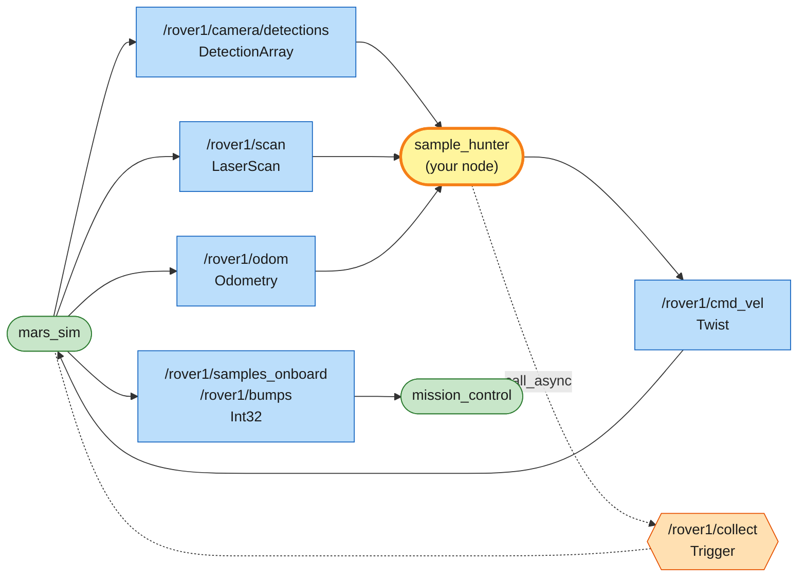
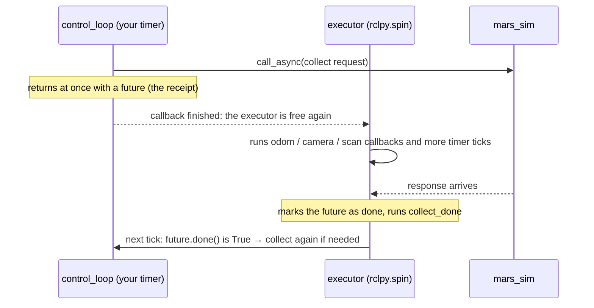
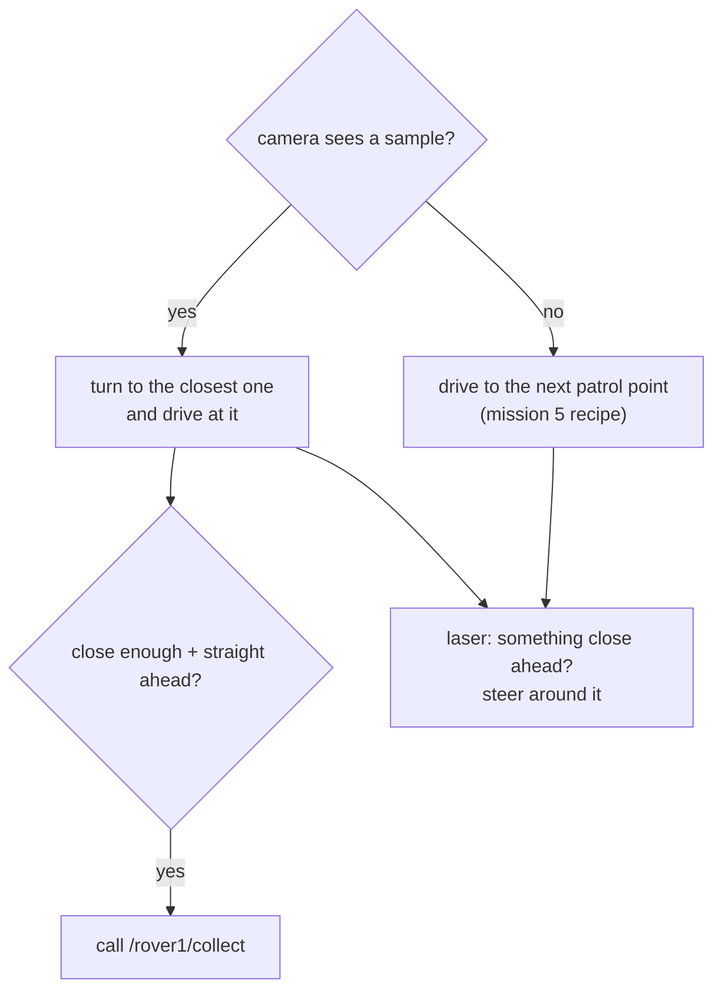

# Mission 6: Sample Hunter

No coordinates this time. Six blue crystal samples are scattered around the map, and rocks stand in between. The rover has a camera to spot samples and a laser scanner to see what's close. Find a sample, drive up to it, and call the collect service from your own code, without hitting anything.


**Objectives**
- [ ] Collect samples (0/5)
- [ ] Drive the rover with your own node (no teleop, `ros2 topic pub` or teleport)

**Stars:** ≤ 90 s = ⭐⭐⭐ · ≤ 180 s = ⭐⭐ · bumping into a rock = ⭐⭐ at most · the clock starts when the rover starts moving

```bash
# Terminal 1
ros2 launch mission_control mission.launch.py mission:=6
```

---

## The rover's sensors

| Sensor | Topic | Sees | Used for |
|---|---|---|---|
| camera (the light cone on the map) | `/rover1/camera/detections` | samples, rocks and other objects, 60° wide, up to 6 m | finding samples |
| laser scanner (red marks where it hits) | `/rover1/scan` | rocks, other rovers and the edge of the map, 180° in front, 0.15–8 m | not hitting things |

Both publish 10 times per second. The collect service, `/rover1/collect`, only works on a sample within 1.0 m and less than 30° to either side of straight ahead.

### The camera

The simulator does the image processing for you and reports what it recognised. Each message on `/rover1/camera/detections` is a `mars_interfaces/msg/DetectionArray`: a header plus `detections`, a list of everything in view (empty = nothing in sight). One entry of that list looks like this:

```bash
ros2 interface show mars_interfaces/msg/Detection
```

```text
# One object seen by the rover's camera.
string kind        # sample | rock | landmark | drill_site | core | meteorite
string id          # unique name of the object, e.g. "sample_3" or "Olympus Rock"
float32 range      # distance from the rover's centre to the object's centre, in metres
float32 bearing    # angle to the object in radians: 0 = straight ahead, + = to the left
```

The camera doesn't give you x and y. It says something like "a sample, 2.5 m away, 0.3 radians to the left". Real perception works the same way: cameras and LiDAR report what they see relative to the robot itself.

### The laser

`/rover1/scan` is a `sensor_msgs/msg/LaserScan`, the message every real 2D LiDAR uses:

```bash
ros2 topic echo --once /rover1/scan --no-arr
```

```text
header: ...
angle_min: -1.5707963705062866       ← the first ray points −90°, to the right
angle_max: 1.5707963705062866        ← the last ray points +90°, to the left
angle_increment: 0.01745329238474369 ← 1° between rays
range_min: 0.15000000596046448
range_max: 8.0
ranges: '<sequence type: float, length: 181>'
...
```

(`--no-arr` hides the long lists. Leave it out to see all 181 numbers.)

`ranges` is a list of 181 distances, one per ray. Ray `i` points at angle `angle_min + i * angle_increment`, measured like the bearing (0 = straight ahead, + = left):

```text
                   ranges[90]  (0°, straight ahead)
                        ↑
  ranges[180]  ←      rover      →  ranges[0]
  (+90°, left)                      (−90°, right)
```

A ray that hits nothing within 8 m reports `inf` (infinity). Python compares `inf` like any other number, so `min()` still works. The laser sits 0.3 m in front of the rover's centre, so its distances are measured from the nose.

Experiment as much as you like with `ros2 topic echo` and `ros2 service call`. Only driving by hand (teleop, or `ros2 topic pub` on `cmd_vel`) and teleporting cost you stars, and those are remembered until you relaunch.

---

## System map



> 🟩 existing node · 🟨 you · 🟦 topic · 🟧 service · 🟪 action · ⬜ parameter — [how to read the maps](../ARCHITECTURE.md#how-to-read-the-maps)

Three topics in, one topic out, plus a service call. This is your first node that uses both kinds of communication.

The camera has already done the hard part (perception), so your node only decides. Topics bring the world in, your node thinks, and topics and services act on the result. Every mission from here on has that shape.

---

## Step 1: Look around

Create `src/my_rover/my_rover/sample_hunter.py`:

```python
# my_rover/my_rover/sample_hunter.py  (first version: just look)
import math

import rclpy
from rclpy.executors import ExternalShutdownException
from rclpy.node import Node
from mars_interfaces.msg import DetectionArray
from sensor_msgs.msg import LaserScan


class SampleHunter(Node):
    def __init__(self):
        super().__init__('sample_hunter')
        self.create_subscription(DetectionArray, '/rover1/camera/detections', self.detections_callback, 10)
        self.create_subscription(LaserScan, '/rover1/scan', self.scan_callback, 10)

    def detections_callback(self, msg: DetectionArray):
        for d in msg.detections:
            self.get_logger().info(f'{d.kind} {d.id}: {d.range:.2f} m away, bearing {d.bearing:.2f} rad',
                                   throttle_duration_sec=0.5)

    def scan_callback(self, msg: LaserScan):
        # the ray whose angle is 0 points straight ahead
        middle = round((0.0 - msg.angle_min) / msg.angle_increment)
        ahead = msg.ranges[middle]
        if math.isinf(ahead):
            text = 'nothing within 8 m'
        else:
            text = f'{ahead:.2f} m'
        self.get_logger().info(f'{len(msg.ranges)} rays, straight ahead: {text}', throttle_duration_sec=1.0)


def main():
    rclpy.init()
    node = SampleHunter()
    try:
        rclpy.spin(node)
    except (KeyboardInterrupt, ExternalShutdownException):
        pass
    finally:
        node.destroy_node()
        rclpy.try_shutdown()


if __name__ == '__main__':
    main()
```

Add `'sample_hunter = my_rover.sample_hunter:main',` to `setup.py`, then build, source and run as before.

```text
[INFO] [sample_hunter]: rock rock_9: 3.61 m away, bearing -0.32 rad
[INFO] [sample_hunter]: 181 rays, straight ahead: nothing within 8 m
```

What you see depends on the world. If nothing is in the camera cone, there are no detection lines, which is fine. The next steps send the rover searching.

## Step 2: Drive in and collect

Driving in is easier than in mission 5, because `bearing` already is the heading error. You don't need atan2:

```python
cmd.angular.z = K_ANGULAR * target.bearing
if abs(target.bearing) < 0.5:
    cmd.linear.x = min(0.8 * target.range, MAX_SPEED)
```

Collecting means calling `/rover1/collect`. Try it once from the terminal first:

```bash
ros2 service call /rover1/collect std_srvs/srv/Trigger
```

```text
response:
std_srvs.srv.Trigger_Response(success=False, message='No sample within 1.0 m in front of the rover.')
```

`std_srvs/srv/Trigger` has an empty request, and the response says whether it worked (`success`) and what happened (`message`). When a sample is in view but out of reach, the message also says where the closest one is.

This time you call it from inside your code. For that you need a **service client**:

```python
self.collect_client = self.create_client(Trigger, '/rover1/collect')        # when creating the node
...
self.collect_future = self.collect_client.call_async(Trigger.Request())    # when you want to collect
```

### Why `call_async`?

`call_async` places the order and hangs up instead of waiting on the line. You get a receipt, a `future`, that you can check later with `future.done()`, or ask to call a function of yours when the answer arrives with `future.add_done_callback(...)`.



Your code runs inside a callback. If it waits for the answer there, `spin()` is stuck with it and nobody is left to receive the response. Both sides wait forever and the rover freezes. That's a **deadlock**.

So you don't flood the service with requests, only send a new one once the previous one has been answered.

## Step 3: Nothing in sight, so patrol

If the camera sees no sample, the rover has to go and look. A simple approach works: patrol along a fixed route with the same "face the point and drive" recipe from mission 5. That recipe needs the rover's own position, so you also subscribe to `/rover1/odom`.

The route is `PATROL = [(5, 5), (15, 5), (15, 10), (5, 10), (5, 15), (15, 15)]`. With a 6 m camera it sweeps the whole area where samples can be, and mission_control keeps the rocks clear of it.



## Step 4: Don't hit the rocks

The patrol route is clear, but a sample can sit behind a rock. Bumping into one caps you at 2 stars. The laser sees rocks, so before publishing, look at it:

1. Find the closest thing in a wedge straight ahead (−0.5 to +0.5 rad, about ±29°).
2. If it's closer than 1 m, compare the room on the left (0.5 to 1.6 rad) and on the right (−1.6 to −0.5 rad).
3. Turn towards the side with more room. Creep forward slowly, or stop and turn on the spot if it's very close.

This is the simplest kind of obstacle avoidance. It doesn't plan a path, it only reacts to what's in front right now. That's enough here, because the rocks are kept away from the patrol route.

## Put it all together

Change `sample_hunter.py` to:

```python
# my_rover/my_rover/sample_hunter.py
import math

import rclpy
from rclpy.executors import ExternalShutdownException
from rclpy.node import Node
from geometry_msgs.msg import Twist
from mars_interfaces.msg import DetectionArray
from nav_msgs.msg import Odometry
from sensor_msgs.msg import LaserScan
from std_srvs.srv import Trigger

MAX_SPEED = 0.6       # m/s
K_ANGULAR = 2.5
COLLECT_RANGE = 0.8   # the collect service reaches 1.0 m; aim a bit closer
SAFE_DISTANCE = 1.0   # something closer than this in front: steer around it
# when no sample is in sight, patrol through these points (rocks are kept clear of this route)
PATROL = [(5.0, 5.0), (15.0, 5.0), (15.0, 10.0), (5.0, 10.0), (5.0, 15.0), (15.0, 15.0)]


def yaw_from_quaternion(q) -> float:
    return math.atan2(2.0 * (q.w * q.z + q.x * q.y), 1.0 - 2.0 * (q.y * q.y + q.z * q.z))


class SampleHunter(Node):
    def __init__(self):
        super().__init__('sample_hunter')
        self.pose = None        # (x, y, yaw)
        self.detections = []    # what the camera saw last
        self.scan = None        # what the laser saw last
        self.patrol_index = 0
        self.create_subscription(Odometry, '/rover1/odom', self.odom_callback, 10)
        self.create_subscription(DetectionArray, '/rover1/camera/detections', self.detections_callback, 10)
        self.create_subscription(LaserScan, '/rover1/scan', self.scan_callback, 10)
        self.publisher = self.create_publisher(Twist, '/rover1/cmd_vel', 10)
        self.collect_client = self.create_client(Trigger, '/rover1/collect')
        self.collect_future = None
        self.create_timer(0.05, self.control_loop)

    # -- callbacks only remember the latest data
    def odom_callback(self, msg: Odometry):
        p = msg.pose.pose
        self.pose = (p.position.x, p.position.y, yaw_from_quaternion(p.orientation))

    def detections_callback(self, msg: DetectionArray):
        self.detections = msg.detections

    def scan_callback(self, msg: LaserScan):
        self.scan = msg

    # -- helpers
    def closest_in(self, low: float, high: float) -> float:
        """Shortest laser range between two angles (radians, 0 = straight ahead, + = left)."""
        if self.scan is None:
            return math.inf
        best = math.inf
        for i, r in enumerate(self.scan.ranges):
            angle = self.scan.angle_min + i * self.scan.angle_increment
            if low <= angle <= high:
                best = min(best, r)
        return best

    def steer_to(self, x: float, y: float) -> Twist:
        """Same recipe as mission 5: face the point (x, y) and drive to it."""
        cmd = Twist()
        px, py, yaw = self.pose
        error = math.atan2(y - py, x - px) - yaw
        error = math.atan2(math.sin(error), math.cos(error))
        cmd.angular.z = K_ANGULAR * error
        if abs(error) < 0.5:
            cmd.linear.x = min(math.hypot(x - px, y - py), MAX_SPEED)
        return cmd

    def collect(self):
        # only send a new request once the previous one was answered, so we don't spam
        if self.collect_future is None or self.collect_future.done():
            self.collect_future = self.collect_client.call_async(Trigger.Request())
            self.collect_future.add_done_callback(self.collect_done)

    def collect_done(self, future):
        self.get_logger().info(future.result().message)   # what the service said

    def avoid_obstacles(self, cmd: Twist):
        """Change cmd if the laser sees something close ahead."""
        if cmd.linear.x <= 0.0 or self.closest_in(-0.5, 0.5) >= SAFE_DISTANCE:
            return   # not driving forward, or the way is clear
        left = self.closest_in(0.5, 1.6)
        right = self.closest_in(-1.6, -0.5)
        cmd.angular.z = 1.5 if left > right else -1.5   # turn towards the side with more room
        cmd.linear.x = 0.15 if self.closest_in(-0.5, 0.5) > 0.6 else 0.0   # very close: turn on the spot

    # -- the decision, 20 times a second
    def control_loop(self):
        if self.pose is None:
            return
        samples = [d for d in self.detections if d.kind == 'sample']
        if samples:
            target = min(samples, key=lambda d: d.range)   # the closest one
            cmd = Twist()
            cmd.angular.z = K_ANGULAR * target.bearing      # bearing is already the heading error
            if abs(target.bearing) < 0.5:
                cmd.linear.x = min(0.8 * target.range, MAX_SPEED)
            if target.range < COLLECT_RANGE and abs(target.bearing) < 0.4:
                self.collect()
        else:
            x, y = PATROL[self.patrol_index]
            if math.hypot(x - self.pose[0], y - self.pose[1]) < 0.8:
                self.patrol_index = (self.patrol_index + 1) % len(PATROL)   # reached -> next point
            cmd = self.steer_to(x, y)
        self.avoid_obstacles(cmd)
        self.publisher.publish(cmd)


def main():
    rclpy.init()
    node = SampleHunter()
    try:
        rclpy.spin(node)
    except (KeyboardInterrupt, ExternalShutdownException):
        pass
    finally:
        node.destroy_node()
        rclpy.try_shutdown()


if __name__ == '__main__':
    main()
```

```bash
ros2 run my_rover sample_hunter
```

```text
[INFO] [sample_hunter]: Collected sample_17. Samples on board: 1
[INFO] [sample_hunter]: No sample within 1.0 m in front of the rover. The closest one in view is 3.5 m away, 2 deg to the right.
...
```

The rover finds its own samples now: a small autonomous robot. Count them with `ros2 topic echo /rover1/samples_onboard`. The panel shows *Mission complete* and your stars.

<details>
<summary>Want 3 stars?</summary>

- Patrol speed and chase speed don't have to be the same. The rover can do 1.0 m/s.
- Look at the timer in the panel when the mission ends. Over 90 s? Then speed is the problem. Under 90 s with ⭐⭐? Then you bumped into something: watch `ros2 topic echo /rover1/bumps` and find out where.
- While chasing one sample, a rock can end up between you and it. Is 1 m early enough to start steering away at your speed?

Your instructor has a 3-star reference version to demo, but try these ideas first.

</details>

---

## Summary

Most sensors report relative to the robot (distance and bearing), not in world coordinates. `sensor_msgs/LaserScan` is a list of distances, one per ray: ray `i` points at `angle_min + i * angle_increment`, and `inf` means nothing in range.

A service client is `create_client(Type, 'name')`, then `call_async(Request())`. Keep the `future` and check `.done()`, or add a done callback. Never wait on the line inside a callback, or you get a deadlock.

The autonomous behaviour here is just looking at the situation and picking an action: if a sample is in sight, chase it; if not, patrol; if something is close ahead, steer around it.

## Check yourself

<details>
<summary>1. Right after each <code>Collected ...</code> line there's a <code>No sample within 1.0 m ...</code> line. Why?</summary>

The camera publishes 10 times per second, and the control loop runs 20 times per second. Right after the collect succeeds, `self.detections` still holds the last camera frame, which still shows the sample you just picked up. The loop sees it "in reach" and calls collect once more, and the simulator answers that there's nothing there. A moment later the next camera frame arrives without it.
Sensor data is always a little old. Here it costs nothing, but it's worth remembering.

</details>

<details>
<summary>2. Why does <code>closest_in</code> start from <code>math.inf</code> and not from 0?</summary>

It looks for the smallest distance. Starting from 0 would always return 0, "something touching the nose", and the rover would never move. Starting from infinity means "nothing seen yet", and every real ray can only make it smaller. When `self.scan` hasn't arrived yet, `inf` also means "the way is clear", which is the right guess at start-up.

</details>

## Extras

- Hide the camera cone and laser marks on the map: `ros2 param set /mars_sim show_sensors false`. (That's the simulator's parameter, not yours, so it doesn't count for anything.)
- If you have RViz installed (`ros-<distro>-desktop`), run `rviz2`, set *Fixed Frame* to `map` and add the `/rover1/scan` and `/mars/markers` topics. You'll see the same scan in 3D, the way you'd look at a real robot's LiDAR. Mission 10 does more with RViz.

---

**Previous:** [Mission 5: Waypoints](05-waypoints.md) · **Next:** [Mission 7: Rover Fleet](07-rover-fleet.md)
