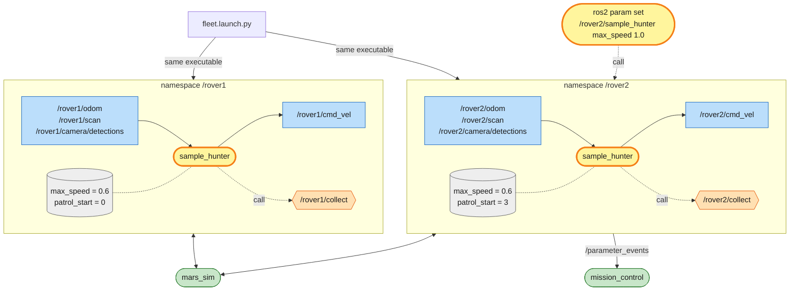

# Mission 7: Rover Fleet

A second rover, `rover2`, has landed next to the first one. Fourteen samples are out there and Earth wants ten of them. You don't want to write a second program for the new rover. ROS 2 lets you reuse the same node for as many robots as you like.


**Objectives**
- [ ] Run nodes in the `/rover1` and `/rover2` namespaces
- [ ] Change a parameter while the node is running
- [ ] Each rover collects at least 3 samples
- [ ] Samples collected in total (0/10)

**Stars:** ≤ 90 s = ⭐⭐⭐ · ≤ 180 s = ⭐⭐ · the clock starts when a rover starts moving

```bash
# Terminal 1
ros2 launch mission_control mission.launch.py mission:=7
```

`rover2` starts at (3, 4.2), just above the lander, facing right. It has the same topics and services as `rover1`, under its own name: `/rover2/odom`, `/rover2/cmd_vel`, `/rover2/collect` and so on. Check with `ros2 topic list`.

---

## Three tools for reusing a node

| Tool | Solves | Example |
|---|---|---|
| namespace | the same node talks to different robots | `/rover1/scan` vs `/rover2/scan` |
| parameter | values you want to tune without editing code | top speed, starting patrol point |
| launch file | start many nodes with one command | 2 hunters, two namespaces, different values |

---

## System map



> 🟩 existing node · 🟨 you · 🟦 topic · 🟧 service · 🟪 action · ⬜ parameter — [how to read the maps](../ARCHITECTURE.md#how-to-read-the-maps)

There is one executable, started twice. Each copy lives in its own namespace, so `'cmd_vel'` in the code becomes `/rover1/cmd_vel` in one copy and `/rover2/cmd_vel` in the other. Each copy also has its own parameters (grey): same code, different settings.

`ros2 param set` reaches into one running node through services that every node offers (the `.../set_parameters` family you skipped in mission 3). The node then announces the change on `/parameter_events`, and mission_control hears it.

The launch file starts everything with the right namespaces and parameters in one command.

---

## Step 1: Namespaces take the rover's name out of the code

Right now `sample_hunter.py` uses **absolute** names, which start with `/`. `'/rover1/scan'` is hard-wired to rover1.

With **relative** names (no leading `/`), such as `'scan'`, ROS prepends the node's namespace for you:

| Node namespace | `'scan'` becomes | `'camera/detections'` becomes |
|---|---|---|
| `/` (not set) | `/scan` | `/camera/detections` |
| `/rover1` | `/rover1/scan` | `/rover1/camera/detections` |
| `/rover2` | `/rover2/scan` | `/rover2/camera/detections` |

Change 5 lines in `__init__` of `sample_hunter.py`:

```python
        self.create_subscription(Odometry, 'odom', self.odom_callback, 10)
        self.create_subscription(DetectionArray, 'camera/detections', self.detections_callback, 10)
        self.create_subscription(LaserScan, 'scan', self.scan_callback, 10)
        self.publisher = self.create_publisher(Twist, 'cmd_vel', 10)
        self.collect_client = self.create_client(Trigger, 'collect')
```

Then run two copies in two terminals, setting the namespace with `--ros-args -r __ns:=...`:

```bash
ros2 run my_rover sample_hunter --ros-args -r __ns:=/rover1
```

```bash
ros2 run my_rover sample_hunter --ros-args -r __ns:=/rover2
```

```bash
ros2 node list
# /mars_sim
# /mission_control
# /rover1/sample_hunter
# /rover2/sample_hunter      ← same node, two bodies!
```

Both rovers hunt, but they patrol nose-to-tail like a parade, because both start at the same patrol point. The laser sees the other rover too, so they steer around each other rather than crash. Stop both with `Ctrl+C` before the next step.

> Note: after this change, replaying mission 6 needs `--ros-args -r __ns:=/rover1` too. Without it the node listens on `/odom` and `/scan`, which nobody publishes, and the rover never moves.

## Step 2: Parameters you can change from outside

Move the values worth tuning into **parameters**. Declare them in `__init__` with `declare_parameter(name, default)` and read them with `get_parameter(name).value`.

Replace `sample_hunter.py` with:

```python
# my_rover/my_rover/sample_hunter.py
import math

import rclpy
from rclpy.executors import ExternalShutdownException
from rclpy.node import Node
from geometry_msgs.msg import Twist
from mars_interfaces.msg import DetectionArray
from nav_msgs.msg import Odometry
from sensor_msgs.msg import LaserScan
from std_srvs.srv import Trigger

K_ANGULAR = 2.5
COLLECT_RANGE = 0.8   # the collect service reaches 1.0 m; aim a bit closer
SAFE_DISTANCE = 1.0   # something closer than this in front: steer around it
# when no sample is in sight, patrol through these points (rocks are kept clear of this route)
PATROL = [(5.0, 5.0), (15.0, 5.0), (15.0, 10.0), (5.0, 10.0), (5.0, 15.0), (15.0, 15.0)]


def yaw_from_quaternion(q) -> float:
    return math.atan2(2.0 * (q.w * q.z + q.x * q.y), 1.0 - 2.0 * (q.y * q.y + q.z * q.z))


class SampleHunter(Node):
    def __init__(self):
        super().__init__('sample_hunter')
        self.declare_parameter('max_speed', 0.6)
        self.declare_parameter('patrol_start', 0)   # which patrol point to start from
        self.pose = None        # (x, y, yaw)
        self.detections = []    # what the camera saw last
        self.scan = None        # what the laser saw last
        self.patrol_index = self.get_parameter('patrol_start').value % len(PATROL)
        # relative names (no leading /) -> they live under the node's namespace
        self.create_subscription(Odometry, 'odom', self.odom_callback, 10)
        self.create_subscription(DetectionArray, 'camera/detections', self.detections_callback, 10)
        self.create_subscription(LaserScan, 'scan', self.scan_callback, 10)
        self.publisher = self.create_publisher(Twist, 'cmd_vel', 10)
        self.collect_client = self.create_client(Trigger, 'collect')
        self.collect_future = None
        self.create_timer(0.05, self.control_loop)

    # -- callbacks only remember the latest data
    def odom_callback(self, msg: Odometry):
        p = msg.pose.pose
        self.pose = (p.position.x, p.position.y, yaw_from_quaternion(p.orientation))

    def detections_callback(self, msg: DetectionArray):
        self.detections = msg.detections

    def scan_callback(self, msg: LaserScan):
        self.scan = msg

    # -- helpers
    def max_speed(self) -> float:
        # read every time -> `ros2 param set` takes effect immediately
        return self.get_parameter('max_speed').value

    def closest_in(self, low: float, high: float) -> float:
        """Shortest laser range between two angles (radians, 0 = straight ahead, + = left)."""
        if self.scan is None:
            return math.inf
        best = math.inf
        for i, r in enumerate(self.scan.ranges):
            angle = self.scan.angle_min + i * self.scan.angle_increment
            if low <= angle <= high:
                best = min(best, r)
        return best

    def steer_to(self, x: float, y: float) -> Twist:
        """Same recipe as mission 5: face the point (x, y) and drive to it."""
        cmd = Twist()
        px, py, yaw = self.pose
        error = math.atan2(y - py, x - px) - yaw
        error = math.atan2(math.sin(error), math.cos(error))
        cmd.angular.z = K_ANGULAR * error
        if abs(error) < 0.5:
            cmd.linear.x = min(math.hypot(x - px, y - py), self.max_speed())
        return cmd

    def collect(self):
        # only send a new request once the previous one was answered, so we don't spam
        if self.collect_future is None or self.collect_future.done():
            self.collect_future = self.collect_client.call_async(Trigger.Request())
            self.collect_future.add_done_callback(self.collect_done)

    def collect_done(self, future):
        self.get_logger().info(future.result().message)   # what the service said

    def avoid_obstacles(self, cmd: Twist):
        """Change cmd if the laser sees something close ahead."""
        if cmd.linear.x <= 0.0 or self.closest_in(-0.5, 0.5) >= SAFE_DISTANCE:
            return   # not driving forward, or the way is clear
        left = self.closest_in(0.5, 1.6)
        right = self.closest_in(-1.6, -0.5)
        cmd.angular.z = 1.5 if left > right else -1.5   # turn towards the side with more room
        cmd.linear.x = 0.15 if self.closest_in(-0.5, 0.5) > 0.6 else 0.0   # very close: turn on the spot

    # -- the decision, 20 times a second
    def control_loop(self):
        if self.pose is None:
            return
        samples = [d for d in self.detections if d.kind == 'sample']
        if samples:
            target = min(samples, key=lambda d: d.range)   # the closest one
            cmd = Twist()
            cmd.angular.z = K_ANGULAR * target.bearing      # bearing is already the heading error
            if abs(target.bearing) < 0.5:
                cmd.linear.x = min(0.8 * target.range, self.max_speed())
            if target.range < COLLECT_RANGE and abs(target.bearing) < 0.4:
                self.collect()
        else:
            x, y = PATROL[self.patrol_index]
            if math.hypot(x - self.pose[0], y - self.pose[1]) < 0.8:
                self.patrol_index = (self.patrol_index + 1) % len(PATROL)   # reached -> next point
            cmd = self.steer_to(x, y)
        self.avoid_obstacles(cmd)
        self.publisher.publish(cmd)


def main():
    rclpy.init()
    node = SampleHunter()
    try:
        rclpy.spin(node)
    except (KeyboardInterrupt, ExternalShutdownException):
        pass
    finally:
        node.destroy_node()
        rclpy.try_shutdown()


if __name__ == '__main__':
    main()
```

Compared with mission 6: the names are relative, the constant `MAX_SPEED` became the parameter `max_speed` (read through `self.max_speed()`), and the patrol starts at `patrol_start`.

Set a parameter at start-up with `-p name:=value`. Patrol point 3 is (5, 10), on the other side of the route from rover1's start:

```bash
ros2 run my_rover sample_hunter --ros-args -r __ns:=/rover2 -p patrol_start:=3
```

and change one while the node runs, from another terminal:

```bash
ros2 param list /rover2/sample_hunter               # which parameters exist
ros2 param get /rover2/sample_hunter max_speed      # current value
ros2 param set /rover2/sample_hunter max_speed 1.0  # change it! rover2 speeds up immediately
```

```text
  max_speed
  patrol_start
  use_sim_time
Double value is: 0.6
Set parameter successful
```

Write `1.0`, not `1`. The parameter was declared with a decimal default, so it's a double, and `ros2 param set ... 1` would try to set an integer and be refused.

## Step 3: A launch file for the whole fleet

Opening terminals one by one gets old fast. Write a **launch file** instead (it's plain Python). Create the folder `src/my_rover/launch/` and in it `fleet.launch.py`:

```python
# my_rover/launch/fleet.launch.py
from launch import LaunchDescription
from launch_ros.actions import Node


def generate_launch_description():
    return LaunchDescription([
        Node(
            package='my_rover',
            executable='sample_hunter',
            namespace='rover1',                  # = -r __ns:=/rover1
            parameters=[{'patrol_start': 0}],    # = -p patrol_start:=0
        ),
        Node(
            package='my_rover',
            executable='sample_hunter',
            namespace='rover2',
            parameters=[{'patrol_start': 3}],
        ),
    ])
```

`setup.py` must also install the `launch/` folder. Add the imports at the top and one line in `data_files`:

```python
import os
from glob import glob

from setuptools import find_packages, setup
```

```python
    data_files=[
        ('share/ament_index/resource_index/packages',
            ['resource/' + package_name]),
        ('share/' + package_name, ['package.xml']),
        (os.path.join('share', package_name, 'launch'), glob('launch/*.launch.py')),
    ],
```

Your `from setuptools import ...` line may look slightly different. Leave it alone and just add `import os` and `from glob import glob` above it.

Since `setup.py` changed, rebuild, then start the fleet:

```bash
cd ~/mars_rover
colcon build --symlink-install --packages-select my_rover
source install/setup.bash
ros2 launch my_rover fleet.launch.py
```

While the fleet is hunting, take care of objective 2 from another terminal:

```bash
ros2 param set /rover2/sample_hunter max_speed 1.0
```

The panel shows *Mission complete* and your stars.

---

## Summary

| | in code | with `ros2 run` | in a launch file |
|---|---|---|---|
| namespace | use relative names (`'scan'`) | `--ros-args -r __ns:=/rover1` | `namespace='rover1'` |
| parameter | `declare_parameter` + `get_parameter` | `--ros-args -p max_speed:=1.0` | `parameters=[{'max_speed': 1.0}]` |

Tune parameters live with `ros2 param list`, `get` and `set`. Launch files live in `<pkg>/launch/` and must be added to `data_files` in `setup.py`.

Real robot fleets use this same pattern: one codebase, a namespace per robot and parameters per robot. The simulator does it too: every rover's topics come from the same code, under `/rover1`, `/rover2` and so on.

## Troubleshooting

| Symptom | Fix |
|---|---|
| `file 'fleet.launch.py' was not found` | the `data_files` line is missing in `setup.py`, or you didn't rebuild and source after adding it |
| one rover doesn't move | a name in `sample_hunter.py` still starts with `/`; check with `ros2 node info /rover2/sample_hunter` |
| `Node not found` from `ros2 param` | the node name includes the namespace: `/rover2/sample_hunter`. Right after starting, wait a second and try again |
| `Setting parameter failed` | `max_speed` is a double: write `1.0`, not `1` |

## Check yourself

<details>
<summary>1. You forget to change <code>'/rover1/collect'</code> to <code>'collect'</code> but fix every other line. What happens?</summary>

rover2 chases samples just fine, but when it tries to collect it calls `/rover1/collect`. So rover1 picks up a sample (if one happens to be right in front of rover1) and rover2 never collects a thing: it hovers around its sample, calling the wrong service over and over. `ros2 node info /rover2/sample_hunter` shows which names a node is connected to.

</details>

<details>
<summary>2. Why is <code>max_speed</code> read every loop but <code>patrol_start</code> only once?</summary>

`patrol_start` only matters at start-up, and changing it later means nothing. `max_speed` should be tunable live. If you read it once in `__init__` and kept it, `ros2 param set` would change the value inside the node but your code would never read the new one.

</details>

## Extras

- Add a `safe_distance` parameter and tune it live. Does the rover get round rocks more smoothly, or does it start avoiding things that aren't in the way?
- Put the mission in your launch file too, so one command starts everything:

```python
import os

from ament_index_python.packages import get_package_share_directory
from launch.actions import IncludeLaunchDescription
from launch.launch_description_sources import PythonLaunchDescriptionSource

mission = IncludeLaunchDescription(
    PythonLaunchDescriptionSource(os.path.join(
        get_package_share_directory('mission_control'), 'launch', 'mission.launch.py')),
    launch_arguments={'mission': '7'}.items(),
)
# then add `mission` to the LaunchDescription([...]) list
```

---

**Previous:** [Mission 6: Sample Hunter](06-sample-hunter.md) · **Next:** [Mission 8 (boss): Power Crisis](08-boss-power-crisis.md)
