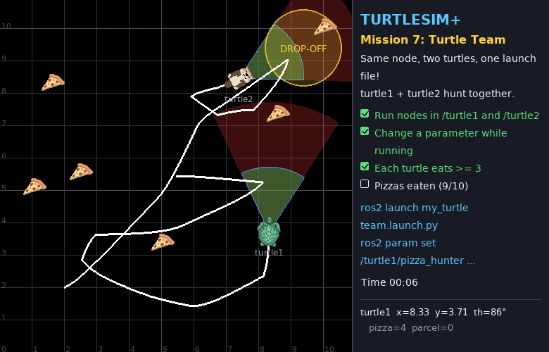
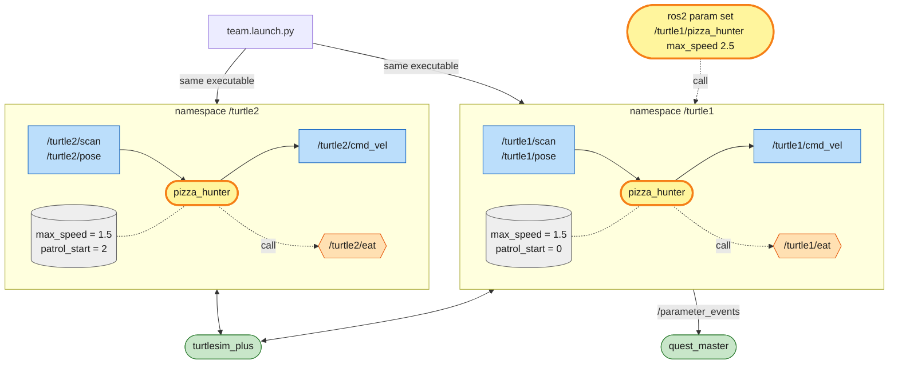

# Mission 7: Turtle Team

Business is good and one turtle can't keep up, so `turtle2` has joined the team. You don't want to write a second program for it. ROS 2 lets you reuse the same node for as many robots as you like.



**Objectives**
- [ ] Run nodes in the `/turtle1` and `/turtle2` namespaces
- [ ] Change a parameter while the node is running
- [ ] Each turtle eats at least 3 pizzas
- [ ] 10 pizzas eaten in total (the map keeps getting restocked)

**Stars:** ≤ 40 s = ⭐⭐⭐ · ≤ 90 s = ⭐⭐ · the clock starts when the turtles start moving

```bash
# Terminal 1
ros2 launch turtle_quest mission.launch.py mission:=7
```

---

## Three tools for reusing a node

| Tool | Solves | Example |
|---|---|---|
| namespace | the same node talks to different robots | `/turtle1/scan` vs `/turtle2/scan` |
| parameter | values you want to tune without editing code | top speed, starting patrol point |
| launch file | start many nodes with one command | 2 hunters, two namespaces, different values |

---

## System map



> 🟩 existing node · 🟨 you · 🟦 topic · 🟧 service · 🟪 action · ⬜ parameter — [how to read the maps](../ARCHITECTURE.md#how-to-read-the-maps)

There is one executable, started twice. Each copy lives in its own namespace, so `'cmd_vel'` in the code becomes `/turtle1/cmd_vel` in one copy and `/turtle2/cmd_vel` in the other. Each copy also has its own parameters (grey): same code, different settings.

`ros2 param set` reaches into one running node through services that every node offers (the `.../set_parameters` family you skipped in mission 3). The node then announces the change on `/parameter_events`, and quest_master hears it.

The launch file starts everything with the right namespaces and parameters in one command.

---

## Step 1: Namespaces take the turtle's name out of the code

Right now `pizza_hunter.py` uses **absolute** names, which start with `/`. `'/turtle1/scan'` is hard-wired to turtle1.

With **relative** names (no leading `/`), such as `'scan'`, ROS prepends the node's namespace for you:

| Node namespace | `'scan'` becomes |
|---|---|
| `/` (not set) | `/scan` |
| `/turtle1` | `/turtle1/scan` |
| `/turtle2` | `/turtle2/scan` |

Change 4 lines in `__init__` of `pizza_hunter.py`:

```python
        self.create_subscription(ScannerDataArray, 'scan', self.scan_callback, 10)
        self.create_subscription(Pose, 'pose', self.pose_callback, 10)
        self.publisher = self.create_publisher(Twist, 'cmd_vel', 10)
        self.eat_client = self.create_client(Empty, 'eat')
```

Then run two copies in two terminals, setting the namespace with `--ros-args -r __ns:=...`:

```bash
ros2 run my_turtle pizza_hunter --ros-args -r __ns:=/turtle1
```

```bash
ros2 run my_turtle pizza_hunter --ros-args -r __ns:=/turtle2
```

```bash
ros2 node list
# /turtle1/pizza_hunter
# /turtle2/pizza_hunter      ← same node, two bodies!
```

Both turtles hunt, but they patrol nose-to-tail like a parade, because both start at the same patrol point. Stop both with `Ctrl+C` before the next step.

> Note: after this change, replaying mission 6 needs `--ros-args -r __ns:=/turtle1` too.

## Step 2: Parameters you can change from outside

Move the values worth tuning into **parameters**. Declare them in `__init__` with `declare_parameter(name, default)` and read them with `get_parameter(name).value`.

Replace `pizza_hunter.py` with:

```python
# my_turtle/my_turtle/pizza_hunter.py
import math

import rclpy
from rclpy.node import Node
from geometry_msgs.msg import Twist
from std_srvs.srv import Empty
from turtlesim.msg import Pose
from turtlesim_plus_interfaces.msg import ScannerDataArray

K_LINEAR = 1.0
K_ANGULAR = 4.0
EAT_DISTANCE = 1.5
PATROL = [(2.5, 2.5), (8.4, 2.5), (8.4, 8.4), (2.5, 8.4)]


class PizzaHunter(Node):
    def __init__(self):
        super().__init__('pizza_hunter')
        self.declare_parameter('max_speed', 1.5)
        self.declare_parameter('patrol_start', 0)   # which patrol point to start from
        self.scan = []
        self.pose = None
        self.patrol_index = self.get_parameter('patrol_start').value % len(PATROL)
        # relative names (no leading /) -> they live under the node's namespace
        self.create_subscription(ScannerDataArray, 'scan', self.scan_callback, 10)
        self.create_subscription(Pose, 'pose', self.pose_callback, 10)
        self.publisher = self.create_publisher(Twist, 'cmd_vel', 10)
        self.eat_client = self.create_client(Empty, 'eat')
        self.eat_future = None
        self.create_timer(0.05, self.control_loop)

    def max_speed(self) -> float:
        # read every time -> `ros2 param set` takes effect immediately
        return self.get_parameter('max_speed').value

    def scan_callback(self, msg: ScannerDataArray):
        self.scan = msg.data

    def pose_callback(self, msg: Pose):
        self.pose = msg

    def steer_to(self, x: float, y: float) -> Twist:
        cmd = Twist()
        error = math.atan2(y - self.pose.y, x - self.pose.x) - self.pose.theta
        error = math.atan2(math.sin(error), math.cos(error))
        cmd.angular.z = K_ANGULAR * error
        if abs(error) < 0.5:
            cmd.linear.x = self.max_speed()
        return cmd

    def eat(self):
        if self.eat_future is None or self.eat_future.done():
            self.eat_future = self.eat_client.call_async(Empty.Request())

    def control_loop(self):
        if self.pose is None:
            return
        pizzas = [thing for thing in self.scan if thing.type == 'Pizza']
        if pizzas:
            target = min(pizzas, key=lambda thing: thing.distance)
            cmd = Twist()
            cmd.angular.z = K_ANGULAR * target.angle
            cmd.linear.x = min(K_LINEAR * target.distance, self.max_speed())
            if target.distance < EAT_DISTANCE and abs(target.angle) < 0.4:
                self.eat()
        else:
            x, y = PATROL[self.patrol_index]
            if math.hypot(x - self.pose.x, y - self.pose.y) < 0.5:
                self.patrol_index = (self.patrol_index + 1) % len(PATROL)
            cmd = self.steer_to(x, y)
        self.publisher.publish(cmd)


def main():
    rclpy.init()
    node = PizzaHunter()
    try:
        rclpy.spin(node)
    except KeyboardInterrupt:
        pass
    finally:
        node.destroy_node()
        rclpy.try_shutdown()


if __name__ == '__main__':
    main()
```

Set a parameter at start-up with `-p name:=value`:

```bash
ros2 run my_turtle pizza_hunter --ros-args -r __ns:=/turtle2 -p patrol_start:=2
```

and change it while the node runs, from another terminal:

```bash
ros2 param list /turtle2/pizza_hunter               # which parameters exist
ros2 param get /turtle2/pizza_hunter max_speed      # current value
ros2 param set /turtle2/pizza_hunter max_speed 2.5  # change it! turtle2 speeds up immediately
```

## Step 3: A launch file for the whole team

Opening terminals one by one gets old fast. Write a **launch file** instead (it's plain Python). Create the folder `src/my_turtle/launch/` and in it `team.launch.py`:

```python
# my_turtle/launch/team.launch.py
from launch import LaunchDescription
from launch_ros.actions import Node


def generate_launch_description():
    return LaunchDescription([
        Node(
            package='my_turtle',
            executable='pizza_hunter',
            namespace='turtle1',                 # = -r __ns:=/turtle1
            parameters=[{'patrol_start': 0}],    # = -p patrol_start:=0
        ),
        Node(
            package='my_turtle',
            executable='pizza_hunter',
            namespace='turtle2',
            parameters=[{'patrol_start': 2}],
        ),
    ])
```

`setup.py` must also install the `launch/` folder. Add the imports at the top and one line in `data_files`:

```python
import os
from glob import glob

from setuptools import find_packages, setup
```

```python
    data_files=[
        ('share/ament_index/resource_index/packages', ['resource/' + package_name]),
        ('share/' + package_name, ['package.xml']),
        (os.path.join('share', package_name, 'launch'), glob('launch/*.launch.py')),
    ],
```

Your `from setuptools import ...` line may look slightly different. Leave it alone and just add `import os` and `from glob import glob` above it.

Since `setup.py` changed, rebuild, then start the team:

```bash
cd ~/turtle_quest
colcon build --symlink-install --packages-select my_turtle
source install/setup.bash
ros2 launch my_turtle team.launch.py
```

While the team is hunting, take care of objective 2:

```bash
ros2 param set /turtle1/pizza_hunter max_speed 2.5
```

The panel shows *Mission complete* and your stars.

---

## Summary

| | in code | with `ros2 run` | in a launch file |
|---|---|---|---|
| namespace | use relative names (`'scan'`) | `--ros-args -r __ns:=/turtle1` | `namespace='turtle1'` |
| parameter | `declare_parameter` + `get_parameter` | `--ros-args -p max_speed:=2.0` | `parameters=[{'max_speed': 2.0}]` |

Tune parameters live with `ros2 param list`, `get` and `set`. Launch files live in `<pkg>/launch/` and must be added to `data_files` in `setup.py`.

Real robot fleets use this same pattern: one codebase, a namespace per robot and parameters per robot.

## Check yourself

<details>
<summary>1. You forget to change <code>'/turtle1/eat'</code> to <code>'eat'</code> but fix every other line. What happens?</summary>

turtle2 chases pizzas just fine, but when it orders food it calls `/turtle1/eat`. So turtle1 eats (if a pizza happens to be in turtle1's green cone) and turtle2 never eats a thing. `ros2 node info /turtle2/pizza_hunter` shows which names a node is connected to.

</details>

<details>
<summary>2. Why is <code>max_speed</code> read every loop but <code>patrol_start</code> only once?</summary>

`patrol_start` only matters at start-up, and changing it later means nothing. `max_speed` should be tunable live. If you read it once in `__init__` and kept it, `ros2 param set` would change the value inside the node but your code would never read the new one.

</details>

## Extras

- Add an `eat_distance` parameter and tune it live. Does the turtle eat more reliably, or miss more?
- Put the mission in your launch file too, so one command starts everything:

```python
from ament_index_python.packages import get_package_share_directory
from launch.actions import IncludeLaunchDescription
from launch.launch_description_sources import PythonLaunchDescriptionSource
import os

mission = IncludeLaunchDescription(
    PythonLaunchDescriptionSource(os.path.join(
        get_package_share_directory('turtle_quest'), 'launch', 'mission.launch.py')),
    launch_arguments={'mission': '7'}.items(),
)
# then add `mission` to the LaunchDescription([...]) list
```

---

**Previous:** [Mission 6](06-pizza-hunter.md) · **Next:** [Mission 8: Boss!](08-boss-delivery.md)
