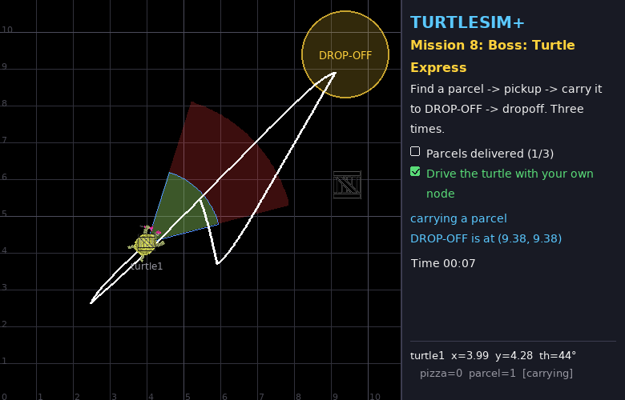
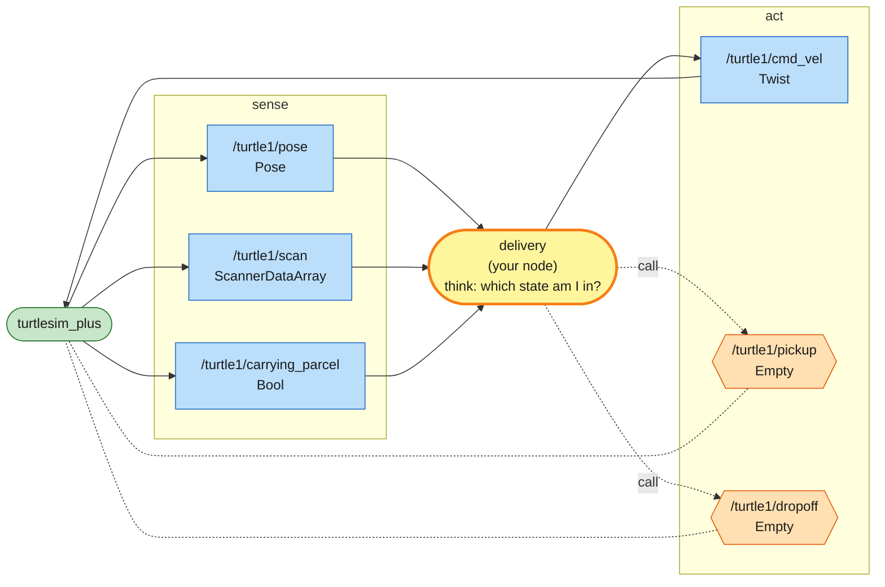
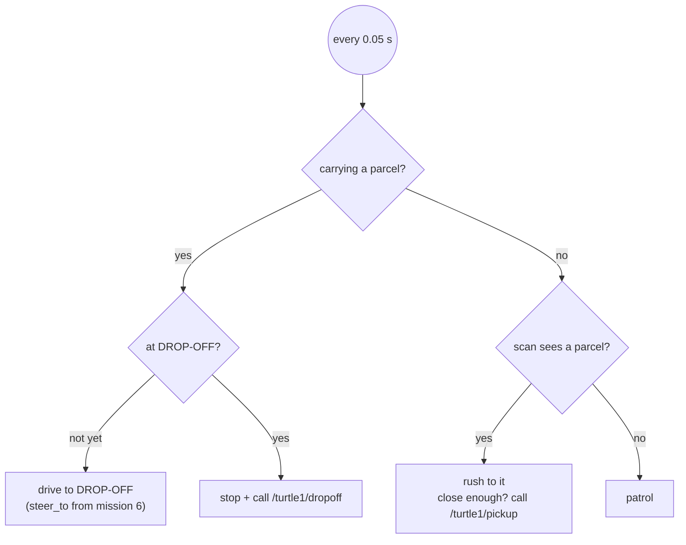

# Mission 8 (Boss): Turtle Express 📦

> **Briefing:** The company launches a new business — **Turtle Express**! Three parcels are scattered across the map.
> The turtle must find → pick up → carry to **DROP-OFF** (top-right) → drop off all 3, with nobody steering it.
>
> This mission has **no full program to copy** — but you already have everything you need from missions 4–7 💪



**🎯 Objectives**
- [ ] Deliver 3 parcels
- [ ] Drive the turtle with your own node (no teleporting!)

**⭐ Stars:** ≤ 24 s = ⭐⭐⭐ · ≤ 60 s = ⭐⭐ — the clock starts when the turtle starts moving

```bash
# Terminal 1
ros2 launch turtle_quest mission.launch.py mission:=8
```

---

## 🗺️ What you have to work with

| Name | Kind | Type | Used for |
|---|---|---|---|
| `/turtle1/pose` | topic (in) | `turtlesim/msg/Pose` | the turtle's position |
| `/turtle1/scan` | topic (in) | `turtlesim_plus_interfaces/msg/ScannerDataArray` | look for parcels (`type == 'Parcel'`) |
| `/turtle1/carrying_parcel` | topic (in) | `std_msgs/msg/Bool` | **am I carrying a parcel right now?** (`msg.data`) |
| `/turtle1/cmd_vel` | topic (out) | `geometry_msgs/msg/Twist` | drive |
| `/turtle1/pickup` | service | `std_srvs/srv/Empty` | pick up the parcel inside the cone (blue outline: 2 m, 60°) |
| `/turtle1/dropoff` | service | `std_srvs/srv/Empty` | deliver — only works inside the DROP-OFF circle |

- DROP-OFF is at **(9.38, 9.38)**, radius 1.2 m
- One parcel at a time (you'll see it on the turtle's back, and `[carrying]` in the panel)

### 🕸️ System map



> 🟩 existing node · 🟨 you · 🟦 topic · 🟧 service · 🟪 action · ⬜ parameter — [how to read the maps](../ARCHITECTURE.md#how-to-read-the-maps)

This is the classic robot shape, **sense → think → act**: topics bring the world in, your node decides, topics and services carry the decision out.
[ARCHITECTURE.md](../ARCHITECTURE.md#putting-them-together-design-patterns) shows this and other patterns for combining nodes.

## 🧠 Think in states

A robot that does multi-step jobs is easiest to reason about as a set of **states**: every loop, ask "which state am I in, what should I do?"

Good news: you don't even have to remember the state — `/turtle1/carrying_parcel` tells you every loop!



## Step 1: The skeleton

Create `src/my_turtle/my_turtle/delivery.py` from this skeleton and fill in the TODOs:

```python
# my_turtle/my_turtle/delivery.py  (skeleton: fill in the TODOs)
import math

import rclpy
from rclpy.node import Node
from geometry_msgs.msg import Twist
from std_msgs.msg import Bool
from std_srvs.srv import Empty
from turtlesim.msg import Pose
from turtlesim_plus_interfaces.msg import ScannerDataArray

DROPOFF = (9.38, 9.38)
PATROL = [(2.5, 2.5), (8.4, 2.5), (8.4, 8.4), (2.5, 8.4)]


class Delivery(Node):
    def __init__(self):
        super().__init__('delivery')
        self.pose = None
        self.scan = []
        self.carrying = False
        self.patrol_index = 0
        # TODO 1: subscribe to /turtle1/pose, /turtle1/scan and /turtle1/carrying_parcel
        # TODO 2: a publisher on /turtle1/cmd_vel  (call it self.publisher)
        # TODO 3: service clients for /turtle1/pickup and /turtle1/dropoff
        self.pending = None  # the service request still waiting for an answer
        self.create_timer(0.05, self.control_loop)

    def call(self, client):
        """Call a service without spamming it (like eat() in mission 6)"""
        if self.pending is None or self.pending.done():
            self.pending = client.call_async(Empty.Request())

    def distance_to(self, x: float, y: float) -> float:
        return math.hypot(x - self.pose.x, y - self.pose.y)

    def steer_to(self, x: float, y: float) -> Twist:
        # TODO 4: face the point (x, y) and drive to it
        return Twist()

    def control_loop(self):
        if self.pose is None:
            return
        cmd = Twist()
        if self.carrying:
            pass  # TODO 5: drive to DROP-OFF / once there, stop and call dropoff
        else:
            parcels = [thing for thing in self.scan if thing.type == 'Parcel']
            if parcels:
                pass  # TODO 6: rush to the closest parcel / close enough? call pickup
            else:
                pass  # TODO 7: patrol through PATROL
        self.publisher.publish(cmd)


def main():
    rclpy.init()
    node = Delivery()
    try:
        rclpy.spin(node)
    except KeyboardInterrupt:
        pass
    finally:
        node.destroy_node()
        rclpy.try_shutdown()


if __name__ == '__main__':
    main()
```

Don't forget `'delivery = my_turtle.delivery:main',` in `setup.py` → build → source → `ros2 run my_turtle delivery`

> 💡 **Tip:** don't write it all in one go. Do one TODO, run, look.
> E.g. TODOs 1-4 + 7 first → the turtle should patrol → then 6 → it picks up → then 5

## 💡 Hints, one TODO at a time (open only when really stuck)

<details>
<summary>TODOs 1-3: subscribers / publisher / clients</summary>

Exactly like mission 6, plus a subscriber for `carrying_parcel`:

```python
self.create_subscription(Bool, '/turtle1/carrying_parcel', self.carrying_callback, 10)
...
def carrying_callback(self, msg: Bool):
    self.carrying = msg.data
```

and two clients: `self.pickup_client = self.create_client(Empty, '/turtle1/pickup')` (dropoff likewise)

</details>

<details>
<summary>TODO 4: steer_to</summary>

Copy it from mission 6, or use the mission 5 style that slows down near the target (`min(K × distance, MAX)`) — that helps not to overshoot the DROP-OFF circle

</details>

<details>
<summary>TODO 5: delivering</summary>

```python
if self.distance_to(*DROPOFF) < 0.6:
    self.call(self.dropoff_client)   # cmd is still an empty Twist() = stop
else:
    cmd = self.steer_to(*DROPOFF)
```

</details>

<details>
<summary>TODOs 6-7: pick up / patrol</summary>

Same as mission 6's `control_loop`, just replace `self.eat()` with `self.call(self.pickup_client)`

</details>

> 🧩 There's no full file to unlock here, on purpose: the hints above cover every TODO.
> Still stuck? Ask your instructor to demo the reference solution, then write your own version.

🏆 **Boss defeated!** That's the end of Part 1.

```bash
ros2 run turtle_quest progress   # how many of the stars did you collect?
```

---

## 🎓 What you can do now

| ROS 2 skill | Missions |
|---|---|
| workspace, package, `colcon build`, `source` | 0, 4 |
| nodes, topics, messages, `ros2 topic/node/interface` | 1 |
| publishing `Twist` to drive a robot | 2, 4 |
| services from the CLI and from code (`call_async`) | 3, 6 |
| publishers, subscribers and timers in Python | 4, 5 |
| closed-loop control (P controller) | 5 |
| reading relative sensor data (angle + distance) | 6 |
| namespaces, parameters, launch files | 7 |
| designing robot behaviour as a state machine | 8 |

## 🦾 Part 2: the turtle grows arms

Driving is only half of robotics — the other half is **manipulating** things.
In Part 2 every turtle gets two arms with grippers, and you'll learn joint control, kinematics and pick-and-place.

**Next →** [Mission 9: Arm Day](09-arm-day.md)

---

**← Previous** [Mission 7](07-team.md) · **Home** [README](../README.md)
