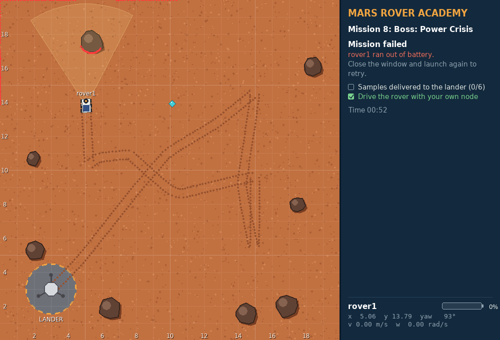
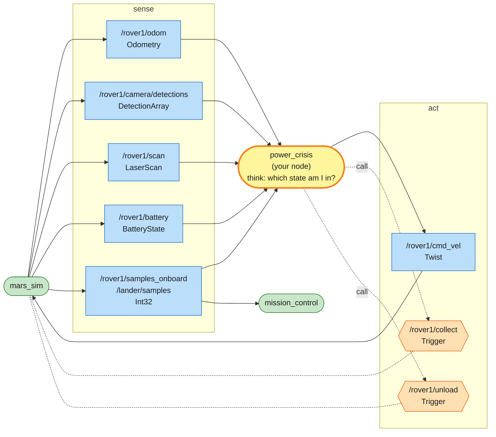
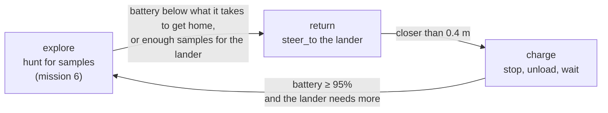

# Mission 8 (boss): Power Crisis

A dust storm has covered the solar panels. The battery starts at 35% and drains four times faster than usual, and the lander needs six samples. There are nine out there, all more than 6 m from the lander. One trip won't do it: the rover has to collect, come home before the battery runs out, unload, recharge and go out again, with nobody steering. There's no complete program to copy this time, but missions 4 to 7 gave you everything you need.


**Objectives**
- [ ] Samples delivered to the lander (0/6)
- [ ] Drive the rover with your own node (no teleop, `ros2 topic pub` or teleport)

**Stars:** ≤ 170 s = ⭐⭐⭐ · ≤ 340 s = ⭐⭐ · the clock starts when the rover starts moving · battery at 0% = mission failed

```bash
# Terminal 1
ros2 launch mission_control mission.launch.py mission:=8
```

---

## What you have to work with

| Name | Kind | Type | Used for |
|---|---|---|---|
| `/rover1/odom` | topic (in) | `nav_msgs/msg/Odometry` | the rover's position |
| `/rover1/camera/detections` | topic (in) | `mars_interfaces/msg/DetectionArray` | look for samples (`kind == 'sample'`) |
| `/rover1/scan` | topic (in) | `sensor_msgs/msg/LaserScan` | don't hit rocks |
| `/rover1/battery` | topic (in) | `sensor_msgs/msg/BatteryState` | `percentage`: 0.0 (empty) to 1.0 (full) |
| `/rover1/samples_onboard` | topic (in) | `std_msgs/msg/Int32` | samples on the rover right now |
| `/lander/samples` | topic (in) | `std_msgs/msg/Int32` | samples delivered so far |
| `/rover1/cmd_vel` | topic (out) | `geometry_msgs/msg/Twist` | drive |
| `/rover1/collect` | service | `std_srvs/srv/Trigger` | collect a sample, as in mission 6 |
| `/rover1/unload` | service | `std_srvs/srv/Trigger` | hand everything on board to the lander; only works on the lander |

The lander is the grey circle at (3, 3), with a radius of 1.5 m. The rover starts on it.

### The battery

```bash
ros2 topic echo /rover1/battery --field percentage
```

In this mission:
- Driving costs about **0.8% per metre**.
- Just being switched on costs 0.08% per second, even standing still: about 5% a minute.
- Parked on the lander (inside the circle and not driving), it **charges 3% per second**. From 10% to 95% takes under 30 s. `power_supply_status` in the message says 1 (charging) while it does.
- At 0% the rover stops dead and the mission fails. The panel says why:



35% is about 40 m of driving. The far end of the patrol route, (15, 15), is 17 m from the lander, so a single trip there and back uses most of what you start with.

### System map



> 🟩 existing node · 🟨 you · 🟦 topic · 🟧 service · 🟪 action · ⬜ parameter — [how to read the maps](../ARCHITECTURE.md#how-to-read-the-maps)

This is the classic shape of a robot program, usually called sense, think, act. Topics bring the world in, your node decides what to do, and topics and services carry the decision back out. [ARCHITECTURE.md](../ARCHITECTURE.md#putting-them-together-design-patterns) shows this and other ways of combining nodes.

## Thinking in states

A robot doing a multi-step job is easiest to reason about as a set of **states**. On every loop it asks which state it's in and what that state calls for. Here there are three, kept in `self.state`:



The hard part is the first arrow: when to give up exploring and head home. Too early and you waste time on short trips. Too late and the rover dies in the sand.

The rule in the skeleton is: "how much battery does it take to get home from here?" Driving home costs 0.8% per metre in a straight line, but the rover turns, steers around rocks and drains a little every second as well. So budget 1.2% per metre, plus 5% to spare:

```python
needed = COST_PER_METRE * self.distance_home() + RESERVE    # 0.012 per metre + 0.05
```

At (15, 15), 17 m from the lander, that's 0.012 × 17 + 0.05 ≈ 0.25. With less than 25% left, it's time to go home. Measure it yourself with `ros2 topic echo /rover1/battery --field percentage` and change the numbers if you disagree.

## Step 1: The skeleton

Create `src/my_rover/my_rover/power_crisis.py` from this skeleton and fill in the TODOs. The helpers are copied from mission 6, with the absolute `/rover1/...` names: there is only one rover this time.

```python
# my_rover/my_rover/power_crisis.py  (skeleton: fill in the TODOs)
import math

import rclpy
from rclpy.executors import ExternalShutdownException
from rclpy.node import Node
from geometry_msgs.msg import Twist
from mars_interfaces.msg import DetectionArray
from nav_msgs.msg import Odometry
from sensor_msgs.msg import BatteryState, LaserScan
from std_msgs.msg import Int32
from std_srvs.srv import Trigger

LANDER = (3.0, 3.0)
GOAL = 6                 # samples the lander needs
PATROL = [(5.0, 5.0), (15.0, 5.0), (15.0, 10.0), (5.0, 10.0), (5.0, 15.0), (15.0, 15.0)]
MAX_SPEED = 0.6          # m/s
K_ANGULAR = 2.5
COLLECT_RANGE = 0.8
SAFE_DISTANCE = 1.0
COST_PER_METRE = 0.012   # battery used per metre (0.8 % measured, plus a margin)
RESERVE = 0.05           # never plan to arrive home with less than 5 %
FULL = 0.95              # charged enough to go out again


def yaw_from_quaternion(q) -> float:
    return math.atan2(2.0 * (q.w * q.z + q.x * q.y), 1.0 - 2.0 * (q.y * q.y + q.z * q.z))


class PowerCrisis(Node):
    def __init__(self):
        super().__init__('power_crisis')
        self.pose = None
        self.detections = []
        self.scan = None
        self.battery = None      # 0.0 - 1.0, None = not received yet
        self.onboard = 0         # samples on the rover
        self.delivered = 0       # samples in the lander
        self.state = 'explore'   # 'explore', 'return' or 'charge'
        self.patrol_index = 0
        self.create_subscription(Odometry, '/rover1/odom', self.odom_callback, 10)
        self.create_subscription(DetectionArray, '/rover1/camera/detections', self.detections_callback, 10)
        self.create_subscription(LaserScan, '/rover1/scan', self.scan_callback, 10)
        # TODO 1: subscribe to /rover1/battery, /rover1/samples_onboard and /lander/samples
        self.publisher = self.create_publisher(Twist, '/rover1/cmd_vel', 10)
        self.collect_client = self.create_client(Trigger, '/rover1/collect')
        # TODO 2: a client for /rover1/unload  (call it self.unload_client)
        self.collect_future = None
        self.unload_future = None
        self.create_timer(0.05, self.control_loop)

    def odom_callback(self, msg: Odometry):
        p = msg.pose.pose
        self.pose = (p.position.x, p.position.y, yaw_from_quaternion(p.orientation))

    def detections_callback(self, msg: DetectionArray):
        self.detections = msg.detections

    def scan_callback(self, msg: LaserScan):
        self.scan = msg

    # -- helpers from mission 6
    def closest_in(self, low: float, high: float) -> float:
        if self.scan is None:
            return math.inf
        best = math.inf
        for i, r in enumerate(self.scan.ranges):
            angle = self.scan.angle_min + i * self.scan.angle_increment
            if low <= angle <= high:
                best = min(best, r)
        return best

    def steer_to(self, x: float, y: float) -> Twist:
        cmd = Twist()
        px, py, yaw = self.pose
        error = math.atan2(y - py, x - px) - yaw
        error = math.atan2(math.sin(error), math.cos(error))
        cmd.angular.z = K_ANGULAR * error
        if abs(error) < 0.5:
            cmd.linear.x = min(math.hypot(x - px, y - py), MAX_SPEED)
        return cmd

    def avoid_obstacles(self, cmd: Twist):
        if cmd.linear.x <= 0.0 or self.closest_in(-0.5, 0.5) >= SAFE_DISTANCE:
            return
        left = self.closest_in(0.5, 1.6)
        right = self.closest_in(-1.6, -0.5)
        cmd.angular.z = 1.5 if left > right else -1.5
        cmd.linear.x = 0.15 if self.closest_in(-0.5, 0.5) > 0.6 else 0.0

    def call(self, client, future):
        """Send a Trigger request, unless the last one is still waiting for its answer."""
        if future is None or future.done():
            return client.call_async(Trigger.Request())
        return future

    def distance_home(self) -> float:
        return math.hypot(LANDER[0] - self.pose[0], LANDER[1] - self.pose[1])

    # -- the states
    def explore(self) -> Twist:
        # TODO 3: hunt for samples like mission 6's control_loop, and return the Twist
        #         collect with: self.collect_future = self.call(self.collect_client, self.collect_future)
        return Twist()

    def control_loop(self):
        if self.pose is None or self.battery is None:
            return
        needed = COST_PER_METRE * self.distance_home() + RESERVE   # battery to get home from here
        if self.state == 'explore':
            # TODO 4: switch to 'return' when the battery is below `needed`,
            #         or when delivered + on board is already enough for the lander
            cmd = self.explore()
        elif self.state == 'return':
            # TODO 5: steer to the lander; closer than 0.4 m: stop and switch to 'charge'
            cmd = Twist()
        else:  # 'charge'
            cmd = Twist()   # stand still: the rover only charges while it is parked
            # TODO 6: unload while anything is on board; once the battery is FULL
            #         and the lander still needs samples, go back to 'explore'
        self.avoid_obstacles(cmd)
        self.publisher.publish(cmd)


def main():
    rclpy.init()
    node = PowerCrisis()
    try:
        rclpy.spin(node)
    except (KeyboardInterrupt, ExternalShutdownException):
        pass
    finally:
        node.destroy_node()
        rclpy.try_shutdown()


if __name__ == '__main__':
    main()
```

Add `'power_crisis = my_rover.power_crisis:main',` to `setup.py`, then build, source and run `ros2 run my_rover power_crisis`.

The skeleton runs as it is, but the rover doesn't move: `control_loop` waits for a battery reading, and nothing subscribes to the battery yet.

Don't write it all in one go. Do one TODO, run, look. A good order:
1. TODOs 1 and 3. The rover hunts exactly like in mission 6, and keeps going until the battery runs out. Now you've seen the failure.
2. TODOs 4 and 5. The rover comes home in time, then sits on the lander and charges forever.
3. TODOs 2 and 6. It unloads, charges and goes back out.

Every failed run means closing the window and launching mission 8 again, so the world and the battery start fresh.

## Hints, one TODO at a time (only when really stuck)

<details>
<summary>Hint for TODO 1</summary>

Three subscriptions, each with a callback that just remembers the value:

```python
self.create_subscription(BatteryState, '/rover1/battery', self.battery_callback, 10)
self.create_subscription(Int32, '/rover1/samples_onboard', self.onboard_callback, 10)
self.create_subscription(Int32, '/lander/samples', self.delivered_callback, 10)
...
def battery_callback(self, msg: BatteryState):
    self.battery = msg.percentage
```

The other two callbacks store `msg.data` in `self.onboard` and `self.delivered`.

</details>

<details>
<summary>Hint for TODO 2</summary>

The same as the collect client: `self.unload_client = self.create_client(Trigger, '/rover1/unload')`

</details>

<details>
<summary>Hint for TODO 3</summary>

Copy the body of mission 6's `control_loop`, from `samples = ...` on, with three changes:
- `return cmd` at the end of the "sample in sight" branch, and `return self.steer_to(x, y)` at the end of the patrol branch.
- `self.collect()` becomes `self.collect_future = self.call(self.collect_client, self.collect_future)`.
- No `avoid_obstacles` and no `publish` here: `control_loop` does both for every state.

</details>

<details>
<summary>Hint for TODO 4</summary>

```python
if self.battery < needed or self.delivered + self.onboard >= GOAL:
    self.get_logger().info(f'Heading home: battery {self.battery:.0%}, {self.onboard} on board')
    self.state = 'return'
```

The log line costs nothing and tells you why the rover turned round.

</details>

<details>
<summary>Hint for TODO 5</summary>

```python
cmd = self.steer_to(*LANDER)
if self.distance_home() < 0.4:
    self.state = 'charge'
    cmd = Twist()   # stop
```

</details>

<details>
<summary>Hint for TODO 6</summary>

```python
if self.onboard > 0:
    self.unload_future = self.call(self.unload_client, self.unload_future)
elif self.battery >= FULL and self.delivered < GOAL:
    self.get_logger().info('Charged, back to work')
    self.state = 'explore'
```

Once the lander has all six, the rover stays in `charge`, parked on the lander. The mission is over.

</details>

There's no full file to unlock here, on purpose: the hints cover every TODO.

<details>
<summary>Want 3 stars?</summary>

With the hints as written the mission takes about 150 s, just inside 3 stars.
- The battery pays per metre, not per second, while driving. Driving slowly doesn't save energy, but standing around does cost some. What does that say about `MAX_SPEED`?
- The rover starts on the lander with 35%. Is a short charge before the first trip worth the seconds?
- Does the rover really need 95% before it goes out again? Work out how much the next trip costs.

If you're still stuck, ask your instructor to demo the 3-star reference solution, then write your own version.

</details>

Once the sixth sample is in the lander, Part 1 is over. To see how many stars you've collected:

```bash
ros2 run mission_control progress   # how many of the stars did you collect?
```

---

## What you can do now

| ROS 2 skill | Missions |
|---|---|
| workspace, package, `colcon build`, `source`, `ros2 launch` | 0, 4 |
| nodes, topics, messages, `ros2 topic/node/interface` | 1 |
| publishing `Twist` to drive a robot | 2, 4 |
| services from the CLI and from code (`call_async`) | 3, 6 |
| publishers, subscribers and timers in Python | 4, 5 |
| `nav_msgs/Odometry`, quaternion to yaw, closed-loop control (P controller) | 5 |
| reading sensors relative to the robot (camera detections, `LaserScan`) | 6 |
| namespaces, parameters, launch files | 7 |
| designing robot behaviour as a state machine, managing a battery | 8 |

## Part 2: the rover grows arms

Driving is only half of robotics. The other half is manipulation: picking things up and putting them somewhere. In Part 2 the rover unfolds two arms with grippers and gets a drill. You'll learn joint control, kinematics, coordinate frames with tf2, and actions that run for a while, report progress and can be cancelled.

**Next:** [Mission 9: Arm Check](09-arm-check.md)

---

**Previous:** [Mission 7: Rover Fleet](07-rover-fleet.md) · **Home:** [README](../README.md)
