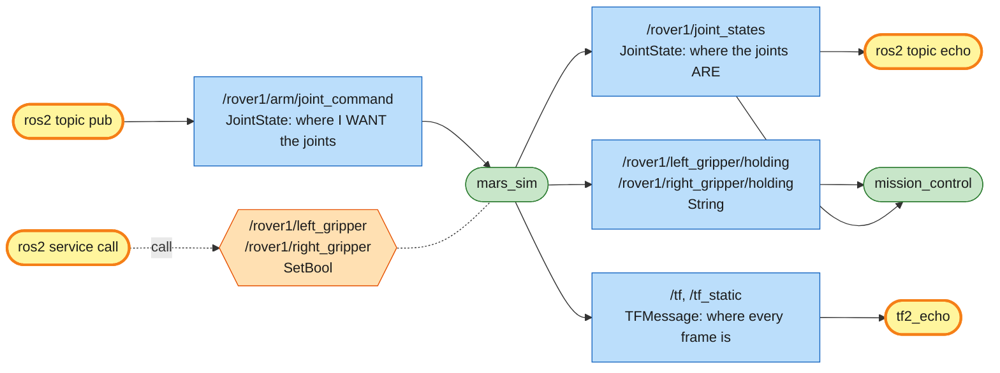

# Mission 9: Arm Check

The rover has unfolded two arms, each with a gripper at the end. Before you program them, get a feel for them by hand: move the joints from the terminal, touch two beacons and pick up a sample. The rover stays parked on the lander the whole time. Only the arms move.


**Objectives**
- [ ] Touch beacon 1 with the LEFT gripper
- [ ] Touch beacon 2 with the RIGHT gripper
- [ ] Pick up the sample with a gripper

**Stars:** ≤ 4 min = ⭐⭐⭐ · ≤ 8 min = ⭐⭐ · the rover must stay parked (driving = ⭐ only)

```bash
# Terminal 1: missions 9-12 switch the arms on, and this one zooms in on the rover
ros2 launch mission_control mission.launch.py mission:=9
```

---

## The arms

Each arm has two joints, a shoulder and an elbow, and two links: the upper arm (0.6 m) and the forearm (0.5 m). The shoulders sit on the front corners of the rover. Everything is measured in the rover's own frame, `rover1/base_link`: its origin is the centre of the rover, x points the way the rover faces and y points to its left.

```text
                                 gripper
                                /
                      forearm  /  L2 = 0.5
                              /
                      elbow  o  <- elbow angle q2 (relative to the upper arm)
                            /
                upper arm  /  L1 = 0.6
                          /
          left shoulder  o  (0.4, +0.25)  <- shoulder angle q1 (0 = straight ahead)
     +-------------------+
     |  rover1     x     | - - - - - - - - > heading (x)
     +-------------------+
         right shoulder  o  (0.4, -0.25)   (the right arm is the mirror image)
```

| Joint | Range | Zero means |
|---|---|---|
| `left_shoulder`, `right_shoulder` | −π … π rad | upper arm points straight ahead |
| `left_elbow`, `right_elbow` | −2.8 … 2.8 rad | forearm continues straight on |

Positive angles turn left (counter-clockwise), same as `angular.z` in mission 2. All four joints start at 0, so both arms point straight ahead. Fully stretched, an arm reaches 1.1 m from its shoulder.

With the arms switched on, the rover gets these interfaces:

| Name | Kind | Type |
|---|---|---|
| `/rover1/joint_states` | topic (out) | `sensor_msgs/msg/JointState`: current angles and speeds |
| `/rover1/arm/joint_command` | topic (in) | `sensor_msgs/msg/JointState`: target angles |
| `/rover1/left_gripper`, `/rover1/right_gripper` | service | `std_srvs/srv/SetBool`: `true` = close (grab), `false` = open (let go) |
| `/rover1/left_gripper/holding`, `/rover1/right_gripper/holding` | topic (out) | `std_msgs/msg/String`: what the gripper holds (`''` = nothing) |
| `/tf`, `/tf_static` | topic (out) | `tf2_msgs/msg/TFMessage`: where every part of the rover is, read with tf2 |

---

## Step 1: Read the joints

```bash
ros2 interface show sensor_msgs/msg/JointState
```

```text
std_msgs/Header header
string[] name
float64[] position
float64[] velocity
float64[] effort
```

The message is a set of parallel lists: `name[i]` goes with `position[i]` and `velocity[i]`. Real robot arms publish this exact message, and RViz and `robot_state_publisher` read it to draw the robot.

```bash
ros2 topic echo --once /rover1/joint_states
```

```text
name:
- left_shoulder
- left_elbow
- right_shoulder
- right_elbow
position:
- 0.0
- 0.0
- 0.0
- 0.0
velocity:
- 0.0
...
```

## Step 2: Where is the gripper? Ask tf2

The simulator publishes a **frame** for every part of the rover, and how each frame sits relative to its parent. That set of frames is called the **TF tree**:

```text
map                          the ground, (0, 0) in the bottom-left corner
└── rover1/base_link         the rover (moves when it drives)
    ├── rover1/laser, rover1/drill, rover1/cache
    ├── rover1/left_shoulder          fixed, at (0.4, 0.25)
    │   └── rover1/left_upper_arm     turned by left_shoulder
    │       └── rover1/left_forearm   0.6 m further, turned by left_elbow
    │           └── rover1/left_gripper   0.5 m further
    └── rover1/right_shoulder ...     the same for the right arm
```

**tf2** is the ROS 2 library that reads this tree and answers questions like "where is frame B, seen from frame A?". It chains all the steps in between for you. Ask it where the left gripper is on the map:

```bash
ros2 run tf2_ros tf2_echo map rover1/left_gripper
```

```text
At time 1791340258.369446869
- Translation: [4.500, 3.250, 0.200]
- Rotation: in Quaternion (xyzw) [0.000, 0.000, 0.000, 1.000]
...
```

It prints once a second until you press Ctrl+C. (If the first line says *frame does not exist*, it hasn't heard the tree yet. Wait a second.) Ignore the z of 0.2: the arms are mounted 0.2 m above the ground, and the map is flat.

You can check that by hand. The rover is at (3, 3) facing +x, the left shoulder is 0.4 m ahead and 0.25 m left of its centre, and the stretched arm adds 0.6 + 0.5 = 1.1 m straight ahead: (3 + 0.4 + 1.1, 3 + 0.25) = (4.5, 3.25).

The first frame you name is the one you look *from*. Look from the rover instead and you get the same gripper in rover coordinates:

```bash
ros2 run tf2_ros tf2_echo rover1/base_link rover1/left_gripper
```

```text
- Translation: [1.500, 0.250, 0.200]
```

## Step 3: Move an arm

Send target angles on `/rover1/arm/joint_command`, listing only the joints you want to move:

```bash
ros2 topic pub --once /rover1/arm/joint_command sensor_msgs/msg/JointState \
  "{name: [left_shoulder], position: [1.57]}"
```

The left arm swings round to point left (1.57 rad = 90°). Joints move towards the target at a limited speed (2 rad/s) and then stay there. The 1-second rule from driving doesn't apply to arms. Ask tf2 again:

```bash
ros2 run tf2_ros tf2_echo map rover1/left_gripper
```

```text
- Translation: [3.401, 4.350, 0.200]
```

Working this out yourself is called **forward kinematics**: joint angles in, gripper position out. In the rover frame:

```text
elbow   = shoulder + 0.6 · (cos q1,        sin q1)
gripper = elbow    + 0.5 · (cos(q1 + q2),  sin(q1 + q2))
```

With q1 = 1.57 and q2 = 0: elbow = (0.4, 0.25) + 0.6 · (0, 1) = (0.4, 0.85), gripper = (0.4, 0.85) + 0.5 · (0, 1) = (0.4, 1.35). Add the rover's position (3, 3) and you get tf2's answer.

## Step 4: Touch the beacons

| Beacon | Map | Rover frame | With |
|---|---|---|---|
| 1 | (4.0, 3.75) | (1.0, 0.75) | the left gripper |
| 2 | (4.0, 2.25) | (1.0, −0.75) | the right gripper |

The map positions are also on `/mission/goals`. The rover sits at (3, 3) facing +x, so here the rover frame is just the map minus (3, 3). The gripper has to get within 0.15 m of the beacon's centre.

Find shoulder and elbow angles that put each gripper on its beacon. Trial and error is fine: send a guess, watch the arm, check with `tf2_echo`, adjust. You can also test a guess on paper first. This one-liner is the forward kinematics above for the left arm:

```bash
python3 -c "from math import *; q1, q2 = 1.0, -1.0; print(0.4 + 0.6*cos(q1) + 0.5*cos(q1+q2), 0.25 + 0.6*sin(q1) + 0.5*sin(q1+q2))"
```

```text
1.2241... 0.7548...
```

That guess puts the gripper at (1.22, 0.75): the right height, but 0.22 m too far forward. For beacon 1, aim the upper arm up and to the left, then bend the elbow back to the right (a negative q2). From there, nudge one joint at a time.

<details>
<summary>Angles that work</summary>

```bash
ros2 topic pub --once /rover1/arm/joint_command sensor_msgs/msg/JointState \
  "{name: [left_shoulder, left_elbow], position: [1.39, -1.57]}"
ros2 topic pub --once /rover1/arm/joint_command sensor_msgs/msg/JointState \
  "{name: [right_shoulder, right_elbow], position: [-1.39, 1.57]}"
```

```bash
ros2 run tf2_ros tf2_echo map rover1/left_gripper
```

```text
- Translation: [4.000, 3.751, 0.200]
```

The right arm is the mirror image, so you flip the sign of both angles. In the next mission you'll compute these instead of guessing.

</details>

## Step 5: Pick up the sample

The sample is the small blue crystal at (4.3, 3.0) on the map, which is (1.3, 0.0) in the rover frame, right in front of the rover. Move a gripper onto it, then close the gripper:

```bash
ros2 interface show std_srvs/srv/SetBool
```

```text
bool data
---
bool success
string message
```

```bash
ros2 service call /rover1/left_gripper std_srvs/srv/SetBool "{data: true}"
```

If the gripper isn't within 0.3 m of the sample, it closes on nothing and the response tells you how far off you are:

```text
response:
std_srvs.srv.SetBool_Response(success=False, message='The left gripper closed on nothing. The closest thing to grab is 0.81 m from it.')
```

When it is close enough:

```text
response:
std_srvs.srv.SetBool_Response(success=True, message='Holding sample_1')
```

```bash
ros2 topic echo --once /rover1/left_gripper/holding
```

```text
data: sample_1
```

Move the arm around and the sample comes along. `{data: false}` lets go of it.

<details>
<summary>Angles that work</summary>

```bash
ros2 topic pub --once /rover1/arm/joint_command sensor_msgs/msg/JointState \
  "{name: [left_shoulder, left_elbow], position: [0.23, -1.12]}"
ros2 service call /rover1/left_gripper std_srvs/srv/SetBool "{data: true}"
```

</details>

The panel shows *Mission complete* and your stars.

---

## System map



> 🟩 existing node · 🟨 you · 🟦 topic · 🟧 service · 🟪 action · ⬜ parameter — [how to read the maps](../ARCHITECTURE.md#how-to-read-the-maps)

You write targets to `joint_command`, and the simulator reports what actually happened on `joint_states`. Same message type, two topics, opposite directions. It's the same split as `cmd_vel` (what you want) and `odom` (what you got), and real arms work exactly this way.

The grippers are a service because you want an answer: did it grab something or not? Joint targets are a topic because they're a stream you might update at any moment. `/tf` is how every node in a robot finds out where things are, without knowing who computed it.

## Summary

Arms are controlled in joint space: you command angles, not positions. The message for that, `sensor_msgs/msg/JointState`, is a set of parallel lists (`name[]`, `position[]`, `velocity[]`, `effort[]`) used by real robots everywhere.

Going from angles to where the gripper ends up is called **forward kinematics**:

```text
elbow   = shoulder + L1 · (cos q1,        sin q1)
gripper = elbow    + L2 · (cos(q1 + q2),  sin(q1 + q2))        (in the rover frame)
```

**tf2** keeps track of every frame of the robot and does that chaining for you: `ros2 run tf2_ros tf2_echo A B` tells you where frame B is, seen from frame A.

`std_srvs/srv/SetBool` is the standard service for switching something on or off and hearing how it went.

## Check yourself

<details>
<summary>1. You send <code>{name: [left_elbow], position: [1.0]}</code>. What happens to the left shoulder?</summary>

Nothing. Joints you don't name keep their last target, which is why you can move one joint at a time.

</details>

<details>
<summary>2. You send <code>{name: [left_shoulder, left_elbow], position: [0.5]}</code> (one number short). What happens?</summary>

Nothing moves. `name` and `position` are parallel lists, so `left_elbow` has no position, and the simulator ignores the whole message. Terminal 1 shows a warning: *joint_command needs one position per name*.

</details>

<details>
<summary>3. <code>tf2_echo map rover1/left_gripper</code> and <code>tf2_echo rover1/base_link rover1/left_gripper</code> print different numbers. Which one is right?</summary>

Both. It's the same gripper, seen from two frames. From `map` you get where it is on the ground, from `rover1/base_link` where it is relative to the rover. Drive the rover and the first one changes, the second one doesn't.

</details>

<details>
<summary>4. Why does <code>/rover1/joint_states</code> also report <code>velocity</code>?</summary>

So you can tell whether the arm is still moving. In mission 11 your node waits until the arm arrives before it closes the gripper.

</details>

## Extras

- Wave hello: alternate two shoulder angles with `--rate 1` in two terminals.
- Pick the sample up with the right gripper instead. Which angles does it need?
- Draw the TF tree: `ros2 run tf2_tools view_frames` listens for 5 seconds and writes `frames_<date>.pdf` with every frame and who publishes it.
- Hand the sample to the cache on the rover's back at (−0.15, 0) in the rover frame and open the gripper there. You'll do this in code in mission 11.

---

**Previous:** [Mission 8: Power Crisis](08-boss-power-crisis.md) · **Next:** [Mission 10: Frames](10-frames.md)
