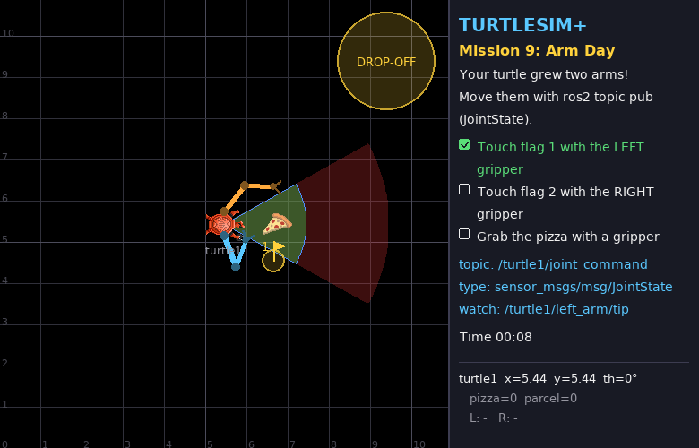

# Mission 9: Arm Day 🦾

> **Briefing:** Big news from the lab — the turtle has grown **two arms**, each with a gripper!
> Before we program them, get a feel for them by hand: move the joints from the terminal, touch two flags and grab a pizza.



**🎯 Objectives**
- [ ] Touch flag 1 with the LEFT gripper
- [ ] Touch flag 2 with the RIGHT gripper
- [ ] Grab the pizza with a gripper

**⭐ Stars:** ≤ 4 min = ⭐⭐⭐ · ≤ 8 min = ⭐⭐ · the turtle must stay parked (driving = ⭐ only)

```bash
# Terminal 1 — arms are switched on automatically for missions 9-12
ros2 launch turtle_quest mission.launch.py mission:=9
```

---

## 🧠 Concept card: meet the arms

Each arm has two **joints** (shoulder and elbow) and two links: the upper arm (0.8 m) and the forearm (0.7 m).
Everything is measured in the **turtle's own frame**: x points where the turtle faces, y points to its left.

```text
                       tip (gripper)
                     /
            forearm /  L2 = 0.7
                   /
           elbow  o  <- elbow angle q2 (relative to the upper arm)
                 /
     upper arm  /  L1 = 0.8
               /
   shoulder   o  <- shoulder angle q1 (measured from the turtle's heading)
              |  0.3 m
     turtle   T  - - - - - - - - - - > heading (x)
              |  0.3 m
   shoulder   o   (the right arm is the mirror image)
```

| Joint | Range | Zero means |
|---|---|---|
| `left_shoulder`, `right_shoulder` | −π … π rad | upper arm points straight ahead |
| `left_elbow`, `right_elbow` | −2.7 … 2.7 rad | forearm continues straight on |

Positive angles turn **left** (counter-clockwise), just like `angular.z` in mission 2.
The **left arm is orange**, the **right arm is blue**. Fully stretched, an arm reaches 1.5 m from its shoulder.

New interfaces on every turtle when arms are on:

| Name | Kind | Type |
|---|---|---|
| `/turtle1/joint_states` | topic (out) | `sensor_msgs/msg/JointState` — current angles and speeds |
| `/turtle1/joint_command` | topic (in) | `sensor_msgs/msg/JointState` — target angles |
| `/turtle1/left_arm/tip`, `/turtle1/right_arm/tip` | topic (out) | `geometry_msgs/msg/Point` — where each gripper is, in world coordinates |
| `/turtle1/left_gripper`, `/turtle1/right_gripper` | service | `std_srvs/srv/SetBool` — `true` = close (grab), `false` = open (release) |
| `/turtle1/left_gripper/holding`, `.../right_gripper/holding` | topic (out) | `std_msgs/msg/String` — what the gripper holds (`''` = nothing) |

---

## Step 1: Read the joints

```bash
ros2 interface show sensor_msgs/msg/JointState
```

```text
std_msgs/Header header
string[] name
float64[] position
float64[] velocity
float64[] effort
```

It's a set of **parallel lists**: `name[i]` goes with `position[i]` and `velocity[i]`.
This is the very same message real robot arms publish — RViz and `robot_state_publisher` read it to draw the robot.

```bash
ros2 topic echo --once /turtle1/joint_states
```

```text
name:
- left_shoulder
- left_elbow
- right_shoulder
- right_elbow
position:
- 1.2
- -2.4
- -1.2
- 2.4
...
```

That's the folded "home" posture you see on screen.

## Step 2: Move an arm

Send the **target** angles on `/turtle1/joint_command`. You only list the joints you want to move:

```bash
ros2 topic pub --once /turtle1/joint_command sensor_msgs/msg/JointState \
  "{name: [left_shoulder, left_elbow], position: [0.0, 0.0]}"
```

The left arm swings out straight ahead. The joints move at a limited speed (2 rad/s) to the target and stay there — no 1-second rule for arms.

Where is the gripper now?

```bash
ros2 topic echo --once /turtle1/left_arm/tip
```

```text
x: 6.94
y: 5.74
```

Check it: the left shoulder is at (5.44, 5.44 + 0.3) = (5.44, 5.74); the stretched arm adds 0.8 + 0.7 = 1.5 m straight ahead → (6.94, 5.74) ✔️

## Step 3: Touch the flags 🚩

| Flag | Position (world) | With |
|---|---|---|
| 1 | (6.64, 6.34) | the **left** gripper |
| 2 | (6.64, 4.54) | the **right** gripper |

Find shoulder/elbow angles that put each gripper on its flag (within 0.3 m).
Trial and error is completely fine here: send a guess, watch the arm, check `/turtle1/left_arm/tip`, adjust.

> 💡 Good first guess for flag 1: the shoulder points up-left, the elbow bends back a bit to the right. Then nudge one joint at a time.

<details>
<summary>🔓 Angles that work</summary>

```bash
ros2 topic pub --once /turtle1/joint_command sensor_msgs/msg/JointState \
  "{name: [left_shoulder, left_elbow], position: [0.89, -0.93]}"
ros2 topic pub --once /turtle1/joint_command sensor_msgs/msg/JointState \
  "{name: [right_shoulder, right_elbow], position: [-0.89, 0.93]}"
```

Notice the right arm is the mirror image: flip the sign of both angles. In the next mission you'll *compute* these instead of guessing.

</details>

## Step 4: Grab the pizza 🍕

The pizza is at **(6.74, 5.44)**, right in front of the turtle. Move a gripper onto it, then close the gripper:

```bash
ros2 interface show std_srvs/srv/SetBool
```

```text
bool data
---
bool success
string message
```

```bash
ros2 service call /turtle1/left_gripper std_srvs/srv/SetBool "{data: true}"
```

```text
response:
std_srvs.srv.SetBool_Response(success=True, message='grabbed pizza0')
```

or, if the gripper wasn't close enough (it must be within 0.4 m):

```text
std_srvs.srv.SetBool_Response(success=False, message='nothing within reach of the gripper')
```

Now move the arm around — the pizza comes along. `{data: false}` lets it go.

<details>
<summary>🔓 Angles that work</summary>

```bash
ros2 topic pub --once /turtle1/joint_command sensor_msgs/msg/JointState \
  "{name: [left_shoulder, left_elbow], position: [0.21, -0.95]}"
ros2 service call /turtle1/left_gripper std_srvs/srv/SetBool "{data: true}"
```

</details>

🎉 Mission complete!

---

## 🔍 Summary

- Arms are controlled in **joint space**: you command angles, not positions
- `sensor_msgs/msg/JointState` = parallel lists `name[]`, `position[]`, `velocity[]`, `effort[]` — used by real robots everywhere
- **Forward kinematics** (angles → where the gripper ends up) is what the simulator computes for `/turtle1/left_arm/tip`:

```text
elbow = shoulder + L1 · (cos q1,        sin q1)
tip   = elbow    + L2 · (cos(q1 + q2),  sin(q1 + q2))        (in the turtle frame)
```

- `std_srvs/srv/SetBool` is the standard "switch something on/off and tell me how it went" service

## 🧩 Check yourself

<details>
<summary>1. You send <code>{name: [left_elbow], position: [1.0]}</code>. What happens to the left shoulder?</summary>

Nothing — joints you don't name keep their last target. That's why you can move one joint at a time.

</details>

<details>
<summary>2. You send <code>{name: [left_shoulder, left_elbow], position: [0.5]}</code> (one number short). What happens?</summary>

`name` and `position` are parallel lists, so `left_elbow` has no position. The shoulder moves, and the simulator logs a warning that every name needs a position.

</details>

<details>
<summary>3. Why does <code>/turtle1/joint_states</code> also report <code>velocity</code>?</summary>

So you can tell whether the arm is still moving! In mission 11 you'll wait until the arm *arrives* before closing the gripper.

</details>

## 🏆 Side quests

- Wave hello: alternate two shoulder angles with `--rate 1` and two terminals 👋
- Try a **crate** in free-play mode: `ros2 launch turtlesim_plus turtlesim_plus.launch.py arms:=true`, then
  `ros2 service call /spawn_crate turtlesim_plus_interfaces/srv/GivePosition "{x: 6.5, y: 5.44}"`.
  Grab it with one gripper — what does the response say? 🤔

---

**← Previous** [Mission 8](08-boss-delivery.md) · **Next →** [Mission 10: Long Reach](10-long-reach.md)
