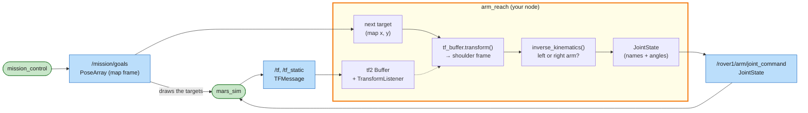

# Mission 10: Frames

The rover is parked at (6, 6), facing a random direction. Six small targets surround it, and a gripper has to touch them in order. The targets are given in the map frame and they're tiny (0.12 m), so guessing angles like in mission 9 won't work. Your node has to turn each target into the shoulder's frame with **tf2**, then compute the joint angles, which is called **inverse kinematics**.


**Objectives**
- [ ] Touch the targets in order (6 of them)
- [ ] Move the arms with your own node

**Stars:** ≤ 8 s = ⭐⭐⭐ · ≤ 20 s = ⭐⭐ · the rover must stay parked; the clock starts when an arm starts moving

```bash
# Terminal 1 (add seed:=1 to get the same heading and targets as the examples below)
ros2 launch mission_control mission.launch.py mission:=10
```

---

## Forward and inverse kinematics

| | Question | Difficulty |
|---|---|---|
| forward kinematics (FK) | "My joints are at (q1, q2). Where is the gripper?" | easy: plug into the formula from mission 9 |
| inverse kinematics (IK) | "I want the gripper *there*. Which (q1, q2)?" | harder: solve the formula backwards |

Robots are commanded in joint space, but jobs are described in the world ("touch that target"). That's why IK shows up everywhere in manipulation.

## Coordinate frames

The target arrives in the `map` frame, but the arm formulas work from the shoulder, in the rover's directions. In mission 9 the rover faced +x, so you could just subtract its position. Here it faces a random way. Ask tf2 which way:

```bash
ros2 run tf2_ros tf2_echo map rover1/base_link
```

```text
- Translation: [6.000, 6.000, 0.000]
- Rotation: in Quaternion (xyzw) [0.000, 0.000, 0.912, -0.410]
- Rotation: in RPY (radian) [0.000, -0.000, -2.297]
```

The last number of the RPY line is the yaw: −2.297 rad, so the rover faces down and to the left. The first target is the first pose on `/mission/goals`:

```bash
ros2 topic echo --once /mission/goals
```

```text
poses:
- position:
    x: 5.837
    y: 4.913
    z: 0.12       # <- the target's radius, ignore it
```

### By hand

Two conversions take a map point to the shoulder frame:

```text
 map (x, y)  --move to the rover, rotate by -yaw-->  rover frame  --subtract the shoulder-->  shoulder frame
```

```python
dx, dy = x - rover_x, y - rover_y            # map -> rover frame: move the origin to the rover ...
x_r =  cos(yaw) * dx + sin(yaw) * dy         # ... and undo its rotation
y_r = -sin(yaw) * dx + cos(yaw) * dy
x_s, y_s = x_r - 0.4, y_r - 0.25             # rover frame -> left shoulder frame (right: y_r + 0.25)
```

With the numbers above:

```bash
python3 -c "from math import *; x, y, rx, ry, yaw = 5.837, 4.913, 6.0, 6.0, -2.297; dx, dy = x - rx, y - ry; print(cos(yaw)*dx + sin(yaw)*dy - 0.4, -sin(yaw)*dx + cos(yaw)*dy - 0.25)"
```

```text
0.5209... 0.3499...
```

Seen from the left shoulder, the target is 0.52 m ahead and 0.35 m to the left.

### With tf2

That's the same chain tf2 walks for `tf2_echo`: `map` → `rover1/base_link` → `rover1/left_shoulder`. In a node you hand it a point and the frame you want it in:

```python
from geometry_msgs.msg import PointStamped
from tf2_ros import Buffer, TransformListener
import tf2_geometry_msgs  # noqa: F401  (teaches tf_buffer.transform() about PointStamped)

# in __init__
self.tf_buffer = Buffer()                                   # remembers the frames for a few seconds
self.tf_listener = TransformListener(self.tf_buffer, self)  # fills it from /tf and /tf_static

# later
point = PointStamped()
point.header.frame_id = 'map'                               # the frame the numbers are in
point.point.x, point.point.y = 5.837, 4.913
p = self.tf_buffer.transform(point, 'rover1/left_shoulder').point   # p.x = 0.52, p.y = 0.35
```

No yaw, no quaternion, no shoulder offset in your code. If the rover were somewhere else, or the shoulder moved, this code wouldn't change. That's why real robots use tf2 for every frame, from wheels to cameras. The `import tf2_geometry_msgs` line looks unused, but it teaches `transform()` how to handle `geometry_msgs` types like `PointStamped`. Leave it in.

Until the listener has heard the frames (the first fraction of a second), `transform()` raises a `TransformException`. Catch it and try again on the next loop.

## Solving a 2-link arm

Seen from the shoulder, the target is at (x, y), a distance d away. The upper arm (L1), the forearm (L2) and the line to the target form a triangle:

```text
                 target
                 /|
            L2  / |
               /  |  d = distance shoulder -> target
       elbow  o   |
               \  |
            L1  \ |
                 \|
               shoulder
```

1. The elbow comes straight from the law of cosines:

   ```text
   cos(q2) = (d² - L1² - L2²) / (2 · L1 · L2)
   ```

   If that number is outside −1…1, the target is out of reach (too far, or too close to the shoulder). `acos` gives two answers, +q2 and −q2, because the elbow can bend either way. Bend it outwards (left arm: −q2, right arm: +q2) so the arms don't fold across the rover.

2. For the shoulder, point at the target and then correct for the bend in the elbow:

   ```text
   q1 = atan2(y, x) - atan2(L2 · sin(q2),  L1 + L2 · cos(q2))
   ```

---

## System map



> 🟩 existing node · 🟨 you · 🟦 topic · 🟧 service · 🟪 action · ⬜ parameter — [how to read the maps](../ARCHITECTURE.md#how-to-read-the-maps)

From the outside the node is simple: frames and targets in, joint angles out. Inside, the frame change is tf2's job and the IK is a plain Python function with no ROS in it, so you can test it on its own, which you'll do in Step 2. Keeping the maths apart from the ROS plumbing is a habit worth having.

---

## Step 1: Add the Part 2 dependencies

Your nodes from now on use tf2 and, in mission 11, actions. Open `src/my_rover/package.xml` and add these lines next to the other `<depend>` lines:

```xml
  <depend>tf2_ros</depend>
  <depend>tf2_geometry_msgs</depend>
  <depend>action_msgs</depend>
```

All three come with ROS 2 (they're in `ros-base`), so there's nothing to install. If you were creating the package today, you could list them in `ros2 pkg create --dependencies ...` instead.

## Step 2: The maths as plain Python

Create `src/my_rover/my_rover/arm_kinematics.py`. It has no ROS in it at all, and missions 11 and 12 will import it too:

```python
# my_rover/my_rover/arm_kinematics.py  (plain Python: no ROS in here)
import math

L1 = 0.6   # upper arm, metres
L2 = 0.5   # forearm, metres


def forward_kinematics(q1: float, q2: float):
    """Where the gripper is, seen from the shoulder, for joint angles (q1, q2)."""
    ex, ey = L1 * math.cos(q1), L1 * math.sin(q1)                    # the elbow
    return ex + L2 * math.cos(q1 + q2), ey + L2 * math.sin(q1 + q2)  # the gripper


def inverse_kinematics(x: float, y: float, side: str):
    """Joint angles (q1, q2) that put the gripper at (x, y) in the shoulder frame, or None."""
    cos_q2 = (x * x + y * y - L1 * L1 - L2 * L2) / (2 * L1 * L2)   # law of cosines
    if abs(cos_q2) > 1.0 + 1e-9:
        return None                                    # out of reach
    q2 = math.acos(max(-1.0, min(1.0, cos_q2)))        # rounding can give 1.0000000000000002
    if side == 'left':
        q2 = -q2                                       # bend the elbow outwards, away from the body
    q1 = math.atan2(y, x) - math.atan2(L2 * math.sin(q2), L1 + L2 * math.cos(q2))
    q1 = math.atan2(math.sin(q1), math.cos(q1))       # keep it in -pi..pi
    return q1, q2
```

Test it before you write any ROS code. Mission 9's beacon 1 was at (0.6, 0.5) seen from the left shoulder. Do you get the angles that worked there?

```bash
cd ~/mars_rover/src/my_rover/my_rover
python3 -c "from arm_kinematics import inverse_kinematics as ik; print(ik(0.6, 0.5, 'left'), ik(1.1, 0.0, 'left'), ik(2.0, 0.0, 'left'))"
```

```text
(1.3894765523934065, -1.5707963267948966) (0.0, -0.0) None
```

Beacon 1 matches (1.39, −1.57), a fully stretched arm gives (0, 0), and a point 2 m away is out of reach. Forward kinematics should undo the IK:

```bash
python3 -c "from arm_kinematics import *; print(forward_kinematics(*inverse_kinematics(0.52, 0.35, 'left')))"
```

```text
(0.52, 0.35)
```

## Step 3: The node

Create `src/my_rover/my_rover/arm_reach.py`:

```python
# my_rover/my_rover/arm_reach.py
import rclpy
from rclpy.executors import ExternalShutdownException
from rclpy.node import Node
from geometry_msgs.msg import PointStamped, PoseArray
from sensor_msgs.msg import JointState
from tf2_ros import Buffer, TransformException, TransformListener
import tf2_geometry_msgs  # noqa: F401  (teaches tf_buffer.transform() about PointStamped)

from my_rover.arm_kinematics import inverse_kinematics


class ArmReach(Node):
    def __init__(self):
        super().__init__('arm_reach')
        self.targets = []                                    # map frame, next one first
        self.tf_buffer = Buffer()                            # remembers the frames for a few seconds
        self.tf_listener = TransformListener(self.tf_buffer, self)   # fills it from /tf and /tf_static
        self.create_subscription(PoseArray, '/mission/goals', self.goals_callback, 10)
        self.publisher = self.create_publisher(JointState, '/rover1/arm/joint_command', 10)
        self.create_timer(0.1, self.control_loop)

    def goals_callback(self, msg: PoseArray):
        self.targets = [(p.position.x, p.position.y) for p in msg.poses]

    def in_frame(self, x: float, y: float, frame: str):
        """A point in the map frame, seen from another frame."""
        point = PointStamped()
        point.header.frame_id = 'map'
        point.point.x, point.point.y = x, y
        return self.tf_buffer.transform(point, frame).point

    def control_loop(self):
        if not self.targets:
            return
        x, y = self.targets[0]
        try:
            in_rover = self.in_frame(x, y, 'rover1/base_link')
            side = 'left' if in_rover.y >= 0 else 'right'    # the arm on the target's side
            p = self.in_frame(x, y, f'rover1/{side}_shoulder')
        except TransformException as error:
            self.get_logger().info(f'waiting for tf: {error}', throttle_duration_sec=2.0)
            return
        angles = inverse_kinematics(p.x, p.y, side)
        if angles is None:
            self.get_logger().warning(f'({x:.2f}, {y:.2f}) is out of reach of the {side} arm',
                                      throttle_duration_sec=2.0)
            return
        self.get_logger().info(f'target ({x:.2f}, {y:.2f}) in rover1/{side}_shoulder: '
                               f'({p.x:.2f}, {p.y:.2f})', throttle_duration_sec=1.0)
        cmd = JointState()
        cmd.name = [f'{side}_shoulder', f'{side}_elbow']
        cmd.position = list(angles)
        self.publisher.publish(cmd)


def main(args=None):
    rclpy.init(args=args)
    node = ArmReach()
    try:
        rclpy.spin(node)
    except (KeyboardInterrupt, ExternalShutdownException):
        pass
    finally:
        node.destroy_node()
        rclpy.try_shutdown()


if __name__ == '__main__':
    main()
```

The node uses tf2 twice per target: once into `rover1/base_link` to see which side of the rover the target is on, and once into that side's shoulder frame for the IK.

## Step 4: Run it

Add the program to `setup.py`, mind the comma:

```python
            'arm_reach = my_rover.arm_reach:main',
```

You changed `package.xml` and `setup.py`, so rebuild and re-source:

```bash
cd ~/mars_rover
colcon build --symlink-install --packages-select my_rover
source install/setup.bash
ros2 run my_rover arm_reach
```

```text
[INFO] [arm_reach]: target (5.84, 4.91) in rover1/left_shoulder: (0.52, 0.35)
...
```

The first line is the point you converted by hand. The arms snap from target to target, and the panel shows *Mission complete* and your stars.

## Step 5 (optional): See the frames

If you have the ROS 2 desktop install, RViz can draw the TF tree live. Start it while the mission runs:

```bash
rviz2
```

Set **Fixed Frame** (top left) to `map`, then **Add** → **TF**. Every frame shows up as a small set of axes, and the arm frames move as the joints do. **Add** → **By topic** → `/mars/markers` draws the rocks and the lander too.

Without RViz, `ros2 run tf2_tools view_frames` writes the tree to a PDF.

---

## Summary

Forward kinematics takes joint angles and gives you the gripper position, with one formula. Inverse kinematics goes the other way by solving the triangle. A 2-link planar arm has up to two IK solutions (elbow bent left or right), and none if the target is out of reach.

Always work in the right frame. The frame change itself is just "move the origin, undo the rotation, subtract the offset", but on a robot with dozens of frames you let **tf2** do it: a `Buffer` with a `TransformListener` collects `/tf`, and `tf_buffer.transform(point, frame)` gives you the point in any frame you name. Bigger arms use solvers like MoveIt for the IK, but the idea is the same as what you just wrote.

## Check yourself

<details>
<summary>1. Which points can the left gripper reach at all?</summary>

Everything between 0.1 m (= L1 − L2) and 1.1 m (= L1 + L2) from the left shoulder, which is a ring (an "annulus"). In practice the elbow limit (±2.8 rad) makes the inner edge a little bigger.

</details>

<details>
<summary>2. What would happen without the <code>atan2(sin, cos)</code> line that wraps q1?</summary>

q1 could come out as, say, 4.0 rad, outside the shoulder limit of ±π. The simulator would clamp it to π and the arm would point the wrong way. Wrapping gives the same direction as −2.28 rad, which is allowed.

</details>

<details>
<summary>3. Your node starts and the first log line is <i>waiting for tf: ... "map" ... does not exist</i>. Is something broken?</summary>

No. The `TransformListener` has only just subscribed to `/tf` and hasn't heard any frames yet. A fraction of a second later the next loop works. That's why the `try`/`except TransformException` is there.

</details>

<details>
<summary>4. Why does the node transform each target twice, into <code>rover1/base_link</code> and into a shoulder frame?</summary>

The base_link point says which side of the rover the target is on, so the node can pick the arm on that side. The shoulder frame is what the IK needs. One frame per question.

</details>

## Extras

- Make it faster. `/mission/goals` lists all remaining targets, so send the idle arm ahead to the next target on its side and have it waiting there.
- Try the other elbow solution (flip the sign of q2) and watch the arms bend inwards.
- Add a `forward_kinematics` check to the node: ask tf2 where `rover1/left_gripper` is in `rover1/left_shoulder` with `self.tf_buffer.lookup_transform('rover1/left_shoulder', 'rover1/left_gripper', rclpy.time.Time())`, and log the difference to your own FK. It should be about 0.

---

**Previous:** [Mission 9](09-arm-check.md) · **Next:** [Mission 11: Drill & Stow](11-drill-and-stow.md)
