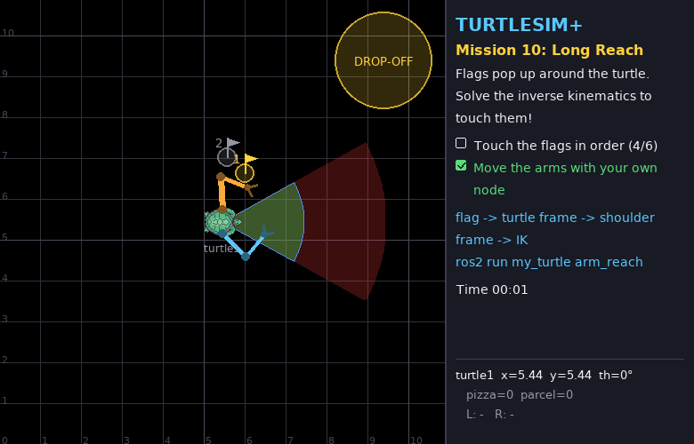
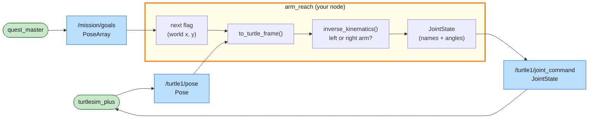

# Mission 10: Long Reach

Six small flags pop up around the turtle, one after another, at random spots. A gripper has to touch each one, and they're tiny (0.25 m), so guessing angles like in mission 9 won't work. Your node has to compute the joint angles from a target position, which is called **inverse kinematics**.



**Objectives**
- [ ] Touch the flags in order (6 of them)
- [ ] Move the arms with your own node

**Stars:** ≤ 6 s = ⭐⭐⭐ · ≤ 20 s = ⭐⭐ · the turtle must stay parked; the clock starts when an arm starts moving

```bash
# Terminal 1
ros2 launch turtle_quest mission.launch.py mission:=10
```

---

## Forward and inverse kinematics

| | Question | Difficulty |
|---|---|---|
| forward kinematics (FK) | "My joints are at (q1, q2). Where is the gripper?" | easy: plug into the formula from mission 9 |
| inverse kinematics (IK) | "I want the gripper *there*. Which (q1, q2)?" | harder: solve the formula backwards |

Robots are commanded in joint space, but jobs are described in the world ("touch that flag"). That's why IK shows up everywhere in manipulation.

## Coordinate frames

The flag arrives in world coordinates, but the arm formulas work in the turtle frame (x forward, y left), measured from the shoulder. So there are two conversions:

```text
 world (x, y)  --rotate by -theta-->  turtle frame (x_t, y_t)  --subtract shoulder-->  shoulder frame (dx, dy)
```

```python
# world -> turtle frame: move the origin to the turtle, then undo its rotation
dx, dy = x - pose.x, y - pose.y
x_t =  cos(theta) * dx + sin(theta) * dy
y_t = -sin(theta) * dx + cos(theta) * dy
# turtle frame -> shoulder frame: the left shoulder sits at (0, +0.3), the right at (0, -0.3)
```

In this mission the turtle sits at the centre facing right, so theta = 0. Write the rotation properly anyway, because you'll need it once the turtle drives in mission 12.

## Solving a 2-link arm

Seen from the shoulder, the target is at (dx, dy), a distance d away. The upper arm (L1), the forearm (L2) and the line to the target form a triangle:

```text
                 target
                 /|
            L2  / |
               /  |  d = distance shoulder -> target
       elbow  o   |
               \  |
            L1  \ |
                 \|
               shoulder
```

1. The elbow comes straight from the law of cosines:

   ```text
   cos(q2) = (d² - L1² - L2²) / (2 · L1 · L2)
   ```

   If that number is outside −1…1, the target is out of reach (too far, or too close to the shoulder). `acos` gives two answers, +q2 and −q2, because the elbow can bend either way. Bend it outwards (left arm: −q2, right arm: +q2) so the arms don't fold across the body.

2. For the shoulder, point at the target and then correct for the bend in the elbow:

   ```text
   q1 = atan2(dy, dx) - atan2(L2 · sin(q2),  L1 + L2 · cos(q2))
   ```

---

## System map



> 🟩 existing node · 🟨 you · 🟦 topic · 🟧 service · 🟪 action · ⬜ parameter — [how to read the maps](../ARCHITECTURE.md#how-to-read-the-maps)

From the outside the node is simple: two topics in, one out. The interesting part is inside. It's a pipeline of plain Python functions with no ROS in them, so you can test them on their own, which you'll do in Step 1. Only the last step builds a ROS message. Keeping the maths apart from the ROS plumbing is a habit worth having.

---

## Step 1: The maths as Python functions

Create `src/my_turtle/my_turtle/arm_reach.py` with the full node below. The two helper functions at the top are the previous two sections written as code:

```python
# my_turtle/my_turtle/arm_reach.py
import math

import rclpy
from rclpy.node import Node
from geometry_msgs.msg import PoseArray
from sensor_msgs.msg import JointState
from turtlesim.msg import Pose

L1, L2 = 0.8, 0.7                           # upper arm, forearm
SHOULDER_Y = {'left': 0.3, 'right': -0.3}   # shoulders sit 0.3 left/right of the turtle's centre
HOME = {'left': (1.2, -2.4), 'right': (-1.2, 2.4)}


def to_turtle_frame(pose: Pose, x: float, y: float):
    """World point -> turtle frame (x forward, y left)."""
    dx, dy = x - pose.x, y - pose.y
    c, s = math.cos(pose.theta), math.sin(pose.theta)
    return c * dx + s * dy, -s * dx + c * dy


def inverse_kinematics(x: float, y: float, side: str):
    """Joint angles (shoulder, elbow) that put the gripper at (x, y) in the turtle frame, or None."""
    dx, dy = x, y - SHOULDER_Y[side]                 # target seen from the shoulder
    cos_q2 = (dx * dx + dy * dy - L1 * L1 - L2 * L2) / (2 * L1 * L2)  # law of cosines
    if abs(cos_q2) > 1.0:
        return None                                  # out of reach
    q2 = math.acos(cos_q2)
    if side == 'left':
        q2 = -q2                                     # bend the elbow outwards, away from the body
    q1 = math.atan2(dy, dx) - math.atan2(L2 * math.sin(q2), L1 + L2 * math.cos(q2))
    q1 = math.atan2(math.sin(q1), math.cos(q1))
    return q1, q2


class ArmReach(Node):
    def __init__(self):
        super().__init__('arm_reach')
        self.pose = None
        self.goals = []
        self.create_subscription(Pose, '/turtle1/pose', self.pose_callback, 10)
        self.create_subscription(PoseArray, '/mission/goals', self.goals_callback, 10)
        self.publisher = self.create_publisher(JointState, '/turtle1/joint_command', 10)
        self.create_timer(0.1, self.control_loop)

    def pose_callback(self, msg: Pose):
        self.pose = msg

    def goals_callback(self, msg: PoseArray):
        self.goals = [(p.position.x, p.position.y) for p in msg.poses]

    def control_loop(self):
        if self.pose is None or not self.goals:
            return
        x, y = to_turtle_frame(self.pose, *self.goals[0])
        # use the arm on the flag's side; fall back to the other one if it can't reach
        sides = ['left', 'right'] if y >= 0 else ['right', 'left']
        for side in sides:
            angles = inverse_kinematics(x, y, side)
            if angles is not None:
                break
        else:
            self.get_logger().warning('flag out of reach', throttle_duration_sec=1.0)
            return
        other = 'right' if side == 'left' else 'left'
        cmd = JointState()
        cmd.name = [f'{side}_shoulder', f'{side}_elbow', f'{other}_shoulder', f'{other}_elbow']
        cmd.position = [*angles, *HOME[other]]       # the idle arm tucks itself in
        self.publisher.publish(cmd)


def main():
    rclpy.init()
    node = ArmReach()
    try:
        rclpy.spin(node)
    except KeyboardInterrupt:
        pass
    finally:
        node.destroy_node()
        rclpy.try_shutdown()


if __name__ == '__main__':
    main()
```

Test the maths on its own before you run the node. Mission 9's flag 1 was at (1.2, 0.9) in the turtle frame. Do you get the same angles as the mission 9 solution?

```bash
cd ~/turtle_quest/src/my_turtle/my_turtle
python3 -c "from arm_reach import inverse_kinematics as ik; print(ik(1.2, 0.9, 'left'), ik(1.5, 0.3, 'left'), ik(3.0, 0.0, 'left'))"
```

```text
(0.89..., -0.93...) (0.0, -0.0) None
```

Flag 1 matches, a fully stretched arm gives (0, 0), and a point 3 m away is out of reach.

## Step 2: Run it

Add `'arm_reach = my_turtle.arm_reach:main',` to `setup.py`, build, source, and run:

```bash
ros2 run my_turtle arm_reach
```

The arms snap from flag to flag. The panel shows *Mission complete* and your stars.

---

## Summary

Forward kinematics takes joint angles and gives you the gripper position, with one formula. Inverse kinematics goes the other way by solving the triangle. A 2-link planar arm has up to two IK solutions (elbow bent left or right), and none if the target is out of reach.

Always convert into the right frame first: world, then robot, then shoulder. In ROS 2 these frames are managed by **tf2**, and bigger arms use solvers like MoveIt, but the idea is the same as what you just wrote.

## Check yourself

<details>
<summary>1. Which points can the left gripper reach at all?</summary>

Everything between 0.1 m (= L1 − L2) and 1.5 m (= L1 + L2) from the left shoulder, which is a ring (an "annulus"). In practice the elbow limit (±2.7 rad) makes the inner edge a bit bigger.

</details>

<details>
<summary>2. What would happen without the <code>atan2(sin, cos)</code> line that wraps q1?</summary>

q1 could come out as, say, 4.0 rad, outside the shoulder limit of ±π. The simulator would clamp it to π and the arm would point the wrong way. Wrapping gives the same direction as −2.28 rad, which is allowed.

</details>

## Extras

- Make it faster. `/mission/goals` lists all remaining flags, so instead of tucking the idle arm in, send it ahead to the next flag on its side and have it waiting there.
- Try the other elbow solution (flip the sign of q2) and watch the arms bend inwards.
- Write `forward_kinematics(q1, q2, side)` and log the difference to `/turtle1/left_arm/tip`. It should be about 0.

---

**Previous:** [Mission 9](09-arm-day.md) · **Next:** [Mission 11: Pick & Place](11-pick-place.md)
