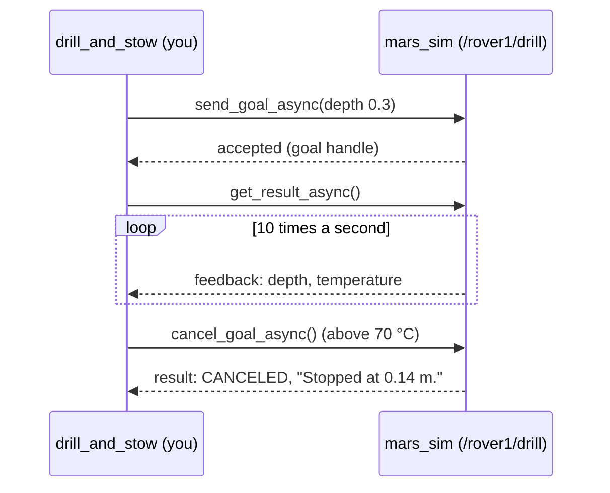
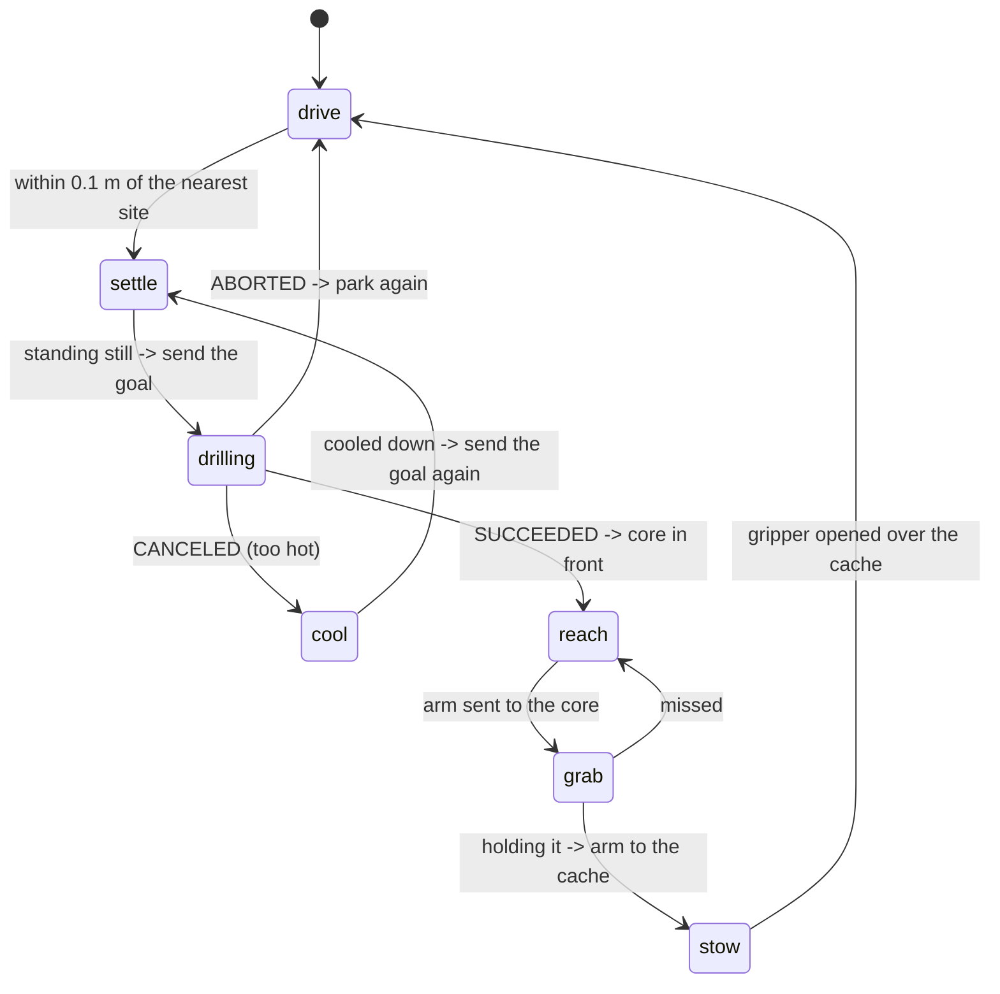
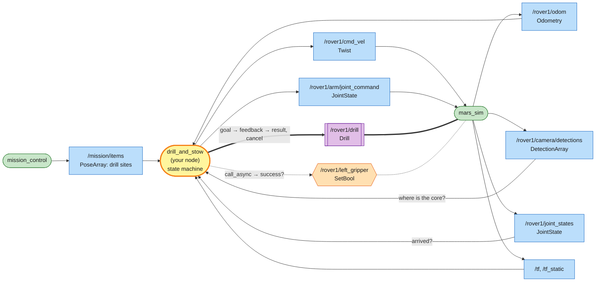

# Mission 11: Drill & Stow

Three drill sites (the white rings) are marked near the lander. Park the rover over each one, drill a core sample with the drill under its belly, then pick the core up with an arm and drop it into the sample cache on the rover's back. Drilling takes several seconds, reports its progress, and sometimes has to be stopped, so it isn't a topic or a service: it's an **action**.


**Objectives**
- [ ] Cores stowed in the cache (3 of them)
- [ ] Drive the rover with your own node

**Stars:** ≤ 2 min = ⭐⭐⭐ · ≤ 4 min = ⭐⭐ · the clock starts when the rover starts moving · a broken drill bit ends the mission

```bash
# Terminal 1
ros2 launch mission_control mission.launch.py mission:=11
```

---

## Topics, services and actions

| | Topic | Service | Action |
|---|---|---|---|
| shape | a stream of messages | one request, one response | a goal, a stream of feedback, one result |
| how long | — | short: the caller waits for the answer | long: seconds or minutes |
| can you stop it? | — | no | yes, cancel it any time |
| in this course | `cmd_vel`, `odom`, `joint_states` | `collect`, `left_gripper` | `drill` |

An action is built from the other two. Under the hood `/rover1/drill` is three services (send a goal, cancel it, get the result) and two topics (feedback and status). The action client in `rclpy` hides all of that behind a few calls.

## The drill

```bash
ros2 interface show mars_interfaces/action/Drill
```

```text
# Drill into the ground under the rover and leave a core sample next to it.
float32 depth          # target depth in metres (0.1 - 0.5)
---
bool success
string message
---
float32 depth          # current depth in metres
float32 temperature    # drill bit temperature in degrees C; above 80 the bit breaks
```

An action type has three parts, separated by `---`: the **goal** you send, the **result** you get at the end, and the **feedback** that streams in while it runs.

| Rule | Detail |
|---|---|
| where | the drill is under the middle of the rover: park with the drill site less than 0.35 m from the rover's centre |
| stand still | the rover must be stopped when the goal arrives and stay stopped; moving aborts the goal |
| speed | 0.04 m/s, so a 0.3 m hole takes 7.5 s of drilling |
| heat | the bit starts at 20 °C, heats up 15 °C/s while drilling and cools 10 °C/s while resting |
| too hot | above 80 °C the bit breaks, and the mission fails |
| core | a hole 0.3 m deep gives a core sample, which appears 0.9 m in front of the rover |
| memory | each hole remembers how deep it is: cancel, let the bit cool, send the goal again and it carries on |

Do the sums: 7.5 s of drilling heats the bit by 112 °C, but it only has 60 °C to go before it breaks. So you have to stop, let it cool, and start again, twice per hole.

## What you have to work with

| Name | Kind | Type | Used for |
|---|---|---|---|
| `/mission/items` | topic (in) | `geometry_msgs/msg/PoseArray` | the drill sites not drilled yet, in the map frame |
| `/rover1/odom` | topic (in) | `nav_msgs/msg/Odometry` | where the rover is, and whether it stands still |
| `/rover1/cmd_vel` | topic (out) | `geometry_msgs/msg/Twist` | drive |
| `/rover1/drill` | action | `mars_interfaces/action/Drill` | drill: goal depth, feedback depth and temperature |
| `/rover1/camera/detections` | topic (in) | `mars_interfaces/msg/DetectionArray` | where the core is (kind `core`) |
| `/rover1/joint_states` | topic (in) | `sensor_msgs/msg/JointState` | has the arm arrived? |
| `/rover1/arm/joint_command` | topic (out) | `sensor_msgs/msg/JointState` | move the arm |
| `/rover1/left_gripper` | service | `std_srvs/srv/SetBool` | grab the core, drop it in the cache |
| `/rover1/samples_onboard` | topic (in) | `std_msgs/msg/Int32` | how many cores are in the cache |

---

## Step 1: Drill from the terminal

Start with the command line, the same way you met topics and services. Find the action and its type:

```bash
ros2 action list
```

```text
/rover1/drill
```

```bash
ros2 action info /rover1/drill
```

```text
Action: /rover1/drill
Action clients: 0
Action servers: 1
    /mars_sim
```

Send a goal. `--feedback` prints the feedback as it comes in:

```bash
ros2 action send_goal --feedback /rover1/drill mars_interfaces/action/Drill "{depth: 0.3}"
```

```text
Goal accepted with ID: fa536d59ec4749e19012905ec3045669

Result:
    success: false
message: There is no drill site under the rover. Park with the site less than 0.35 m from the rover's centre.

Goal finished with status: ABORTED
```

The rover is still on the lander. The server accepted the goal, found nothing to drill and **aborted** it, and the result says why.

For a test, put the rover on a site with the teleport service from mission 3. The sites are on `/mission/items`:

```bash
ros2 topic echo --once /mission/items
ros2 service call /rover1/teleport mars_interfaces/srv/Teleport "{x: 5.87, y: 10.51, yaw: 0.0}"   # use your numbers
```

Teleporting caps this run at ⭐, so treat it as practice: you'll relaunch the mission before running your node. Send the goal again and watch the temperature climb. When it passes 70, press **Ctrl+C**:

```text
Feedback:
    depth: 0.13441064953804016
temperature: 70.40399169921875

Canceling goal...
Feedback:
    depth: 0.13840273022651672
temperature: 71.9010238647461

Goal canceled.
Feedback:
    depth: 0.1424121856689453
temperature: 73.40457153320312

Result:
    success: false
message: Stopped at 0.14 m.

Goal finished with status: CANCELED
```

Ctrl+C on `send_goal` **cancels** the goal. Notice that the bit got a little hotter after you pressed it: stopping takes a moment. Wait 5 seconds for the bit to cool, then send the same goal again. The hole remembers its depth:

```text
Feedback:
    depth: 0.14481380581855774
temperature: 20.90060806274414
```

Cancel again above 70, wait, and a third goal finishes the hole:

```text
Result:
    success: true
message: The hole is 0.30 m deep. Core sample core_1 is ready in front of the rover.

Goal finished with status: SUCCEEDED
```

Now see what happens if nobody watches the temperature. Teleport onto another site from `/mission/items`, send the goal, and keep your hands off the keyboard:

```text
Feedback:
    depth: 0.16001258790493011
temperature: 79.60675048828125

Result:
    success: false
message: The drill bit overheated (over 80 C) and broke.

Goal finished with status: ABORTED
```

The panel says *Mission failed*. That's what your node has to prevent. Close the simulator window and launch mission 11 again for the real run.

## Step 2: An action client in code

Your node does what you just did by hand: send the goal, watch the feedback, cancel when it gets too hot, wait, send it again. In `rclpy` that's four calls, and each one hands its answer to a callback, so the timer never waits:

```python
from rclpy.action import ActionClient
from action_msgs.msg import GoalStatus
from mars_interfaces.action import Drill

# in __init__
self.drill_client = ActionClient(self, Drill, '/rover1/drill')

# 1. send the goal, say which function gets the feedback
future = self.drill_client.send_goal_async(Drill.Goal(depth=0.3), feedback_callback=self.drill_feedback)
future.add_done_callback(self.drill_accepted)

def drill_accepted(self, future):
    self.goal_handle = future.result()            # 2. accepted or rejected?
    if self.goal_handle.accepted:
        self.goal_handle.get_result_async().add_done_callback(self.drill_done)

def drill_feedback(self, msg):                    # 3. ten times a second while it drills
    if msg.feedback.temperature > 70.0:
        self.goal_handle.cancel_goal_async()      #    stop it

def drill_done(self, future):                     # 4. the result, whatever happened
    status = future.result().status               #    GoalStatus.STATUS_SUCCEEDED / _CANCELED / _ABORTED
    message = future.result().result.message
```



There are two futures. The first, from `send_goal_async`, only tells you whether the goal was accepted. The second, from `get_result_async`, completes when the job ends. The status tells you how it ended: `SUCCEEDED` (a core is waiting), `CANCELED` (you stopped it: cool down and go again) or `ABORTED` (the server gave up, for example because the rover moved: park again).

## Picking up the core

When a hole is done, the core appears 0.9 m in front of the rover. Don't hard-code that: find it with the camera, like the samples in mission 6. A detection gives range and bearing from the rover's centre, which is a point in `rover1/base_link`:

```python
x, y = core.range * math.cos(core.bearing), core.range * math.sin(core.bearing)
```

From there it's mission 10: tf2 turns the point into `rover1/left_shoulder`, and `inverse_kinematics()` gives the angles. Close the gripper, then send the gripper to the cache at (−0.15, 0) in `rover1/base_link` the same way and open it there:

```text
Stowed core_2 in the cache (1/6).
```

## The state machine



"Standing still" comes from `/rover1/odom`: the speeds in `twist` are close to 0. "Cooled down" is a time you can compute from the last feedback: the bit cools 10 °C/s, so from 70 °C to 30 °C takes 4 s.

### System map



> 🟩 existing node · 🟨 you · 🟦 topic · 🟧 service · 🟪 action · ⬜ parameter — [how to read the maps](../ARCHITECTURE.md#how-to-read-the-maps)

All three ways to talk show up in one node: topics to drive and to move the arm, a service for the gripper, and an action for the drill. Each fits its job. The arm target is a stream, the gripper is a quick question with an answer, and the drill is a long job you watch and may stop.

---

## Step 3: The node

Create `src/my_rover/my_rover/drill_and_stow.py`. It reuses your mission 5 controller to drive and your mission 10 IK for the arm:

```python
# my_rover/my_rover/drill_and_stow.py
import math

import rclpy
from rclpy.action import ActionClient
from rclpy.executors import ExternalShutdownException
from rclpy.node import Node
from action_msgs.msg import GoalStatus
from geometry_msgs.msg import PointStamped, PoseArray, Twist
from mars_interfaces.action import Drill
from mars_interfaces.msg import DetectionArray
from nav_msgs.msg import Odometry
from sensor_msgs.msg import JointState
from std_srvs.srv import SetBool
from tf2_ros import Buffer, TransformException, TransformListener
import tf2_geometry_msgs  # noqa: F401

from my_rover.arm_kinematics import inverse_kinematics

DEPTH = 0.3           # a core needs a hole this deep
TOO_HOT = 70.0        # cancel above this (the bit breaks above 80 C)
COOL_ENOUGH = 30.0    # drill again once it has cooled to about this
COOL_RATE = 10.0      # degrees per second while the drill rests
PARK = 0.1            # stop this close to the drill site (it has to be within 0.35 m)
CACHE = (-0.15, 0.0)  # the cache, in rover1/base_link
TOLERANCE = 0.02      # rad: close enough to the joint target to call it "arrived"


def yaw_from_quaternion(q) -> float:
    return math.atan2(2.0 * (q.w * q.z + q.x * q.y), 1.0 - 2.0 * (q.y * q.y + q.z * q.z))


class DrillAndStow(Node):
    def __init__(self):
        super().__init__('drill_and_stow')
        self.pose = None          # (x, y, yaw) in the map frame
        self.speed = 0.0
        self.sites = []           # drill sites still to drill, map frame
        self.detections = []      # what the camera sees
        self.joints = {}          # joint name -> current angle
        self.state = 'drive'
        self.temperature = 20.0
        self.goal_handle = None
        self.cancel_sent = False
        self.wait_until = 0.0
        self.arm_target = None
        self.gripper_future = None
        self.tf_buffer = Buffer()
        self.tf_listener = TransformListener(self.tf_buffer, self)
        self.create_subscription(Odometry, '/rover1/odom', self.odom_callback, 10)
        self.create_subscription(PoseArray, '/mission/items', self.items_callback, 10)
        self.create_subscription(DetectionArray, '/rover1/camera/detections', self.camera_callback, 10)
        self.create_subscription(JointState, '/rover1/joint_states', self.joints_callback, 10)
        self.cmd_pub = self.create_publisher(Twist, '/rover1/cmd_vel', 10)
        self.arm_pub = self.create_publisher(JointState, '/rover1/arm/joint_command', 10)
        self.drill_client = ActionClient(self, Drill, '/rover1/drill')
        self.gripper_client = self.create_client(SetBool, '/rover1/left_gripper')
        self.create_timer(0.05, self.control_loop)

    # -- callbacks only remember
    def odom_callback(self, msg: Odometry):
        p = msg.pose.pose
        self.pose = (p.position.x, p.position.y, yaw_from_quaternion(p.orientation))
        self.speed = abs(msg.twist.twist.linear.x) + abs(msg.twist.twist.angular.z)

    def items_callback(self, msg: PoseArray):
        self.sites = [(p.position.x, p.position.y) for p in msg.poses]

    def camera_callback(self, msg: DetectionArray):
        self.detections = msg.detections

    def joints_callback(self, msg: JointState):
        self.joints = dict(zip(msg.name, msg.position))

    # -- the drill action: goal -> accepted? -> feedback ... -> result
    def start_drilling(self):
        self.state = 'drilling'
        self.cancel_sent = False
        goal = Drill.Goal(depth=DEPTH)
        future = self.drill_client.send_goal_async(goal, feedback_callback=self.drill_feedback)
        future.add_done_callback(self.drill_accepted)

    def drill_accepted(self, future):
        self.goal_handle = future.result()
        if not self.goal_handle.accepted:
            self.state = 'settle'                     # try again
            return
        self.goal_handle.get_result_async().add_done_callback(self.drill_done)

    def drill_feedback(self, msg):
        self.temperature = msg.feedback.temperature
        if self.temperature > TOO_HOT and not self.cancel_sent:
            self.cancel_sent = True
            self.get_logger().info(f'{self.temperature:.0f} C at {msg.feedback.depth:.2f} m: pausing')
            self.goal_handle.cancel_goal_async()

    def drill_done(self, future):
        status = future.result().status
        self.get_logger().info(future.result().result.message)
        if status == GoalStatus.STATUS_SUCCEEDED:
            self.state = 'reach'
        elif status == GoalStatus.STATUS_CANCELED:
            self.state = 'cool'
            self.wait_until = self.now() + (self.temperature - COOL_ENOUGH) / COOL_RATE
        else:
            self.state = 'drive'                      # aborted, e.g. not on the site: park again

    # -- helpers
    def now(self) -> float:
        return self.get_clock().now().nanoseconds / 1e9

    def steer_to(self, x: float, y: float) -> Twist:
        """Mission 5's controller."""
        px, py, yaw = self.pose
        error = math.atan2(y - py, x - px) - yaw
        error = math.atan2(math.sin(error), math.cos(error))
        cmd = Twist()
        cmd.angular.z = 3.0 * error
        if abs(error) < 0.3:
            cmd.linear.x = min(1.2 * math.hypot(x - px, y - py), 0.6)
        return cmd

    def move_arm(self, x: float, y: float) -> bool:
        """Send the left gripper to (x, y) in rover1/base_link. False if it can't go there (yet)."""
        point = PointStamped()
        point.header.frame_id = 'rover1/base_link'
        point.point.x, point.point.y = x, y
        try:
            p = self.tf_buffer.transform(point, 'rover1/left_shoulder').point
        except TransformException:
            return False
        angles = inverse_kinematics(p.x, p.y, 'left')
        if angles is None:
            return False
        self.arm_target = angles
        cmd = JointState()
        cmd.name = ['left_shoulder', 'left_elbow']
        cmd.position = list(angles)
        self.arm_pub.publish(cmd)
        return True

    def arm_arrived(self) -> bool:
        q = (self.joints.get('left_shoulder'), self.joints.get('left_elbow'))
        return None not in q and all(abs(a - b) < TOLERANCE for a, b in zip(q, self.arm_target))

    def gripper(self, close: bool):
        self.gripper_future = self.gripper_client.call_async(SetBool.Request(data=close))

    # -- the state machine, 20 times a second
    def control_loop(self):
        if self.pose is None:
            return
        cmd = Twist()                                 # stand still unless a state says otherwise
        if self.state == 'drive':
            if self.sites:
                x, y = min(self.sites, key=lambda s: math.hypot(s[0] - self.pose[0], s[1] - self.pose[1]))
                if math.hypot(x - self.pose[0], y - self.pose[1]) < PARK:
                    self.state = 'settle'
                else:
                    cmd = self.steer_to(x, y)
        elif self.state == 'settle':
            if self.speed < 0.005:                    # the drill only works when the rover stands still
                self.start_drilling()
        elif self.state == 'cool':
            if self.now() >= self.wait_until:
                self.state = 'settle'
        elif self.state == 'reach':
            cores = [d for d in self.detections if d.kind == 'core']
            if cores:
                core = min(cores, key=lambda d: d.range)
                # range and bearing -> a point in rover1/base_link
                if self.move_arm(core.range * math.cos(core.bearing), core.range * math.sin(core.bearing)):
                    self.state = 'grab'
        elif self.state == 'grab':
            if self.gripper_future is None:
                if self.arm_arrived():
                    self.gripper(True)
            elif self.gripper_future.done():
                ok = self.gripper_future.result().success
                self.gripper_future = None
                if ok and self.move_arm(*CACHE):
                    self.state = 'stow'
                else:
                    self.state = 'reach'
        elif self.state == 'stow':
            if self.gripper_future is None:
                if self.arm_arrived():
                    self.gripper(False)
            elif self.gripper_future.done():
                self.get_logger().info(self.gripper_future.result().message)
                self.gripper_future = None
                self.state = 'drive'
        self.cmd_pub.publish(cmd)


def main(args=None):
    rclpy.init(args=args)
    node = DrillAndStow()
    try:
        rclpy.spin(node)
    except (KeyboardInterrupt, ExternalShutdownException):
        pass
    finally:
        node.destroy_node()
        rclpy.try_shutdown()


if __name__ == '__main__':
    main()
```

The action callbacks (`drill_accepted`, `drill_feedback`, `drill_done`) only change `self.state`, and the timer reads it. Nothing ever waits inside a callback, which keeps `spin()` free to deliver the feedback the node is waiting for. That's the deadlock from mission 6 again.

## Step 4: Run it

Add the program to `setup.py`, build, source, and run:

```python
            'drill_and_stow = my_rover.drill_and_stow:main',
```

```bash
cd ~/mars_rover
colcon build --symlink-install --packages-select my_rover
source install/setup.bash
ros2 run my_rover drill_and_stow
```

```text
[INFO] [drill_and_stow]: 71 C at 0.14 m: pausing
[INFO] [drill_and_stow]: Stopped at 0.14 m.
[INFO] [drill_and_stow]: 70 C at 0.25 m: pausing
[INFO] [drill_and_stow]: Stopped at 0.25 m.
[INFO] [drill_and_stow]: The hole is 0.30 m deep. Core sample core_2 is ready in front of the rover.
[INFO] [drill_and_stow]: Stowed core_2 in the cache (1/6).
...
```

Count the cores in a second terminal:

```bash
ros2 topic echo /rover1/samples_onboard
```

When the third core drops into the cache, the panel shows *Mission complete* and your stars.

---

## Summary

Use an **action** for a job that takes a while, where you want progress along the way and the option to stop it. An action client sends a goal (`send_goal_async`), gets feedback through a callback, can cancel (`cancel_goal_async`), and gets one result with a status (`get_result_async`): `SUCCEEDED`, `CANCELED` or `ABORTED`. From the terminal, `ros2 action list / info / send_goal --feedback` do the same, and Ctrl+C cancels.

Pick and place is the frame chain from mission 10 again: camera (range, bearing) → point in `rover1/base_link` → tf2 → shoulder frame → IK. Move on when something has finished (the arm has arrived per `joint_states`, the service has answered per `future.done()`, the action has a result), never after a guessed delay.

## Check yourself

<details>
<summary>1. Why is the drill an action and not a service?</summary>

A service call gives you nothing until it's over, and you can't stop it. Drilling takes seconds, you need the temperature while it runs, and you must be able to stop it before the bit breaks. That's feedback and cancel, which only actions have.

</details>

<details>
<summary>2. Why cancel at 70 °C and not at 79?</summary>

The cancel isn't instant. The request has to reach the simulator and the drill stops at its next step, and meanwhile the bit keeps heating at 15 °C/s. In Step 1 the feedback after *Canceling goal...* still showed the temperature rising, from 70.4 to 73.4 °C. Leave a margin.

</details>

<details>
<summary>3. The node sends a goal while the rover is still rolling to a stop. What happens?</summary>

The server checks the rover first: the goal is accepted and then aborted with *Stop the rover before drilling.* `drill_done` sees `ABORTED` and goes back to `drive`. That's why `settle` waits for the speeds in `/rover1/odom` to drop to about 0.

</details>

<details>
<summary>4. Why does the node find the core with the camera instead of just using (0.9, 0)?</summary>

Both work here, but the camera tells you where the core really is. If the rover slips, or a later version of the drill drops it somewhere else, the camera version still works and the hard-coded one grabs thin air.

</details>

## Extras

- Look under the hood: `ros2 topic list --include-hidden-topics | grep drill` and `ros2 service list --include-hidden-services | grep drill` show the topics and services the action is made of.
- Push the limit: how close to 80 °C can `TOO_HOT` be before a bit breaks? One pause per hole would save time, but is it worth the risk?
- Deliver the cores: drive back onto the lander and call `/rover1/unload` (mission 8). Cores count as samples.

---

**Previous:** [Mission 10](10-frames.md) · **Next:** [Mission 12: Boss!](12-boss-meteorite-recovery.md)
