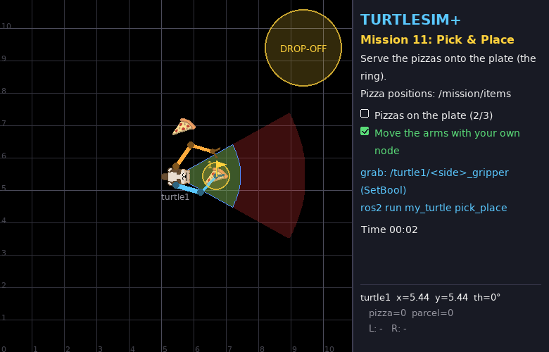
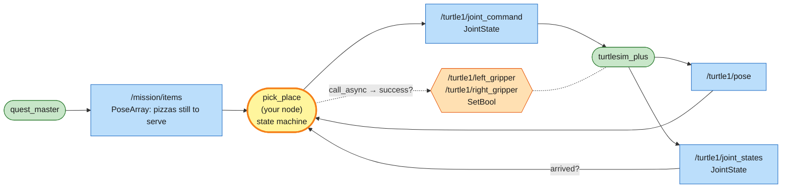
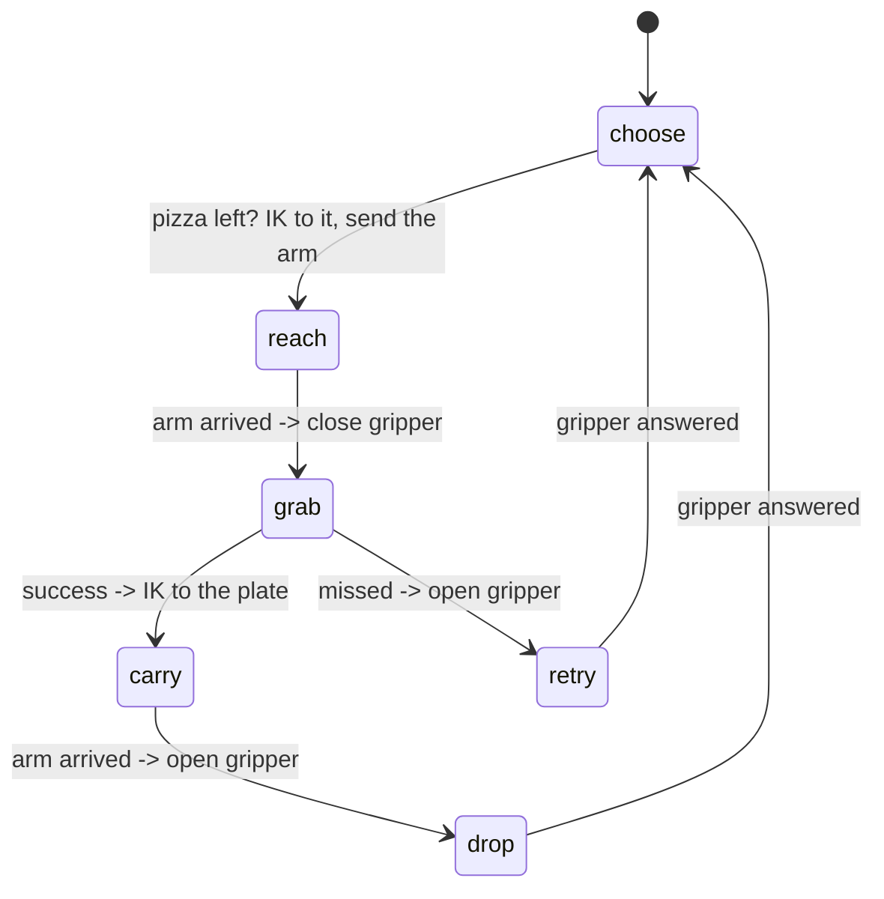

# Mission 11: Pick & Place 🍽️

> **Briefing:** The turtle has opened a restaurant. Three pizzas lie around it; serve them all onto the **plate** (the ring in front of the turtle).
> Every pizza is a little sequence — reach, grab, carry, release — so this is where **state machines** meet arms.



**🎯 Objectives**
- [ ] Put 3 pizzas on the plate
- [ ] Move the arms with your own node

**⭐ Stars:** ≤ 8 s = ⭐⭐⭐ · ≤ 20 s = ⭐⭐ — the turtle must stay parked; the clock starts when an arm starts moving

```bash
# Terminal 1
ros2 launch turtle_quest mission.launch.py mission:=11
```

> ⚠️ Don't call `/turtle1/eat` — the plate is inside the green cone and an eaten pizza can't be served. (If it happens, relaunch.)

---

## 🗺️ What you have to work with

| Name | Kind | Type | Used for |
|---|---|---|---|
| `/mission/items` | topic (in) | `geometry_msgs/msg/PoseArray` | the "overhead camera": world positions of pizzas **not yet on the plate** |
| `/mission/goals` | topic (in) | `geometry_msgs/msg/PoseArray` | the plate (one ring) — it's at **(1.25, 0)** in the turtle frame |
| `/turtle1/joint_states` | topic (in) | `sensor_msgs/msg/JointState` | where the joints are now → has the arm **arrived**? |
| `/turtle1/joint_command` | topic (out) | `sensor_msgs/msg/JointState` | where the joints should go |
| `/turtle1/left_gripper`, `/turtle1/right_gripper` | service | `std_srvs/srv/SetBool` | grab (`true`) / release (`false`); `success` tells you if you got something |

A pizza dropped anywhere inside the plate ring counts.

### 🕸️ System map



> 🟩 existing node · 🟨 you · 🟦 topic · 🟧 service · 🟪 action · ⬜ parameter — [how to read the maps](../ARCHITECTURE.md#how-to-read-the-maps)

Two signals move the state machine forward, and both come back *into* the node: **`joint_states`** (has the arm arrived?) and the gripper **service response** (did the grab work?).

## 🧠 Concept card: a manipulation state machine

In mission 8 the state could be read from a topic every loop. Here we must **remember** where we are in the sequence, and only move on when something has finished: the arm has *arrived*, or the gripper service has *answered*.



**"Arrived?"** = every joint of the working arm is within a small tolerance of its target, according to `/turtle1/joint_states`.
Never assume a motion is done after a fixed time — the arm may be slower than you think (or a joint limit may stop it).

---

## Step 1: Reuse your IK

Your IK and frame helpers already live in `arm_reach.py`. Because both files are in the `my_turtle` Python package, you can simply import them:

```python
from my_turtle.arm_reach import inverse_kinematics, to_turtle_frame
```

No copy-paste: fix a bug once, both nodes get it.

## Step 2: The node

Create `src/my_turtle/my_turtle/pick_place.py`:

```python
# my_turtle/my_turtle/pick_place.py
import math

import rclpy
from rclpy.node import Node
from geometry_msgs.msg import PoseArray
from sensor_msgs.msg import JointState
from std_srvs.srv import SetBool
from turtlesim.msg import Pose

from my_turtle.arm_reach import inverse_kinematics, to_turtle_frame

PLATE = (1.25, 0.0)   # plate centre in the turtle frame
TOLERANCE = 0.02      # rad: close enough to the joint target to call it "arrived"


class PickPlace(Node):
    def __init__(self):
        super().__init__('pick_place')
        self.pose = None
        self.items = []    # pizzas still to serve (world x, y)
        self.joints = {}   # joint name -> current angle
        self.create_subscription(Pose, '/turtle1/pose', self.pose_callback, 10)
        self.create_subscription(PoseArray, '/mission/items', self.items_callback, 10)
        self.create_subscription(JointState, '/turtle1/joint_states', self.joints_callback, 10)
        self.publisher = self.create_publisher(JointState, '/turtle1/joint_command', 10)
        self.grippers = {side: self.create_client(SetBool, f'/turtle1/{side}_gripper') for side in ('left', 'right')}
        self.state = 'choose'
        self.side = 'left'        # the arm doing the work right now
        self.target = (0.0, 0.0)  # its joint target
        self.future = None        # pending gripper request
        self.create_timer(0.05, self.loop)

    def pose_callback(self, msg: Pose):
        self.pose = msg

    def items_callback(self, msg: PoseArray):
        self.items = [(p.position.x, p.position.y) for p in msg.poses]

    def joints_callback(self, msg: JointState):
        self.joints = dict(zip(msg.name, msg.position))   # parallel lists -> {name: angle}

    def move_arm(self, side: str, angles):
        self.side, self.target = side, angles
        cmd = JointState()
        cmd.name = [f'{side}_shoulder', f'{side}_elbow']
        cmd.position = list(angles)
        self.publisher.publish(cmd)

    def arrived(self) -> bool:
        q = (self.joints.get(f'{self.side}_shoulder'), self.joints.get(f'{self.side}_elbow'))
        return None not in q and all(abs(a - b) < TOLERANCE for a, b in zip(q, self.target))

    def gripper(self, close: bool):
        self.future = self.grippers[self.side].call_async(SetBool.Request(data=close))

    def loop(self):
        if self.pose is None:
            return
        if self.state == 'choose':
            todo = [to_turtle_frame(self.pose, *item) for item in self.items]
            # /mission/items may lag a moment behind: skip anything already on the plate
            todo = [(x, y) for x, y in todo if math.hypot(x - PLATE[0], y - PLATE[1]) > 0.5]
            if not todo:
                return                                   # all served
            x, y = todo[0]
            side = 'left' if y >= 0 else 'right'
            angles = inverse_kinematics(x, y, side)
            if angles is None:
                side = 'right' if side == 'left' else 'left'
                angles = inverse_kinematics(x, y, side)
            if angles is None:
                self.get_logger().warning('pizza out of reach', throttle_duration_sec=1.0)
                return
            self.move_arm(side, angles)
            self.state = 'reach'
        elif self.state == 'reach' and self.arrived():
            self.gripper(True)
            self.state = 'grab'
        elif self.state == 'grab' and self.future.done():
            if self.future.result().success:
                self.move_arm(self.side, inverse_kinematics(*PLATE, self.side))
                self.state = 'carry'
            else:
                self.get_logger().info(self.future.result().message)
                self.gripper(False)
                self.state = 'retry'
        elif self.state == 'carry' and self.arrived():
            self.gripper(False)
            self.state = 'drop'
        elif self.state in ('drop', 'retry') and self.future.done():
            self.state = 'choose'


def main():
    rclpy.init()
    node = PickPlace()
    try:
        rclpy.spin(node)
    except KeyboardInterrupt:
        pass
    finally:
        node.destroy_node()
        rclpy.try_shutdown()


if __name__ == '__main__':
    main()
```

Notice how each `elif` only **checks a condition and moves on** — nothing ever waits inside the timer. That keeps `spin()` free to deliver the joint states and the service answers the state machine is waiting for (remember the deadlock from mission 6).

Add `'pick_place = my_turtle.pick_place:main',` to `setup.py`, build, source, and run:

```bash
ros2 run my_turtle pick_place
```

🎉 Mission complete!

---

## 🔍 Summary

- Manipulation = a **sequence**: reach → grasp → move → release. Write it as an explicit state machine
- Move on when something **finished** (arm arrived per `joint_states`, service answered per `future.done()`), never after a guessed delay
- Check the gripper's `success` — grasps can miss, and good robot code recovers
- Share code between nodes by importing from your own package (`from my_turtle.arm_reach import ...`)

## 🧩 Check yourself

<details>
<summary>1. Why compare the joints against the target instead of just waiting 1 second after <code>move_arm</code>?</summary>

The time a move takes depends on how far the joints travel (2 rad/s max) — a short move wastes time waiting, a long move isn't finished after 1 s and the gripper would close in mid-air.

</details>

<details>
<summary>2. The loop sends the joint command once per move. What if that one message got lost?</summary>

The arm would never arrive and the state machine would wait forever in `reach`. Robust code re-sends the target while waiting (e.g. publish it every loop in `reach`/`carry`) — try adding that!

</details>

## 🏆 Side quests

- **Two hands at once:** the left arm fetches the next pizza while the right one is still serving — juggle two state machines (one per arm)
- Re-send the joint command every loop while waiting (see question 2)
- Stack them neatly: drop each pizza at a slightly different spot on the plate

---

**← Previous** [Mission 10](10-long-reach.md) · **Next →** [Mission 12: Boss!](12-boss-heavy-lifting.md)
