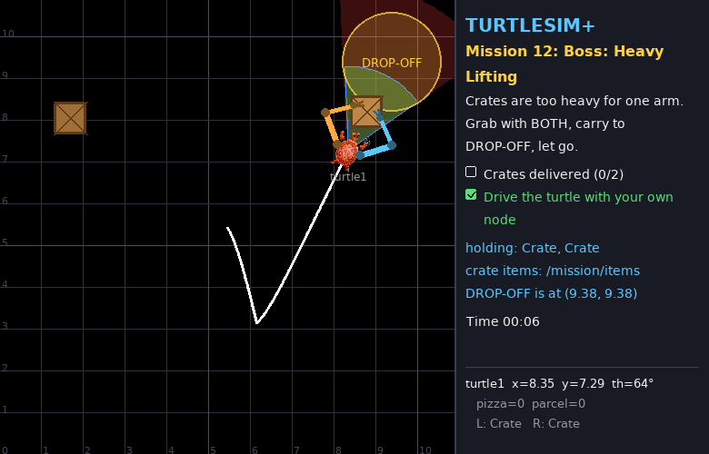
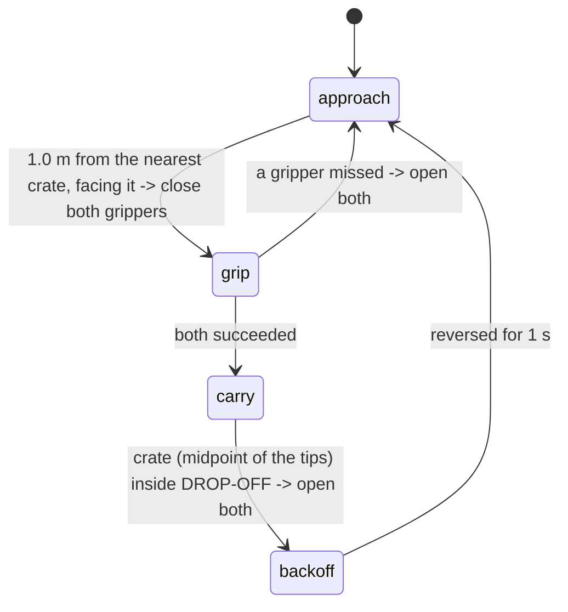

# Mission 12 (Boss): Heavy Lifting 🏗️

> **Briefing:** Two heavy **crates** must go to DROP-OFF. They're too heavy for one arm —
> the turtle has to drive up, grip a crate with **both** grippers at once, drive it to the zone and set it down.
> Driving *and* manipulating together is called **mobile manipulation**, and it's the final exam 💪



**🎯 Objectives**
- [ ] Deliver 2 crates (set down inside DROP-OFF)
- [ ] Drive the turtle with your own node (no teleporting!)

**⭐ Stars:** ≤ 25 s = ⭐⭐⭐ · ≤ 60 s = ⭐⭐ — the clock starts when the turtle or an arm starts moving

```bash
# Terminal 1
ros2 launch turtle_quest mission.launch.py mission:=12
```

---

## 📦 Crate rules

| Rule | Detail |
|---|---|
| size | 0.8 × 0.8 m |
| gripping | a gripper "touches" the crate when its tip is within **0.65 m** of the crate's centre; closing it then succeeds |
| too heavy | held by **one** gripper the crate doesn't move (the service tells you: *too heavy for one arm*) |
| lifted | held by **both** grippers of the same turtle, the crate sits exactly halfway between the two tips and moves with them |
| slipping | if the two tips get more than **1.5 m** apart, the crate slips and both grippers open |
| delivered | crate centre inside DROP-OFF (centre (9.38, 9.38), radius 1.2) **and** no gripper holding it |

## 🗺️ What you have to work with

| Name | Kind | Type | Used for |
|---|---|---|---|
| `/mission/items` | topic (in) | `geometry_msgs/msg/PoseArray` | world positions of the crates not delivered yet |
| `/turtle1/pose` | topic (in) | `turtlesim/msg/Pose` | the turtle |
| `/turtle1/left_arm/tip`, `/turtle1/right_arm/tip` | topic (in) | `geometry_msgs/msg/Point` | where the grippers are → the midpoint is where a lifted crate is |
| `/turtle1/cmd_vel` | topic (out) | `geometry_msgs/msg/Twist` | drive |
| `/turtle1/joint_command` | topic (out) | `sensor_msgs/msg/JointState` | arm posture |
| `/turtle1/left_gripper`, `/turtle1/right_gripper` | service | `std_srvs/srv/SetBool` | grip / let go |

## 🧠 The plan

One trick makes this much simpler: **keep the arms in one fixed "forklift" posture the whole time** —
both grippers 1.0 m in front of the turtle, 0.35 m left and right of the middle (use your IK from mission 10!).
Then "put the grippers around the crate" just means "**park the turtle 1.0 m from the crate, facing it**" — a driving problem you already know.



## Step 1: The skeleton

Create `src/my_turtle/my_turtle/crate_mover.py` and fill in the TODOs:

```python
# my_turtle/my_turtle/crate_mover.py  (skeleton: fill in the TODOs)
import math

import rclpy
from rclpy.node import Node
from geometry_msgs.msg import Point, PoseArray, Twist
from sensor_msgs.msg import JointState
from std_srvs.srv import SetBool
from turtlesim.msg import Pose

from my_turtle.arm_reach import inverse_kinematics

DROPOFF = (9.38, 9.38)
REACH = 1.0        # crate centre this far in front of the turtle when gripping
GRIP_Y = 0.35      # grippers this far left/right of the crate centre


class CrateMover(Node):
    def __init__(self):
        super().__init__('crate_mover')
        self.pose = None
        self.crates = []   # from /mission/items
        self.tips = {}     # 'left'/'right' -> (x, y)
        # TODO 1: subscribe to /turtle1/pose, /mission/items and both /turtle1/<side>_arm/tip topics
        # TODO 2: publishers self.cmd_pub (/turtle1/cmd_vel) and self.joint_pub (/turtle1/joint_command)
        # TODO 3: SetBool clients for both grippers
        self.futures = []  # pending gripper requests
        self.state = 'approach'
        self.backoff_until = 0.0
        self.create_timer(0.05, self.loop)

    def now(self) -> float:
        return self.get_clock().now().nanoseconds / 1e9

    def hold_arms_out(self):
        # TODO 4: publish the forklift posture: IK for (REACH, +GRIP_Y) left and (REACH, -GRIP_Y) right
        pass

    def grippers_set(self, close: bool):
        # TODO 5: call both gripper services, keep both futures in self.futures
        pass

    def loop(self):
        if self.pose is None:
            return
        cmd = Twist()
        if self.state == 'approach':
            self.hold_arms_out()
            # TODO 6: drive to REACH metres from the nearest crate, facing it;
            #         when close enough and well aligned: stop, grippers_set(True), state = 'grip'
        elif self.state == 'grip':
            pass  # TODO 7: once both futures are done: both succeeded -> 'carry', else open both -> 'approach'
        elif self.state == 'carry':
            pass  # TODO 8: crate = midpoint of the tips; in DROP-OFF -> open both, 'backoff'; else drive to DROP-OFF
        elif self.state == 'backoff':
            pass  # TODO 9: reverse until backoff_until, then 'approach'
        self.cmd_pub.publish(cmd)


def main():
    rclpy.init()
    node = CrateMover()
    try:
        rclpy.spin(node)
    except KeyboardInterrupt:
        pass
    finally:
        node.destroy_node()
        rclpy.try_shutdown()


if __name__ == '__main__':
    main()
```

Add `'crate_mover = my_turtle.crate_mover:main',` to `setup.py` → build → source → `ros2 run my_turtle crate_mover`

> 💡 **Build it in stages:** TODOs 1-4 first and check the arms take the forklift posture → then 6 and watch the turtle park in front of a crate → then 5 + 7 → then 8 + 9.

## 💡 Hints (open only when stuck)

<details>
<summary>TODO 4: the forklift posture</summary>

```python
cmd = JointState()
cmd.name = ['left_shoulder', 'left_elbow', 'right_shoulder', 'right_elbow']
cmd.position = [*inverse_kinematics(REACH, GRIP_Y, 'left'), *inverse_kinematics(REACH, -GRIP_Y, 'right')]
self.joint_pub.publish(cmd)
```

</details>

<details>
<summary>TODO 6: parking in front of the crate</summary>

Mission 5's controller, but aim for a distance of `REACH` instead of 0, and allow reversing a little if too close:

```python
x, y = min(self.crates, key=lambda c: math.hypot(c[0] - self.pose.x, c[1] - self.pose.y))
distance = math.hypot(x - self.pose.x, y - self.pose.y)
error = <heading error to (x, y), wrapped>
cmd.angular.z = 4.0 * error
if abs(error) < 0.3:
    cmd.linear.x = max(-0.5, min(2.0, 1.5 * (distance - REACH)))
if abs(distance - REACH) < 0.06 and abs(error) < 0.05:
    ...  # stop and grip
```

</details>

<details>
<summary>TODOs 7-9: grip, carry, back off</summary>

- grip: `all(f.done() for f in self.futures)` then `all(f.result().success for f in self.futures)`
- carry: the crate is at the midpoint of `self.tips['left']` and `self.tips['right']`; drive towards `DROPOFF` (the crate travels 1 m ahead of the turtle, so it gets there first) and release when the crate is within ~0.4 m of the zone centre
- backoff: `cmd.linear.x = -1.0` until `self.now() >= self.backoff_until`

</details>

<details>
<summary>🔓 The whole file</summary>

`solutions/quest_solutions/quest_solutions/crate_mover.py` — or watch it: `ros2 run quest_solutions crate_mover`

</details>

🏆 **Final boss defeated! You finished Turtle Quest!**

```bash
ros2 run turtle_quest progress   # out of 39 stars, how many did you get?
```

---

## 🎓 What you learned in Part 2

| Skill | Missions |
|---|---|
| joint-space control with `sensor_msgs/JointState` | 9 |
| grippers as `std_srvs/SetBool` services | 9, 11, 12 |
| coordinate frames (world → robot → shoulder) | 10, 12 |
| forward and inverse kinematics of a 2-link arm | 9, 10 |
| manipulation state machines that wait for real events | 11 |
| reusing your own Python modules across nodes | 11, 12 |
| mobile manipulation: driving + two-arm coordination | 12 |

## 🚀 Where next?

- **tf2** — ROS 2's system for coordinate frames (what you did by hand with `to_turtle_frame`): [tf2 tutorials](https://docs.ros.org/en/humble/Tutorials/Intermediate/Tf2/Tf2-Main.html)
- **URDF + RViz** — describe a real robot's links and joints, and see `joint_states` come alive in 3-D
- **MoveIt 2** — IK, motion planning and collision avoidance for real arms
- **ros2_control** — how `joint_command`-style interfaces talk to real motors
- **Nav2** — the grown-up version of missions 5, 6 and 8 (it uses `cmd_vel` too!)
- **C++ nodes** — same concepts, other language: [Writing a simple publisher and subscriber (C++)](https://docs.ros.org/en/humble/Tutorials/Beginner-Client-Libraries/Writing-A-Simple-Cpp-Publisher-And-Subscriber.html)
- **Challenge your friends** — launch with the same `seed:=<number>` and race, or design a mission of your own (see [TEACHER.md](../TEACHER.md#writing-a-new-mission))

---

**← Previous** [Mission 11](11-pick-place.md) · **Home** [README](../README.md)
