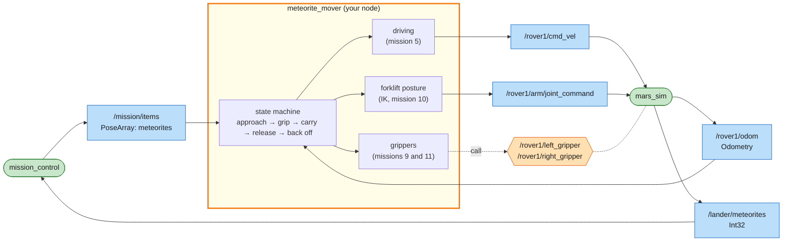
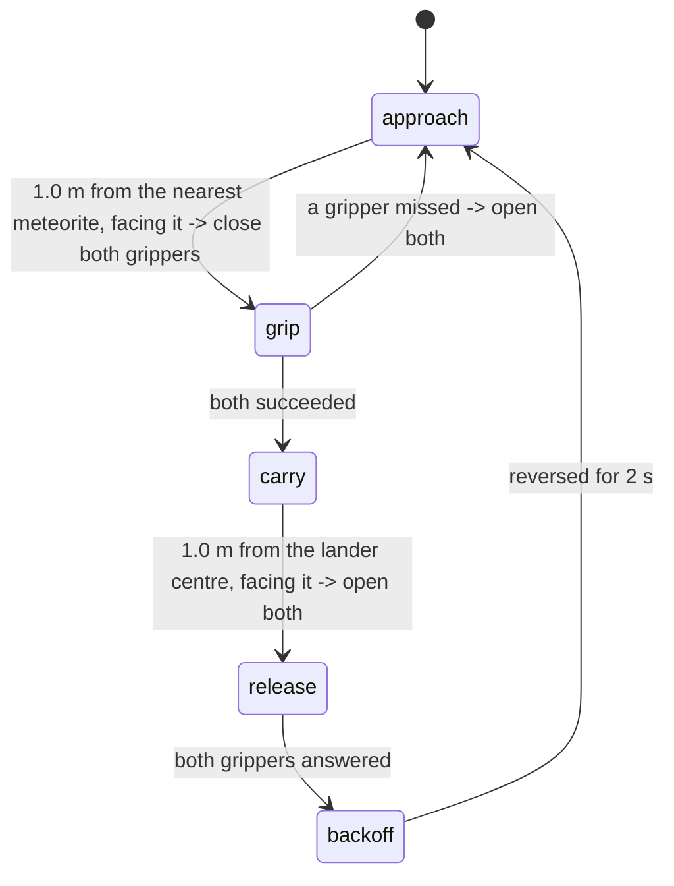

# Mission 12 (boss): Meteorite Recovery

Two meteorites have come down out on the plain, and the scientists want them on the lander. They're too heavy for one arm. The rover has to drive up, grip a meteorite with both grippers at once, carry it home and set it down, on a battery that's already low. Driving and manipulating at the same time is called **mobile manipulation**, and it's the final exam.


**Objectives**
- [ ] Meteorites set down on the lander (2 of them)
- [ ] Drive the rover with your own node

**Stars:** ≤ 2 min = ⭐⭐⭐ · ≤ 4 min = ⭐⭐ · the clock starts when the rover starts moving · if the battery runs out, the mission fails

```bash
# Terminal 1
ros2 launch mission_control mission.launch.py mission:=12
```

---

## Meteorite rules

| Rule | Detail |
|---|---|
| size | radius 0.35 m |
| gripping | a gripper can close on a meteorite when its tip is within 0.5 m of the meteorite's centre |
| too heavy | held by one gripper it doesn't move (the response says *It is heavy: grab it with the other arm too.*), and pulling away loses the grip |
| lifted | held by both grippers, it sits halfway between the two tips and moves with them |
| slipping | if the two grippers get more than 1.2 m apart, it slips and both grippers open |
| delivered | open the grippers with its centre on the lander (within 1.5 m of (3, 3)) |
| battery | starts at 60 % and drains 3× faster than usual; standing still on the lander charges it |
| rocks | there are rocks, but none on the straight lines between the lander and each meteorite |

## What you have to work with

| Name | Kind | Type | Used for |
|---|---|---|---|
| `/mission/items` | topic (in) | `geometry_msgs/msg/PoseArray` | the meteorites not on the lander yet, where they are now (map frame) |
| `/rover1/odom` | topic (in) | `nav_msgs/msg/Odometry` | the rover |
| `/rover1/battery` | topic (in) | `sensor_msgs/msg/BatteryState` | how much battery is left (`percentage`, 0–1) |
| `/rover1/cmd_vel` | topic (out) | `geometry_msgs/msg/Twist` | drive |
| `/rover1/arm/joint_command` | topic (out) | `sensor_msgs/msg/JointState` | arm posture |
| `/rover1/left_gripper`, `/rover1/right_gripper` | service | `std_srvs/srv/SetBool` | grip / let go |
| `/lander/meteorites` | topic (in) | `std_msgs/msg/Int32` | how many meteorites are on the lander |

### System map



> 🟩 existing node · 🟨 you · 🟦 topic · 🟧 service · 🟪 action · ⬜ parameter — [how to read the maps](../ARCHITECTURE.md#how-to-read-the-maps)

It's one node with two control loops (driving and arms) and a state machine on top, built almost entirely from parts you wrote in missions 5, 10 and 11.

## The plan

One trick makes this much simpler: keep the arms in one fixed "forklift" posture the whole time, with both grippers 1.0 m in front of the rover and 0.35 m left and right of the middle. In `rover1/base_link` that's the points (1.0, 0.35) and (1.0, −0.35). Your IK from mission 10 gives you the angles, once, at the start. Getting the grippers around a meteorite then just means parking the rover 1.0 m from it, facing it, and setting it down means parking 1.0 m from the lander's centre, facing it. You've solved that driving problem before.



The rover stops on the lander every time it sets a meteorite down, so it charges a little while the grippers open. Watch the battery in a second terminal while you test:

```bash
ros2 topic echo /rover1/battery --field percentage
```

## Step 1: The skeleton

Create `src/my_rover/my_rover/meteorite_mover.py` and fill in the TODOs:

```python
# my_rover/my_rover/meteorite_mover.py  (skeleton: fill in the TODOs)
import math

import rclpy
from rclpy.executors import ExternalShutdownException
from rclpy.node import Node
from geometry_msgs.msg import PoseArray, Twist
from nav_msgs.msg import Odometry
from sensor_msgs.msg import JointState
from std_srvs.srv import SetBool

from my_rover.arm_kinematics import inverse_kinematics

LANDER = (3.0, 3.0)
REACH = 1.0        # meteorite centre this far in front of the rover when gripping
GRIP_Y = 0.35      # grippers this far left/right of the meteorite centre
SHOULDER = {'left': (0.4, 0.25), 'right': (0.4, -0.25)}   # in rover1/base_link


def yaw_from_quaternion(q) -> float:
    return math.atan2(2.0 * (q.w * q.z + q.x * q.y), 1.0 - 2.0 * (q.y * q.y + q.z * q.z))


class MeteoriteMover(Node):
    def __init__(self):
        super().__init__('meteorite_mover')
        self.pose = None         # (x, y, yaw), from /rover1/odom
        self.meteorites = []     # (x, y) of each meteorite not on the lander yet, from /mission/items
        # TODO 1: subscribe to /rover1/odom and /mission/items (write the two callbacks too)
        # TODO 2: publishers self.cmd_pub (/rover1/cmd_vel) and self.arm_pub (/rover1/arm/joint_command)
        # TODO 3: SetBool clients for both grippers
        self.posture = None      # TODO 4: the forklift posture, see hold_arms_out()
        self.futures = []        # pending gripper requests
        self.state = 'approach'
        self.backoff_until = 0.0
        self.create_timer(0.05, self.control_loop)

    def now(self) -> float:
        return self.get_clock().now().nanoseconds / 1e9

    def hold_arms_out(self):
        # TODO 4: build self.posture once (a JointState with all four joints): IK for the point
        #         (REACH, +GRIP_Y) with the left arm and (REACH, -GRIP_Y) with the right arm.
        #         Those points are in rover1/base_link: subtract SHOULDER[side] first.
        #         Then publish it on every call.
        pass

    def all_grippers(self, close: bool):
        # TODO 5: call both gripper services, keep both futures in self.futures
        pass

    def park_facing(self, x: float, y: float, stop_at: float):
        """Drive towards (x, y) and stop stop_at metres before it, facing it. Returns (cmd, arrived)."""
        cmd = Twist()
        arrived = False
        # TODO 6: mission 5's controller, but aim for a distance of stop_at instead of 0
        return cmd, arrived

    def control_loop(self):
        if self.pose is None:
            return
        self.hold_arms_out()
        cmd = Twist()
        if self.state == 'approach':
            pass  # TODO 7: park_facing() the nearest meteorite, REACH metres before it;
                  #         arrived -> cmd = Twist(), all_grippers(True), state = 'grip'
        elif self.state == 'grip':
            pass  # TODO 8: once both futures are done: both succeeded -> 'carry', else open both -> 'approach'
        elif self.state == 'carry':
            pass  # TODO 9: park_facing() the lander centre, REACH metres before it;
                  #         arrived -> cmd = Twist(), all_grippers(False), state = 'release'
        elif self.state == 'release':
            pass  # TODO 10: once both futures are done: backoff_until = 2 s from now, state = 'back off'
        elif self.state == 'back off':
            pass  # TODO 11: reverse until backoff_until, then 'approach'
        self.cmd_pub.publish(cmd)


def main(args=None):
    rclpy.init(args=args)
    node = MeteoriteMover()
    try:
        rclpy.spin(node)
    except (KeyboardInterrupt, ExternalShutdownException):
        pass
    finally:
        node.destroy_node()
        rclpy.try_shutdown()


if __name__ == '__main__':
    main()
```

Add `'meteorite_mover = my_rover.meteorite_mover:main',` to `setup.py`, build, source, and run `ros2 run my_rover meteorite_mover`.

Build it in stages. Do TODOs 1–4 first and check that the arms take the forklift posture. Then add 6 and 7 and watch the rover park in front of a meteorite. Then 5 and 8, and finally 9 to 11.

## Hints (open only when stuck)

<details>
<summary>Hint for TODOs 1–3: subscriptions, publishers, clients</summary>

The callbacks only remember, as in mission 5:

```python
def odom_callback(self, msg):
    p = msg.pose.pose
    self.pose = (p.position.x, p.position.y, yaw_from_quaternion(p.orientation))

def items_callback(self, msg):
    self.meteorites = [(p.position.x, p.position.y) for p in msg.poses]
```

Two clients in a dictionary keep the rest of the code short:

```python
self.grippers = {side: self.create_client(SetBool, f'/rover1/{side}_gripper') for side in ('left', 'right')}
```

</details>

<details>
<summary>Hint for TODO 4: the forklift posture</summary>

The left gripper should be at (REACH, GRIP_Y) in `rover1/base_link`. Seen from the left shoulder at (0.4, 0.25), that's (REACH − 0.4, GRIP_Y − 0.25). The rover's arms are mounted on the rover, so this never changes, and you don't need tf2 for it.

```python
if self.posture is None:
    angles = []
    for side, y in (('left', GRIP_Y), ('right', -GRIP_Y)):
        sx, sy = SHOULDER[side]
        angles += inverse_kinematics(REACH - sx, y - sy, side)
    self.posture = JointState()
    self.posture.name = ['left_shoulder', 'left_elbow', 'right_shoulder', 'right_elbow']
    self.posture.position = angles
self.arm_pub.publish(self.posture)
```

</details>

<details>
<summary>Hint for TODOs 5 and 6: grippers and parking</summary>

```python
self.futures = [c.call_async(SetBool.Request(data=close)) for c in self.grippers.values()]
```

Parking is mission 5's controller, but it aims for a distance of `stop_at` instead of 0, and it may reverse a little if the rover gets too close:

```python
px, py, yaw = self.pose
error = <heading error to (x, y), wrapped to -pi..pi>
gap = math.hypot(x - px, y - py) - stop_at        # negative: too close
cmd.angular.z = 3.0 * error
if abs(error) < 0.3:
    cmd.linear.x = max(-0.3, min(1.2 * gap, 0.8))
arrived = abs(gap) < 0.04 and abs(error) < 0.05
```

The grippers are 0.35 m from the meteorite's centre when the rover parks exactly, so there's some room, but a sloppy park still misses.

</details>

<details>
<summary>Hint for TODOs 7–11: the states</summary>

- approach: the nearest meteorite is `min(self.meteorites, key=lambda m: math.hypot(m[0] - self.pose[0], m[1] - self.pose[1]))`. Do nothing if the list is empty.
- grip and release: `self.futures and all(f.done() for f in self.futures)`, then `all(f.result().success for f in self.futures)`
- carry: `self.park_facing(*LANDER, REACH)`. The meteorite travels 1.0 m ahead of the rover, so it ends up on the lander's centre.
- back off: `cmd.linear.x = -0.5` until `self.now() >= self.backoff_until`. Without it, the next approach starts with the grippers still around the meteorite you just delivered.

</details>

> Note: there's no full solution file to unlock here, on purpose. The hints above cover every TODO. If you're still stuck, ask your instructor to demo the reference solution, then write your own version.

That's the final boss and the end of Mars Rover Academy. Check your total:

```bash
ros2 run mission_control progress   # out of 39 stars, how many did you get?
```

---

## Design challenge: split it up

`meteorite_mover` does everything in one node. Real robot software would split it into a behaviour node (just the state machine) on top of reusable skill nodes. Pattern 4 in [ARCHITECTURE.md](../ARCHITECTURE.md#pattern-4-split-big-jobs-into-small-nodes) describes the design. Try it:

1. Write `arm_controller`. It subscribes to `/rover1/left_arm/target` and `/rover1/right_arm/target` (`geometry_msgs/msg/PointStamped`, in any frame), turns each point into its shoulder frame with tf2, and publishes the IK angles on `/rover1/arm/joint_command`. It's your mission 10 node with a different input.
2. Test it on its own:
   `ros2 topic pub --once /rover1/left_arm/target geometry_msgs/msg/PointStamped "{header: {frame_id: rover1/base_link}, point: {x: 1.0, y: 0.35}}"`
3. Do the same for `base_controller`: a goal point in, `/rover1/cmd_vel` out. A topic is fine for a first version. Pattern 4 makes it an action, `/rover1/go_to`, so the caller gets feedback and can cancel; writing an action server is the next step after this course.
4. Shrink `meteorite_mover` to `recovery_brain`, a pure state machine that sends goals and targets and calls the grippers, and start all three nodes with one launch file.

Afterwards, was it easier or harder to change things? That trade-off is what software architecture is about.

---

## What you learned in Part 2

| Skill | Missions |
|---|---|
| joint-space control with `sensor_msgs/JointState` | 9 |
| grippers as `std_srvs/SetBool` services | 9, 11, 12 |
| coordinate frames and tf2 (`tf2_echo`, `Buffer`, `transform()`) | 9, 10, 11 |
| forward and inverse kinematics of a 2-link arm | 9, 10 |
| action clients: goal, feedback, cancel, result | 11 |
| manipulation state machines that wait for real events | 11, 12 |
| reusing your own Python modules across nodes | 11, 12 |
| mobile manipulation: driving + two-arm coordination, on a battery budget | 12 |

## Where next?

- [CONCEPTS.md, "Not covered yet"](../CONCEPTS.md#not-covered-yet): your own message and action types, action servers (the `go_to` above), recording a mission with `ros2 bag`, and more, each with a short tested example.
- Odometry drift: `/rover1/odom` in the simulator is perfect, but real wheel odometry drifts. That's why real robots add an `odom` frame and a localisation node that publishes `map → odom`.
- URDF and `robot_state_publisher`: describe a robot's links and joints once, and `joint_states` moves a 3-D model in RViz.
- MoveIt 2: IK, motion planning and collision avoidance for real arms.
- ros2_control: how `joint_command`-style interfaces talk to real motors.
- Nav2: the full-size version of missions 5, 6 and 8. It uses `cmd_vel`, `odom`, `scan` and tf2 too.
- C++ nodes: the same concepts in another language. Start with [Writing a simple publisher and subscriber (C++)](https://docs.ros.org/en/jazzy/Tutorials/Beginner-Client-Libraries/Writing-A-Simple-Cpp-Publisher-And-Subscriber.html).
- Racing your friends: launch with the same `seed:=<number>` and compare times, or design a mission of your own (see [TEACHER.md](../TEACHER.md#writing-a-new-mission)).

---

**Previous:** [Mission 11](11-drill-and-stow.md) · **Home:** [README](../README.md)
