<!-- _class: cover -->
<!-- _paginate: false -->
<!-- _footer: "" -->

# ROS2 from<br>Zero to Hero

<p class="name">Dr. Kitti Thamrongaphichartkul</p>
<p class="role">Research Fellow</p>
<p class="role">Nanyang Technological University</p>
<p class="date">8 Oct 2026</p>

<div class="qr">


github.com/kittinook/ros2_tutorial

</div>

<!--
Scan the QR code for the course repo: missions, slides and the simulator.
-->

---

<!-- _class: lead -->
<!-- _paginate: false -->
<!-- header: Mars Rover Academy -->

# Learn ROS 2 with a Mars rover

The whole course in one deck. For every mission: what you'll learn, the picture of what you'll build, how to run it, and a checklist.

**13 missions** · ROS 2 Jazzy or newer · github.com/kittinook/ros2_tutorial

<!--
How to use this deck: one mission at a time. Show the overview and the picture, run it live with the class following along, then go through the checklist together. The details of every step are in missions/NN-*.md; learners tick their progress in CHECKLIST.md.
-->

---

<!-- header: Course overview -->

# What you'll learn

<style scoped>table { font-size: 17px; } th, td { padding: 3px 14px; } h1 { margin-bottom: 10px; }</style>

| # | Mission | You learn |
|---|---|---|
| 0 | Landing | workspace, build, launch, teleop, remapping |
| 1 | Telemetry | nodes, topics, messages |
| 2 | Manual Drive | publishing `Twist`, speeds and angles |
| 3 | Mission Control | services: request and response |
| 4 | Survey Square | a package and a Python publisher |
| 5 | Waypoints | subscribers, `Odometry`, closed-loop control |
| 6 | Sample Hunter | camera and laser, service clients in code |
| 7 | Rover Fleet | namespaces, parameters, launch files |
| 8 | Boss: Power Crisis | all of the above, state machines, battery |
| 9 | Arm Check | joints, `JointState`, `SetBool` grippers, tf2 |
| 10 | Frames | tf2 in code, inverse kinematics |
| 11 | Drill & Stow | actions: goal, feedback, cancel; pick and place |
| 12 | Boss: Meteorite Recovery | mobile manipulation, two arms |

<!--
Part 1 (0 to 8) is the rover, Part 2 (9 to 12) gives it two arms and a drill. Missions 0 to 3 and 9 only use terminal commands; the rest are Python nodes. Suggested pace: see the schedule in TEACHER.md.
-->

---

<!-- header: Course overview -->

# ROS 2 official / Tutorial docs
- About ROS 2: [docs.ros.org/en/lyrical/About-ROS.html](https://docs.ros.org/en/lyrical/About-ROS.html)
- Install ROS 2: [docs.ros.org/en/lyrical/Get-Started/Installation.html](https://docs.ros.org/en/lyrical/Get-Started/Installation.html)
- Tutorial: [docs.ros.org/en/lyrical/ROS-Framework.html](https://docs.ros.org/en/lyrical/ROS-Framework.html)
- https://github.com/kittinook/ros2_tutorial/blob/main/ARCHITECTURE.md
- Concept: https://github.com/kittinook/ros2_tutorial/blob/main/CONCEPTS.md

# Example
- Tele-operation System: https://github.com/synergylab-ntu/tele_ros2
- Haption: https://github.com/synergylab-ntu/haption_ros2
- Kinova Controller: https://github.com/synergylab-ntu/kinova_controller_pkgs
- Phasespace: https://github.com/synergylab-ntu/phasespace_ros2

<!--
These are the docs for ROS 2 Lyrical; the course itself runs on Jazzy or newer, and the concepts are the same.
-->

---

<!-- header: Course overview -->

# Set up once

```bash
source /opt/ros/jazzy/setup.bash             # or your distro: humble, kilted, rolling ...
sudo apt install python3-pygame python3-numpy ros-$ROS_DISTRO-teleop-twist-keyboard
git clone <url of this repo> ~/mars_rover
cd ~/mars_rover
colcon build --symlink-install
source install/setup.bash

echo "source /opt/ros/jazzy/setup.bash" >> ~/.bashrc           # so every new
echo "source ~/mars_rover/install/setup.bash" >> ~/.bashrc     # terminal is ready
echo "export ROS_DOMAIN_ID=<your number>" >> ~/.bashrc         # in a classroom
```

> Every new terminal needs `source`. Forgetting it is the most common cause of "Package not found".

<!--
Do this before the first session if you can. ROS_DOMAIN_ID: give everyone in the room a different number (0 to 101), otherwise people see and drive each other's rovers. If colcon build says "option --editable not recognized": pip3 install --user "setuptools<80".
-->

---

<!-- header: Course overview -->

# How every mission works

```bash
# terminal 1: start the mission (the simulator window + mission control)
ros2 launch mission_control mission.launch.py mission:=<number>

# terminal 2, 3, ...: do the work
```

- The **panel** on the right lists the objectives and ticks them by itself
- Finish them all and you get up to **3 stars** for speed. Coding missions start the clock when the rover first moves
- Coding missions check that **your own node** drives: teleop or `ros2 topic pub` costs stars
- Some missions can **fail** (battery flat, drill broken). Close the window and launch again. `ros2 run mission_control progress` shows your best stars

<!--
mission_control only uses ROS interfaces to check things (topics and the ROS graph), just like the learners do. TEACHER.md has the full list.
-->

---

<!-- _class: lead -->
<!-- header: Part 1 -->

# Part 1: the rover

Missions 0 to 8: the four ways ROS 2 programs talk, then your own nodes.

---

<!-- header: Mission 0 · Overview -->

# Mission 0: Landing

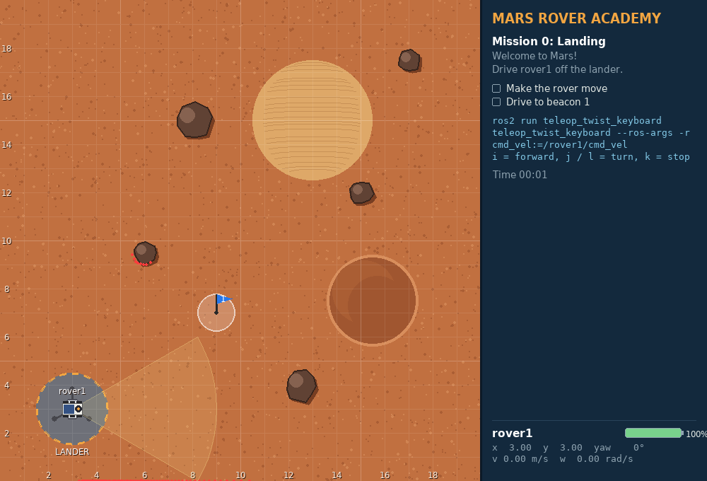

**You'll learn:** what a workspace and a package are, `colcon build`, `source`, `ros2 launch`, `ros2 run`, remapping a topic

**Goal:** drive rover1 off the lander to beacon 1

**Stars:** ≤ 60 s ⭐⭐⭐ · ≤ 2.5 min ⭐⭐

<p class="progress">▶0 1 2 3 4 5 6 7 8 9 10 11 12</p>

<!--
30 to 60 min, mostly installation. Point out the window: grid in metres, (0, 0) bottom-left, the lander at (3, 3), rover1 on it facing east, the panel.
-->

---

<!-- _class: map -->
<!-- header: Mission 0 · The picture -->

# Three nodes, no wires between them

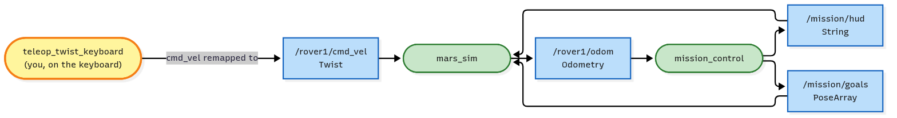

- Teleop turns your key presses into `Twist` messages; `-r cmd_vel:=/rover1/cmd_vel` points them at rover1
- The simulator moves the rover and publishes where it is on `/rover1/odom`
- Mission control reads the odometry, and sends the objectives (`/mission/hud`) and the beacon (`/mission/goals`) back

<p class="legend"><span class="k ros"></span>existing node <span class="k mine"></span>you <span class="k topic"></span>topic <span class="k srv"></span>service <span class="k act"></span>action <span class="k param"></span>parameter</p>

<!--
Green = a node that already exists, yellow = you, blue = a topic. Same colours in every mission. Nobody calls anybody: they only post on and read from topics.
-->

---

<!-- header: Mission 0 · Run it -->

# Run it

```bash
# terminal 1
cd ~/mars_rover
colcon build --symlink-install
source install/setup.bash
ros2 launch mission_control mission.launch.py mission:=0
```

```bash
# terminal 2
source ~/mars_rover/install/setup.bash
ros2 run teleop_twist_keyboard teleop_twist_keyboard --ros-args -r cmd_vel:=/rover1/cmd_vel
```

Click into terminal 2: `i` forward, `j` / `l` turn, `k` stop. Drive to beacon 1.

<!--
Classic mistake: pressing keys in the simulator window. Teleop reads the keyboard from its own terminal.
Without the -r part teleop publishes on /cmd_vel, where nobody listens, and the rover doesn't move.
-->

---

<!-- _class: checklist -->
<!-- header: Mission 0 · Checklist -->

# Can you...

- build the workspace with `colcon build`?
- explain why every new terminal needs `source`?
- launch a mission and say what each part of the window shows?
- drive the rover with teleop and explain what `-r cmd_vel:=/rover1/cmd_vel` does?
- name the three nodes that were running?

---

<!-- header: Mission 1 · Overview -->

# Mission 1: Telemetry


**You'll learn:** nodes, topics and messages, and the `ros2 node` / `ros2 topic` / `ros2 interface` tools

**Goal:** send something on the radio, confirm the code Earth sends you, and radio how often `/rover1/odom` is published

**Stars:** ≤ 3 min ⭐⭐⭐ · ≤ 7 min ⭐⭐

<p class="progress">✓0 ▶1 2 3 4 5 6 7 8 9 10 11 12</p>

<!--
30 to 45 min. A topic is like a group chat: a named room, everyone posts in the same format, posters don't know who reads.
-->

---

<!-- _class: map -->
<!-- header: Mission 1 · The picture -->

# You listen in, then you talk


- `ros2 topic echo` and `ros2 topic hz` are listeners, just like mission control
- `ros2 topic pub` is a publisher: anything you post on `/rover1/radio` shows up above the rover
- The message from Earth is just another topic someone is publishing

<p class="legend"><span class="k ros"></span>existing node <span class="k mine"></span>you <span class="k topic"></span>topic <span class="k srv"></span>service <span class="k act"></span>action <span class="k param"></span>parameter</p>

<!--
Point out that the terminal tools are nodes too: they appear in ros2 node list while they run.
-->

---

<!-- header: Mission 1 · Run it -->

# Run it

```bash
ros2 launch mission_control mission.launch.py mission:=1     # terminal 1
```

```bash
ros2 node list                                     # terminal 2: who is running?
ros2 topic list                                    # which topics exist?
ros2 topic echo --once /rover1/odom                # read one message
ros2 topic info /rover1/radio                      # its type
ros2 interface show std_msgs/msg/String            # the fields of that type
ros2 topic pub --once /rover1/radio std_msgs/msg/String "{data: 'Hello, Earth!'}"
ros2 topic hz /rover1/odom                         # how often? (Ctrl+C)
```

**Your turn:** find the topic with the message from Earth and confirm its code.

<!--
Hint if needed: ros2 topic list, then look for earth. Solution: ros2 topic echo --once /earth/uplink, then pub the code on /rover1/radio. Text that is only digits needs quotes: "{data: '50'}".
-->

---

<!-- _class: checklist -->
<!-- header: Mission 1 · Checklist -->

# Can you...

- list the nodes and topics in a running system?
- listen to a topic with `ros2 topic echo`?
- find a topic's message type and the fields of that type?
- send a message yourself with `ros2 topic pub`?
- measure how often a topic is published?
- explain why a publisher doesn't need to know who is listening?

---

<!-- header: Mission 2 · Overview -->

# Mission 2: Manual Drive

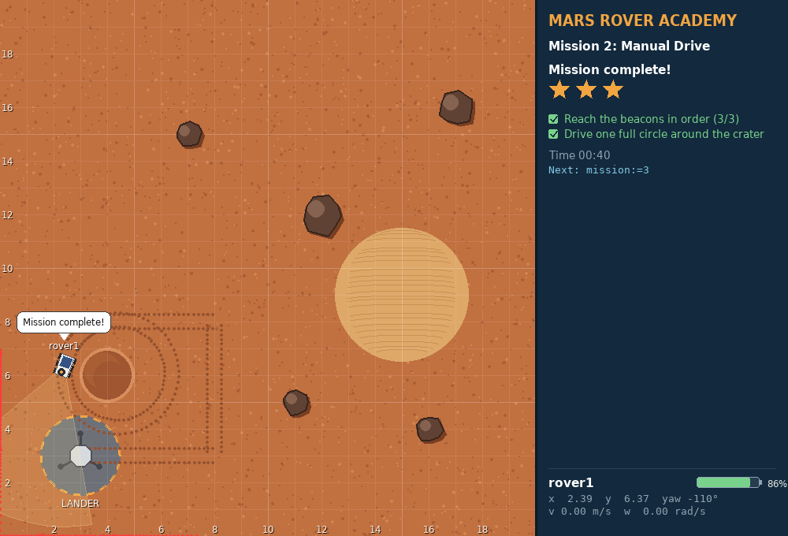

**You'll learn:** `geometry_msgs/msg/Twist`: `linear.x` is forward speed (m/s), `angular.z` is turn rate (rad/s). Radians. The 1-second rule, top speeds.

**Goal:** reach beacons 1, 2, 3 in order and drive one full circle around the crater, by publishing commands yourself (no teleop)

**Stars:** ≤ 4 min ⭐⭐⭐ · ≤ 8 min ⭐⭐

<p class="progress">✓0 ✓1 ▶2 3 4 5 6 7 8 9 10 11 12</p>

<!--
30 to 45 min. Have learners work out the commands on paper first. Each command lasts 1 second, the top speed is 1.0 m/s and 2.0 rad/s: to move 5 m send x: 1.0 five times, to turn 90° send z: 1.5708 once.
-->

---

<!-- _class: map -->
<!-- header: Mission 2 · The picture -->

# You become the steering wheel

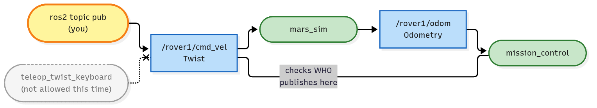

- This time **you** publish on `/rover1/cmd_vel`, with `ros2 topic pub`
- Teleop is not allowed: mission control checks *who* publishes on that topic

<p class="legend"><span class="k ros"></span>existing node <span class="k mine"></span>you <span class="k topic"></span>topic <span class="k srv"></span>service <span class="k act"></span>action <span class="k param"></span>parameter</p>

<!--
The simulator does not care where a Twist comes from. Mission control does, because it looks at the publishers of the topic.
-->

---

<!-- header: Mission 2 · Run it -->

# Run it

```bash
ros2 launch mission_control mission.launch.py mission:=2     # terminal 1
```

```bash
T="/rover1/cmd_vel geometry_msgs/msg/Twist"
ros2 topic pub --rate 1 --times 5 $T "{linear: {x: 1.0}}"    # 5 m east to beacon 1
ros2 topic pub --once $T "{angular: {z: 1.5708}}"            # turn left 90° (now facing north)
ros2 topic pub --rate 1 --times 5 $T "{linear: {x: 1.0}}"    # to beacon 2
ros2 topic pub --once $T "{angular: {z: 1.5708}}"            # now facing west
ros2 topic pub --rate 1 --times 4 $T "{linear: {x: 1.0}}"    # to beacon 3
ros2 topic pub --rate 1 $T "{linear: {x: 1.0}, angular: {z: 0.5}}"   # circle, then Ctrl+C
```

Options go right after `pub`. Wait for the rover to stop between commands.

<!--
Let the class work out the numbers before showing this. Sending x: 3.0 once only moves 1 m: the rover is capped at 1.0 m/s. Circle radius = linear.x / angular.z = 2 m, around the crater at (4, 6); it takes about 12.6 s.
-->

---

<!-- _class: checklist -->
<!-- header: Mission 2 · Checklist -->

# Can you...

- say what `linear.x` and `angular.z` in a `Twist` mean, with their units?
- convert an angle in degrees to radians?
- work out how far a command moves the rover, using the 1-second rule and the top speed?
- use `--once`, `--rate` and `--times`, and put them in the right place?
- drive a circle and predict its radius?
- explain how mission control can tell teleop from your commands?

---

<!-- header: Mission 3 · Overview -->

# Mission 3: Mission Control


**You'll learn:** services: one request, one response. `ros2 service list / type / call`, reading a `.srv` definition, `std_srvs/Trigger` (success + message)

**Goal:** spawn a second rover named `scout`, and photograph Olympus Rock (16, 15), Twin Peaks (15, 5) and Face Rock (5, 16)

**Stars:** ≤ 5 min ⭐⭐⭐ · ≤ 10 min ⭐⭐

<p class="progress">✓0 ✓1 ✓2 ▶3 4 5 6 7 8 9 10 11 12</p>

<!--
30 to 45 min. Topic = a stream, nobody replies. Service = a question with one answer, for one-off jobs where you want to know the outcome. After this mission, a good moment for the first half of ARCHITECTURE.md.
-->

---

<!-- _class: map -->
<!-- header: Mission 3 · The picture -->

# Ask and get an answer

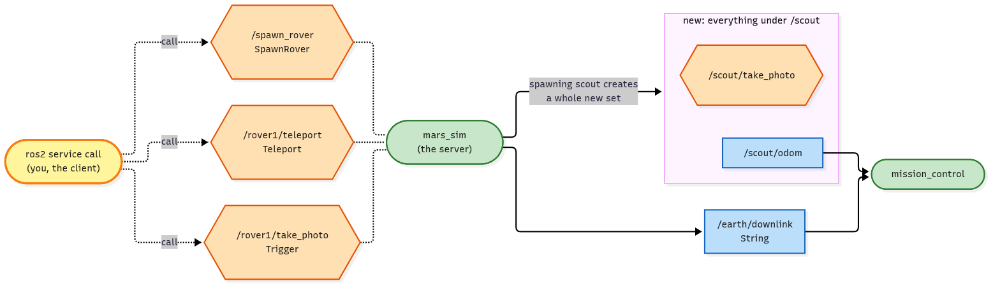

- A service has a **client** (you) and a **server** (the simulator)
- Every call is one request and one response: `success` says whether it worked, `message` says why
- Spawning `scout` creates a whole new set of topics and services under `/scout`

<p class="legend"><span class="k ros"></span>existing node <span class="k mine"></span>you <span class="k topic"></span>topic <span class="k srv"></span>service <span class="k act"></span>action <span class="k param"></span>parameter</p>

<!--
Orange hexagons are services, dotted lines are calls. Compare with the blue topics: a stream that nobody answers.
-->

---

<!-- header: Mission 3 · Run it -->

# Run it

<style scoped>pre { font-size: 16px; }</style>

```bash
ros2 launch mission_control mission.launch.py mission:=3     # terminal 1
```

```bash
ros2 service list
ros2 interface show mars_interfaces/srv/SpawnRover      # above --- the request, below the response
ros2 service call /spawn_rover mars_interfaces/srv/SpawnRover "{name: scout, x: 4.0, y: 6.0, yaw: 0.0}"

ros2 service call /rover1/teleport mars_interfaces/srv/Teleport "{x: 14.0, y: 15.0, yaw: 0.0}"
ros2 service call /rover1/take_photo std_srvs/srv/Trigger
# the same for Twin Peaks (13, 5) and Face Rock (3, 16): 2 m west of it, facing east
```

Read each response: a failed photo tells you what is wrong.

<!--
Ask: what happens if you spawn scout twice? (You get scout_2, and the response tells you.) Show ros2 topic list | grep scout. Teleport is a simulator tool, like Gazebo's set_entity_state; real rovers have to drive.
-->

---

<!-- _class: checklist -->
<!-- header: Mission 3 · Checklist -->

# Can you...

- list the services and find the type a service uses?
- read a service definition and say which part is the request and which the response?
- call a service from the terminal and read `success` and `message` in a `Trigger` response?
- explain why spawning a rover creates a whole new set of topics and services?
- say when to use a topic and when to use a service?

---

<!-- header: Mission 4 · Overview -->

# Mission 4: Survey Square

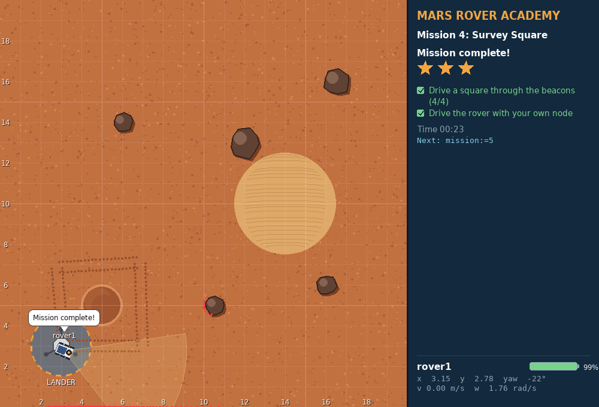

**You'll learn:** creating a Python package, a node with a **publisher** and a **timer**, registering it in `setup.py`

**Goal:** drive a 4 m square through 4 beacons with your own node

**Stars:** ≤ 30 s ⭐⭐⭐ · ≤ 45 s ⭐⭐ · the clock starts when the rover moves

<p class="progress">✓0 ✓1 ✓2 ✓3 ▶4 5 6 7 8 9 10 11 12</p>

<!--
60 min. The place people get stuck most: setup.py, and forgetting to build and source after changing it.
-->

---

<!-- _class: map -->
<!-- header: Mission 4 · The picture -->

# Your first node in the graph

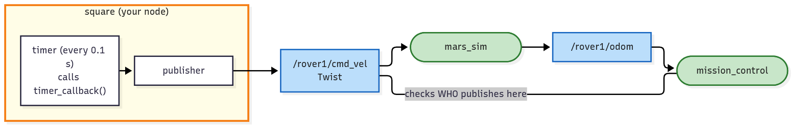

- Inside `square`: a **timer** fires every 0.1 s and the callback **publishes** a `Twist`
- From the outside it looks exactly like teleop: one more publisher on `/rover1/cmd_vel`
- It never reads `/rover1/odom`, so it can't notice when it goes wrong (open loop)

<p class="legend"><span class="k ros"></span>existing node <span class="k mine"></span>you <span class="k topic"></span>topic <span class="k srv"></span>service <span class="k act"></span>action <span class="k param"></span>parameter</p>

<!--
Ask: which arrow is missing for this node to correct itself? (One coming back from /rover1/odom.) That arrow is mission 5.
-->

---

<!-- header: Mission 4 · Run it -->

# Run it

<style scoped>pre { font-size: 17px; }</style>

```bash
cd ~/mars_rover/src
ros2 pkg create --build-type ament_python my_rover --license Apache-2.0 \
  --dependencies rclpy geometry_msgs nav_msgs sensor_msgs std_msgs std_srvs mars_interfaces
```

Write `src/my_rover/my_rover/square.py`, then register it in `setup.py`:

```python
'square = my_rover.square:main',
```

```bash
cd ~/mars_rover
colcon build --symlink-install --packages-select my_rover
source install/setup.bash
ros2 launch mission_control mission.launch.py mission:=4     # terminal 1
ros2 run my_rover square                                     # terminal 2
```

<!--
With --symlink-install, editing a .py needs no rebuild. Changing setup.py does: build and source again. The full square.py (first version and the square) is in missions/04-survey-square.md.
-->

---

<!-- header: Mission 4 · Key code -->

# A publisher and a timer

```python
class Square(Node):
    def __init__(self):
        super().__init__('square')  # node name (shows up in ros2 node list)
        # publisher: sends Twist to /rover1/cmd_vel (10 = message queue size)
        self.publisher = self.create_publisher(Twist, '/rover1/cmd_vel', 10)
        # timer: call timer_callback every 0.1 s
        self.timer = self.create_timer(0.1, self.timer_callback)

    def timer_callback(self):
        msg = Twist()
        msg.linear.x = 1.0   # 1 m/s forward
        msg.angular.z = 0.5  # 0.5 rad/s to the left
        self.publisher.publish(msg)
```

`main()` is always: `rclpy.init()`, create the node, `rclpy.spin(node)`, shut down.

<!--
This is the first version (drives in circles). The square version keeps a plan of (speed, turn, duration) steps with short waits for the rover to stop. It's open loop: it ends about 0.3 m off its start. That's the hook for mission 5.
-->

---

<!-- _class: checklist -->
<!-- header: Mission 4 · Checklist -->

# Can you...

- create a Python package with `ros2 pkg create`?
- write a node with a publisher and a timer?
- register a program in `setup.py` and start it with `ros2 run`?
- say when you have to build and source again, and when you don't?
- explain the difference between a package, an executable and a node?
- explain why this node is "open loop", and why it ends a little off its start?

---

<!-- header: Mission 5 · Overview -->

# Mission 5: Waypoints

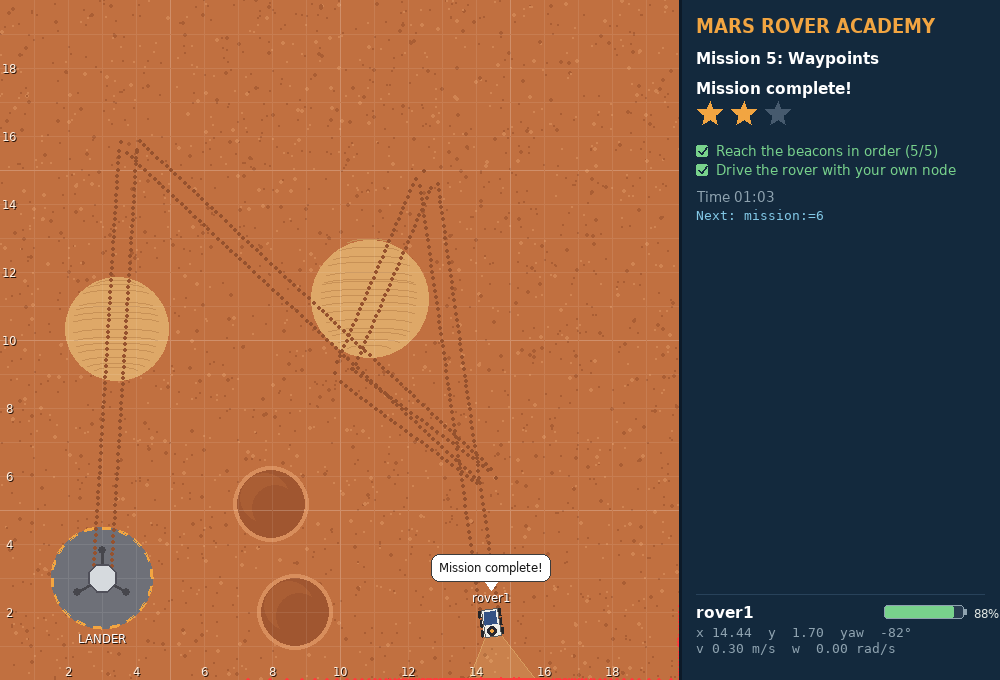

**You'll learn:** **subscribers** and callbacks, `nav_msgs/Odometry` and quaternions, closed-loop control, `atan2`, a P controller

**Goal:** reach 5 beacons at random positions, in order, with your own node; sand makes the rover slip

**Stars:** ⭐⭐⭐ ≤ 1.3 s per metre of route + 8 s

<p class="progress">✓0 ✓1 ✓2 ✓3 ✓4 ▶5 6 7 8 9 10 11 12</p>

<!--
45 to 60 min. Draw the triangle on the board: dx, dy, distance = hypot, angle to face = atan2(dy, dx), error = angle to face minus yaw. And the quaternion → yaw formula: one line, and why ROS stores 3-D rotations as quaternions.
-->

---

<!-- _class: map -->
<!-- header: Mission 5 · The picture -->

# Close the loop

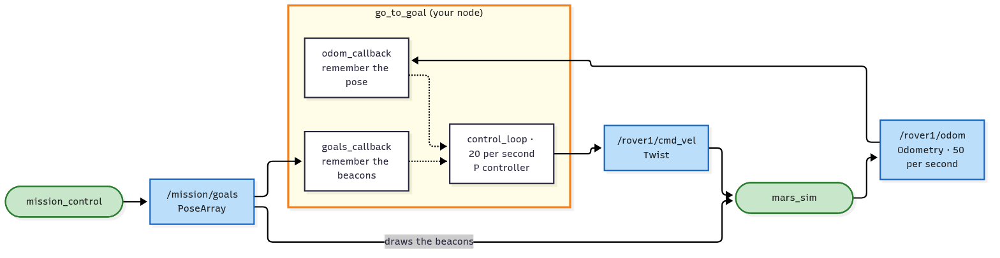

- Two **subscribers**: the odometry and the beacons. Their callbacks only remember the latest message
- A timer runs `control_loop` 20 times a second: compare where you are with where you want to be
- The arrow from the odometry back into your node is what makes it closed loop

<p class="legend"><span class="k ros"></span>existing node <span class="k mine"></span>you <span class="k topic"></span>topic <span class="k srv"></span>service <span class="k act"></span>action <span class="k param"></span>parameter</p>

<!--
Callbacks remember, the timer decides. This shape (subscribe, store, decide in a timer, publish) is the one most nodes in this course follow.
-->

---

<!-- header: Mission 5 · Run it -->

# Run it

```bash
ros2 topic echo --once /mission/goals          # where are the beacons?
ros2 topic echo --once /rover1/odom            # where am I? (orientation is a quaternion)
```

Write `src/my_rover/my_rover/go_to_goal.py`, add to `setup.py`:

```python
'go_to_goal = my_rover.go_to_goal:main',
```

```bash
cd ~/mars_rover
colcon build --symlink-install --packages-select my_rover
source install/setup.bash
ros2 launch mission_control mission.launch.py mission:=5     # terminal 1
ros2 run my_rover go_to_goal                                 # terminal 2
```

<!--
Watch the sand patches: the rover slows to 60 % there, which would ruin a pre-planned route but doesn't matter to a closed loop. The guide's version gets 2 stars; tuning MAX_SPEED and the gains gets 3.
-->

---

<!-- header: Mission 5 · Key code -->

# Callbacks remember, the timer decides

<style scoped>pre { font-size: 15px; line-height: 1.35; } h1 { margin-bottom: 12px; }</style>

```python
def yaw_from_quaternion(q) -> float:
    """The rover only turns about z, so this is all of the quaternion we need."""
    return math.atan2(2.0 * (q.w * q.z + q.x * q.y), 1.0 - 2.0 * (q.y * q.y + q.z * q.z))

    def control_loop(self):
        cmd = Twist()  # start from zero velocity
        if self.pose is not None and self.goals:
            x, y, yaw = self.pose
            goal_x, goal_y = self.goals[0]
            dx = goal_x - x
            dy = goal_y - y
            distance = math.hypot(dx, dy)
            # angle we should face minus angle we face = heading error (wrapped to -pi..pi)
            error = math.atan2(dy, dx) - yaw
            error = math.atan2(math.sin(error), math.cos(error))

            cmd.angular.z = K_ANGULAR * error
            if abs(error) < 0.5:  # only drive once we roughly face the beacon
                cmd.linear.x = min(K_LINEAR * distance, MAX_SPEED)
        self.publisher.publish(cmd)
```

<!--
The wrap line matters: facing -170° when you should face 170° gives 340° of error without it. odom_callback stores (x, y, yaw) with yaw_from_quaternion.
-->

---

<!-- _class: checklist -->
<!-- header: Mission 5 · Checklist -->

# Can you...

- write a subscriber whose callback only stores the data?
- explain why the decisions happen in a timer and not in the callback?
- get x, y and the yaw out of a `nav_msgs/Odometry` message?
- compute the distance and heading error to a point with `hypot` and `atan2`, wrapped into −π..π?
- write a P controller and say what each gain changes?
- explain why sand ruins an open-loop plan but not a closed loop?

---

<!-- header: Mission 6 · Overview -->

# Mission 6: Sample Hunter

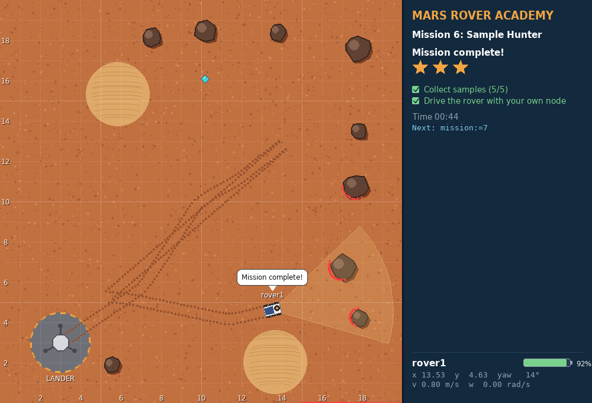

**You'll learn:** reading a camera (range and bearing) and a laser (`LaserScan`), a **service client** in code with `call_async`

**Goal:** find and collect 5 samples with your own node, without bumping into rocks

**Stars:** ≤ 90 s ⭐⭐⭐ · ≤ 180 s ⭐⭐ · a bump: ⭐⭐ at most

<p class="progress">✓0 ✓1 ✓2 ✓3 ✓4 ✓5 ▶6 7 8 9 10 11 12</p>

<!--
60 min. The yellow cone is the camera (6 m, 60°), the red dots are the laser hits (8 m, 180°). /rover1/collect only works on a sample within 1 m, straight ahead.
-->

---

<!-- _class: map -->
<!-- header: Mission 6 · The picture -->

# Two sensors and a service in code

<style scoped>section.map p > img { max-height: 310px; } section.map h1 { margin-bottom: 4px; }</style>

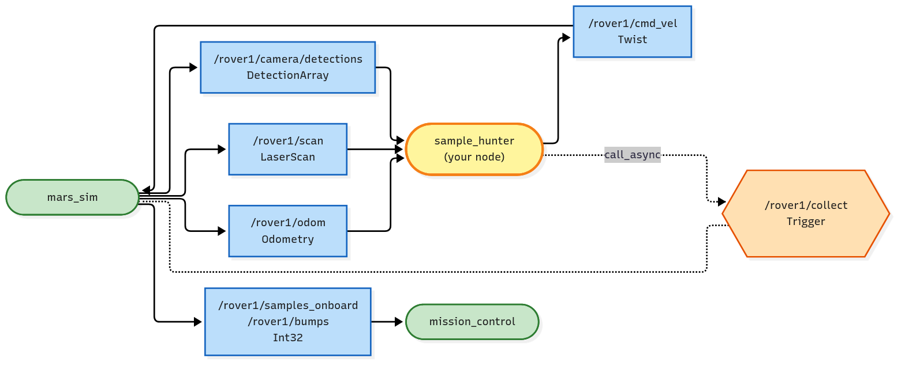

- `/rover1/camera/detections` says what the rover sees: kind, range and bearing
- `/rover1/scan` says how far the nearest thing is in every direction
- Your node calls `/rover1/collect` itself, with `call_async`, without stopping to wait

<p class="legend"><span class="k ros"></span>existing node <span class="k mine"></span>you <span class="k topic"></span>topic <span class="k srv"></span>service <span class="k act"></span>action <span class="k param"></span>parameter</p>

<!--
Same node shape as mission 5, with two more inputs and one service client.
-->

---

<!-- header: Mission 6 · Run it -->

# Run it

```bash
ros2 interface show mars_interfaces/msg/Detection
ros2 topic echo --once /rover1/scan --no-arr
```

Write `src/my_rover/my_rover/sample_hunter.py`, add to `setup.py`:

```python
'sample_hunter = my_rover.sample_hunter:main',
```

```bash
cd ~/mars_rover
colcon build --symlink-install --packages-select my_rover
source install/setup.bash
ros2 launch mission_control mission.launch.py mission:=6     # terminal 1
ros2 run my_rover sample_hunter                              # terminal 2
```

Sample in sight: chase and collect. Nothing: patrol. Rock ahead: steer around it.

<!--
The bearing already is the heading error, so no atan2 needed. Ray i of the scan points at angle_min + i * angle_increment; inf means nothing in range. Patrol reuses mission 5's steering.
-->

---

<!-- header: Mission 6 · Key code -->

# Calling a service without waiting

<style scoped>pre { font-size: 16px; }</style>

```python
self.collect_client = self.create_client(Trigger, '/rover1/collect')

def collect(self):
    # only send a new request once the previous one was answered, so we don't spam
    if self.collect_future is None or self.collect_future.done():
        self.collect_future = self.collect_client.call_async(Trigger.Request())

# in control_loop:
samples = [d for d in self.detections if d.kind == 'sample']
if samples:
    target = min(samples, key=lambda d: d.range)   # the closest one
    cmd.angular.z = K_ANGULAR * target.bearing      # bearing is already the heading error
    if abs(target.bearing) < 0.5:
        cmd.linear.x = min(0.8 * target.range, MAX_SPEED)
    if target.range < COLLECT_RANGE and abs(target.bearing) < 0.4:
        self.collect()
```

> Never wait inside a callback: `spin()` runs one callback at a time, so the answer could never arrive (deadlock).

<!--
call_async = place the order and hang up with a receipt (the future). Check future.done() on a later tick, or add a done callback that logs the response message.
-->

---

<!-- _class: checklist -->
<!-- header: Mission 6 · Checklist -->

# Can you...

- pick the closest sample from a `DetectionArray`, and say what range and bearing mean?
- find the angle of laser ray `i` and the closest obstacle in front?
- create a service client and call it with `call_async`?
- say what a future is and when to check `.done()`?
- explain why waiting inside a callback causes a deadlock?
- describe the hunter's decision: chase, patrol, or steer around a rock?

---

<!-- header: Mission 7 · Overview -->

# Mission 7: Rover Fleet


**You'll learn:** **namespaces** (same code, other robot), **parameters** (settings you change from outside), **launch files** (the whole fleet in one command)

**Goal:** two rovers run the same hunter node, you change a parameter live, 10 samples in total

**Stars:** ≤ 90 s ⭐⭐⭐ · ≤ 180 s ⭐⭐

<p class="progress">✓0 ✓1 ✓2 ✓3 ✓4 ✓5 ✓6 ▶7 8 9 10 11 12</p>

<!--
45 to 60 min. First change sample_hunter.py to relative names ('odom', not '/rover1/odom'), then add the max_speed and patrol_start parameters, then the launch file.
-->

---

<!-- _class: map -->
<!-- header: Mission 7 · The picture -->

# One program, two robots

<style scoped>section.map p > img { max-height: 330px; } section.map h1 { margin-bottom: 4px; }</style>


- The same `sample_hunter` runs twice, once in `/rover1` and once in `/rover2`
- Relative names (`odom`, `cmd_vel`) land inside the node's namespace
- **Parameters** (grey) give each copy its own settings; `ros2 param set` changes them live

<p class="legend"><span class="k ros"></span>existing node <span class="k mine"></span>you <span class="k topic"></span>topic <span class="k srv"></span>service <span class="k act"></span>action <span class="k param"></span>parameter</p>

<!--
The launch file starts both copies. Nothing in the code says rover1 or rover2 any more.
-->

---

<!-- header: Mission 7 · Run it -->

# Run it

<style scoped>pre { font-size: 17px; }</style>

```bash
ros2 launch mission_control mission.launch.py mission:=7                         # terminal 1
ros2 run my_rover sample_hunter --ros-args -r __ns:=/rover1                       # terminal 2
ros2 run my_rover sample_hunter --ros-args -r __ns:=/rover2 -p patrol_start:=3    # terminal 3
```

```bash
ros2 node list                                       # /rover1/sample_hunter, /rover2/sample_hunter
ros2 param list /rover2/sample_hunter
ros2 param set /rover2/sample_hunter max_speed 1.0   # rover2 speeds up right away
```

Or the whole fleet with one command, after writing `launch/fleet.launch.py`:

```bash
ros2 launch my_rover fleet.launch.py
```

<!--
The launch folder has to be installed through data_files in setup.py, then build and source again. Remember: after this change, mission 6 needs --ros-args -r __ns:=/rover1 too. Write 1.0, not 1: max_speed is a double.
-->

---

<!-- header: Mission 7 · Key code -->

# Relative names, parameters, launch

<style scoped>pre { font-size: 17px; }</style>

```python
self.declare_parameter('max_speed', 0.6)
self.declare_parameter('patrol_start', 0)   # which patrol point to start from
# relative names (no leading /) -> they live under the node's namespace
self.create_subscription(Odometry, 'odom', self.odom_callback, 10)
self.publisher = self.create_publisher(Twist, 'cmd_vel', 10)
self.collect_client = self.create_client(Trigger, 'collect')
```

```python
Node(
    package='my_rover',
    executable='sample_hunter',
    namespace='rover2',
    parameters=[{'patrol_start': 3}],
),
```

<!--
max_speed is read every loop so ros2 param set takes effect immediately; patrol_start only matters at start-up. The launch file has one Node(...) per rover.
-->

---

<!-- _class: checklist -->
<!-- header: Mission 7 · Checklist -->

# Can you...

- run the same node for two rovers with `__ns`?
- explain how a relative name like `'cmd_vel'` becomes `/rover2/cmd_vel`?
- declare a parameter in code and read it?
- set a parameter at start-up and change it while the node runs?
- write a launch file and install it from `setup.py`?

---

<!-- header: Mission 8 · Overview -->

# Mission 8 (boss): Power Crisis

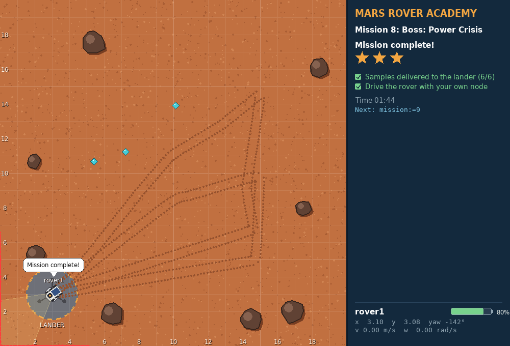

**You'll learn:** putting topics and services together, a battery to manage, and thinking in **states**

**Goal:** bring 6 samples to the lander, starting with 35 % battery that drains 4 times faster; run flat and the mission fails

**Stars:** ≤ 170 s ⭐⭐⭐ · ≤ 340 s ⭐⭐

<p class="progress">✓0 ✓1 ✓2 ✓3 ✓4 ✓5 ✓6 ✓7 ▶8 9 10 11 12</p>

<!--
60 to 90 min, works well in pairs. No full program to copy: a skeleton with TODOs, and hints in the guide.
-->

---

<!-- _class: map -->
<!-- header: Mission 8 · The picture -->

# Sense, think, act

<style scoped>section.map p > img { max-height: 340px; } section.map h1 { margin-bottom: 4px; }</style>

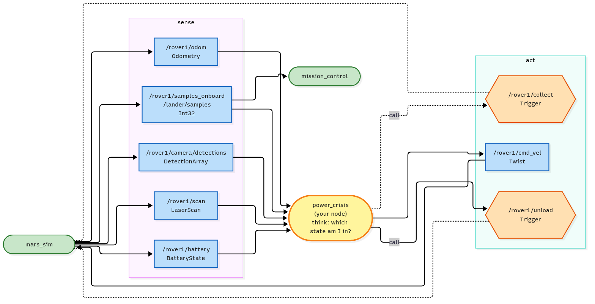

- **Sense:** odometry, camera, laser, battery, samples on board, samples at the lander
- **Think:** explore, return or charge?
- **Act:** drive on `cmd_vel`, call `collect` and `unload`

<p class="legend"><span class="k ros"></span>existing node <span class="k mine"></span>you <span class="k topic"></span>topic <span class="k srv"></span>service <span class="k act"></span>action <span class="k param"></span>parameter</p>

<!--
Nearly every robot node has this shape. Draw the boxes on the board and fill them in with the class before looking at the code.
-->

---

<!-- header: Mission 8 · Run it -->

# Run it

| In | Out |
|---|---|
| `/rover1/odom`, `/rover1/camera/detections`, `/rover1/scan` | `/rover1/cmd_vel` |
| `/rover1/battery`, `/rover1/samples_onboard`, `/lander/samples` | services `/rover1/collect`, `/rover1/unload` |

Copy the skeleton from the guide to `src/my_rover/my_rover/power_crisis.py`, add `'power_crisis = my_rover.power_crisis:main',` to `setup.py`, then:

```bash
cd ~/mars_rover
colcon build --symlink-install --packages-select my_rover
source install/setup.bash
ros2 launch mission_control mission.launch.py mission:=8     # terminal 1
ros2 run my_rover power_crisis                               # terminal 2
```

<!--
Suggested order: TODOs 1 and 3 (it hunts and runs flat: they see the failure), then 4 and 5 (it comes home), then 2 and 6 (it unloads and charges). Every failed run: close the window and launch again.
-->

---

<!-- header: Mission 8 · Key code -->

# Think in states

<style scoped>pre { font-size: 16px; }</style>

```python
    def control_loop(self):
        if self.pose is None or self.battery is None:
            return
        needed = COST_PER_METRE * self.distance_home() + RESERVE   # battery to get home from here
        if self.state == 'explore':
            # TODO 4: switch to 'return' when the battery is below `needed`,
            #         or when delivered + on board is already enough for the lander
            cmd = self.explore()
        elif self.state == 'return':
            # TODO 5: steer to the lander; closer than 0.4 m: stop and switch to 'charge'
            cmd = Twist()
        else:  # 'charge'
            cmd = Twist()   # stand still: the rover only charges while it is parked
            # TODO 6: unload while anything is on board; once the battery is FULL
            #         and the lander still needs samples, go back to 'explore'
        self.avoid_obstacles(cmd)
        self.publisher.publish(cmd)
```

<!--
This is sense, think, act: topics in, decide, topics and services out. The battery costs about 0.8 % per metre in this mission; COST_PER_METRE adds a margin.
-->

---

<!-- _class: checklist -->
<!-- header: Mission 8 · Checklist -->

# Can you...

- list a robot node's inputs and outputs as sense, think, act?
- describe a multi-step job as states, and what makes the rover change state?
- read the battery from `sensor_msgs/BatteryState` and decide when to turn back?
- call two different services from one node without spamming them?
- turn a skeleton into a working node, one TODO at a time?

---

<!-- _class: lead -->
<!-- header: Part 2 -->

# Part 2: the arms

Missions 9 to 12: joints, frames, the drill and pick-and-place. Mission launches switch the arms on automatically.

---

<!-- header: Mission 9 · Overview -->

# Mission 9: Arm Check

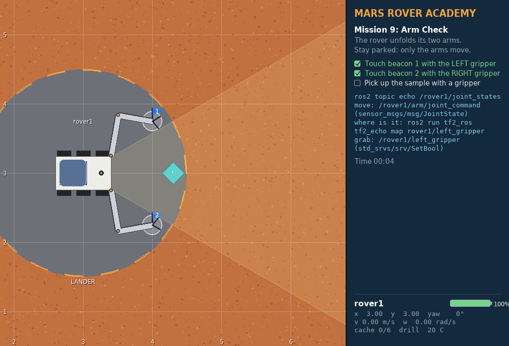

**You'll learn:** joint control with `sensor_msgs/JointState`, grippers as `std_srvs/SetBool` services, forward kinematics, `tf2_echo`

**Goal:** touch beacon 1 with the left gripper, beacon 2 with the right, then pick up the sample. The rover stays parked.

**Stars:** ≤ 4 min ⭐⭐⭐ · ≤ 8 min ⭐⭐

<p class="progress">✓0 ✓1 ✓2 ✓3 ✓4 ✓5 ✓6 ✓7 ✓8 ▶9 10 11 12</p>

<!--
30 to 45 min. Each arm: shoulder at (0.4, ±0.25) in the rover frame, upper arm 0.6 m, forearm 0.5 m. Angles in the rover frame, positive = left. Let them play: intuition for joint space pays off in mission 10.
-->

---

<!-- _class: map -->
<!-- header: Mission 9 · The picture -->

# Arms are just more topics and services

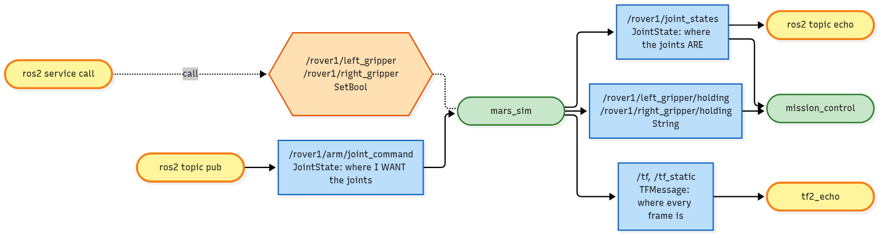

- `arm/joint_command` is where you **want** the joints, `joint_states` is where they **are**
- tf2 knows where every part of the arm is: `tf2_echo map rover1/left_gripper`
- Each gripper is a `SetBool` service: `true` closes it, `false` opens it

<p class="legend"><span class="k ros"></span>existing node <span class="k mine"></span>you <span class="k topic"></span>topic <span class="k srv"></span>service <span class="k act"></span>action <span class="k param"></span>parameter</p>

<!--
No new ROS concepts here apart from tf2, only new message types. That is the point: once you know topics and services, a robot arm is nothing special.
-->

---

<!-- header: Mission 9 · Run it -->

# Run it

<style scoped>pre { font-size: 17px; }</style>

```bash
ros2 launch mission_control mission.launch.py mission:=9        # terminal 1
```

```bash
ros2 topic echo --once /rover1/joint_states                     # where the joints are
ros2 run tf2_ros tf2_echo map rover1/left_gripper               # where the gripper is
ros2 topic pub --once /rover1/arm/joint_command sensor_msgs/msg/JointState \
  "{name: [left_shoulder, left_elbow], position: [1.39, -1.57]}"
ros2 topic pub --once /rover1/arm/joint_command sensor_msgs/msg/JointState \
  "{name: [left_shoulder, left_elbow], position: [0.23, -1.12]}"
ros2 service call /rover1/left_gripper std_srvs/srv/SetBool "{data: true}"
```

Guess angles, check the gripper with `tf2_echo`, adjust.

<!--
Angles that work: left [1.39, -1.57] for beacon 1, right [-1.39, 1.57] for beacon 2 (the mirror image), left [0.23, -1.12] for the sample. Name only the joints you want to move; the others keep their target.
-->

---

<!-- _class: checklist -->
<!-- header: Mission 9 · Checklist -->

# Can you...

- read `/rover1/joint_states` and say which angle belongs to which joint?
- move one arm with `arm/joint_command` from the terminal?
- find where a gripper is with `ros2 run tf2_ros tf2_echo`?
- close and open a gripper with a `SetBool` service and read its answer?
- work out where the gripper is from two joint angles (forward kinematics)?

---

<!-- header: Mission 10 · Overview -->

# Mission 10: Frames

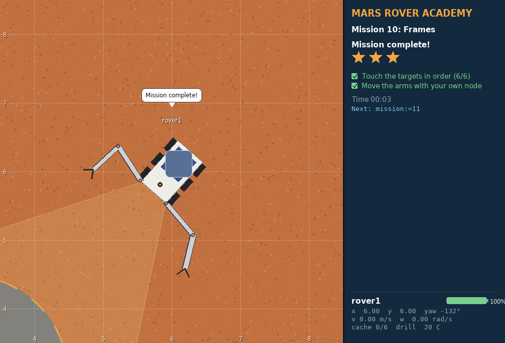

**You'll learn:** coordinate frames with **tf2** (`Buffer`, `TransformListener`, `transform()`), forward and **inverse kinematics** of a 2-link arm

**Goal:** the rover is parked at a random heading: touch 6 targets in order by computing the joint angles in your own node

**Stars:** ≤ 8 s ⭐⭐⭐ · ≤ 20 s ⭐⭐

<p class="progress">✓0 ✓1 ✓2 ✓3 ✓4 ✓5 ✓6 ✓7 ✓8 ✓9 ▶10 11 12</p>

<!--
60 to 90 min. Do one frame change by hand on the board first, then show that tf2 does it in one line. Derive the law of cosines together: cos(q2) = (d² - L1² - L2²) / (2 L1 L2). Outside -1..1 means out of reach.
-->

---

<!-- _class: map -->
<!-- header: Mission 10 · The picture -->

# From a map point to joint angles

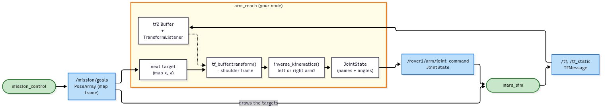

- The targets come in the **map** frame on `/mission/goals`
- tf2 turns each one into the **shoulder** frame: no frame maths in your code
- **Inverse kinematics** turns that point into two joint angles on `/rover1/arm/joint_command`

<p class="legend"><span class="k ros"></span>existing node <span class="k mine"></span>you <span class="k topic"></span>topic <span class="k srv"></span>service <span class="k act"></span>action <span class="k param"></span>parameter</p>

<!--
The IK is a plain Python function in its own file, arm_kinematics.py. That is why it can be tested without starting anything.
-->

---

<!-- header: Mission 10 · Run it -->

# Run it

Add `tf2_ros`, `tf2_geometry_msgs` and `action_msgs` to `package.xml`, write `arm_kinematics.py` and test it on its own:

```bash
cd ~/mars_rover/src/my_rover/my_rover
python3 -c "from arm_kinematics import *; print(forward_kinematics(*inverse_kinematics(0.5, 0.3, 'left')))"
```

Then `arm_reach.py`, add `'arm_reach = my_rover.arm_reach:main',` to `setup.py`, and:

```bash
cd ~/mars_rover
colcon build --symlink-install --packages-select my_rover
source install/setup.bash
ros2 launch mission_control mission.launch.py mission:=10       # terminal 1
ros2 run my_rover arm_reach                                     # terminal 2
```

<!--
The test runs IK and then FK on the result: you should get the point back. Testing the maths without ROS is a habit worth keeping. Optional: rviz2 with the TF display, fixed frame map, or ros2 run tf2_tools view_frames.
-->

---

<!-- header: Mission 10 · Key code -->

# tf2, then inverse kinematics

<style scoped>pre { font-size: 15px; line-height: 1.35; }</style>

```python
self.tf_buffer = Buffer()                                   # remembers the frames for a few seconds
self.tf_listener = TransformListener(self.tf_buffer, self)  # fills it from /tf and /tf_static

point = PointStamped()
point.header.frame_id = 'map'                               # the frame the numbers are in
point.point.x, point.point.y = 5.837, 4.913
p = self.tf_buffer.transform(point, 'rover1/left_shoulder').point   # p.x = 0.52, p.y = 0.35
```

```python
def inverse_kinematics(x: float, y: float, side: str):
    """Joint angles (q1, q2) that put the gripper at (x, y) in the shoulder frame, or None."""
    cos_q2 = (x * x + y * y - L1 * L1 - L2 * L2) / (2 * L1 * L2)   # law of cosines
    if abs(cos_q2) > 1.0 + 1e-9:
        return None                                    # out of reach
    q2 = math.acos(max(-1.0, min(1.0, cos_q2)))        # rounding can give 1.0000000000000002
    if side == 'left':
        q2 = -q2                                       # bend the elbow outwards, away from the body
    q1 = math.atan2(y, x) - math.atan2(L2 * math.sin(q2), L1 + L2 * math.cos(q2))
    q1 = math.atan2(math.sin(q1), math.cos(q1))       # keep it in -pi..pi
    return q1, q2
```

<!--
FK: angles to gripper position (one formula). IK: gripper position to angles (solve the triangle). Two solutions (elbow left or right), we pick the outward one. import tf2_geometry_msgs is what lets transform() handle PointStamped.
-->

---

<!-- _class: checklist -->
<!-- header: Mission 10 · Checklist -->

# Can you...

- convert a point from the map frame into the rover frame by hand?
- do the same with a tf2 `Buffer`, `TransformListener` and `transform()`?
- explain forward versus inverse kinematics?
- compute both joint angles of a 2-link arm with the law of cosines, and say when a point is out of reach?
- test your maths without starting ROS?

---

<!-- header: Mission 11 · Overview -->

# Mission 11: Drill & Stow

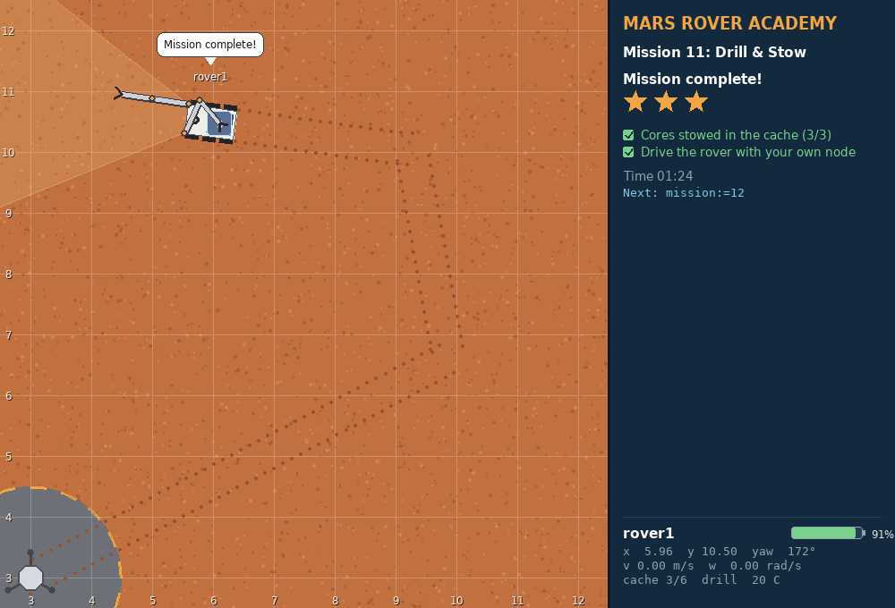

**You'll learn:** **actions** in code: goal, feedback, cancel, result. Pick and place as a state machine.

**Goal:** drill 3 sites, stopping before the bit overheats (80 °C breaks it and ends the mission), and stow each core in the cache

**Stars:** ≤ 2 min ⭐⭐⭐ · ≤ 4 min ⭐⭐

<p class="progress">✓0 ✓1 ✓2 ✓3 ✓4 ✓5 ✓6 ✓7 ✓8 ✓9 ✓10 ▶11 12</p>

<!--
60 to 90 min. Start in the terminal: send a goal with --feedback on a fresh site and leave it alone. The bit passes 80 °C and breaks, and the mission fails. That one demo makes feedback and cancel stick. Relaunch, then write the client.
-->

---

<!-- _class: map -->
<!-- header: Mission 11 · The picture -->

# A long job you can watch and stop

<style scoped>section.map p > img { max-height: 300px; } section.map h1 { margin-bottom: 4px; }</style>

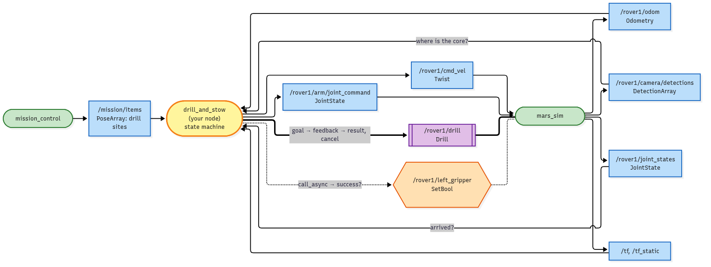

- The drill is an **action**: one goal, feedback 10 times a second (depth, temperature), one result
- Your node cancels above 70 °C, lets the bit cool and sends the goal again: the hole keeps its depth
- Then the arm drops the core in the cache: tf2 and IK from mission 10

<p class="legend"><span class="k ros"></span>existing node <span class="k mine"></span>you <span class="k topic"></span>topic <span class="k srv"></span>service <span class="k act"></span>action <span class="k param"></span>parameter</p>

<!--
Purple = action. Compare with the services: a service can't tell you how it's going, and you can't stop it halfway.
-->

---

<!-- header: Mission 11 · Run it -->

# Run it

<style scoped>pre { font-size: 17px; }</style>

```bash
ros2 launch mission_control mission.launch.py mission:=11       # terminal 1
```

```bash
ros2 interface show mars_interfaces/action/Drill
ros2 action list
ros2 action info /rover1/drill
ros2 action send_goal --feedback /rover1/drill mars_interfaces/action/Drill "{depth: 0.3}"
ros2 topic echo --once /mission/items                           # the drill sites
```

Then `drill_and_stow.py`, add it to `setup.py`, build, and `ros2 run my_rover drill_and_stow`.

States: drive → settle → drilling ⇄ cool → reach → grab → stow, then the next site.

<!--
A goal is only accepted when the rover stands still within 0.35 m of a site: on the lander it aborts and says why. Ctrl+C on send_goal cancels the goal. Each hole needs two pauses to reach 0.3 m.
-->

---

<!-- header: Mission 11 · Key code -->

# An action client

<style scoped>pre { font-size: 16px; }</style>

```python
self.drill_client = ActionClient(self, Drill, '/rover1/drill')

# 1. send the goal, say which function gets the feedback
future = self.drill_client.send_goal_async(Drill.Goal(depth=0.3), feedback_callback=self.drill_feedback)
future.add_done_callback(self.drill_accepted)

def drill_accepted(self, future):
    self.goal_handle = future.result()            # 2. accepted or rejected?
    if self.goal_handle.accepted:
        self.goal_handle.get_result_async().add_done_callback(self.drill_done)

def drill_feedback(self, msg):                    # 3. ten times a second while it drills
    if msg.feedback.temperature > 70.0:
        self.goal_handle.cancel_goal_async()      #    stop it

def drill_done(self, future):                     # 4. the result, whatever happened
    status = future.result().status               #    GoalStatus.STATUS_SUCCEEDED / _CANCELED / _ABORTED
    message = future.result().result.message
```

<!--
Nothing here waits: every step is a callback, so spin() stays free to deliver the feedback. That is the same rule as call_async in mission 6, one level up.
-->

---

<!-- _class: checklist -->
<!-- header: Mission 11 · Checklist -->

# Can you...

- use `ros2 action list`, `info` and `send_goal --feedback`?
- send a goal from code and receive feedback and the result?
- cancel a goal, and tell SUCCEEDED, CANCELED and ABORTED apart?
- say when a job should be an action instead of a service?
- turn a camera detection into a point the arm can reach (range/bearing → base_link → tf2 → IK)?
- move to the next state when something has finished, not after a guessed delay?

---

<!-- header: Mission 12 · Overview -->

# Mission 12 (boss): Meteorite Recovery

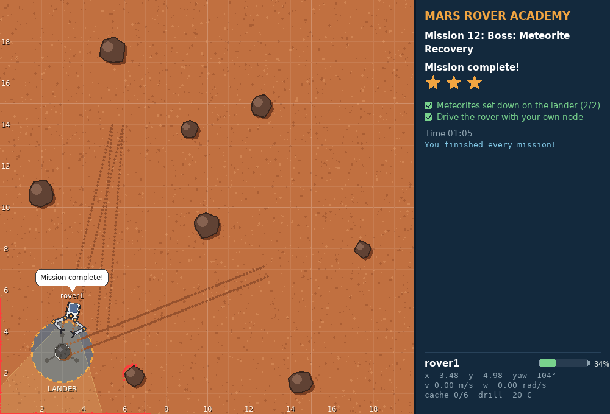

**You'll learn:** **mobile manipulation**: driving and two-arm coordination together, with a battery to watch

**Goal:** carry 2 meteorites to the lander. A meteorite only moves when both grippers hold it.

**Stars:** ≤ 2 min ⭐⭐⭐ · ≤ 4 min ⭐⭐

<p class="progress">✓0 ✓1 ✓2 ✓3 ✓4 ✓5 ✓6 ✓7 ✓8 ✓9 ✓10 ✓11 ▶12</p>

<!--
90+ min, great as a team project. The trick: keep the arms in one fixed forklift posture, then gripping a meteorite is just parking 1.0 m in front of it.
-->

---

<!-- _class: map -->
<!-- header: Mission 12 · The picture -->

# Driving and arms together

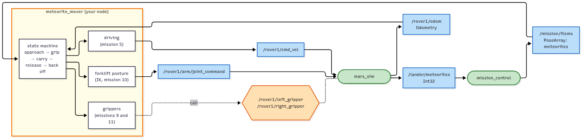

- One state machine on top: approach, grip, carry, release, back off
- Driving goes out on `cmd_vel`, the arms on `arm/joint_command`, the grippers as service calls
- With the arms fixed, the hard part is a driving problem you already solved in mission 5

<p class="legend"><span class="k ros"></span>existing node <span class="k mine"></span>you <span class="k topic"></span>topic <span class="k srv"></span>service <span class="k act"></span>action <span class="k param"></span>parameter</p>

<!--
Everything here was built in an earlier mission. The new part is the state machine that coordinates them. Pattern 4 in ARCHITECTURE.md shows how to split this into several nodes.
-->

---

<!-- header: Mission 12 · Run it -->

# Run it

Copy the skeleton from the guide to `src/my_rover/my_rover/meteorite_mover.py`, add `'meteorite_mover = my_rover.meteorite_mover:main',` to `setup.py`, then:

```bash
cd ~/mars_rover
colcon build --symlink-install --packages-select my_rover
source install/setup.bash
ros2 launch mission_control mission.launch.py mission:=12       # terminal 1
ros2 run my_rover meteorite_mover                               # terminal 2
```

Meteorites on `/mission/items` · battery on `/rover1/battery` (starts at 60 %, drains 3 times faster).

Build it in stages: the posture, then parking, then gripping, then carrying.

<!--
Meteorite rules: grab within its edge + 0.15 m; with both grippers it sits halfway between them; grippers more than 1.2 m apart and it slips. Delivered = its centre on the lander pad when released.
-->

---

<!-- header: Mission 12 · Key code -->

# The forklift posture

```python
if self.posture is None:
    angles = []
    for side, y in (('left', GRIP_Y), ('right', -GRIP_Y)):
        sx, sy = SHOULDER[side]
        angles += inverse_kinematics(REACH - sx, y - sy, side)
    self.posture = JointState()
    self.posture.name = ['left_shoulder', 'left_elbow', 'right_shoulder', 'right_elbow']
    self.posture.position = angles
self.arm_pub.publish(self.posture)
```

`REACH` = 1.0 m in front, `GRIP_Y` = 0.35 m either side: computed once with mission 10's IK.

<!--
Design challenge after the boss: split meteorite_mover into a behaviour node and reusable skill nodes (base_controller as an action, arm_controller). See pattern 4 in ARCHITECTURE.md and the action server in CONCEPTS.md.
-->

---

<!-- _class: checklist -->
<!-- header: Mission 12 · Checklist -->

# Can you...

- run two control loops (driving and arms) from one state machine?
- turn a manipulation problem into a driving problem with a fixed arm posture?
- explain why both grippers must hold the meteorite, and what happens if they drift apart?
- sketch how you would split `meteorite_mover` into several nodes?

---

<!-- _class: lead -->
<!-- header: Done -->

# Course complete

Keep track in **CHECKLIST.md** · every part of ROS 2 and what to learn next in **CONCEPTS.md** · how the parts fit together in **ARCHITECTURE.md**

`ros2 run mission_control progress`: how many of the 39 stars did you get?

<!--
Next steps after the course: your own action server (the go_to of pattern 4), URDF and RViz, ros2 bag, Nav2, MoveIt 2, ros2_control, C++ nodes. CONCEPTS.md has a tested example for each.
-->

