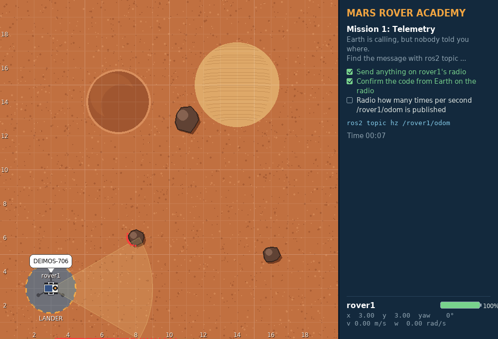
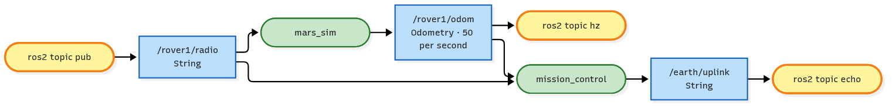

<!-- _class: lead -->
<!-- _paginate: false -->
<!-- header: Mars Rover Academy · Part 1 -->

# Mission 1: Telemetry

Earth is sending rover1 a message, but nobody told you on which channel. Find it, answer on the rover's radio, and report how fast the rover sends its position.

**You will learn:** nodes · topics · messages · the `ros2 topic` tools

<!--
Suggested time: 30 to 45 minutes.
Goal of the session: everyone can look around a running ROS 2 system from the terminal, listen to a topic and send a message by hand.
Everything today happens in the terminal. Nobody writes code yet.
-->

---

<!-- _class: roadmap -->
<!-- header: Where we are -->

# Part 1 roadmap

| | # | Mission | You learn |
|---|---|---|---|
| ✓ | 0 | Landing | workspace, build, launch, teleop, remapping |
| **▶** | **1** | **Telemetry** | **nodes, topics, messages** |
| | 2 | Manual Drive | publishing `Twist`, speeds and angles |
| | 3 | Mission Control | services: request and response |
| | 4 | Survey Square | a package and a Python publisher |
| | 5 | Waypoints | subscribers, `Odometry`, closed-loop control |
| | 6 | Sample Hunter | camera and laser, service clients in code |
| | 7 | Rover Fleet | namespaces, parameters, launch files |
| | 8 | Boss: Power Crisis | all of the above, state machines, battery |

<!--
About 1 minute. Last time we built the workspace and drove rover1 off the lander with teleop. Today we look at what was going on underneath: the nodes and topics.
-->

---

<!-- header: Mission 1 · Goal -->

# Today's goal



**Objectives**
1. Send anything on rover1's radio
2. Confirm the code from Earth on the radio
3. Radio how many times per second /rover1/odom is published

**Stars:** ≤ 3 min = ⭐⭐⭐ · ≤ 7 min = ⭐⭐

<!--
About 2 minutes. Point at the screenshot: rover1 is still on the lander and has radioed the code from Earth in a speech bubble. Two of the three objectives are ticked.
All three objectives are about the radio. The difference is what you send.
The rover doesn't have to move at all today.
-->

---

<!-- header: Mission 1 · Goal -->

# Launch the mission

```bash
# Terminal 1
ros2 launch mission_control mission.launch.py mission:=1
```

Leave this terminal running. Every command from now on goes in a **new** terminal.

<!--
In missions 0 to 3 the clock starts at launch. If people care about stars, they can follow along with the slides first and launch when they're ready.
Remind everyone: a new terminal needs source ~/mars_rover/install/setup.bash, unless they added it to ~/.bashrc in mission 0.
Usual mistake: a mission 0 launch still running in another terminal. Close it first.
-->

---

<!-- header: Mission 1 · Concept -->

# Nodes, topics and messages

A topic works like a group chat:

| ROS 2 | Group chat |
|---|---|
| **node** | one person in the chat (one program) |
| **topic** | one chat room with a name, e.g. `/rover1/odom` |
| **publisher** | someone posting into the room |
| **subscriber** | someone reading the room |
| **message type** | the "form" every post in that room must use, e.g. `std_msgs/msg/String` has one text field |

<!--
About 3 minutes. Go through the table row by row. The message type is the one people skip: it's the agreed format, and a post in the wrong format is refused.
-->

---

<!-- header: Mission 1 · Concept -->

# Nobody is wired to anybody

Whoever posts doesn't know who's reading, and readers don't know who posted.

Both sides only agree on two things:
- the room's **name**
- the **message format**

That's how the parts of a robot stay independent of each other: nothing is wired directly to anything else.

<!--
About 2 minutes. This is the most important idea of the day. You can add a reader (a logger, a second screen, a referee) without touching the program that posts. We'll see exactly that on the system map at the end.
-->

---

<!-- header: Mission 1 · Step 1 of 5 -->

# Step 1: Who's in the system?

Open a new terminal (and run `source ~/mars_rover/install/setup.bash` in it):

```bash
ros2 node list
```

```text
/mars_sim
/mission_control
```

There are two nodes, the simulator and mission control.

<!--
About 2 minutes. Run it live.
If someone sees more nodes, they probably still have teleop or an old launch running in another terminal, or a neighbour on the same ROS_DOMAIN_ID.
If someone sees nothing at all: the launch terminal isn't running, or this terminal wasn't sourced.
-->

---

<!-- header: Mission 1 · Step 1 of 5 -->

# What does a node offer?

To see what `mars_sim` offers:

```bash
ros2 node info /mars_sim
```

It's a long list:
- every topic the node **subscribes** to
- every topic it **publishes**
- its services and actions

You'll meet most of them over the next missions.

<!--
About 2 minutes. Scroll through the output live but don't explain it all. Point out the Subscribers and Publishers headings and that /rover1/radio and /rover1/odom are in there.
Usual mistake: forgetting the leading slash in the node name.
-->

---

<!-- header: Mission 1 · Step 2 of 5 -->

# Step 2: Listen to the rover's position

```bash
ros2 topic list
```

There are quite a few. Everything that belongs to rover1 starts with `/rover1/`. Its position is on `/rover1/odom` ("odometry"):

```bash
ros2 topic echo /rover1/odom
```

That scrolls past very fast, and each message is long. Press `Ctrl+C`.

<!--
About 3 minutes. Each message has a header, the position, the orientation, the velocity and two blocks of 36 numbers called covariance. Don't explain them; mission 5 reads this message from code.
The output scrolls fast because odom is published many times per second. That's a nice lead-in to step 5.
-->

---

<!-- header: Mission 1 · Step 2 of 5 -->

# Only what you need

For a single message:

```bash
ros2 topic echo --once /rover1/odom
```

For only the part you care about, add `--field`:

```bash
ros2 topic echo --once /rover1/odom --field pose.pose.position
```

```text
x: 3.0
y: 3.0
z: 0.0
---
```

<!--
About 3 minutes. The type is nav_msgs/msg/Odometry, the standard message real robots use for "where am I and how fast am I going". Learners read it from their own code in mission 5.
Demo: start teleop from mission 0 in another terminal, drive around and run the --field command again to watch x and y change. Remind people to click into the teleop terminal first.
Usual mistake: a typo in the field path, e.g. pose.position instead of pose.pose.position.
-->

---

<!-- header: Mission 1 · Step 3 of 5 -->

# Step 3: Use the radio

The rover listens on `/rover1/radio` and shows whatever text arrives there in a speech bubble. First find out which message type the topic uses:

```bash
ros2 topic info /rover1/radio
```

```text
Type: std_msgs/msg/String
Publisher count: 0
Subscription count: 2
```

<!--
About 2 minutes. Ask the room: who are the two subscribers? (The simulator, which draws the speech bubble, and mission_control, which checks the answer.) The system map at the end confirms it.
-->

---

<!-- header: Mission 1 · Step 3 of 5 -->

# What's inside a String?

The type is `std_msgs/msg/String`. Its fields:

```bash
ros2 interface show std_msgs/msg/String
```

```text
# This was originally provided as an example message.
# ...(lines starting with # are comments, skip them)
string data
```

One field, `data`, holding text.

<!--
About 1 minute. ros2 interface show is the tool for "what does this message look like?". People will use it again for every new type.
The only line that matters here is the last one: a field called data of type string.
-->

---

<!-- header: Mission 1 · Step 3 of 5 -->

# Send it

<style scoped>pre { font-size: 19px; }</style>

```bash
ros2 topic pub --once /rover1/radio std_msgs/msg/String "{data: 'Hello from rover1'}"
```

The general form is:

```text
ros2 topic pub --once  <topic name>  <message type>  "<data as YAML>"
```

The data is written as YAML, `{field: value}`. That ticks the first objective.

<!--
About 3 minutes. Learners should see a speech bubble over rover1 and the first tick in the panel.
Usual mistakes: typos in the type name, a missing space after the colon in the YAML, and mixed-up quotes. Double quotes outside, single quotes inside.
-->

---

<!-- header: Mission 1 · Step 3 of 5 -->

# Careful with the options

> Put options like `--once` right after `pub`, before the topic name. If one lands between the type and the data, you get `error: unrecognized arguments`.

```text
ros2 topic pub --once  <topic name>  <message type>  "<data as YAML>"
```

<!--
About 1 minute. Show the failing version live if there's time: move --once to the end of the line and read the error together. Then put it back after pub.
This matters again in mission 2, where --rate and --times join --once.
-->

---

<!-- header: Mission 1 · Step 4 of 5 -->

# Step 4: Find the message from Earth

No step-by-step this time. You already have the commands you need:

1. List all topics and look for one that doesn't belong to a rover.
2. Listen to it.
3. Send what Earth asks for on the radio.

<!--
Give people about 5 minutes. Walk around; resist giving the topic name away.
Every learner's code is different (it's random), so copying a neighbour's answer doesn't work unless the class uses a shared seed.
-->

---

<!-- header: Mission 1 · Step 4 of 5 -->

# Hint

```bash
ros2 topic list | grep earth
```

<!--
Show only after people have tried.
grep keeps only the lines that contain "earth". If someone has never seen a pipe, explain it in one sentence: the output of the left command goes into the right one.
-->

---

<!-- header: Mission 1 · Step 4 of 5 -->

# Solution

<style scoped>pre { font-size: 17px; padding: 20px 16px; }</style>

```bash
ros2 topic echo --once /earth/uplink
# data: 'Earth to rover1: please confirm code DEIMOS-682 on your radio.'   (yours will differ: it's random)
ros2 topic pub --once /rover1/radio std_msgs/msg/String "{data: 'DEIMOS-682'}"
```

<!--
Show only after people have tried.
Learners should see the second objective tick.
Usual mistake: typing DEIMOS-682 from the slide instead of their own code. The objective only ticks with the code their own mission control published.
-->

---

<!-- header: Mission 1 · Step 5 of 5 -->

# Step 5: Measure the rate

ROS 2 can measure how often a topic is published:

```bash
ros2 topic hz /rover1/odom
```

Let the number settle for a few seconds, press `Ctrl+C`, and radio it. It only needs to be roughly right (within 10%).

<!--
About 2 minutes. Learners should see "average rate:" lines with a number close to 50. Let it run 3 to 5 seconds; the first lines can be off.
-->

---

<!-- header: Mission 1 · Step 5 of 5 -->

# Radio the rate

<style scoped>pre { font-size: 18px; }</style>

```bash
ros2 topic pub --once /rover1/radio std_msgs/msg/String "{data: '<the rate you measured>'}"
```

> Careful: wrap a number in quotes inside the YAML, e.g. `"{data: '50'}"`. The field holds text, and the quotes make sure YAML reads it as text.

That's the last objective. The panel shows *Mission complete* and your stars.

<!--
About 2 minutes. Replace the whole <the rate you measured> part, angle brackets included, with the number, and keep the single quotes around it.
Learners should see Mission complete. If the third objective doesn't tick, check the quotes and that the number is roughly what hz printed.
Usual mistake: {data: 50} without the inner quotes. YAML reads it as a number and ROS refuses to put a number into a text field.
-->

---

<!-- header: Mission 1 · System map -->

# What happened behind the scenes



- Each `ros2 topic` command was briefly a node itself (named `_ros2cli_...`). It joined the graph, did its job and left.
- `/rover1/radio` has two subscribers: the simulator draws the speech bubble, mission_control checks your answer. One message reached both.
- Nobody told you about `/earth/uplink`: mission_control publishes it, and anyone who knows the name can listen.

<!--
About 3 minutes. Green = a node that already exists, yellow = you, blue = a topic.
/rover1/odom has even more readers while your echo or hz runs, and the simulator neither knows nor cares how many. That's the "nobody is wired to anybody" idea from the start of the session.
-->

---

<!-- header: Mission 1 · Summary -->

# Commands you now know

<style scoped>table { font-size: 21px; } td:first-child code { white-space: nowrap; }</style>

| Command | What it does |
|---|---|
| `ros2 node list` / `ros2 node info <node>` | who's in the system / what a node sends and receives |
| `ros2 topic list` | which topics exist |
| `ros2 topic echo <topic>` | eavesdrop (`--once` = one message, `--field` = one part of it) |
| `ros2 topic info <topic>` | its type + how many publishers/subscribers (`-v` = with names) |
| `ros2 interface show <type>` | the fields of a message |
| `ros2 topic pub --once <topic> <type> "<yaml>"` | send a message yourself |
| `ros2 topic hz <topic>` | measure the rate |

<!--
This table is in the mission guide too, so nobody needs to copy it. Mention -v on topic info: it shows the node names, and mission control will use exactly that to catch teleop in mission 2.
-->

---

<!-- header: Mission 1 · Check yourself -->

# Check yourself

1. You leave `ros2 topic echo /rover1/radio` running and send something on the radio. What happens?

2. What does `ros2 topic info -v /rover1/cmd_vel` show that plain `ros2 topic info` doesn't?

<!--
Let people try both in the terminal before answering.
1. The echo terminal prints the message as well. Everyone subscribed to a topic gets every message, so right now /rover1/radio has three listeners: the simulator, mission_control and your echo.
2. The node names of the publishers and subscribers. That's how mission_control will catch you using teleop in later missions.
-->

---

<!-- _class: checklist -->
<!-- header: Mission 1 · Checklist -->

# Before you move on, can you...

- list the nodes and topics in a running system?
- listen to a topic with `ros2 topic echo`?
- find a topic's message type and the fields of that type?
- send a message yourself with `ros2 topic pub`?
- measure how often a topic is published?
- explain why a publisher doesn't need to know who is listening?

<!--
The same list is in CHECKLIST.md for learners to tick off. If someone can't do the third item, have them repeat step 3 for /rover1/odom: topic info, then interface show on the type it prints.
-->

---

<!-- _class: roadmap -->
<!-- header: Where we are -->

# Next: Mission 2, Manual Drive

| | # | Mission | You learn |
|---|---|---|---|
| ✓ | 0 | Landing | workspace, build, launch, teleop, remapping |
| ✓ | 1 | Telemetry | nodes, topics, messages |
| **▶** | **2** | **Manual Drive** | **publishing `Twist`, speeds and angles** |
| | 3 | Mission Control | services: request and response |
| | 4 | Survey Square | a package and a Python publisher |
| | 5 | Waypoints | subscribers, `Odometry`, closed-loop control |
| | 6 | Sample Hunter | camera and laser, service clients in code |
| | 7 | Rover Fleet | namespaces, parameters, launch files |
| | 8 | Boss: Power Crisis | all of the above, state machines, battery |

<!--
Extras for fast finishers:
- See the whole system as a diagram with rqt_graph (if it's missing: sudo apt install ros-$ROS_DISTRO-rqt-graph).
- The rover has more to say: ros2 topic echo --once /rover1/battery --field percentage (1.0 = full) and ros2 topic hz /rover1/scan (the laser scanner).
- Multi-line radio: '{data: "first line\nsecond line"}'. The quotes are swapped on purpose, because YAML only understands \n inside double quotes.
- Make the rover repeat itself every second by replacing --once with --rate 1. Stop it with Ctrl+C.
-->
