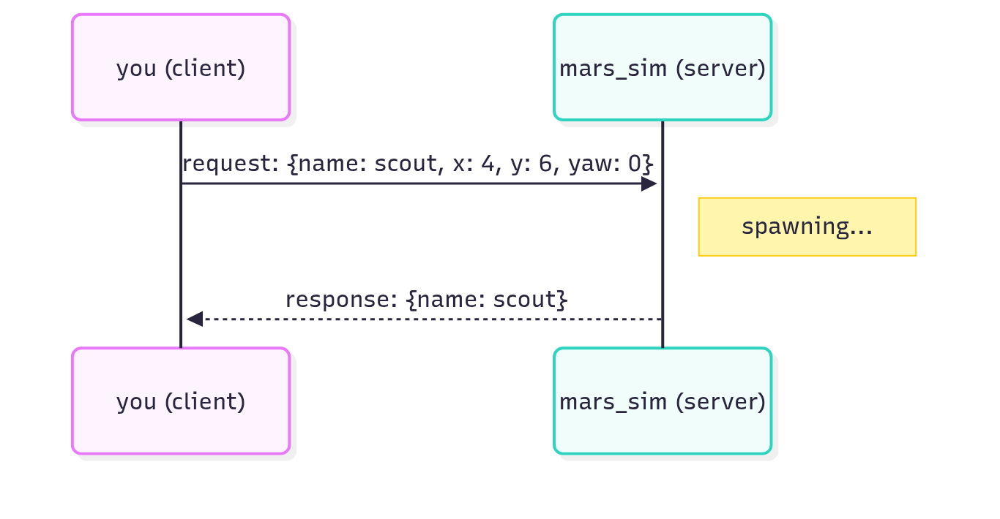

<!-- _class: lead -->
<!-- _paginate: false -->
<!-- header: Mars Rover Academy · Part 1 -->

# Mission 3: Mission Control

Earth wants photos of three landmarks at the far ends of the map. Instead of driving, call the simulator's services to land a second rover, move a rover instantly and take photos.

**You will learn:** services · request and response · `ros2 service` · `ros2 interface show` · `Trigger`

<!--
Suggested time: 30 to 45 minutes. Finish the session with the first half of ARCHITECTURE.md (the big picture and the four ways nodes talk).
Goal of the session: everyone has called a service from the terminal, read its response (including success and message in a Trigger response), and can say when to use a topic and when a service.
-->

---

<!-- _class: roadmap -->
<!-- header: Where we are -->

# Part 1 roadmap

| | # | Mission | You learn |
|---|---|---|---|
| ✓ | 0 | Landing | workspace, build, launch, teleop, remapping |
| ✓ | 1 | Telemetry | nodes, topics, messages |
| ✓ | 2 | Manual Drive | publishing `Twist`, speeds and angles |
| **▶** | **3** | **Mission Control** | **services: request and response** |
| | 4 | Survey Square | a package and a Python publisher |
| | 5 | Waypoints | subscribers, `Odometry`, closed-loop control |
| | 6 | Sample Hunter | camera and laser, service clients in code |
| | 7 | Rover Fleet | namespaces, parameters, launch files |
| | 8 | Boss: Power Crisis | all of the above, state machines, battery |

<!--
About 1 minute.
So far everything was topics: listening in mission 1, publishing in mission 2. Today is the second way nodes talk to each other. It's also the last mission done only from the terminal; next time we write code.
-->

---

<!-- header: Mission 3 · Goal -->

# Today's goal


**Objectives**
1. Spawn a second rover named scout
2. Photograph the landmarks: Olympus Rock (16, 15), Twin Peaks (15, 5) and Face Rock (5, 16)

**Stars:** ≤ 5 min = ⭐⭐⭐ · ≤ 10 min = ⭐⭐

Driving to each landmark is a slog. With services the job takes a handful of commands.

<!--
About 2 minutes.
Point at the screenshot: scout has landed and all three landmarks have been photographed. The landmarks are far apart on purpose, so driving with teleop is slow.
In this mission the clock starts at launch, so five minutes is plenty if people type the commands rather than drive. Stars are optional; finishing always earns at least one.
-->

---

<!-- header: Mission 3 · Concept -->

# Services: ask and wait for the answer

A topic is like radio or a group chat. Messages flow and nobody replies.

Sometimes you need an answer: "please land a rover, and tell me its name". For that ROS 2 has the **service**.



<!--
About 3 minutes.
Walk through the diagram top to bottom: you (the client) send a request with a name, x, y and yaw; mars_sim (the server) does the work; then a response comes back with the name. One question, one answer, and the call is over.
Another example from today: "take a photo, and tell me whether it worked".
-->

---

<!-- header: Mission 3 · Concept -->

# Topic or service?

| | topic | service |
|---|---|---|
| shape | one-way, continuous | one question → one answer |
| get a reply? | no | yes |
| good for | data that keeps flowing (position, sensors, velocity) | one-off jobs (spawn, take a photo, reset) |
| examples here | `/rover1/odom`, `/rover1/cmd_vel` | `/spawn_rover`, `/rover1/take_photo` |

<!--
About 2 minutes.
Ask the room before showing the last row: which of the things we used so far were topics? Odometry and cmd_vel both keep flowing, so they are topics. Spawning a rover or taking a photo happens once, and you want to know it worked, so those are services.
-->

---

<!-- header: Mission 3 · Step 1 of 4 -->

# Step 1: Open the phone book

```bash
# Terminal 1
ros2 launch mission_control mission.launch.py mission:=3
```

In a second terminal:

```bash
ros2 service list
```

- Some belong to the world (`/spawn_rover`), others to each rover (`/rover1/take_photo`, `/rover1/teleport` ...)
- The ones starting with `/sim/` are how mission_control builds each mission's world. Leave them alone.
- The ones ending in `/describe_parameters`, `/get_parameters` ... exist on every node. They're for parameters (mission 7), so skip them for now.

<!--
About 3 minutes.
Learners should see a long list. Don't read it all out; point at the groups. If the list is nearly empty, the mission isn't running or the terminal isn't sourced.
`ros2 service list -t` also prints each service's type.
The clock starts at launch in this mission, so it's fine to explore first and relaunch before going for stars.
-->

---

<!-- header: Mission 3 · Step 2 of 4 -->

# Step 2: Spawn a second rover

Before calling a service, find out which type (the form it uses):

```bash
ros2 service type /spawn_rover
# mars_interfaces/srv/SpawnRover

ros2 interface show mars_interfaces/srv/SpawnRover
```

The type is the name of the form. `ros2 interface show` prints the form itself.

<!--
About 2 minutes.
Run both commands live. The comment line shows what the first command prints.
This is the same pattern as mission 1, where `ros2 topic type` and `ros2 interface show` told us what a message looks like. Only the folder changes: srv instead of msg.
-->

---

<!-- header: Mission 3 · Step 2 of 4 -->

# Reading the form

```text
# Put a new rover into the world. An empty or taken name gets a free one.
string name
float64 x
float64 y
float64 yaw
---
string name        # the name the new rover actually got
```

The `---` line splits the form in two.

- Above it is what you send: the **request**
- Below it is what you get back: the **response**

<!--
About 2 minutes.
This is what `ros2 interface show mars_interfaces/srv/SpawnRover` prints. Ask: what do we have to send, and what will we get back?
Point at the first comment: an empty or taken name gets a free one, and the response tells you which name the rover actually got. That's the whole reason this service answers back.
-->

---

<!-- header: Mission 3 · Step 2 of 4 -->

# Call it

<style scoped>pre { font-size: 17px; }</style>

```bash
ros2 service call /spawn_rover mars_interfaces/srv/SpawnRover "{name: scout, x: 4.0, y: 6.0, yaw: 0.0}"
```

```text
requester: making request: mars_interfaces.srv.SpawnRover_Request(name='scout', x=4.0, y=6.0, yaw=0.0)

response:
mars_interfaces.srv.SpawnRover_Response(name='scout')
```

**You should see:** a new rover named scout at (4, 6), and the first objective ticked.

<!--
About 3 minutes.
The order is always: service name, type, then the request in YAML inside double quotes.
Common mistakes: forgetting the type, missing the space after a colon (x:4.0), or using double quotes inside the double quotes.
The first line of output is your request, the last line is the server's answer.
-->

---

<!-- header: Mission 3 · Step 2 of 4 -->

# scout gets everything rover1 has

A new rover gets the same full set of topics and services as rover1:

```bash
ros2 topic list | grep scout
ros2 topic pub --once /scout/radio std_msgs/msg/String "{data: 'Hi rover1!'}"
```

<!--
About 2 minutes.
Learners should see /scout/odom, /scout/cmd_vel and the rest, and scout's radio message in the window.
One service call changed the whole graph: new topics and services appeared that didn't exist a moment ago. mission_control ticks objective 1 because /scout/odom has appeared in the graph.
-->

---

<!-- header: Mission 3 · Step 3 of 4 -->

# Step 3: Take a photo

The camera is a service too:

```bash
ros2 service type /rover1/take_photo
# std_srvs/srv/Trigger

ros2 interface show std_srvs/srv/Trigger
```

```text
---
bool success   # indicate successful run of triggered service
string message # informational, e.g. for error messages
```

- The request is empty: there's nothing to fill in, you only ask
- The response has two fields: `success` says whether it worked, `message` says what happened

<!--
About 2 minutes.
Point at the empty space above the --- line: nothing to send. The new part is the response. Trigger comes with ROS 2 (std_srvs), so you'll meet it on real robots too.
-->

---

<!-- header: Mission 3 · Step 3 of 4 -->

# Try it now, from the lander

<style scoped>pre { font-size: 18px; }</style>

```bash
ros2 service call /rover1/take_photo std_srvs/srv/Trigger
```

```text
response:
std_srvs.srv.Trigger_Response(success=False, message='No landmark in the picture. 
Get within 3 m and point the camera at it (less than 30 deg off).')
```

The call itself worked fine; the photo didn't, and the message tells you why.

`Trigger` is a common type for "do this one thing and tell me how it went". **Always read the answer.**

<!--
About 2 minutes.
No data after the type: the request is empty, so you leave it out.
The response is one long line in the terminal; it's split in two here only to fit the slide.
Ask: did the service call fail? No. The request reached the server and an answer came back. The job failed, and message says why. This comes back as Check yourself question 3.
The message also hands people the rule they need for step 4: within 3 m, less than 30 degrees off.
-->

---

<!-- header: Mission 3 · Step 4 of 4 -->

# Step 4: Teleport to the landmarks

You could drive to each landmark, or you could teleport:

```bash
ros2 interface show mars_interfaces/srv/Teleport
```

```text
# Simulator debug tool: put the rover at a pose instantly (it also stops it).
float64 x
float64 y
float64 yaw
---
```

The response is empty. The call coming back just means it's done.

<!--
About 2 minutes.
Point at the nothing below the --- line. Even with no data in the response, the client still waits for the answer, so you know the teleport has happened when the command returns.
Teleporting isn't something a real rover can do. It's a simulator tool for testing, like set_entity_state in the Gazebo simulator. From mission 4 on, mission_control detects teleports and they cost stars.
-->

---

<!-- header: Mission 3 · Step 4 of 4 -->

# Where to stand for each photo

A photo works when the landmark is **less than 3 m** away and **less than 30°** off the direction the rover faces.

`yaw` is in radians: 0 faces right (+x), 1.5708 faces up (+y).

| Landmark | Position |
|---|---|
| Olympus Rock | (16, 15) |
| Twin Peaks | (15, 5) |
| Face Rock | (5, 16) |

**Work out where to put rover1 for each photo.** The landmarks are solid rock, so stand next to them, not on top.

<!--
About 5 to 8 minutes of hands-on time. Walk around.
The usual mistakes: teleporting right onto the landmark (it's solid rock), standing too far away, or facing the wrong way. The take_photo message says which one it was, so send people back to reading the answer.
Don't show the next slides until most people have tried.
-->

---

<!-- header: Mission 3 · Hint -->

# Hint

Stand 2 m west of the landmark (2 less in x) and face right (`yaw: 0.0`).

For Olympus Rock that's x = 14, y = 15.

For each landmark you need two calls: `/rover1/teleport`, then `/rover1/take_photo`.

Use `ros2 interface show` if you're not sure what to send.

<!--
Show only after people have tried. If someone is stuck on the YAML, point them back at the spawn call: same shape, different fields.
2 m west and facing right puts the landmark straight ahead, 2 m away: inside both limits.
-->

---

<!-- header: Mission 3 · Solution -->

# Solution

<style scoped>pre { font-size: 17px; }</style>

```bash
ros2 service call /rover1/teleport mars_interfaces/srv/Teleport "{x: 14.0, y: 15.0, yaw: 0.0}"
ros2 service call /rover1/take_photo std_srvs/srv/Trigger

ros2 service call /rover1/teleport mars_interfaces/srv/Teleport "{x: 13.0, y: 5.0, yaw: 0.0}"
ros2 service call /rover1/take_photo std_srvs/srv/Trigger

ros2 service call /rover1/teleport mars_interfaces/srv/Teleport "{x: 3.0, y: 16.0, yaw: 0.0}"
ros2 service call /rover1/take_photo std_srvs/srv/Trigger
```

Each photo answers `success=True, message='Photo of ... sent to Earth.'`

Once the last photo is sent, the panel shows *Mission complete* and your stars.

<!--
Show only after people have tried. Everyone should have seen Mission complete before moving on. Pair people who finished with people who are stuck.
Other positions work too, as long as the landmark is within 3 m and less than 30 degrees off. Facing up from 2 m south, for example.
-->

---

<!-- header: Mission 3 · System map -->

# What happened behind the scenes


- One node, `mars_sim`, is the **server** for many services; you were the **client** of each call
- A service can change the graph: `/spawn_rover` created a whole new set under `/scout/`
- You took the photo with a service; the photo went to Earth on a topic (`/earth/downlink`)

<!--
About 3 minutes.
Orange hexagons are services, blue boxes are topics. Every call is a round trip: the request goes out, the response comes back, and that's the end of it. Unlike a topic, nothing keeps flowing afterwards.
mission_control noticed /scout/odom appear (objective 1) and listens to /earth/downlink for the photos (objective 2). Services and topics work together.
This is a good point to go through the first half of ARCHITECTURE.md.
-->

---

<!-- header: Mission 3 · Recap -->

# Commands you now know

| Command | What it does |
|---|---|
| `ros2 service list` | which services exist (`-t` = with types) |
| `ros2 service type <service>` | the form a service uses |
| `ros2 interface show <type>` | show the form (above `---` = request, below = response) |
| `ros2 service call <service> <type> "<yaml>"` | call the service (leave out the data if the request is empty) |

<!--
About 1 minute.
These four commands are all you need to use any service you find on a robot: list, find the type, read the form, call it.
-->

---

<!-- header: Mission 3 · Check yourself -->

# Check yourself

1. What happens if you call `/spawn_rover` with `name: scout` again?

2. Should "drive the rover" be a topic or a service? And "take a photo"?

3. A `Trigger` call comes back with `success=False`. Did the service call fail?

<!--
Answers:
1. Try it live. Names must be unique, so the simulator picks scout_2 and tells you in the response. That's why services answer back: with a topic you'd never find out.
2. Driving is a continuous stream of velocities, so it's a topic (cmd_vel). A photo is a one-off job where you want to know whether it worked, so it's a service (take_photo, which answers with success and message).
3. No. The call worked: the request reached the server and an answer came back. The job failed, and message says why. A call that really fails never gets an answer at all, e.g. ros2 service call keeps printing "waiting for service to become available..." when nobody offers that service.
-->

---

<!-- _class: checklist -->
<!-- header: Mission 3 · Checklist -->

# Before you move on, can you...

- list the services and find the type a service uses?
- read a service definition and say which part is the request and which the response?
- call a service from the terminal and read `success` and `message` in a `Trigger` response?
- explain why spawning a rover creates a whole new set of topics and services?
- say when to use a topic and when to use a service?

<!--
The same list is in CHECKLIST.md for learners to tick off. Anyone unsure about the last one: ask them about odom, cmd_vel, spawn_rover and take_photo one at a time.
-->

---

<!-- _class: roadmap -->
<!-- header: Where we are -->

# Next: Mission 4, Survey Square

| | # | Mission | You learn |
|---|---|---|---|
| ✓ | 0 | Landing | workspace, build, launch, teleop, remapping |
| ✓ | 1 | Telemetry | nodes, topics, messages |
| ✓ | 2 | Manual Drive | publishing `Twist`, speeds and angles |
| ✓ | 3 | Mission Control | services: request and response |
| **▶** | **4** | **Survey Square** | **a package and a Python publisher** |
| | 5 | Waypoints | subscribers, `Odometry`, closed-loop control |
| | 6 | Sample Hunter | camera and laser, service clients in code |
| | 7 | Rover Fleet | namespaces, parameters, launch files |
| | 8 | Boss: Power Crisis | all of the above, state machines, battery |

<!--
Extras for fast finishers (all in the guide): drive scout with ros2 topic pub --once /scout/cmd_vel geometry_msgs/msg/Twist "{linear: {x: 1.0}}" and see whether scout can photograph a landmark too; take a screenshot of the simulator with ros2 service call /sim/screenshot std_srvs/srv/Trigger (the message says where the file went); spawn a rover with an empty name (name: '') and see what it gets called.
Next time we stop typing commands and write our first node.
-->
