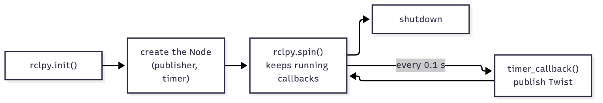
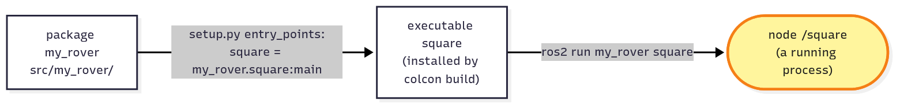

<!-- _class: lead -->
<!-- _paginate: false -->
<!-- header: Mars Rover Academy · Part 1 -->

# Mission 4: Survey Square

Typing commands one at a time gets old fast. Write a program that drives the rover for you: a survey square, 4 metres per side, through four beacons.

**You will learn:** package · `ros2 pkg create` · publisher · timer · `setup.py` · open loop

<!--
Suggested time: 60 minutes. This is where people get stuck most: setup.py, and forgetting to build or source. Budget time for walking around.
Goal of the session: everyone has their own package my_rover with a node that finishes the square.
-->

---

<!-- _class: roadmap -->
<!-- header: Where we are -->

# Part 1 roadmap

| | # | Mission | You learn |
|---|---|---|---|
| ✓ | 0 | Landing | workspace, build, launch, teleop, remapping |
| ✓ | 1 | Telemetry | nodes, topics, messages |
| ✓ | 2 | Manual Drive | publishing `Twist`, speeds and angles |
| ✓ | 3 | Mission Control | services: request and response |
| **▶** | **4** | **Survey Square** | **a package and a Python publisher** |
| | 5 | Waypoints | subscribers, `Odometry`, closed-loop control |
| | 6 | Sample Hunter | camera and laser, service clients in code |
| | 7 | Rover Fleet | namespaces, parameters, launch files |
| | 8 | Boss: Power Crisis | all of the above, state machines, battery |

<!--
About 1 minute.
Missions 1 to 3 were all done from the terminal. From today on we write our own nodes in Python. Everything from mission 2 (Twist, cmd_vel, the 1-second rule, the rover rolling to a stop) comes back, now in code.
-->

---

<!-- header: Mission 4 · Goal -->

# Today's goal


**Objectives**
1. Drive a square through the beacons 1 → 2 → 3 → 4
2. Drive the rover with your own node (no teleop / `ros2 topic pub`)

**Stars:** ≤ 30 s = ⭐⭐⭐ · ≤ 45 s = ⭐⭐ · the clock starts when the rover starts moving

<!--
About 2 minutes.
Point at the screenshot: the rover's tracks show the square, ending a little off its starting point. Keep that in mind; it's the punchline at the end.
Objective 2 matters: mission_control checks the node name of whoever publishes on cmd_vel. Yours will be `square`, not teleop_twist_keyboard or _ros2cli_..., so typing the commands by hand doesn't count. Teleporting is detected too.
-->

---

<!-- header: Mission 4 · Start -->

# Launch the mission

```bash
# Terminal 1
ros2 launch mission_control mission.launch.py mission:=4
```

- The rover starts on the lander at (3, 3), facing right
- The beacons are at (7, 3), (7, 7), (3, 7) and (3, 3), in that order
- So each side is 4 metres, and every corner is a 90° left turn
- The last beacon is where you started: it only counts once the rover has left

<!--
About 2 minutes.
Leave this terminal running. Draw the square on the board with the four beacon positions; it helps when we write the plan in step 5.
-->

---

<!-- header: Mission 4 · Concept -->

# What we're building


- Your node `square`: a timer drives a publisher
- It publishes on `/rover1/cmd_vel`, the same topic `ros2 topic pub` used in mission 2
- mission_control checks the node name of whoever publishes on `cmd_vel`

<!--
About 2 minutes. The best habit to build: draw the map before coding. What goes in, what comes out?
Yellow is you: for the first time the yellow box is a node you write. The simulator can't tell your node from ros2 topic pub; mission_control can, by the node's name.
Ask: does anything come back into our node? No. Keep that thought for the end.
-->

---

<!-- header: Mission 4 · Step 1 of 5 -->

# Step 1: Create a package

ROS 2 code always lives in a **package**. Create your own in `src/`:

<style scoped>pre { font-size: 17px; }</style>

```bash
cd ~/mars_rover/src
ros2 pkg create --build-type ament_python --license Apache-2.0 my_rover \
  --dependencies rclpy geometry_msgs nav_msgs sensor_msgs std_msgs std_srvs mars_interfaces
```

- `--build-type ament_python` makes it a Python package
- `--dependencies ...` lists the other packages you'll use; they get written into `package.xml` for you

> Careful: put the package name before `--dependencies`. Everything after it is read as a dependency.

<!--
About 3 minutes.
Make sure people are inside src/ before running it, otherwise the package ends up in the wrong place and colcon won't find it.
The backslash continues the command on the next line; copying both lines together is fine.
Today only rclpy and geometry_msgs are needed; the rest are for later missions, and listing them now saves editing package.xml then.
Common mistake: the package name typed after --dependencies. It gets read as a dependency and ros2 pkg create complains or names the package wrong.
-->

---

<!-- header: Mission 4 · Step 1 of 5 -->

# What you get

```text
src/my_rover/
├── my_rover/
│   └── __init__.py      ← your .py files go in this folder
├── package.xml          ← the package's ID card: name, maintainer, dependencies
├── setup.py             ← which programs `ros2 run` can start from this package
├── setup.cfg
├── LICENSE
├── resource/
└── test/
```

Note the two levels: `src/my_rover/my_rover/`. Your code goes in the inner folder.

<!--
About 2 minutes.
The double folder confuses almost everyone. The outer my_rover is the package, the inner my_rover is the Python module. Today we only touch two files: a new .py file in the inner folder, and setup.py.
-->

---

<!-- header: Mission 4 · Step 2 of 5 -->

# Step 2: A first node (part 1 of 3)

<style scoped>pre { font-size: 18px; }</style>

Create `src/my_rover/my_rover/square.py`:

```python
# my_rover/my_rover/square.py  (first version)
import rclpy
from rclpy.executors import ExternalShutdownException
from rclpy.node import Node
from geometry_msgs.msg import Twist


class Square(Node):
    def __init__(self):
        super().__init__('square')  # node name (shows up in ros2 node list)
        # publisher: sends Twist to /rover1/cmd_vel (10 = message queue size)
        self.publisher = self.create_publisher(Twist, '/rover1/cmd_vel', 10)
        # timer: call timer_callback every 0.1 s
        self.timer = self.create_timer(0.1, self.timer_callback)
```

<!--
About 4 minutes, typing included.
Every node is a class that inherits from Node. The constructor does three things: give the node a name, create a publisher (same topic and type as mission 2), and create a timer.
The name 'square' is what mission_control checks for objective 2.
Common mistake: a typo in the topic name, e.g. missing the leading slash or writing rover instead of rover1.
-->

---

<!-- header: Mission 4 · Step 2 of 5 -->

# Step 2: A first node (part 2 of 3)

```python
    def timer_callback(self):
        msg = Twist()
        msg.linear.x = 1.0   # 1 m/s forward
        msg.angular.z = 0.5  # 0.5 rad/s to the left
        self.publisher.publish(msg)
```

- The timer calls this every 0.1 s
- It fills a `Twist`, exactly like the YAML you typed in mission 2, and publishes it
- Forward and turning at the same time: the rover drives in circles

<!--
About 2 minutes.
Compare with mission 2: there you wrote "{linear: {x: 1.0}, angular: {z: 0.5}}" in YAML; here the same fields are set in Python.
Watch the indentation: this method belongs inside the class, at the same level as __init__.
-->

---

<!-- header: Mission 4 · Step 2 of 5 -->

# Step 2: A first node (part 3 of 3)

<style scoped>pre { font-size: 17px; } p { margin: 10px 0 0; }</style>

```python
def main():
    rclpy.init()           # 1. start ROS 2
    node = Square()        # 2. create the node
    try:
        rclpy.spin(node)   # 3. "spin": wait for timers/messages and run their callbacks, forever
    except (KeyboardInterrupt, ExternalShutdownException):
        pass               #    until Ctrl+C
    finally:
        node.destroy_node()
        rclpy.try_shutdown()  # 4. shut down


if __name__ == '__main__':
    main()
```

The full file is in the guide, `missions/04-survey-square.md`, Step 2.

<!--
About 2 minutes.
main() is the same in every node you'll write in this course: init, create, spin, shut down. `def main` is not indented: it's outside the class.
Depending on the ROS 2 version, Ctrl+C arrives as a KeyboardInterrupt or as an ExternalShutdownException. Catching both lets the node exit quietly instead of printing a traceback.
-->

---

<!-- header: Mission 4 · Step 2 of 5 -->

# Anatomy of a node



- You don't write a `while True:` loop with `sleep()` yourself
- You tell ROS to call a function every 0.1 s, and `spin()` takes care of it
- It sends every 0.1 s because of the **1-second rule**: stop sending and the rover stops

<!--
About 2 minutes.
spin() keeps the node free to react to things. The next mission shows why that matters: the node has to stay free to receive incoming messages. A while loop with sleep would block that.
-->

---

<!-- header: Mission 4 · Step 3 of 5 -->

# Step 3: Register the program

Open `src/my_rover/setup.py`, find `entry_points` and add this line:

```python
    entry_points={
        'console_scripts': [
            'square = my_rover.square:main',
        ],
    },
```

That reads as "the command `square` runs the `main` function in `my_rover/square.py`".

<!--
About 3 minutes.
This is the step people get wrong most often. Only add the one line inside the existing list; don't paste a second entry_points. Check the quotes and the trailing comma.
If this line is missing, ros2 run says "No executable found".
-->

---

<!-- header: Mission 4 · Step 3 of 5 -->

# Package, executable, node



- The **package** is the box of code
- The **executable** is one program in it
- The **node** is what that program creates when it runs

One executable can be started many times as separate nodes, which is exactly what you'll do in mission 7.

<!--
About 2 minutes.
Three different names that are easy to mix up, and here they are almost the same word (my_rover, square, /square). Ask the room which names `ros2 run` takes (package and executable) and which one shows up in `ros2 node list` (the node).
-->

---

<!-- header: Mission 4 · Step 4 of 5 -->

# Step 4: Build and run

```bash
cd ~/mars_rover                # always build at the workspace root, not inside src/
colcon build --symlink-install --packages-select my_rover
source install/setup.bash
ros2 run my_rover square
```

**You should see:** the rover drives in circles with a 2 m radius (1.0 / 0.5, as in mission 2). Stop it with `Ctrl+C`.

<!--
About 5 minutes; this is where the stuck slides come in handy.
Common mistakes: building inside src/ (creates a second build/install there), forgetting to source after the build ("Package 'my_rover' not found"), and a missing setup.py line ("No executable found").
Keep the mission from the start running in its own terminal. The circles start the mission clock, so we relaunch before the square.
-->

---

<!-- header: Mission 4 · Step 4 of 5 -->

# Check it from another terminal

While it runs:

```bash
ros2 node list                          # /square is there now
ros2 topic info -v /rover1/cmd_vel      # the publisher is your node
```

With `--symlink-install`, the .py files in `install/` are only shortcuts back to `src/`, so you can **edit your code and run it again without rebuilding**.

The exception is `setup.py`: if you change it (to add a new program, say), build and source again.

<!--
About 2 minutes.
Learners should see /square in the node list and "Node name: square" under the publishers. Your node is now a node like any other; the tools from mission 1 work on it.
-->

---

<!-- header: Mission 4 · Step 5 of 5 -->

# Step 5: Drive the square

A square is four repeats of "drive 4 m straight, turn left 90°".

Instead of sending the same command forever, write a **plan**: a list of steps

`(forward speed, turn speed, duration)`

The timer checks the clock to know which step it's in.

The rover needs a moment to roll to a stop after each move (up to 1 s from full speed, mission 2). So the plan has short **wait** steps with zero speed between the moves.

<!--
About 3 minutes.
Before showing code, ask: at 0.5 m/s, how long for 4 m? (8 s.) At 1 rad/s, how long for 90 degrees? (pi/2, about 1.57 s.)
Why the waits: if the next step started straight away, the rover would still be rolling forward while it begins to turn, and the corners would become curves. One of the extras is to take the waits out and watch exactly that.
-->

---

<!-- header: Mission 4 · Step 5 of 5 -->

# The new square.py (part 1 of 4)

Change `square.py` to:

```python
# my_rover/my_rover/square.py
import math

import rclpy
from rclpy.executors import ExternalShutdownException
from rclpy.node import Node
from geometry_msgs.msg import Twist

SPEED = 0.5       # forward speed (m/s)
TURN_SPEED = 1.0  # turning speed (rad/s)
SIDE = 4.0        # side length (m)
```

<!--
About 1 minute.
New: `import math` (for pi) and three constants at the top, so they're easy to change later when chasing three stars.
-->

---

<!-- header: Mission 4 · Step 5 of 5 -->

# The new square.py (part 2 of 4)

<style scoped>pre { font-size: 17px; }</style>

```python
class Square(Node):
    def __init__(self):
        super().__init__('square')
        self.publisher = self.create_publisher(Twist, '/rover1/cmd_vel', 10)
        self.timer = self.create_timer(0.1, self.timer_callback)

        # the plan: (forward speed, turn speed, duration) for one side, repeated 4 times
        one_side = [
            (SPEED, 0.0, SIDE / SPEED),                     # drive one side
            (0.0, 0.0, 1.0),                                # wait for the rover to roll to a stop
            (0.0, TURN_SPEED, (math.pi / 2) / TURN_SPEED),  # turn left 90 degrees
            (0.0, 0.0, 0.7),                                # wait for the turn to settle
        ]
        self.plan = one_side * 4
        self.step = 0                    # which step of the plan we're in
        self.step_started = self.now()   # when this step started
```

<!--
About 3 minutes.
Publisher and timer are the same as before. one_side has four steps: drive (8 s), wait (1 s), turn (pi/2 s), wait (0.7 s). Multiplying a Python list by 4 repeats it, so the plan has 16 steps.
self.now() is defined on the next slide.
-->

---

<!-- header: Mission 4 · Step 5 of 5 -->

# The new square.py (part 3 of 4)

<style scoped>pre { font-size: 17px; }</style>

```python
    def now(self) -> float:
        return self.get_clock().now().nanoseconds / 1e9  # current time in seconds

    def timer_callback(self):
        if self.step >= len(self.plan):
            self.publisher.publish(Twist())  # an empty Twist() = zero velocity = stop
            return
        linear, angular, duration = self.plan[self.step]
        if self.now() - self.step_started >= duration:
            self.step += 1  # this step is over -> next step
            self.step_started += duration
            return
        msg = Twist()
        msg.linear.x = linear
        msg.angular.z = angular
        self.publisher.publish(msg)
```

<!--
About 3 minutes.
now() turns the ROS clock into seconds.
Read timer_callback top to bottom: plan finished, so stop. Otherwise look up the current step. Time up, so move to the next step. Otherwise publish this step's speeds.
Note step_started += duration, not = now(): that way small delays don't add up from step to step.
-->

---

<!-- header: Mission 4 · Step 5 of 5 -->

# The new square.py (part 4 of 4)

<style scoped>pre { font-size: 18px; }</style>

```python
def main():
    rclpy.init()
    node = Square()
    try:
        rclpy.spin(node)
    except (KeyboardInterrupt, ExternalShutdownException):
        pass
    finally:
        node.destroy_node()
        rclpy.try_shutdown()


if __name__ == '__main__':
    main()
```

The full file is in the guide, `missions/04-survey-square.md`, Step 5.

<!--
About 1 minute.
main() is the same as in the first version, just without the comments. Point people at the guide if their file doesn't work: comparing with the full file is faster than debugging line by line.
-->

---

<!-- header: Mission 4 · Step 5 of 5 -->

# Run the square

The circles from step 4 already started the mission clock. Close and relaunch the mission so the rover goes back to the lander, then run it.

Thanks to `--symlink-install` there's no rebuild:

```bash
ros2 run my_rover square
```

**You should see:** *Mission complete*, most likely with **two stars**.

Why only two? Work it out from the plan.

<!--
About 3 minutes.
If someone gets 1 star with "teleop / ros2 topic pub detected", they still have teleop or a ros2 topic pub running somewhere. "teleport detected" means they called /rover1/teleport.
Let people think about the two stars for a minute before the next slide.
-->

---

<!-- header: Mission 4 · Solution -->

# Solution: why only 2 stars?

Each side: 8 s driving (4 m at 0.5 m/s) + 1 s waiting + about 1.6 s turning (π/2 at 1.0 rad/s) + 0.7 s settling.

Three sides and most of the fourth come to about **40 seconds**, which is more than 30.

Try the rover's top speeds, `SPEED = 1.0` and `TURN_SPEED = 2.0`. The square then takes about 23 seconds.

Does it get less accurate?

<!--
Show only after people have tried. Let them experiment with the constants; no rebuild needed.
Answer to the last question (from the guide): not much here, because the wait steps are long enough for the rover to stop even from its top speed.
The fourth side counts only until the rover reaches beacon 4, which is why it's "most of the fourth".
-->

---

<!-- header: Mission 4 · Checkpoint -->

# Stuck? (1 of 2)

| Symptom | Fix |
|---|---|
| `No executable found` | missing line in `setup.py` / forgot to rebuild after editing `setup.py` / forgot `source install/setup.bash` |
| `Package 'my_rover' not found` | forgot `source install/setup.bash` (in the terminal where you `ros2 run`) |
| `error: option --editable not recognized` | a setuptools installed with pip is too new: `pip3 install --user "setuptools<80"` (Ubuntu 24.04 also needs `--break-system-packages`) |

<!--
These three are all build or source problems. Walk around the room at this point. Pair people who finished with people who are stuck.
-->

---

<!-- header: Mission 4 · Checkpoint -->

# Stuck? (2 of 2)

<style scoped>table { font-size: 21px; }</style>

| Symptom | Fix |
|---|---|
| the square misses a beacon | did you relaunch the mission so the rover starts on the lander, facing right? |
| the clock was already running before you started | it starts the first time the rover moves; close and relaunch the mission |
| 1 star + "teleop / ros2 topic pub detected" | teleop or `ros2 topic pub` is still running in another terminal; close them all and retry |
| 1 star + "teleport detected" | you called `/rover1/teleport`; relaunch the mission and let your node do the driving |

**Done?** Everyone should have seen *Mission complete* before moving on.

<!--
These are all "the run wasn't clean" problems. The fix is almost always: close everything, relaunch the mission, run the node once.
The teleport row catches people who are still in the habit from mission 3.
-->

---

<!-- header: Mission 4 · System map -->

# What you built


- Your node publishes on `/rover1/cmd_vel`, so the simulator can't tell it from `ros2 topic pub`
- Inside the node, a timer drives a publisher
- Nothing comes back into your node, so it can't see where the rover is

<!--
About 2 minutes.
Point out that there is no arrow from /rover1/odom to square. Only mission_control listens to the odometry. That's the lead-in to the summary.
-->

---

<!-- header: Mission 4 · Summary -->

# Summary

<style scoped>li { font-size: 24px; } blockquote { font-size: 23px; }</style>

- **package**: created with `ros2 pkg create`. Code lives in `<pkg>/<pkg>/` and programs are registered in `setup.py`
- **publisher**: `self.create_publisher(Type, 'topic', 10)`, then `.publish(msg)`
- **timer**: `self.create_timer(seconds, function)`. ROS calls you periodically
- Lifecycle: `rclpy.init()`, create the node, `rclpy.spin()`, shut down
- Run `colcon build --symlink-install` once, then edit .py files freely. Changing `setup.py` needs a rebuild

> The rover stopped about 0.3 m from where it started, even though every number in the plan is right. This node drives with its eyes closed and only counts time: **open loop**.

<!--
About 3 minutes.
Every move ends a little off: the timer only looks at the clock every 0.1 s, so a side can run a few centimetres long or a turn a degree or two too far. The plan never finds out, so each corner starts from a slightly wrong place, and the errors add up around the square. If someone teleported the rover halfway, the node would carry on with the plan without noticing either.
In the next mission the rover reads its own position, and there's sand on the way.
-->

---

<!-- header: Mission 4 · Check yourself -->

# Check yourself

1. Who publishes on `/rover1/cmd_vel` while `square` runs, and how can you check?
2. You add a second program to `setup.py`. What do you have to do before `ros2 run` finds it?
3. Why does the rover end about 0.3 m away from where it started, when every number in the plan is right?
4. Someone teleports the rover halfway through the square. What does your node do?

<!--
Answers:
1. Your node, /square. `ros2 topic info -v /rover1/cmd_vel` shows it under the publishers.
2. Build again and source again. Editing .py files needs no rebuild with --symlink-install, but setup.py does.
3. Open loop: every side and every turn ends slightly off (the timer only looks at the clock every 0.1 s), and the node never checks where the rover really is, so the position and heading errors add up from corner to corner.
4. It carries on with the plan without noticing. It only counts time.
-->

---

<!-- _class: checklist -->
<!-- header: Mission 4 · Checklist -->

# Before you move on, can you...

- create a Python package with `ros2 pkg create`?
- write a node with a publisher and a timer?
- register a program in `setup.py` and start it with `ros2 run`?
- say when you have to build and source again, and when you don't?
- explain the difference between a package, an executable and a node?
- explain why this node is "open loop", and why it ends a little off its start?

<!--
The same list is in CHECKLIST.md for learners to tick off. Anyone unsure about the fourth one: have them change a comment in square.py and run it again without building, then add a line to setup.py and see that it needs a build.
-->

---

<!-- _class: roadmap -->
<!-- header: Where we are -->

# Next: Mission 5, Waypoints

| | # | Mission | You learn |
|---|---|---|---|
| ✓ | 0 | Landing | workspace, build, launch, teleop, remapping |
| ✓ | 1 | Telemetry | nodes, topics, messages |
| ✓ | 2 | Manual Drive | publishing `Twist`, speeds and angles |
| ✓ | 3 | Mission Control | services: request and response |
| ✓ | 4 | Survey Square | a package and a Python publisher |
| **▶** | **5** | **Waypoints** | **subscribers, `Odometry`, closed-loop control** |
| | 6 | Sample Hunter | camera and laser, service clients in code |
| | 7 | Rover Fleet | namespaces, parameters, launch files |
| | 8 | Boss: Power Crisis | all of the above, state machines, battery |

<!--
Extras for fast finishers (from the guide): drive a triangle or a 5-pointed star (a star turns 144 degrees at each tip); take out the two wait steps and watch the corners become curves; make the rover announce the side it's driving with a publisher to /rover1/radio (type std_msgs/msg/String).
The 3-star reference to demo, if you have the solutions package: ros2 run rover_solutions square.
Keep my_rover: mission 5 adds a second node to the same package.
-->
