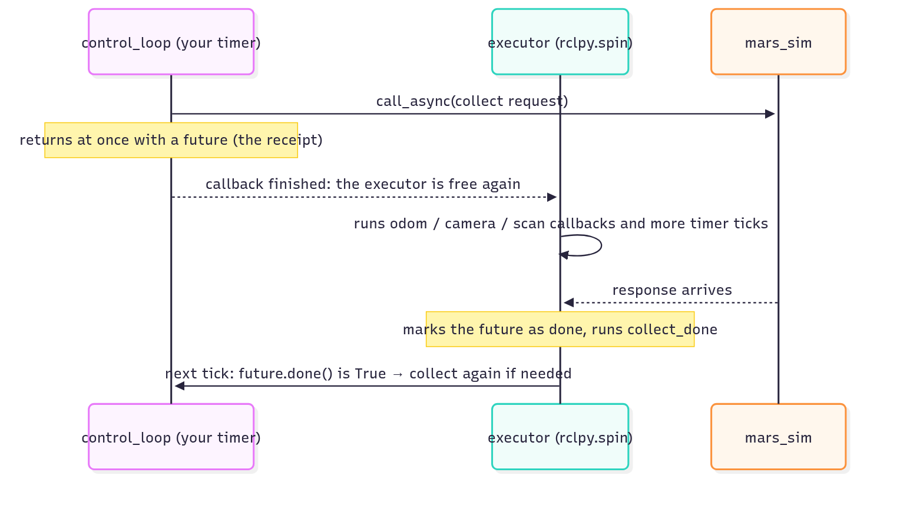
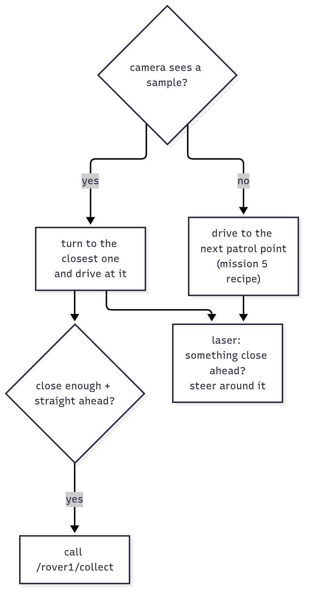

<!-- _class: lead -->
<!-- _paginate: false -->
<!-- header: Mars Rover Academy · Part 1 -->

# Mission 6: Sample Hunter

No coordinates this time. Six samples are scattered around the map, with rocks in between. Find them with the camera, steer around the rocks with the laser, and call the collect service from your own code.

**You will learn:** sensors that report relative to the robot · `LaserScan` · service clients in code · `call_async` and futures · simple obstacle avoidance

<!--
Suggested time: 60 to 75 minutes.
Goal of the session: everyone has a sample_hunter node that finds and collects five samples by itself, without hitting a rock.
It reuses the steering recipe and yaw_from_quaternion from go_to_goal.py, so make sure everyone finished mission 5 first.
This is a good mission for a class contest: everyone launches with the same seed (mission:=6 seed:=2026) and the fastest time wins.
-->

---

<!-- _class: roadmap -->
<!-- header: Where we are -->

# Part 1 roadmap

| | # | Mission | You learn |
|---|---|---|---|
| ✓ | 0 | Landing | workspace, build, launch, teleop, remapping |
| ✓ | 1 | Telemetry | nodes, topics, messages |
| ✓ | 2 | Manual Drive | publishing `Twist`, speeds and angles |
| ✓ | 3 | Mission Control | services: request and response |
| ✓ | 4 | Survey Square | a package and a Python publisher |
| ✓ | 5 | Waypoints | subscribers, `Odometry`, closed-loop control |
| **▶** | **6** | **Sample Hunter** | **camera and laser, service clients in code** |
| | 7 | Rover Fleet | namespaces, parameters, launch files |
| | 8 | Boss: Power Crisis | all of the above, state machines, battery |

<!--
In mission 3 we called services from the terminal. Today we call one from code, which brings a new trap: deadlock. In mission 5 we subscribed to odometry; today two of the topics are sensors.
-->

---

<!-- header: Mission 6 · Goal -->

# Today's goal


**Objectives**
1. Collect samples (0/5)
2. Drive the rover with your own node (no teleop, `ros2 topic pub` or teleport)

**Stars:** ≤ 90 s = ⭐⭐⭐ · ≤ 180 s = ⭐⭐ · bumping into a rock = ⭐⭐ at most

The clock starts when the rover starts moving.

```bash
# Terminal 1
ros2 launch mission_control mission.launch.py mission:=6
```

<!--
Launch it now. The samples are the small blue crystals; most of them are not in view at the start, so the rover has to find them.
Point at the screenshot: the light cone is the camera, the red marks are where the laser hits rocks.
Six samples are on the map but only five are needed, so missing one is fine.
A bump caps the run at 2 stars even if it's fast. Keep that in mind for the 3-star hint at the end.
-->

---

<!-- header: Mission 6 · Concept -->

# The rover's sensors

| Sensor | Topic | Sees | Used for |
|---|---|---|---|
| camera (the light cone) | `/rover1/camera/detections` | samples, rocks and other objects, 60° wide, up to 6 m | finding samples |
| laser scanner (red marks) | `/rover1/scan` | rocks, other rovers and the edge of the map, 180° in front, 0.15–8 m | not hitting things |

Both publish 10 times per second.

`/rover1/collect` only works on a sample within **1.0 m** and less than **30°** to either side of straight ahead.

<!--
Point at the two sensors in the window: the light cone is the camera, the red marks show where laser rays hit something.
The camera is for finding, the laser is for not crashing. Two sensors, two jobs.
The collect limits matter later: the code aims a bit closer than 1.0 m so the sample is safely in reach.
-->

---

<!-- header: Mission 6 · Concept -->

# The camera

<style scoped>pre { font-size: 17px; }</style>

The simulator does the image processing and reports what it recognised: a `DetectionArray`, a header plus `detections`, a list of everything in view (empty = nothing in sight).

```bash
ros2 interface show mars_interfaces/msg/Detection
```

```text
# One object seen by the rover's camera.
string kind        # sample | rock | landmark | drill_site | core | meteorite
string id          # unique name of the object, e.g. "sample_3" or "Olympus Rock"
float32 range      # distance from the rover's centre to the object's centre, in metres
float32 bearing    # angle to the object in radians: 0 = straight ahead, + = to the left
```

No x and y: "a sample, 2.5 m away, 0.3 radians to the left". Real cameras and LiDAR also report **relative to the robot itself**.

<!--
Run the interface show command live. Detection is a type from the course's own interface package, mars_interfaces.
The key idea of the day: the sensor answers "where is it from me?", not "where is it on the map?".
Ask: bearing 0.3, is that left or right? (Left, positive is left, like yaw.)
-->

---

<!-- header: Mission 6 · Concept -->

# The laser

<style scoped>pre { font-size: 17px; }</style>

`/rover1/scan` is a `sensor_msgs/msg/LaserScan`, the message every real 2D LiDAR uses:

```bash
ros2 topic echo --once /rover1/scan --no-arr
```

```text
header: ...
angle_min: -1.5707963705062866       ← the first ray points −90°, to the right
angle_max: 1.5707963705062866        ← the last ray points +90°, to the left
angle_increment: 0.01745329238474369 ← 1° between rays
range_min: 0.15000000596046448
range_max: 8.0
ranges: '<sequence type: float, length: 181>'
...
```

`--no-arr` hides the long lists. Leave it out to see all 181 numbers.

<!--
Run it live. The arrows are annotations from the guide, they are not printed.
LaserScan is a standard message, so everything learned here works on a real robot's LiDAR.
-->

---

<!-- header: Mission 6 · Concept -->

# Which ray points where?

`ranges` is a list of 181 distances, one per ray. Ray `i` points at `angle_min + i * angle_increment` (0 = straight ahead, + = left):

```text
                   ranges[90]  (0°, straight ahead)
                        ↑
  ranges[180]  ←      rover      →  ranges[0]
  (+90°, left)                      (−90°, right)
```

- A ray that hits nothing within 8 m reports `inf`. `min()` still works on it.
- The laser sits 0.3 m in front of the rover's centre: distances are measured from the nose.

> Experiment freely with `ros2 topic echo` and `ros2 service call`. Only driving by hand (teleop, `ros2 topic pub` on `cmd_vel`) and teleporting cost stars, until you relaunch.

<!--
Ask: which index is straight ahead? (90.) Which is 90° to the left? (180.) Ray 0 is on the right, which surprises people.
inf is a normal float in Python: inf > 3.0 is True, so min() and comparisons just work.
The camera measures from the rover's centre, the laser from the nose. That's why the numbers don't quite agree for the same rock.
-->

---

<!-- header: Mission 6 · Concept -->

# What we're building


- Three topics in, one topic out (`cmd_vel`), plus a service call (`collect`)
- The camera has done the hard part (perception), so your node only **decides**

<!--
Draw this on the board before coding.
This is the first node that uses both kinds of communication: topics and a service.
Topics bring the world in, the node thinks, and topics and services act on the result. Every mission from here on has that shape.
samples_onboard and bumps go to mission_control: that's how it counts your samples and notices a bump.
-->

---

<!-- header: Mission 6 · Step 1 of 4 -->

<style scoped>pre { font-size: 16px; }</style>

# Step 1: Look around (part 1 of 3)

Create `src/my_rover/my_rover/sample_hunter.py`:

```python
# my_rover/my_rover/sample_hunter.py  (first version: just look)
import math

import rclpy
from rclpy.executors import ExternalShutdownException
from rclpy.node import Node
from mars_interfaces.msg import DetectionArray
from sensor_msgs.msg import LaserScan


class SampleHunter(Node):
    def __init__(self):
        super().__init__('sample_hunter')
        self.create_subscription(DetectionArray, '/rover1/camera/detections', self.detections_callback, 10)
        self.create_subscription(LaserScan, '/rover1/scan', self.scan_callback, 10)
```

<!--
Same shape as go_to_goal's first version: subscriptions and callbacks, no publisher yet.
Common mistake: the import is mars_interfaces.msg for DetectionArray, but sensor_msgs.msg for LaserScan.
-->

---

<!-- header: Mission 6 · Step 1 of 4 -->

<style scoped>pre { font-size: 16px; }</style>

# Step 1: Look around (part 2 of 3)

```python
    def detections_callback(self, msg: DetectionArray):
        for d in msg.detections:
            self.get_logger().info(f'{d.kind} {d.id}: {d.range:.2f} m away, bearing {d.bearing:.2f} rad',
                                   throttle_duration_sec=0.5)

    def scan_callback(self, msg: LaserScan):
        # the ray whose angle is 0 points straight ahead
        middle = round((0.0 - msg.angle_min) / msg.angle_increment)
        ahead = msg.ranges[middle]
        if math.isinf(ahead):
            text = 'nothing within 8 m'
        else:
            text = f'{ahead:.2f} m'
        self.get_logger().info(f'{len(msg.ranges)} rays, straight ahead: {text}', throttle_duration_sec=1.0)
```

- Camera: log everything in view, at most twice a second
- Laser: find the ray at angle 0 and print its distance

<!--
middle is the "which ray points where" formula turned around: solve angle_min + i * angle_increment = 0 for i. It comes out as 90.
math.isinf catches the "nothing hit" case so we can print something friendlier than inf.
throttle_duration_sec limits the log, like in mission 5.
-->

---

<!-- header: Mission 6 · Step 1 of 4 -->

# Step 1: Look around (part 3 of 3)

```python
def main():
    rclpy.init()
    node = SampleHunter()
    try:
        rclpy.spin(node)
    except (KeyboardInterrupt, ExternalShutdownException):
        pass
    finally:
        node.destroy_node()
        rclpy.try_shutdown()


if __name__ == '__main__':
    main()
```

<!--
The same main() as go_to_goal, with SampleHunter instead.
-->

---

<!-- header: Mission 6 · Step 1 of 4 -->

# Register, build and run

Add `'sample_hunter = my_rover.sample_hunter:main',` to `setup.py`, then build, source and run as before:

```bash
cd ~/mars_rover
colcon build --symlink-install --packages-select my_rover
source install/setup.bash
ros2 run my_rover sample_hunter
```

**You should see** something like:

```text
[INFO] [sample_hunter]: rock rock_9: 3.61 m away, bearing -0.32 rad
[INFO] [sample_hunter]: 181 rays, straight ahead: nothing within 8 m
```

<!--
The build commands are the ones from mission 5.
What you see depends on the world. If nothing is in the camera cone there are no detection lines, which is fine. The laser line always appears.
The next steps send the rover searching.
-->

---

<!-- header: Mission 6 · Checkpoint -->

# Stuck?

| Symptom | Fix |
|---|---|
| `No executable found` | missing line in `setup.py` / forgot to rebuild after editing `setup.py` / forgot `source install/setup.bash` |
| no detection lines | fine if nothing is in the camera cone |
| 1 star + "teleop / ros2 topic pub detected" | teleop or `ros2 topic pub` is still running in another terminal; close them all and retry |

**Done?** Everyone has `sample_hunter` running and sees at least the laser line.

<!--
The first and last rows come from mission 4's troubleshooting table.
If someone drove by hand inside mission 6 already, they need to relaunch the mission before the real run.
-->

---

<!-- header: Mission 6 · Step 2 of 4 -->

# Step 2: Drive in

Driving in is easier than in mission 5, because `bearing` already is the heading error. You don't need atan2:

```python
cmd.angular.z = K_ANGULAR * target.bearing
if abs(target.bearing) < 0.5:
    cmd.linear.x = min(0.8 * target.range, MAX_SPEED)
```

| | Mission 5 | Mission 6 |
|---|---|---|
| target given as | x, y on the map | range, bearing from the rover |
| heading error | `math.atan2(dy, dx) - yaw`, wrapped | `target.bearing` |

<!--
Ask the class why: in mission 5 we had to turn a map position into "how far off am I pointing". The camera already answers that question.
Same P controller idea: turn harder the further off you point, and only drive when roughly facing the target.
-->

---

<!-- header: Mission 6 · Step 2 of 4 -->

# Step 2: Try collect by hand first

```bash
ros2 service call /rover1/collect std_srvs/srv/Trigger
```

```text
response:
std_srvs.srv.Trigger_Response(success=False, message='No sample within 1.0 m in front of the rover.')
```

- `std_srvs/srv/Trigger`: an empty request
- the response says whether it worked (`success`) and what happened (`message`)
- with a sample in view but out of reach, the message also says where the closest one is

<!--
Run it live. Calling the service from the terminal costs no stars, only driving by hand does.
Trigger is a standard service type, like Empty in mission 3 but with an answer.
-->

---

<!-- header: Mission 6 · Step 2 of 4 -->

<style scoped>pre { font-size: 18px; }</style>

# Step 2: A service client

This time you call it from inside your code. For that you need a **service client**:

```python
self.collect_client = self.create_client(Trigger, '/rover1/collect')        # when creating the node
...
self.collect_future = self.collect_client.call_async(Trigger.Request())    # when you want to collect
```

- `create_client(Type, 'name')` once, when the node is created
- `call_async(Request())` each time you want to collect

<!--
Compare with mission 3: there we typed ros2 service call. This is the same call, made from code.
The ... stands for the rest of the node; the full file comes after Step 4.
-->

---

<!-- header: Mission 6 · Step 2 of 4 -->

# Why `call_async`?

`call_async` places the order and hangs up instead of waiting on the line.

You get a receipt, a **future**, that you can check later with `future.done()`, or ask it to call a function of yours when the answer arrives with `future.add_done_callback(...)`.

Your code runs inside a callback. If it waits for the answer there, `spin()` is stuck with it and nobody is left to receive the response. Both sides wait forever and the rover freezes. That's a **deadlock**.

So you don't flood the service with requests, only send a new one once the previous one has been answered.

<!--
The restaurant picture works well: you phone in an order and hang up. You don't hold the line until the food arrives.
The executor (rclpy.spin) is the one worker that runs every callback, one at a time. If our callback blocks, that worker is gone.
-->

---

<!-- header: Mission 6 · Step 2 of 4 -->

# The order, step by step



<!--
Walk through the arrows top to bottom:
1. control_loop calls call_async and gets a future back at once.
2. control_loop returns, so the executor is free.
3. The executor keeps running odom, camera and scan callbacks and timer ticks.
4. The response arrives: the executor marks the future as done and runs collect_done.
5. On a later tick, control_loop sees future.done() is True and may collect again.
-->

---

<!-- header: Mission 6 · Step 3 of 4 -->

# Step 3: Nothing in sight, so patrol



If the camera sees no sample, the rover has to go and look: patrol along a fixed route with the "face the point and drive" recipe from mission 5.

That recipe needs the rover's own position, so you also subscribe to `/rover1/odom`.

`PATROL = [(5, 5), (15, 5), (15, 10), (5, 10), (5, 15), (15, 15)]`

With a 6 m camera it sweeps the whole area where samples can be, and mission_control keeps the rocks clear of it.

<!--
This is the whole brain of the node: one if/else plus a safety check, 20 times per second.
Point at the flowchart on the right and follow both branches. Both end in the laser box: whatever the rover decided, the laser gets the last word.
Sketch the route on the board: a zig-zag through the middle of the map.
-->

---

<!-- header: Mission 6 · Step 4 of 4 -->

# Step 4: Don't hit the rocks

A sample can sit behind a rock, and a bump caps you at 2 stars. Before publishing, look at the laser:

1. Find the closest thing in a wedge straight ahead (−0.5 to +0.5 rad, about ±29°).
2. If it's closer than 1 m, compare the room on the left (0.5 to 1.6 rad) and on the right (−1.6 to −0.5 rad).
3. Turn towards the side with more room. Creep forward slowly, or stop and turn on the spot if it's very close.

The simplest kind of obstacle avoidance: no path planning, it only reacts to what's in front right now. Enough here, because rocks are kept away from the patrol route.

<!--
Draw three wedges in front of a rover on the board: right, ahead, left.
Ask: which ray indices cover the "ahead" wedge? (About 61 to 119.) The code doesn't use indices; it computes each ray's angle and checks whether it's in range, which is easier to read.
Real robots plan paths (Nav2), but a reactive rule like this is still used as the last safety layer.
-->

---

<!-- header: Mission 6 · Put it all together -->

<style scoped>pre { font-size: 19px; }</style>

# Put it all together (part 1 of 10): imports

Change `sample_hunter.py` to:

```python
# my_rover/my_rover/sample_hunter.py
import math

import rclpy
from rclpy.executors import ExternalShutdownException
from rclpy.node import Node
from geometry_msgs.msg import Twist
from mars_interfaces.msg import DetectionArray
from nav_msgs.msg import Odometry
from sensor_msgs.msg import LaserScan
from std_srvs.srv import Trigger
```

<!--
Tell people to copy the file from the guide rather than type it from the slides. We walk through it in ten parts so they know what each one does.
New imports since the first version: Twist for driving, Odometry for the patrol, Trigger for the collect service.
-->

---

<!-- header: Mission 6 · Put it all together -->

<style scoped>pre { font-size: 16px; }</style>

# Part 2 of 10: constants

```python
MAX_SPEED = 0.6       # m/s
K_ANGULAR = 2.5
COLLECT_RANGE = 0.8   # the collect service reaches 1.0 m; aim a bit closer
SAFE_DISTANCE = 1.0   # something closer than this in front: steer around it
# when no sample is in sight, patrol through these points (rocks are kept clear of this route)
PATROL = [(5.0, 5.0), (15.0, 5.0), (15.0, 10.0), (5.0, 10.0), (5.0, 15.0), (15.0, 15.0)]


def yaw_from_quaternion(q) -> float:
    return math.atan2(2.0 * (q.w * q.z + q.x * q.y), 1.0 - 2.0 * (q.y * q.y + q.z * q.z))
```

- `COLLECT_RANGE`: collect only when closer than 0.8 m (the service reaches 1.0 m)
- `SAFE_DISTANCE`: something closer than 1 m in front means steer around it
- `yaw_from_quaternion`: the same function as in mission 5

<!--
Why 0.8 and not 1.0? A little margin, so the sample is safely in reach when the request arrives.
These numbers are the first place to look when tuning for 3 stars.
-->

---

<!-- header: Mission 6 · Put it all together -->

<style scoped>pre { font-size: 16px; }</style>

# Part 3 of 10: `__init__`

```python
class SampleHunter(Node):
    def __init__(self):
        super().__init__('sample_hunter')
        self.pose = None        # (x, y, yaw)
        self.detections = []    # what the camera saw last
        self.scan = None        # what the laser saw last
        self.patrol_index = 0
        self.create_subscription(Odometry, '/rover1/odom', self.odom_callback, 10)
        self.create_subscription(DetectionArray, '/rover1/camera/detections', self.detections_callback, 10)
        self.create_subscription(LaserScan, '/rover1/scan', self.scan_callback, 10)
        self.publisher = self.create_publisher(Twist, '/rover1/cmd_vel', 10)
        self.collect_client = self.create_client(Trigger, '/rover1/collect')
        self.collect_future = None
        self.create_timer(0.05, self.control_loop)
```

Three subscribers, one publisher, one service client, one timer: the system map in code.

<!--
Point at the map again and match each line to a box.
self.collect_future = None means "no request sent yet". collect() relies on that.
The timer runs control_loop every 0.05 s, 20 times a second.
-->

---

<!-- header: Mission 6 · Put it all together -->

<style scoped>pre { font-size: 18px; }</style>

# Part 4 of 10: callbacks

```python
    # -- callbacks only remember the latest data
    def odom_callback(self, msg: Odometry):
        p = msg.pose.pose
        self.pose = (p.position.x, p.position.y, yaw_from_quaternion(p.orientation))

    def detections_callback(self, msg: DetectionArray):
        self.detections = msg.detections

    def scan_callback(self, msg: LaserScan):
        self.scan = msg
```

Just like mission 5: the callbacks only remember the latest data. The timer does the thinking.

<!--
self.pose is a tuple (x, y, yaw), so later code reads it as self.pose[0] or unpacks it as px, py, yaw.
self.scan keeps the whole LaserScan message, because closest_in needs angle_min and angle_increment as well as the ranges.
-->

---

<!-- header: Mission 6 · Put it all together -->

<style scoped>pre { font-size: 18px; }</style>

# Part 5 of 10: `closest_in`

```python
    # -- helpers
    def closest_in(self, low: float, high: float) -> float:
        """Shortest laser range between two angles (radians, 0 = straight ahead, + = left)."""
        if self.scan is None:
            return math.inf
        best = math.inf
        for i, r in enumerate(self.scan.ranges):
            angle = self.scan.angle_min + i * self.scan.angle_increment
            if low <= angle <= high:
                best = min(best, r)
        return best
```

The "which ray points where" formula, used to find the closest thing in a wedge.

<!--
Walk through it: for every ray, work out its angle; if it's inside the wedge, keep the smallest distance.
Check yourself question 3 is about why best starts at math.inf. Don't give it away yet.
-->

---

<!-- header: Mission 6 · Put it all together -->

<style scoped>pre { font-size: 19px; }</style>

# Part 6 of 10: `steer_to`

```python
    def steer_to(self, x: float, y: float) -> Twist:
        """Same recipe as mission 5: face the point (x, y) and drive to it."""
        cmd = Twist()
        px, py, yaw = self.pose
        error = math.atan2(y - py, x - px) - yaw
        error = math.atan2(math.sin(error), math.cos(error))
        cmd.angular.z = K_ANGULAR * error
        if abs(error) < 0.5:
            cmd.linear.x = min(math.hypot(x - px, y - py), MAX_SPEED)
        return cmd
```

The mission 5 recipe packed into a method: face (x, y), drive only when roughly facing it.

<!--
Same maths as go_to_goal: angle to the point minus our yaw, wrapped into -pi..pi, times a gain.
It returns a Twist instead of publishing it, so control_loop can still change it (avoid_obstacles) before it goes out.
-->

---

<!-- header: Mission 6 · Put it all together -->

<style scoped>pre { font-size: 17px; }</style>

# Part 7 of 10: collecting

```python
    def collect(self):
        # only send a new request once the previous one was answered, so we don't spam
        if self.collect_future is None or self.collect_future.done():
            self.collect_future = self.collect_client.call_async(Trigger.Request())
            self.collect_future.add_done_callback(self.collect_done)

    def collect_done(self, future):
        self.get_logger().info(future.result().message)   # what the service said
```

- `collect()`: the "don't flood" rule from Step 2
- `collect_done()`: runs when the answer arrives, and logs the service's message

<!--
collect(): a new request only when there is none yet, or the last one is done.
collect_done is called by the executor once the response is in, which is the "runs collect_done" box in the sequence diagram. future.result() is the Trigger response, so .message is the text we saw from the terminal in Step 2.
-->

---

<!-- header: Mission 6 · Put it all together -->

<style scoped>pre { font-size: 16px; }</style>

# Part 8 of 10: `avoid_obstacles`

```python
    def avoid_obstacles(self, cmd: Twist):
        """Change cmd if the laser sees something close ahead."""
        if cmd.linear.x <= 0.0 or self.closest_in(-0.5, 0.5) >= SAFE_DISTANCE:
            return   # not driving forward, or the way is clear
        left = self.closest_in(0.5, 1.6)
        right = self.closest_in(-1.6, -0.5)
        cmd.angular.z = 1.5 if left > right else -1.5   # turn towards the side with more room
        cmd.linear.x = 0.15 if self.closest_in(-0.5, 0.5) > 0.6 else 0.0   # very close: turn on the spot
```

Step 4 in code: three wedges, one decision.

- way clear, or not driving forward: leave `cmd` alone
- otherwise turn towards the side with more room, and creep (0.15 m/s) or stop (closer than 0.6 m)

<!--
Match each line to the three numbered rules on the Step 4 slide.
It changes cmd in place and returns nothing. That's why control_loop calls it right before publish.
Common question: why not avoid when turning on the spot? Turning in place can't hit anything in front.
-->

---

<!-- header: Mission 6 · Put it all together -->

<style scoped>pre { font-size: 16px; }</style>

# Part 9 of 10: control loop, a sample in sight

```python
    # -- the decision, 20 times a second
    def control_loop(self):
        if self.pose is None:
            return
        samples = [d for d in self.detections if d.kind == 'sample']
        if samples:
            target = min(samples, key=lambda d: d.range)   # the closest one
            cmd = Twist()
            cmd.angular.z = K_ANGULAR * target.bearing      # bearing is already the heading error
            if abs(target.bearing) < 0.5:
                cmd.linear.x = min(0.8 * target.range, MAX_SPEED)
            if target.range < COLLECT_RANGE and abs(target.bearing) < 0.4:
                self.collect()
```

A sample in sight: chase the closest one, and collect when it's close and straight ahead.

<!--
No pose yet: do nothing this tick.
min with key=range picks the closest sample. The camera also reports rocks, so filtering by kind matters.
The collect check uses both range and bearing: 0.8 m and 0.4 rad are inside the service's 1.0 m and 30° (0.52 rad), with a little margin.
-->

---

<!-- header: Mission 6 · Put it all together -->

<style scoped>pre { font-size: 16px; }</style>

# Part 10 of 10: patrol, avoid, publish

```python
        else:
            x, y = PATROL[self.patrol_index]
            if math.hypot(x - self.pose[0], y - self.pose[1]) < 0.8:
                self.patrol_index = (self.patrol_index + 1) % len(PATROL)   # reached -> next point
            cmd = self.steer_to(x, y)
        self.avoid_obstacles(cmd)
        self.publisher.publish(cmd)
```

No sample in sight: patrol. Within 0.8 m of a patrol point, move on to the next one.

Whatever was decided, the laser gets the last word before publishing.

`main()` stays the same. The full file is in `missions/06-sample-hunter.md`, "Put it all together".

<!--
% len(PATROL) wraps the index back to 0 after the last point, so the patrol goes round and round.
Both branches end with a cmd; avoid_obstacles may change it; it's published once at the end of the loop.
-->

---

<!-- header: Mission 6 · Put it all together -->

<style scoped>pre { font-size: 17px; }</style>

# Run it

```bash
ros2 run my_rover sample_hunter
```

```text
[INFO] [sample_hunter]: Collected sample_17. Samples on board: 1
[INFO] [sample_hunter]: No sample within 1.0 m in front of the rover. The closest one in view is 3.5 m away, 2 deg to the right.
...
```

The rover finds its own samples now: a small autonomous robot. Count them with `ros2 topic echo /rover1/samples_onboard`.

The panel shows *Mission complete* and your stars.

<!--
No rebuild needed, setup.py didn't change. Stop the old node with Ctrl+C and run again.
The "No sample within 1.0 m" line right after each "Collected" is normal: that's Check yourself question 2.
If the rover reaches a sample but never collects it: check the collect call and that COLLECT_RANGE is below 1.0.
To retry for stars, relaunch the mission in terminal 1 first.
-->

---

<!-- header: Mission 6 · Hint -->

# Hint: want 3 stars?

- Patrol speed and chase speed don't have to be the same. The rover can do 1.0 m/s.
- Look at the timer when the mission ends. Over 90 s? Speed is the problem. Under 90 s with ⭐⭐? You bumped into something: watch `ros2 topic echo /rover1/bumps` and find out where.
- While chasing a sample, a rock can end up between you and it. Is 1 m early enough to start steering away at your speed?

<!--
Show only after people have tried.
Your 3-star reference to demo, if you have the rover_solutions package: ros2 run rover_solutions sample_hunter --ros-args -r __ns:=/rover1. Let people try these ideas first.
-->

---

<!-- header: Mission 6 · Extra -->

# Extras

Hide the camera cone and laser marks on the map (the simulator's parameter, so it doesn't count for anything):

```bash
ros2 param set /mars_sim show_sensors false
```

If you have RViz installed (`ros-<distro>-desktop`), run `rviz2`, set *Fixed Frame* to `map` and add the `/rover1/scan` and `/mars/markers` topics.

You'll see the same scan in 3D, the way you'd look at a real robot's LiDAR. Mission 10 does more with RViz.

<!--
For fast finishers.
ros2 param set is a preview of mission 7: every node can have parameters you change from outside.
RViz is optional; the ros-base install used in class may not have it.
-->

---

<!-- header: Mission 6 · System map -->

# What happened behind the scenes


- Most sensors report relative to the robot: range and bearing, not world coordinates
- `LaserScan`: ray `i` points at `angle_min + i * angle_increment`, `inf` = nothing in range
- Service client: `create_client`, then `call_async`; keep the `future` and check `.done()`

<!--
Same map as before, now with the code behind it.
Never wait on the line inside a callback, or you get a deadlock.
The decision: if a sample is in sight, chase it; if not, patrol; if something is close ahead, steer around it.
-->

---

<!-- header: Mission 6 · Check yourself -->

# Check yourself

1. The camera reports a sample at range 2.5, bearing −0.3. Where is it? Can the rover collect it yet?

2. Right after each `Collected ...` line there's a `No sample within 1.0 m ...` line. Why?

3. Why does `closest_in` start from `math.inf` and not from 0?

4. What would happen if `control_loop` waited for the collect response before returning?

<!--
Let people discuss in pairs first.
1. 0.3 rad (about 17°) to the right, 2.5 m from the rover's centre. Not yet: the service reaches 1.0 m, and the code waits for less than 0.8 m (COLLECT_RANGE) and a bearing under 0.4.
2. The camera publishes 10 times per second and the control loop runs 20 times. Right after the collect succeeds, self.detections still holds the last camera frame, which still shows the sample. The loop calls collect once more and the simulator says there's nothing there. Sensor data is always a little old.
3. It looks for the smallest distance. Starting from 0 would always return 0, "something touching the nose", and the rover would never move. Infinity means "nothing seen yet"; every real ray can only make it smaller. Before the first scan arrives, inf also means "the way is clear", the right guess at start-up.
4. Deadlock. spin() is stuck inside our callback, so nobody receives the response; both sides wait forever and the rover freezes.
-->

---

<!-- _class: checklist -->
<!-- header: Mission 6 · Checklist -->

# Before you move on, can you...

- pick the closest sample from a `DetectionArray`, and say what range and bearing mean?
- find the angle of laser ray `i` and the closest obstacle in front?
- create a service client and call it with `call_async`?
- say what a future is and when to check `.done()`?
- explain why waiting inside a callback causes a deadlock?
- describe the hunter's decision: chase, patrol, or steer around a rock?

<!--
The same list is in CHECKLIST.md for learners to tick off. Anyone unsure about the deadlock: go back to the sequence diagram and ask who receives the response.
-->

---

<!-- _class: roadmap -->
<!-- header: Where we are -->

# Next: Mission 7, Rover Fleet

| | # | Mission | You learn |
|---|---|---|---|
| ✓ | 0 | Landing | workspace, build, launch, teleop, remapping |
| ✓ | 1 | Telemetry | nodes, topics, messages |
| ✓ | 2 | Manual Drive | publishing `Twist`, speeds and angles |
| ✓ | 3 | Mission Control | services: request and response |
| ✓ | 4 | Survey Square | a package and a Python publisher |
| ✓ | 5 | Waypoints | subscribers, `Odometry`, closed-loop control |
| ✓ | 6 | Sample Hunter | camera and laser, service clients in code |
| **▶** | **7** | **Rover Fleet** | **namespaces, parameters, launch files** |
| | 8 | Boss: Power Crisis | all of the above, state machines, battery |

<!--
Next mission runs this same sample_hunter on two rovers at once, so keep sample_hunter.py working.
-->
