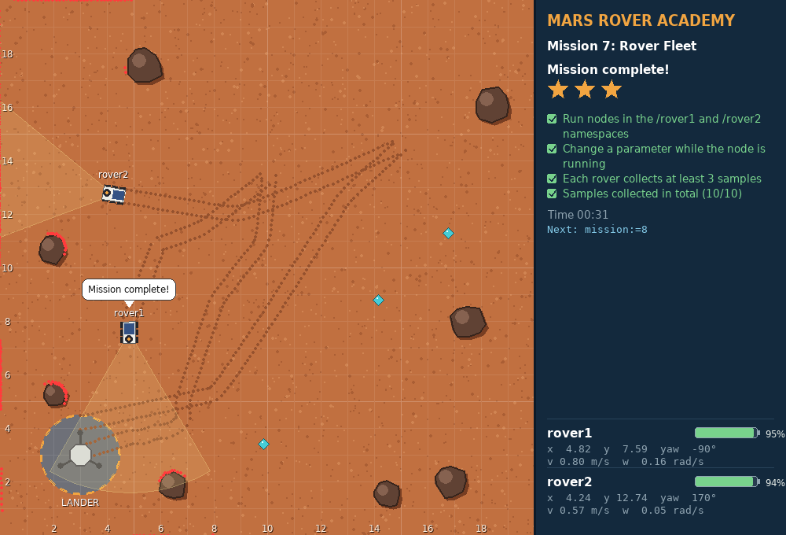
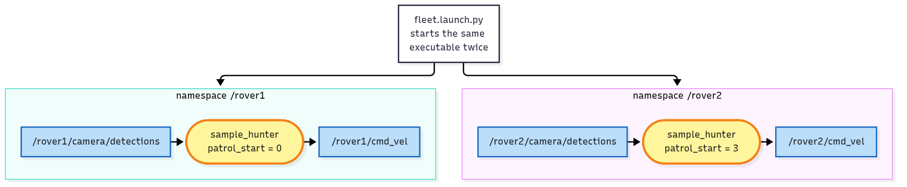
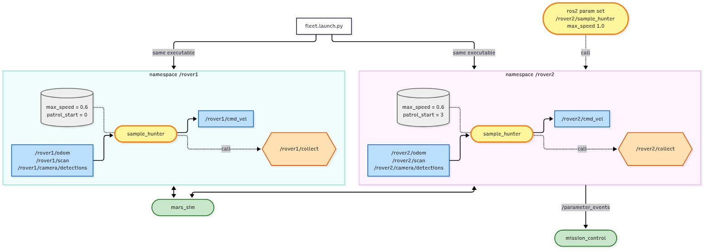

<!-- _class: lead -->
<!-- _paginate: false -->
<!-- header: Mars Rover Academy · Part 1 -->

# Mission 7: Rover Fleet

`rover2` has landed next to the first one. Run the same node for both rovers instead of writing a second program.

**You will learn:** namespaces · relative names · parameters · `ros2 param` · launch files

<!--
Suggested time: 45 to 60 minutes.
Goal of the session: one sample_hunter executable drives two rovers, a parameter is changed while it runs, and one launch file starts the whole fleet.
Everyone needs a working mission 6 sample_hunter before starting. If someone's doesn't work yet, pair them up or let them copy the mission 6 code from the guide first.
-->

---

<!-- _class: roadmap -->
<!-- header: Where we are -->

# Part 1 roadmap

| | # | Mission | You learn |
|---|---|---|---|
| ✓ | 0 | Landing | workspace, build, launch, teleop, remapping |
| ✓ | 1 | Telemetry | nodes, topics, messages |
| ✓ | 2 | Manual Drive | publishing `Twist`, speeds and angles |
| ✓ | 3 | Mission Control | services: request and response |
| ✓ | 4 | Survey Square | a package and a Python publisher |
| ✓ | 5 | Waypoints | subscribers, `Odometry`, closed-loop control |
| ✓ | 6 | Sample Hunter | camera and laser, service clients in code |
| **▶** | **7** | **Rover Fleet** | **namespaces, parameters, launch files** |
| | 8 | Boss: Power Crisis | all of the above, state machines, battery |

<!--
One mission left before the boss. Today we don't write a new robot program; we learn how to reuse the one from mission 6.
-->

---

<!-- header: Mission 7 · Goal -->

# Today's goal



**Objectives**
1. Run nodes in the `/rover1` and `/rover2` namespaces
2. Change a parameter while the node is running
3. Each rover collects at least 3 samples
4. Samples collected in total (0/10)

**Stars:** ≤ 90 s = ⭐⭐⭐ · ≤ 180 s = ⭐⭐ · the clock starts when a rover starts moving

<!--
Point at the screenshot: two rovers, each with its own camera cone, and the panel with four objectives.
Fourteen samples are out there and Earth wants ten of them.
Start the mission now in terminal 1 and leave it running (next slide).
The clock only starts when a rover moves, so typing commands costs no stars.
-->

---

<!-- header: Mission 7 · Goal -->

# Start the mission

```bash
# Terminal 1
ros2 launch mission_control mission.launch.py mission:=7
```

Leave this terminal running for the whole mission.

`rover2` starts at (3, 4.2), just above the lander, facing right. It has the same topics and services as `rover1`, under its own name: `/rover2/odom`, `/rover2/cmd_vel`, `/rover2/collect` and so on.

Check with `ros2 topic list`.

<!--
Everyone launches now. If the window doesn't open, it's almost always a missing source install/setup.bash.
Old sample_hunter from mission 6 still running somewhere? Stop it, or rover1 starts moving before we want it to (ros2 node list shows it).
In ros2 topic list, point out that every rover topic appears twice, once under /rover1 and once under /rover2. The simulator itself uses namespaces.
-->

---

<!-- header: Mission 7 · Concepts -->

# Three tools for reusing a node

| Tool | Solves | Example |
|---|---|---|
| **namespace** | the same node talks to different robots | `/rover1/scan` vs `/rover2/scan` |
| **parameter** | values you want to tune without editing code | top speed, starting patrol point |
| **launch file** | start many nodes with one command | 2 hunters, two namespaces, different values |



<!--
Ask the room first: we have a sample_hunter for rover1. What's the laziest way to get one for rover2? Someone will say "copy the file and replace rover1 with rover2". Then ask what happens when you have 50 rovers, or fix a bug in one copy. That's the problem these three tools solve.
We use one tool per step: namespaces in step 1, parameters in step 2, a launch file in step 3. The picture is where we end up.
-->

---

<!-- header: Mission 7 · Step 1 of 3 -->

# Step 1: Take the rover's name out of the code

Right now `sample_hunter.py` uses **absolute** names, which start with `/`. `'/rover1/scan'` is hard-wired to rover1.

With **relative** names (no leading `/`), such as `'scan'`, ROS prepends the node's namespace for you:

| Node namespace | `'scan'` becomes | `'camera/detections'` becomes |
|---|---|---|
| `/` (not set) | `/scan` | `/camera/detections` |
| `/rover1` | `/rover1/scan` | `/rover1/camera/detections` |
| `/rover2` | `/rover2/scan` | `/rover2/camera/detections` |

<!--
Draw this on the board: the namespace is like a folder, and the relative name is a file inside it.
'camera/detections' shows a relative name can have more than one part: only the leading slash matters.
Ask: what does 'scan' become if we don't set a namespace? (/scan, which nobody publishes, so the rover would see nothing.)
-->

---

<!-- header: Mission 7 · Step 1 of 3 -->

<style scoped>pre { font-size: 17px; }</style>

# Step 1: Change 5 lines

In `__init__` of `sample_hunter.py`, drop `/rover1/` from the five names:

```python
        self.create_subscription(Odometry, 'odom', self.odom_callback, 10)
        self.create_subscription(DetectionArray, 'camera/detections', self.detections_callback, 10)
        self.create_subscription(LaserScan, 'scan', self.scan_callback, 10)
        self.publisher = self.create_publisher(Twist, 'cmd_vel', 10)
        self.collect_client = self.create_client(Trigger, 'collect')
```

Three subscriptions, one publisher, one service client: all five must change.

<!--
Common mistake: fixing four lines and forgetting the service client. That's exactly "Check yourself" question 1, so don't give it away yet; just insist on "all five".
They don't need to rebuild: they built with --symlink-install, so Python changes take effect on the next ros2 run.
-->

---

<!-- header: Mission 7 · Step 1 of 3 -->

# Step 1: Run two copies

Set the namespace with `--ros-args -r __ns:=...`, one terminal each:

```bash
ros2 run my_rover sample_hunter --ros-args -r __ns:=/rover1
```

```bash
ros2 run my_rover sample_hunter --ros-args -r __ns:=/rover2
```

In a third terminal:

```bash
ros2 node list
# /mars_sim
# /mission_control
# /rover1/sample_hunter
# /rover2/sample_hunter      ← same node, two bodies!
```

<!--
Learners should see both rovers start hunting and objective 1 tick.
-r means remap; __ns is the special name for the node's namespace.
Typo watch: two underscores in __ns, and the leading slash in /rover1.
-->

---

<!-- header: Mission 7 · Step 1 of 3 -->

# Step 1: What you should see

Both rovers hunt, but they patrol nose-to-tail like a parade, because both start at the same patrol point.

The laser sees the other rover too, so they steer around each other rather than crash.

Stop both with `Ctrl+C` before the next step.

> Note: after this change, replaying mission 6 needs `--ros-args -r __ns:=/rover1` too. Without it the node listens on `/odom` and `/scan`, which nobody publishes, and the rover never moves.

<!--
Let them watch the parade for a moment, then ask: how would you make rover2 start somewhere else without a second copy of the code? That leads straight into parameters.
Make sure both nodes are really stopped (ros2 node list should show neither), otherwise step 2 runs with a leftover node.
-->

---

<!-- header: Mission 7 · Step 2 of 3 -->

# Step 2: Parameters you can change from outside

Move the values worth tuning into **parameters**.

- declare them in `__init__` with `declare_parameter(name, default)`
- read them with `get_parameter(name).value`

Two parameters in our hunter:

| Parameter | Default | Replaces |
|---|---|---|
| `max_speed` | `0.6` | the `MAX_SPEED` constant from mission 6 |
| `patrol_start` | `0` | always starting at patrol point 0 |

Replace `sample_hunter.py` with the new version from the guide. The next slides show what changed.

<!--
A parameter is a named setting that belongs to one running node. Each copy of the node has its own set, so rover1 and rover2 can have different values.
Tell people to copy the file from the guide, not type it from the slides. We only walk through the parts that changed.
-->

---

<!-- header: Mission 7 · Step 2 of 3 -->

<style scoped>pre { font-size: 16px; }</style>

# The new file, part 1 of 6: imports and constants

```python
# my_rover/my_rover/sample_hunter.py
import math

import rclpy
from rclpy.executors import ExternalShutdownException
from rclpy.node import Node
from geometry_msgs.msg import Twist
from mars_interfaces.msg import DetectionArray
from nav_msgs.msg import Odometry
from sensor_msgs.msg import LaserScan
from std_srvs.srv import Trigger

K_ANGULAR = 2.5
COLLECT_RANGE = 0.8   # the collect service reaches 1.0 m; aim a bit closer
SAFE_DISTANCE = 1.0   # something closer than this in front: steer around it
# when no sample is in sight, patrol through these points (rocks are kept clear of this route)
PATROL = [(5.0, 5.0), (15.0, 5.0), (15.0, 10.0), (5.0, 10.0), (5.0, 15.0), (15.0, 15.0)]
```

<!--
Same imports as mission 6. The one change: MAX_SPEED is gone from the constants. It becomes a parameter on the next slide.
yaw_from_quaternion, which comes next in the file, is unchanged.
-->

---

<!-- header: Mission 7 · Step 2 of 3 -->

<style scoped>pre { font-size: 18px; }</style>

# Part 2 of 6: declare the parameters

```python
class SampleHunter(Node):
    def __init__(self):
        super().__init__('sample_hunter')
        self.declare_parameter('max_speed', 0.6)
        self.declare_parameter('patrol_start', 0)   # which patrol point to start from
        self.pose = None        # (x, y, yaw)
        self.detections = []    # what the camera saw last
        self.scan = None        # what the laser saw last
        self.patrol_index = self.get_parameter('patrol_start').value % len(PATROL)
```

- `declare_parameter` gives each parameter a name and a default
- `patrol_start` is read **once**, here, to pick the first patrol point
- `% len(PATROL)` keeps any number inside 0 to 5

<!--
Declare before you read: get_parameter on an undeclared name raises an error.
The default type matters: 0.6 is a float (a double), 0 is an integer. That's why ros2 param set later needs 1.0, not 1.
-->

---

<!-- header: Mission 7 · Step 2 of 3 -->

<style scoped>pre { font-size: 17px; }</style>

# Part 3 of 6: relative names

```python
        # relative names (no leading /) -> they live under the node's namespace
        self.create_subscription(Odometry, 'odom', self.odom_callback, 10)
        self.create_subscription(DetectionArray, 'camera/detections', self.detections_callback, 10)
        self.create_subscription(LaserScan, 'scan', self.scan_callback, 10)
        self.publisher = self.create_publisher(Twist, 'cmd_vel', 10)
        self.collect_client = self.create_client(Trigger, 'collect')
        self.collect_future = None
        self.create_timer(0.05, self.control_loop)
```

The five lines from step 1, unchanged. The rest of `__init__` is as in mission 6.

The three callbacks after `__init__` are unchanged too.

<!--
This is still inside __init__, right after the previous slide. Nothing new here; it's the step 1 change written into the full file.
-->

---

<!-- header: Mission 7 · Step 2 of 3 -->

<style scoped>pre { font-size: 19px; }</style>

# Part 4 of 6: read `max_speed` every time

```python
    # -- helpers
    def max_speed(self) -> float:
        # read every time -> `ros2 param set` takes effect immediately
        return self.get_parameter('max_speed').value
```

`max_speed()` is new. Everywhere mission 6 used `MAX_SPEED`, the code now calls `self.max_speed()`.

`closest_in`, `collect`, `collect_done` and `avoid_obstacles` are the same as in mission 6.

<!--
This small helper is the whole trick behind objective 2. Because the value is fetched on every call, a ros2 param set from outside shows up on the very next loop.
-->

---

<!-- header: Mission 7 · Step 2 of 3 -->

<style scoped>pre { font-size: 19px; }</style>

# Part 5 of 6: steering

```python
    def steer_to(self, x: float, y: float) -> Twist:
        """Same recipe as mission 5: face the point (x, y) and drive to it."""
        cmd = Twist()
        px, py, yaw = self.pose
        error = math.atan2(y - py, x - px) - yaw
        error = math.atan2(math.sin(error), math.cos(error))
        cmd.angular.z = K_ANGULAR * error
        if abs(error) < 0.5:
            cmd.linear.x = min(math.hypot(x - px, y - py), self.max_speed())
        return cmd
```

Only one line changed: `min(..., self.max_speed())`.

<!--
Point at the single changed line. Everything else is mission 6: face the point, drive only when roughly facing it.
-->

---

<!-- header: Mission 7 · Step 2 of 3 -->

<style scoped>pre { font-size: 16px; }</style>

# Part 6 of 6: the control loop

```python
    def control_loop(self):
        if self.pose is None:
            return
        samples = [d for d in self.detections if d.kind == 'sample']
        if samples:
            target = min(samples, key=lambda d: d.range)   # the closest one
            cmd = Twist()
            cmd.angular.z = K_ANGULAR * target.bearing      # bearing is already the heading error
            if abs(target.bearing) < 0.5:
                cmd.linear.x = min(0.8 * target.range, self.max_speed())
            if target.range < COLLECT_RANGE and abs(target.bearing) < 0.4:
                self.collect()
```

The speed limit is now `self.max_speed()` instead of `MAX_SPEED`. The patrol branch and `main()` are the same as in mission 6.

<!--
Same as mission 6 apart from the speed limit: the closest sample, turn towards it, slow down as you get close, collect when it's in reach.
Recap the changes in the whole file: names are relative, MAX_SPEED became a parameter read through max_speed(), and patrol_start picks the first patrol point. Everything else is mission 6.
-->

---

<!-- header: Mission 7 · Step 2 of 3 -->

<style scoped>pre { font-size: 18px; }</style>

# Step 2: Set and change parameters

At start-up, with `-p name:=value`. Patrol point 3 is (5, 10), on the other side of the route from rover1's start:

```bash
ros2 run my_rover sample_hunter --ros-args -r __ns:=/rover2 -p patrol_start:=3
```

While the node runs, from another terminal:

```bash
ros2 param list /rover2/sample_hunter               # which parameters exist
ros2 param get /rover2/sample_hunter max_speed      # current value
ros2 param set /rover2/sample_hunter max_speed 1.0  # change it! rover2 speeds up immediately
```

<!--
Run it live: start rover2 with patrol_start:=3 and point out it now heads somewhere else, so no more parade.
Then do list, get, set and let the room watch rover2 speed up.
Note the node name: /rover2/sample_hunter, namespace included. Leaving out the namespace gives "Node not found".
-->

---

<!-- header: Mission 7 · Step 2 of 3 -->

# Step 2: What `ros2 param` answers

```text
  max_speed
  patrol_start
  use_sim_time
Double value is: 0.6
Set parameter successful
```

Write `1.0`, not `1`. The parameter was declared with a decimal default, so it's a double, and `ros2 param set ... 1` would try to set an integer and be refused.

<!--
use_sim_time is a parameter every node gets for free; we didn't declare it.
The integer-versus-double mistake is the most common one today. If someone sees "Setting parameter failed", this is why.
-->

---

<!-- header: Mission 7 · Step 3 of 3 -->

# Step 3: A launch file for the whole fleet

Opening terminals one by one gets old fast. Write a **launch file** instead (it's plain Python).

Create the folder `src/my_rover/launch/` and in it `fleet.launch.py`.

Each `Node(...)` in the file is one `ros2 run` from steps 1 and 2:

| In the launch file | On the command line |
|---|---|
| `namespace='rover1'` | `-r __ns:=/rover1` |
| `parameters=[{'patrol_start': 0}]` | `-p patrol_start:=0` |

<!--
Ask: how many terminals would ten rovers need? A launch file starts all of them with one command.
The folder goes next to setup.py, so src/my_rover/launch/, not inside src/my_rover/my_rover/. That's a common mistake.
-->

---

<!-- header: Mission 7 · Step 3 of 3 -->

# Step 3: `fleet.launch.py`, part 1 of 2

```python
# my_rover/launch/fleet.launch.py
from launch import LaunchDescription
from launch_ros.actions import Node


def generate_launch_description():
    return LaunchDescription([
        Node(
            package='my_rover',
            executable='sample_hunter',
            namespace='rover1',                  # = -r __ns:=/rover1
            parameters=[{'patrol_start': 0}],    # = -p patrol_start:=0
        ),
```

<!--
ros2 launch calls generate_launch_description() and starts every node in the list it returns.
Read the two comments aloud: each argument is exactly what you typed on the command line in steps 1 and 2.
Note namespace='rover1' has no leading slash here; that's fine, it's still /rover1.
-->

---

<!-- header: Mission 7 · Step 3 of 3 -->

# Step 3: `fleet.launch.py`, part 2 of 2

```python
        Node(
            package='my_rover',
            executable='sample_hunter',
            namespace='rover2',
            parameters=[{'patrol_start': 3}],
        ),
    ])
```

Same package, same executable. Only the namespace and the parameter value differ.

<!--
Ask: how many lines would a third rover cost? (One more Node block.) That is the point of the whole mission.
-->

---

<!-- header: Mission 7 · Step 3 of 3 -->

<style scoped>pre { font-size: 18px; }</style>

# Step 3: Install the launch folder

`setup.py` must also install `launch/`. Add the imports at the top:

```python
import os
from glob import glob

from setuptools import find_packages, setup
```

and one line in `data_files`:

```python
    data_files=[
        ('share/ament_index/resource_index/packages',
            ['resource/' + package_name]),
        ('share/' + package_name, ['package.xml']),
        (os.path.join('share', package_name, 'launch'), glob('launch/*.launch.py')),
    ],
```

<!--
Your from setuptools import ... line may look slightly different. Leave it alone and just add import os and from glob import glob above it.
Only the last data_files line is new. Without it, ros2 launch says the file can't be found, because launch files are run from install/, not from src/.
-->

---

<!-- header: Mission 7 · Step 3 of 3 -->

# Step 3: Rebuild and start the fleet

Since `setup.py` changed, rebuild:

```bash
cd ~/mars_rover
colcon build --symlink-install --packages-select my_rover
source install/setup.bash
ros2 launch my_rover fleet.launch.py
```

While the fleet is hunting, take care of objective 2 from another terminal:

```bash
ros2 param set /rover2/sample_hunter max_speed 1.0
```

The panel shows *Mission complete* and your stars.

<!--
Changing Python code doesn't need a rebuild with --symlink-install, but changing setup.py always does.
Leftover nodes from steps 1 and 2 still running? Stop them first, or there are four hunters. ros2 node list shows them.
-->

---

<!-- header: Mission 7 · Checkpoint -->

# Stuck?

| Symptom | Fix |
|---|---|
| `file 'fleet.launch.py' was not found` | the `data_files` line is missing in `setup.py`, or you didn't rebuild and source after adding it |
| one rover doesn't move | a name in `sample_hunter.py` still starts with `/`; check with `ros2 node info /rover2/sample_hunter` |
| `Node not found` from `ros2 param` | the node name includes the namespace: `/rover2/sample_hunter`. Right after starting, wait a second and try again |
| `Setting parameter failed` | `max_speed` is a double: write `1.0`, not `1` |

<!--
These four rows are the guide's troubleshooting table. Walk around the room; the second row is the one you'll see most.
Pair people who finished with people who are stuck.
-->

---

<!-- header: Mission 7 · Checkpoint -->

<style scoped>table { font-size: 19px; } td code { white-space: nowrap; } table { margin-bottom: 20px; }</style>

# Summary

| | in code | with `ros2 run` | in a launch file |
|---|---|---|---|
| **namespace** | use relative names (`'scan'`) | `--ros-args -r __ns:=/rover1` | `namespace='rover1'` |
| **parameter** | `declare_parameter` + `get_parameter` | `--ros-args -p max_speed:=1.0` | `parameters=[{'max_speed': 1.0}]` |

Tune parameters live with `ros2 param list`, `get` and `set`. Launch files live in `<pkg>/launch/` and must be added to `data_files` in `setup.py`.

**Done?** Everyone should have seen *Mission complete* before moving on.

<!--
Real robot fleets use this same pattern: one codebase, a namespace per robot and parameters per robot. The simulator does it too: every rover's topics come from the same code, under /rover1, /rover2 and so on.
Contest idea from TEACHER.md: two learners each control one rover and compete for samples.
-->

---

<!-- header: Mission 7 · System map -->

<style scoped>h1 { margin-bottom: 4px; } p:has(> img:only-child) { margin: 0; } ul { margin-top: 4px; }</style>

# What happened behind the scenes



- One executable, started twice: each copy has its own namespace and parameters
- `ros2 param set` changes one node, which announces it on `/parameter_events`

<!--
Green = existing node, yellow = you, blue = topic, orange = service, grey = parameter.
So 'cmd_vel' in the code becomes /rover1/cmd_vel in one copy and /rover2/cmd_vel in the other.
Each copy also has its own parameters (the grey cylinders): same code, different settings.
ros2 param set uses the .../set_parameters family of services you skipped in mission 3. The node then announces the change on /parameter_events, and mission_control hears it: that's how objective 2 got ticked.
The launch file starts everything with the right namespaces and parameters in one command.
-->

---

<!-- header: Mission 7 · Extra -->

<style scoped>pre { font-size: 16px; }</style>

# Extras

- Add a `safe_distance` parameter and tune it live. Smoother round rocks, or avoiding things that aren't in the way?
- Put the mission in your launch file too, so one command starts everything:

```python
import os

from ament_index_python.packages import get_package_share_directory
from launch.actions import IncludeLaunchDescription
from launch.launch_description_sources import PythonLaunchDescriptionSource

mission = IncludeLaunchDescription(
    PythonLaunchDescriptionSource(os.path.join(
        get_package_share_directory('mission_control'), 'launch', 'mission.launch.py')),
    launch_arguments={'mission': '7'}.items(),
)
# then add `mission` to the LaunchDescription([...]) list
```

<!--
For fast finishers.
safe_distance: declare it like max_speed and read it every time in avoid_obstacles instead of SAFE_DISTANCE.
IncludeLaunchDescription runs another package's launch file from yours. Real robot bring-up files are mostly includes like this.
-->

---

<!-- header: Mission 7 · Check yourself -->

# Check yourself

1. You forget to change `'/rover1/collect'` to `'collect'` but fix every other line. What happens?

2. Why is `max_speed` read every loop but `patrol_start` only once?

<!--
Let people think or discuss in pairs for a minute before you answer.
1. rover2 chases samples just fine, but when it tries to collect it calls /rover1/collect. So rover1 picks up a sample (if one happens to be right in front of rover1) and rover2 never collects a thing: it hovers around its sample, calling the wrong service over and over. ros2 node info /rover2/sample_hunter shows which names a node is connected to.
2. patrol_start only matters at start-up, and changing it later means nothing. max_speed should be tunable live. If you read it once in __init__ and kept it, ros2 param set would change the value inside the node but your code would never read the new one.
-->

---

<!-- _class: checklist -->
<!-- header: Mission 7 · Checklist -->

# Before you move on, can you...

- run the same node for two rovers with `__ns`?
- explain how a relative name like `'cmd_vel'` becomes `/rover2/cmd_vel`?
- declare a parameter in code and read it?
- set a parameter at start-up and change it while the node runs?
- write a launch file and install it from `setup.py`?

<!--
The same list is in CHECKLIST.md for learners to tick off. Anyone stuck on the second item: start a node with and without __ns and compare ros2 node info for both.
The boss mission next time uses everything from missions 4 to 7, so this is a good moment to close gaps.
-->

---

<!-- _class: roadmap -->
<!-- header: Where we are -->

# Next: Mission 8, Boss: Power Crisis

| | # | Mission | You learn |
|---|---|---|---|
| ✓ | 0 | Landing | workspace, build, launch, teleop, remapping |
| ✓ | 1 | Telemetry | nodes, topics, messages |
| ✓ | 2 | Manual Drive | publishing `Twist`, speeds and angles |
| ✓ | 3 | Mission Control | services: request and response |
| ✓ | 4 | Survey Square | a package and a Python publisher |
| ✓ | 5 | Waypoints | subscribers, `Odometry`, closed-loop control |
| ✓ | 6 | Sample Hunter | camera and laser, service clients in code |
| ✓ | 7 | Rover Fleet | namespaces, parameters, launch files |
| **▶** | **8** | **Boss: Power Crisis** | **all of the above, state machines, battery** |

<!--
Next time is the boss: one rover again, but a battery that runs out. It reuses the mission 6 helpers, so keep sample_hunter.py around.
-->
