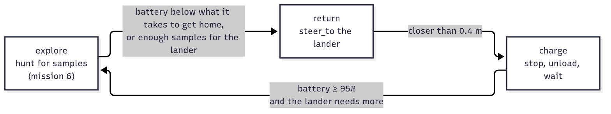

<!-- _class: lead -->
<!-- _paginate: false -->
<!-- header: Mars Rover Academy · Part 1 -->

# Mission 8: Power Crisis

The boss of Part 1. A dust storm has covered the solar panels. Bring six samples to the lander, coming home to recharge before the battery runs out, with nobody steering.

**You will learn:** thinking in states · sense, think, act · reading a battery · topics and services in one node

<!--
Suggested time: 60 to 90 minutes (or homework). Pairs work well for this one.
There's no complete program to copy this time, but missions 4 to 7 gave them everything they need. Learners get a skeleton with TODOs and one hint per TODO. The guide deliberately has no full solution.
Before class: build the instructor-only rover_solutions package if you want to demo the reference (ros2 run rover_solutions power_crisis). Afterwards, ARCHITECTURE.md's design patterns section makes a good wrap-up.
-->

---

<!-- _class: roadmap -->
<!-- header: Where we are -->

# Part 1 roadmap

| | # | Mission | You learn |
|---|---|---|---|
| ✓ | 0 | Landing | workspace, build, launch, teleop, remapping |
| ✓ | 1 | Telemetry | nodes, topics, messages |
| ✓ | 2 | Manual Drive | publishing `Twist`, speeds and angles |
| ✓ | 3 | Mission Control | services: request and response |
| ✓ | 4 | Survey Square | a package and a Python publisher |
| ✓ | 5 | Waypoints | subscribers, `Odometry`, closed-loop control |
| ✓ | 6 | Sample Hunter | camera and laser, service clients in code |
| ✓ | 7 | Rover Fleet | namespaces, parameters, launch files |
| **▶** | **8** | **Boss: Power Crisis** | **all of the above, state machines, battery** |

<!--
Last row of Part 1. Everything above it comes back today: the odometry subscriber from 5, the camera, laser and service client from 6, a package with an entry point from 4.
-->

---

<!-- header: Mission 8 · Goal -->

# Today's goal


**Objectives**
1. Samples delivered to the lander (0/6)
2. Drive the rover with your own node (no teleop, `ros2 topic pub` or teleport)

**Stars:** ≤ 170 s = ⭐⭐⭐ · ≤ 340 s = ⭐⭐ · the clock starts when the rover starts moving · **battery at 0% = mission failed**

The battery starts at 35% and drains four times faster than usual. The lander needs six of the nine samples, all more than 6 m away.

<!--
Point at the screenshot: six samples delivered, the rover parked on the lander.
One trip won't do it: the rover has to collect, come home before the battery runs out, unload, recharge and go out again.
Objective 2 means: no teleop, no ros2 topic pub and no teleport service.
-->

---

<!-- header: Mission 8 · Goal -->

# Start the mission

```bash
# Terminal 1
ros2 launch mission_control mission.launch.py mission:=8
```

Leave this terminal running.

**You should see:** the rover on the lander (the grey circle at (3, 3), radius 1.5 m), rocks, and the battery at 35% in the panel.

<!--
Make sure nothing from mission 7 is still running (ros2 node list). A leftover sample_hunter would drive rover1 around and drain the battery before anyone has written a line.
-->

---

<!-- header: Mission 8 · Concepts -->

# What you have to work with: topics in

| Name | Type | Used for |
|---|---|---|
| `/rover1/odom` | `nav_msgs/msg/Odometry` | the rover's position |
| `/rover1/camera/detections` | `mars_interfaces/msg/DetectionArray` | look for samples (`kind == 'sample'`) |
| `/rover1/scan` | `sensor_msgs/msg/LaserScan` | don't hit rocks |
| `/rover1/battery` | `sensor_msgs/msg/BatteryState` | `percentage`: 0.0 (empty) to 1.0 (full) |
| `/rover1/samples_onboard` | `std_msgs/msg/Int32` | samples on the rover right now |
| `/lander/samples` | `std_msgs/msg/Int32` | samples delivered so far |

<!--
Three of these are old friends from missions 5 and 6. The new ones are the battery and the two sample counters.
Good habit from TEACHER.md: draw the map on the board before anyone codes. What goes in, what comes out? Start with these six arrows going into a box called "power_crisis".
Let them check the new ones live: ros2 topic echo /lander/samples.
-->

---

<!-- header: Mission 8 · Concepts -->

# What you have to work with: what goes out

| Name | Kind | Type | Used for |
|---|---|---|---|
| `/rover1/cmd_vel` | topic (out) | `geometry_msgs/msg/Twist` | drive |
| `/rover1/collect` | service | `std_srvs/srv/Trigger` | collect a sample, as in mission 6 |
| `/rover1/unload` | service | `std_srvs/srv/Trigger` | hand everything on board to the lander; only works on the lander |

> The lander is the grey circle at (3, 3), with a radius of 1.5 m. The rover starts on it.

<!--
unload works like collect: a Trigger request, called with call_async.
Add these three arrows coming out of the box on the board.
-->

---

<!-- header: Mission 8 · Concepts -->

# The battery

```bash
ros2 topic echo /rover1/battery --field percentage
```

- Driving costs about **0.8% per metre**.
- Just being switched on costs 0.08% per second, even standing still: about 5% a minute.
- Parked on the lander (inside the circle and not driving), it **charges 3% per second**. From 10% to 95% takes under 30 s. `power_supply_status` says 1 (charging) while it does.
- At 0% the rover stops dead and the mission fails.

<!--
Run the echo live. It prints 0.35 (35%) at the start, and creeps down even while the rover stands still.
BatteryState is a standard message: real robot batteries report the same fields.
Ask: does driving slowly save energy? (No: it's per metre. Standing around costs a little per second.) That comes back in the 3-star hint.
-->

---

<!-- header: Mission 8 · Concepts -->

# Run out, and the mission fails


35% is about 40 m of driving.

The far end of the patrol route, (15, 15), is 17 m from the lander, so a single trip there and back uses most of what you start with.

The panel says why it failed. Close the window and launch again to retry.

<!--
This is what happens if you run the mission 6 hunter here unchanged: it hunts happily and dies in the sand.
Everyone will see this screen at least once today; that's part of the plan (round 1 of the TODOs).
-->

---

<!-- header: Mission 8 · Concepts -->

# Thinking in states

A robot doing a multi-step job is easiest to reason about as a set of **states**. On every loop it asks which state it's in and what that state calls for.

Here there are three, kept in `self.state`:



The hard part is the first arrow: when to give up exploring and head home. Too early and you waste time on short trips. Too late and the rover dies in the sand.

<!--
Walk the diagram left to right: explore is mission 6's hunter. When the battery gets low, or there are enough samples, switch to return: drive to the lander. Closer than 0.4 m: charge, which means stop, unload, wait. Charged and the lander still needs more: explore again.
Three boxes = three things the rover can be doing. The skeleton's control_loop has exactly this shape.
-->

---

<!-- header: Mission 8 · Concepts -->

# When to turn back?

"How much battery does it take to get home from here?"

Driving home costs 0.8% per metre in a straight line, but the rover turns, steers around rocks and drains a little every second as well. So budget 1.2% per metre, plus 5% to spare:

```python
needed = COST_PER_METRE * self.distance_home() + RESERVE    # 0.012 per metre + 0.05
```

At (15, 15), 17 m from the lander: 0.012 × 17 + 0.05 ≈ 0.25. With less than 25% left, it's time to go home.

<!--
Do the sum on the board together.
Measure it yourself with ros2 topic echo /rover1/battery --field percentage and change the numbers if you disagree. Engineers set margins like RESERVE from measurements, not by guessing.
-->

---

<!-- header: Mission 8 · Skeleton -->

# The skeleton

Create `src/my_rover/my_rover/power_crisis.py` from the skeleton and fill in the TODOs:

| TODO | What to write |
|---|---|
| 1 | subscribe to `/rover1/battery`, `/rover1/samples_onboard` and `/lander/samples` |
| 2 | a client for `/rover1/unload` (call it `self.unload_client`) |
| 3 | hunt for samples like mission 6's `control_loop`, and return the Twist |
| 4 | switch to `'return'` when the battery is below `needed`, or the lander has enough |
| 5 | steer to the lander; closer than 0.4 m: stop and switch to `'charge'` |
| 6 | unload while anything is on board; once `FULL` and the lander needs more, `'explore'` |

<!--
This is the to-do list from the skeleton's comments. TODOs 1 to 3 are mission 6 work. 4 to 6 are the three states of the diagram.
Tell people to copy the skeleton from the guide rather than typing it from the slides. The next ten slides walk through it.
-->

---

<!-- header: Mission 8 · Skeleton -->

<style scoped>pre { font-size: 19px; }</style>

# Skeleton, part 1 of 10: imports

```python
# my_rover/my_rover/power_crisis.py  (skeleton: fill in the TODOs)
import math

import rclpy
from rclpy.executors import ExternalShutdownException
from rclpy.node import Node
from geometry_msgs.msg import Twist
from mars_interfaces.msg import DetectionArray
from nav_msgs.msg import Odometry
from sensor_msgs.msg import BatteryState, LaserScan
from std_msgs.msg import Int32
from std_srvs.srv import Trigger
```

<!--
Two new imports compared with mission 6: BatteryState (next to LaserScan, both from sensor_msgs) and Int32 from std_msgs, for the sample counters.
-->

---

<!-- header: Mission 8 · Skeleton -->

<style scoped>pre { font-size: 17px; }</style>

# Part 2 of 10: constants

```python
LANDER = (3.0, 3.0)
GOAL = 6                 # samples the lander needs
PATROL = [(5.0, 5.0), (15.0, 5.0), (15.0, 10.0), (5.0, 10.0), (5.0, 15.0), (15.0, 15.0)]
MAX_SPEED = 0.6          # m/s
K_ANGULAR = 2.5
COLLECT_RANGE = 0.8
SAFE_DISTANCE = 1.0
COST_PER_METRE = 0.012   # battery used per metre (0.8 % measured, plus a margin)
RESERVE = 0.05           # never plan to arrive home with less than 5 %
FULL = 0.95              # charged enough to go out again


def yaw_from_quaternion(q) -> float:
    return math.atan2(2.0 * (q.w * q.z + q.x * q.y), 1.0 - 2.0 * (q.y * q.y + q.z * q.z))
```

<!--
The middle block is mission 6. New: LANDER, GOAL and the three battery numbers.
These battery numbers are the ones from the "When to turn back?" slide. They're the first place to look when tuning for 3 stars.
-->

---

<!-- header: Mission 8 · Skeleton -->

<style scoped>pre { font-size: 19px; }</style>

# Part 3 of 10: `__init__`, the state

```python
class PowerCrisis(Node):
    def __init__(self):
        super().__init__('power_crisis')
        self.pose = None
        self.detections = []
        self.scan = None
        self.battery = None      # 0.0 - 1.0, None = not received yet
        self.onboard = 0         # samples on the rover
        self.delivered = 0       # samples in the lander
        self.state = 'explore'   # 'explore', 'return' or 'charge'
        self.patrol_index = 0
```

<!--
Three new things to remember: battery, onboard and delivered. TODO 1's callbacks fill them in.
self.state is the state machine's memory. It starts in 'explore'.
-->

---

<!-- header: Mission 8 · Skeleton -->

<style scoped>pre { font-size: 16px; }</style>

# Part 4 of 10: `__init__`, the wiring

```python
        self.create_subscription(Odometry, '/rover1/odom', self.odom_callback, 10)
        self.create_subscription(DetectionArray, '/rover1/camera/detections', self.detections_callback, 10)
        self.create_subscription(LaserScan, '/rover1/scan', self.scan_callback, 10)
        # TODO 1: subscribe to /rover1/battery, /rover1/samples_onboard and /lander/samples
        self.publisher = self.create_publisher(Twist, '/rover1/cmd_vel', 10)
        self.collect_client = self.create_client(Trigger, '/rover1/collect')
        # TODO 2: a client for /rover1/unload  (call it self.unload_client)
        self.collect_future = None
        self.unload_future = None
        self.create_timer(0.05, self.control_loop)
```

Absolute `/rover1/...` names: there is only one rover this time.

<!--
Everything that isn't a TODO is mission 6 work, already done.
One future per service: collect_future and unload_future. call() on part 8 uses them.
-->

---

<!-- header: Mission 8 · Skeleton -->

<style scoped>pre { font-size: 18px; }</style>

# Part 5 of 10: callbacks

```python
    def odom_callback(self, msg: Odometry):
        p = msg.pose.pose
        self.pose = (p.position.x, p.position.y, yaw_from_quaternion(p.orientation))

    def detections_callback(self, msg: DetectionArray):
        self.detections = msg.detections

    def scan_callback(self, msg: LaserScan):
        self.scan = msg
```

The same three callbacks as in mission 6. TODO 1 adds three more like them.

<!--
Callbacks only remember the latest data; the timer does the thinking. The new callbacks for TODO 1 follow the same pattern.
-->

---

<!-- header: Mission 8 · Skeleton -->

<style scoped>pre { font-size: 19px; }</style>

# Part 6 of 10: helpers from mission 6

```python
    # -- helpers from mission 6
    def closest_in(self, low: float, high: float) -> float:
        if self.scan is None:
            return math.inf
        best = math.inf
        for i, r in enumerate(self.scan.ranges):
            angle = self.scan.angle_min + i * self.scan.angle_increment
            if low <= angle <= high:
                best = min(best, r)
        return best
```

<!--
Copied from mission 6, without the docstring: the shortest laser range between two angles.
-->

---

<!-- header: Mission 8 · Skeleton -->

<style scoped>pre { font-size: 16px; }</style>

# Part 7 of 10: more helpers from mission 6

```python
    def steer_to(self, x: float, y: float) -> Twist:
        cmd = Twist()
        px, py, yaw = self.pose
        error = math.atan2(y - py, x - px) - yaw
        error = math.atan2(math.sin(error), math.cos(error))
        cmd.angular.z = K_ANGULAR * error
        if abs(error) < 0.5:
            cmd.linear.x = min(math.hypot(x - px, y - py), MAX_SPEED)
        return cmd

    def avoid_obstacles(self, cmd: Twist):
        if cmd.linear.x <= 0.0 or self.closest_in(-0.5, 0.5) >= SAFE_DISTANCE:
            return
        left = self.closest_in(0.5, 1.6)
        right = self.closest_in(-1.6, -0.5)
        cmd.angular.z = 1.5 if left > right else -1.5
        cmd.linear.x = 0.15 if self.closest_in(-0.5, 0.5) > 0.6 else 0.0
```

<!--
Also from mission 6. steer_to slows down near the target (min of distance and MAX_SPEED), which helps the rover stop on the lander.
avoid_obstacles is called for every state, at the end of control_loop.
-->

---

<!-- header: Mission 8 · Skeleton -->

<style scoped>pre { font-size: 17px; }</style>

# Part 8 of 10: new helpers and `explore`

```python
    def call(self, client, future):
        """Send a Trigger request, unless the last one is still waiting for its answer."""
        if future is None or future.done():
            return client.call_async(Trigger.Request())
        return future

    def distance_home(self) -> float:
        return math.hypot(LANDER[0] - self.pose[0], LANDER[1] - self.pose[1])

    # -- the states
    def explore(self) -> Twist:
        # TODO 3: hunt for samples like mission 6's control_loop, and return the Twist
        #         collect with: self.collect_future = self.call(self.collect_client, self.collect_future)
        return Twist()
```

<!--
call() is mission 6's collect() made general: pass it a client and that client's future, and it gives back the future to keep. It only sends a new request once the last one has been answered.
distance_home is done for them. explore returns an empty Twist for now, so the rover won't move until TODO 3 is written.
-->

---

<!-- header: Mission 8 · Skeleton -->

<style scoped>pre { font-size: 15px; line-height: 1.45; } h1 { margin-bottom: 12px; }</style>

# Part 9 of 10: the control loop

```python
    def control_loop(self):
        if self.pose is None or self.battery is None:
            return
        needed = COST_PER_METRE * self.distance_home() + RESERVE   # battery to get home from here
        if self.state == 'explore':
            # TODO 4: switch to 'return' when the battery is below `needed`,
            #         or when delivered + on board is already enough for the lander
            cmd = self.explore()
        elif self.state == 'return':
            # TODO 5: steer to the lander; closer than 0.4 m: stop and switch to 'charge'
            cmd = Twist()
        else:  # 'charge'
            cmd = Twist()   # stand still: the rover only charges while it is parked
            # TODO 6: unload while anything is on board; once the battery is FULL
            #         and the lander still needs samples, go back to 'explore'
        self.avoid_obstacles(cmd)
        self.publisher.publish(cmd)
```

<!--
Put this next to the state diagram: one branch per state.
No battery reading yet: do nothing. That's why the bare skeleton doesn't move: nothing subscribes to the battery until TODO 1.
avoid_obstacles and publish happen once at the end, for every state.
-->

---

<!-- header: Mission 8 · Skeleton -->

# Part 10 of 10: `main`

```python
def main():
    rclpy.init()
    node = PowerCrisis()
    try:
        rclpy.spin(node)
    except (KeyboardInterrupt, ExternalShutdownException):
        pass
    finally:
        node.destroy_node()
        rclpy.try_shutdown()


if __name__ == '__main__':
    main()
```

<!--
Same main as every node since mission 4, with PowerCrisis instead of the old class name.
-->

---

<!-- header: Mission 8 · Skeleton -->

# Register and run

Add `'power_crisis = my_rover.power_crisis:main',` to `setup.py`, then build, source and run:

```bash
ros2 run my_rover power_crisis
```

The skeleton runs as it is, but the rover doesn't move: `control_loop` waits for a battery reading, and nothing subscribes to the battery yet.

<!--
The line goes into entry_points / console_scripts, next to sample_hunter and the others. Watch for the trailing comma.
Build and source as in mission 7: cd ~/mars_rover, colcon build --symlink-install --packages-select my_rover, source install/setup.bash. setup.py changed, so a rebuild is required this time; after that, edits to power_crisis.py don't need one.
-->

---

<!-- header: Mission 8 · Skeleton -->

# Fill in the TODOs, one at a time

Don't write it all in one go. Do one TODO, run, look. A good order:

1. **TODOs 1 and 3.** The rover hunts exactly like in mission 6, and keeps going until the battery runs out. Now you've seen the failure.
2. **TODOs 4 and 5.** The rover comes home in time, then sits on the lander and charges forever.
3. **TODOs 2 and 6.** It unloads, charges and goes back out.

Every failed run means closing the window and launching mission 8 again, so the world and the battery start fresh.

Hints for each TODO follow. Try first, look second.

<!--
This is where the session spends most of its time. Pairs: one types, one watches the map and the terminal, swap every round.
Common mistakes: forgetting to relaunch the mission after a failed run; forgetting to Ctrl+C and rerun the node after an edit; a callback that never sets self.battery.
-->

---

<!-- header: Mission 8 · Step 1 of 3 -->

# Step 1: TODOs 1 and 3

**TODO 1:** subscribe to `/rover1/battery`, `/rover1/samples_onboard` and `/lander/samples`, and remember the values.

**TODO 3:** fill in `explore()`, the hunt from mission 6.

**You should see:** the rover hunts exactly like in mission 6, and keeps going until the battery runs out. Mission failed.

<!--
Expect the failure screen; that's the point of round 1. It proves the hunt works and shows why the states are needed.
If the rover doesn't move at all: TODO 1 isn't done, so self.battery is still None.
-->

---

<!-- header: Mission 8 · Hint -->

<style scoped>pre { font-size: 18px; }</style>

# Hint: TODO 1

Three subscriptions, each with a callback that just remembers the value:

```python
self.create_subscription(BatteryState, '/rover1/battery', self.battery_callback, 10)
self.create_subscription(Int32, '/rover1/samples_onboard', self.onboard_callback, 10)
self.create_subscription(Int32, '/lander/samples', self.delivered_callback, 10)
...
def battery_callback(self, msg: BatteryState):
    self.battery = msg.percentage
```

The other two callbacks store `msg.data` in `self.onboard` and `self.delivered`.

<!--
Show only after people have tried.
The "..." means: the callback is a separate method in the class, not inside __init__.
-->

---

<!-- header: Mission 8 · Hint -->

# Hint: TODO 3

Copy the body of mission 6's `control_loop`, from `samples = ...` on, with three changes:

- `return cmd` at the end of the "sample in sight" branch, and `return self.steer_to(x, y)` at the end of the patrol branch.
- `self.collect()` becomes `self.collect_future = self.call(self.collect_client, self.collect_future)`.
- No `avoid_obstacles` and no `publish` here: `control_loop` does both for every state.

<!--
Show only after people have tried.
The pose check isn't needed either: control_loop already returns early when there's no pose.
-->

---

<!-- header: Mission 8 · Step 2 of 3 -->

# Step 2: TODOs 4 and 5

**TODO 4:** in `'explore'`, switch to `'return'` when the battery is below `needed`, or when delivered + on board is already enough for the lander.

**TODO 5:** in `'return'`, steer to the lander; closer than 0.4 m: stop and switch to `'charge'`.

**You should see:** the rover comes home in time, then sits on the lander and charges forever.

<!--
"Charges forever" is correct for now: TODO 6 is still empty, so the charge state never leaves.
Watch the battery in the panel climb by 3% per second once the rover is parked.
-->

---

<!-- header: Mission 8 · Hint -->

<style scoped>pre { font-size: 19px; }</style>

# Hint: TODO 4

```python
if self.battery < needed or self.delivered + self.onboard >= GOAL:
    self.get_logger().info(f'Heading home: battery {self.battery:.0%}, {self.onboard} on board')
    self.state = 'return'
```

The log line costs nothing and tells you why the rover turned round.

<!--
Show only after people have tried.
This sits above cmd = self.explore() in the 'explore' branch. Changing self.state here takes effect on the next tick, 0.05 s later.
:.0% formats 0.23 as 23%.
-->

---

<!-- header: Mission 8 · Hint -->

# Hint: TODO 5

```python
cmd = self.steer_to(*LANDER)
if self.distance_home() < 0.4:
    self.state = 'charge'
    cmd = Twist()   # stop
```

<!--
Show only after people have tried.
*LANDER unpacks the tuple into x and y.
0.4 m is well inside the 1.5 m circle, so the rover is safely parked when it starts charging.
-->

---

<!-- header: Mission 8 · Step 3 of 3 -->

# Step 3: TODOs 2 and 6

**TODO 2:** a client for `/rover1/unload` (call it `self.unload_client`).

**TODO 6:** in `'charge'`, unload while anything is on board; once the battery is `FULL` and the lander still needs samples, go back to `'explore'`.

**You should see:** the rover unloads, charges and goes back out, until the lander has all six.

<!--
After this round the mission should complete. If the rover leaves the lander with samples still on board, check the order in TODO 6: unload first, then check the battery.
-->

---

<!-- header: Mission 8 · Hint -->

# Hint: TODO 2

The same as the collect client:

```python
self.unload_client = self.create_client(Trigger, '/rover1/unload')
```

<!--
Show only after people have tried.
-->

---

<!-- header: Mission 8 · Hint -->

# Hint: TODO 6

```python
if self.onboard > 0:
    self.unload_future = self.call(self.unload_client, self.unload_future)
elif self.battery >= FULL and self.delivered < GOAL:
    self.get_logger().info('Charged, back to work')
    self.state = 'explore'
```

Once the lander has all six, the rover stays in `charge`, parked on the lander. The mission is over.

<!--
Show only after people have tried.
Nobody sets a speed here: cmd is the empty Twist from the line above the TODO, so the rover stands still and charges.
-->

---

<!-- header: Mission 8 · Hint -->

# Hint: want 3 stars?

With the hints as written the mission takes about 150 s, just inside 3 stars.

- The battery pays per metre, not per second, while driving. Driving slowly doesn't save energy, but standing around does cost some. What does that say about `MAX_SPEED`?
- The rover starts on the lander with 35%. Is a short charge before the first trip worth the seconds?
- Does the rover really need 95% before it goes out again? Work out how much the next trip costs.

<!--
Show only after people have tried.
Contest idea: everyone relaunches with the same seed (mission:=8 seed:=2026) and the fastest delivery wins.
-->

---

<!-- header: Mission 8 · Checkpoint -->

# Six samples in the lander?

Once the sixth sample is in the lander, Part 1 is over. To see how many stars you've collected:

```bash
ros2 run mission_control progress   # how many of the stars did you collect?
```

There's no full file to unlock here, on purpose: the hints cover every TODO. Still stuck? Ask your instructor to demo the 3-star reference solution, then write your own version.

<!--
Demo: ros2 run rover_solutions power_crisis (from the instructor-only rover_solutions package, see TEACHER.md). Let them watch it, then close it and have them write their own version.
-->

---

<!-- header: Mission 8 · System map -->

<style scoped>h1 { margin-bottom: 8px; } p:has(> img:only-child) { margin: 0; }</style>

# Sense, think, act


Topics bring the world in, your node decides what to do, and topics and services carry the decision back out.

<!--
Green = existing node, yellow = you, blue = topic, orange = service.
This is the classic shape of a robot program, usually called sense, think, act. The "think" box is the state machine we just built.
ARCHITECTURE.md's design patterns section shows this and other ways of combining nodes. Good material for the end of the session.
-->

---

<!-- header: Mission 8 · Check yourself -->

# Check yourself

1. The rover is exploring at (15, 15) with 30% battery left. Does it turn back yet?

2. The battery costs 0.8% per metre. Why does the skeleton budget 1.2%?

3. In the `'charge'` state, nothing sets a speed. Why does the rover stop, and why does it have to?

4. Why does `control_loop` call `avoid_obstacles` and `publish` once at the end, instead of in each state?

<!--
Let people think or discuss in pairs for a minute before you answer.
1. Not yet. (15, 15) is about 17 m from the lander, so needed = 0.012 × 17 + 0.05 ≈ 0.25. 30% is above that, so it keeps exploring; below 25% it turns round.
2. The 0.8% is for a straight line. The rover turns, steers around rocks and drains a little every second as well, so the budget needs a margin. RESERVE adds 5% on top.
3. cmd is an empty Twist(), and publishing an empty Twist means stop. The rover only charges while it is parked on the lander and not driving.
4. Every state needs both, so they live in one place: whatever the state decides, the laser gets the last word and exactly one command goes out per tick.
-->

---

<!-- _class: checklist -->
<!-- header: Mission 8 · Checklist -->

# Before you move on, can you...

- list a robot node's inputs and outputs as sense, think, act?
- describe a multi-step job as states, and what makes the rover change state?
- read the battery from `sensor_msgs/BatteryState` and decide when to turn back?
- call two different services from one node without spamming them?
- turn a skeleton into a working node, one TODO at a time?

<!--
The same list is in CHECKLIST.md for learners to tick off. These close Part 1. Anyone who can tick all five is ready for Part 2.
For the second item, ask them to draw the state diagram from memory on paper, arrows and conditions included.
-->

---

<!-- header: Mission 8 · What you can do now -->

<style scoped>table { font-size: 20px; } th, td { padding: 5px 14px; }</style>

# What you can do now

| ROS 2 skill | Missions |
|---|---|
| workspace, package, `colcon build`, `source`, `ros2 launch` | 0, 4 |
| nodes, topics, messages, `ros2 topic/node/interface` | 1 |
| publishing `Twist` to drive a robot | 2, 4 |
| services from the CLI and from code (`call_async`) | 3, 6 |
| publishers, subscribers and timers in Python | 4, 5 |
| `nav_msgs/Odometry`, quaternion to yaw, closed-loop control (P controller) | 5 |
| reading sensors relative to the robot (camera detections, `LaserScan`) | 6 |
| namespaces, parameters, launch files | 7 |
| designing robot behaviour as a state machine, managing a battery | 8 |

<!--
Read down the list with the room. Every row is something they did with their own hands, not just read about.
-->

---

<!-- _class: roadmap -->
<!-- header: Where we are -->

# Part 1 complete. Next: Mission 9, Arm Check

| | # | Mission | You learn |
|---|---|---|---|
| ✓ | 0 | Landing | workspace, build, launch, teleop, remapping |
| ✓ | 1 | Telemetry | nodes, topics, messages |
| ✓ | 2 | Manual Drive | publishing `Twist`, speeds and angles |
| ✓ | 3 | Mission Control | services: request and response |
| ✓ | 4 | Survey Square | a package and a Python publisher |
| ✓ | 5 | Waypoints | subscribers, `Odometry`, closed-loop control |
| ✓ | 6 | Sample Hunter | camera and laser, service clients in code |
| ✓ | 7 | Rover Fleet | namespaces, parameters, launch files |
| ✓ | 8 | Boss: Power Crisis | all of the above, state machines, battery |

**Part 2, missions 9 to 12:** Arm Check, Frames, Drill & Stow, Boss: Meteorite Recovery

<!--
Part 2: the rover grows arms. Driving is only half of robotics. The other half is manipulation: picking things up and putting them somewhere. In Part 2 the rover unfolds two arms with grippers and gets a drill. They'll learn joint control, kinematics, coordinate frames with tf2, and actions that run for a while, report progress and can be cancelled.
It starts with Mission 9: Arm Check, moving the arms by hand from the terminal.
Part 2 also works as a follow-up course for learners who already know ROS 2 basics.
-->
