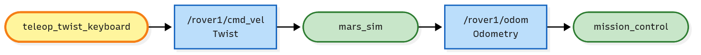
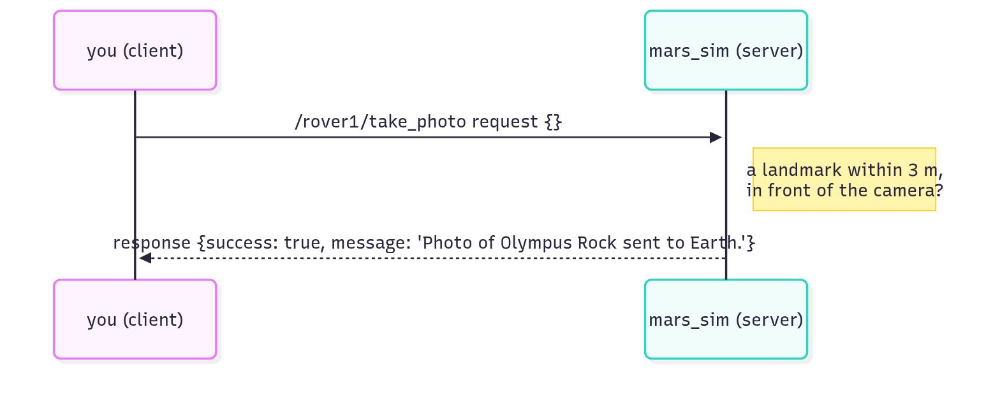
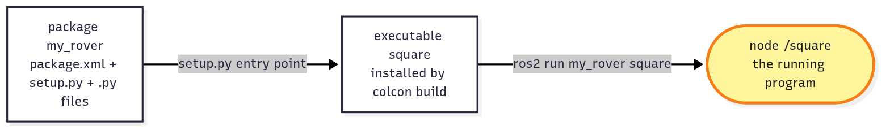
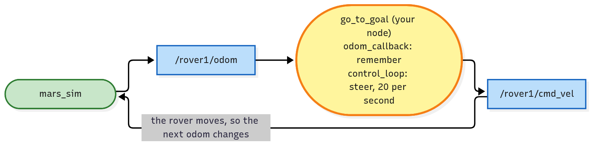
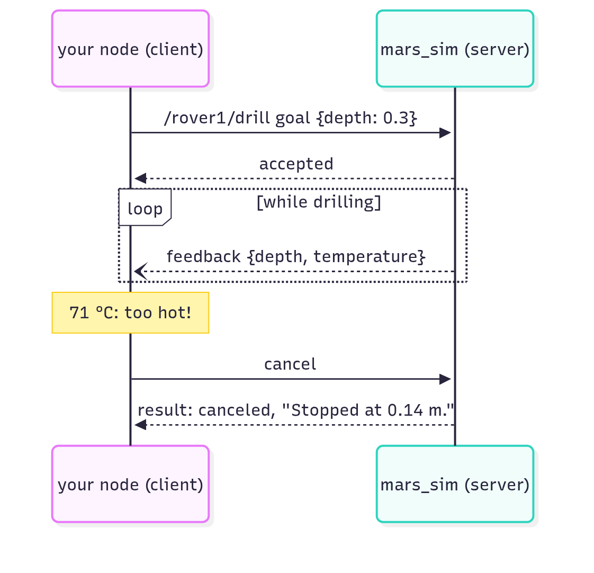
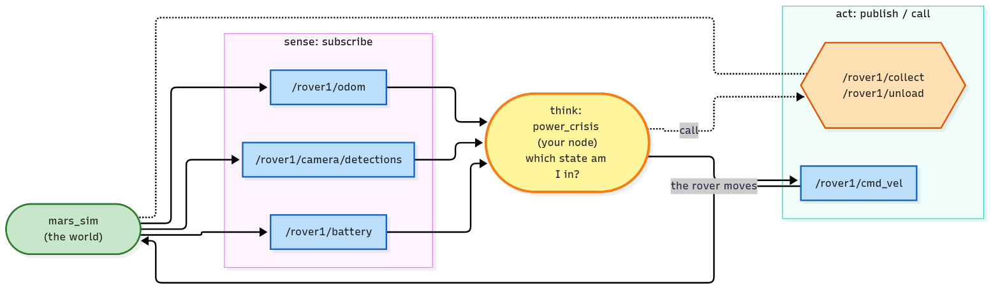
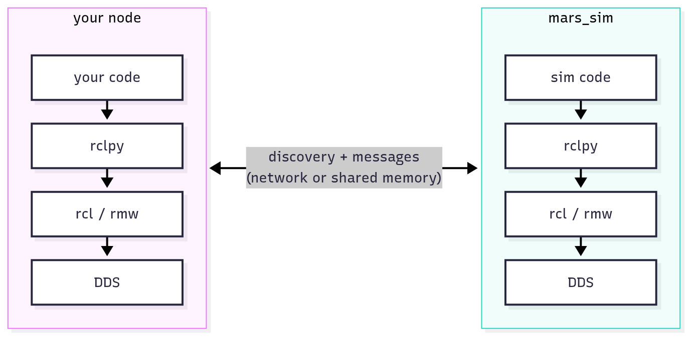

<!-- _class: lead -->
<!-- _paginate: false -->
<!-- _footer: "" -->
<!-- _header: Mars Rover Academy workshop -->

# ROS 2 in one hour

How robot software talks to itself, shown live on a Mars rover.

ROS 2 Jazzy or newer · github.com/kittinook/ros2_tutorial

<!--
0:00. Welcome. Goal for the hour: everyone leaves knowing what a node, topic, service, action and parameter are, and how they fit together. We won't type much code ourselves; I run things live and you watch the rover react.
Before starting: the workspace built and sourced in three terminals, rover_solutions built (it's not in the public repo), teleop_twist_keyboard installed, and your own ROS_DOMAIN_ID so nobody in the room drives your rover.
-->

---

<!-- header: Why ROS 2 -->

# A robot is a team of programs

| Camera driver | Planner | Motor driver | Safety monitor |
|---|---|---|---|
| sends 30 images a second | decides where to go next | turns speed commands into wheel motion | stops everything when something looks wrong |

<br>

Different people write them, sometimes in different languages, and they may run on different computers. They still have to exchange data all the time.

<!--
0:01 to 0:03. Ask the room: what programs would a Mars rover need? Collect three or four answers, they'll match the table. Robot software is never one program. The hard part is how the programs exchange data reliably while all running at once. That's the problem ROS solves.
-->

---

# ROS 2 gives them a common language

### Communication
Programs talk through **topics, services, actions and parameters**. That's most of today.

### Tools
Look inside a running robot, send it messages by hand, record and replay it.

### Ecosystem
Ready-made drivers, navigation (Nav2) and arm planning (MoveIt) that speak the same language.

<p class="muted">Despite the name, ROS is not an operating system. It's a set of libraries and tools on top of Linux (and macOS and Windows).</p>

<!--
0:03 to 0:05. Keep this short; today goes deep only on the first part. We use ROS 2 Jazzy on Ubuntu 24.04 (Humble and newer distros work the same way for everything today). The simulator is mars_sim, a 2-D Mars with a rover, rocks, sand and samples. It uses the same message types as real robots: Odometry, LaserScan, BatteryState, JointState, tf2.
-->

---

<!-- _class: demo -->
<!-- header: Live demo 1 -->

# Land and drive


```bash
# terminal 1
ros2 launch mission_control mission.launch.py mission:=0

# terminal 2
ros2 run teleop_twist_keyboard teleop_twist_keyboard \
  --ros-args -r cmd_vel:=/rover1/cmd_vel
```

`i` forward, `j` / `l` turn, `k` stop. Drive to beacon 1.

<!--
0:05 to 0:08. Run it, don't explain yet. Show the window: grid in metres, (0, 0) bottom-left, rover1 on the lander at (3, 3), the panel with the objectives. Click into terminal 2 (it needs keyboard focus) and drive to the beacon. The panel shows Mission complete.
The -r cmd_vel:=/rover1/cmd_vel part renames teleop's topic so it reaches our rover: remapping, without changing teleop's code. Then ask: what just happened between the keyboard and the rover? Two programs, and they never call each other. Leave both terminals running.
-->

---

<!-- header: Nodes and topics -->

# A node is one program with one job

A robot is many nodes running at the same time. They never call each other's functions directly, so you can replace one without touching the others.

Right now there are three:

| Node | Job |
|---|---|
| `mars_sim` | the world and the rover |
| `mission_control` | the referee: objectives and stars |
| `teleop_twist_keyboard` | your keyboard |

<!--
0:08 to 0:10. Stress "one job per node": the simulator doesn't know about stars, the referee doesn't draw anything. That separation is what lets us replace the keyboard with our own program later.
-->

---

# Nodes talk through topics



- **A named channel**: publishers send to a name, subscribers listen to it
- **One message type**: every message on `/rover1/odom` is an `Odometry`
- **Nobody knows anybody**: teleop has no idea who listens, like posting in a group chat

<!--
0:10 to 0:12. Walk the arrows: the keyboard publishes velocity commands on /rover1/cmd_vel, the simulator subscribes and moves the rover, then publishes where it is on /rover1/odom 50 times a second, and the referee subscribes to that to check the beacon.
Colours: green = existing node, yellow = you, blue = topic. Same colours as every system map in the course.
-->

---

<!-- _class: demo -->
<!-- header: Live demo 2 · terminal 3 -->

# Look inside the running system

```bash
ros2 node list                        # who is running?
ros2 topic list                       # which channels exist?
ros2 topic echo /rover1/odom          # listen in (Ctrl+C)
ros2 topic hz /rover1/odom            # how often?
ros2 topic info -v /rover1/cmd_vel    # who publishes it?
ros2 run rqt_graph rqt_graph          # the whole picture
```

Drive with teleop while **echo** runs and watch the position change.

<!--
0:12 to 0:17. Open a third terminal and source it. node list: /mars_sim, /mission_control, /teleop_twist_keyboard. echo the odometry and drive so they see the numbers move; point out position x, y and the orientation, which is a quaternion (mission 5 explains it). hz: 50 per second. info -v shows teleop_twist_keyboard publishing cmd_vel, which is how the referee catches teleop in the coding missions.
rqt_graph is optional (sudo apt install ros-$ROS_DISTRO-rqt-graph).
-->

---

<!-- header: Nodes and topics -->

# Every topic carries one message type

```text
$ ros2 interface show geometry_msgs/msg/Twist
Vector3 linear
  float64 x      <- forward speed (m/s)
  float64 y
  float64 z
Vector3 angular
  float64 x
  float64 y
  float64 z      <- turn rate (rad/s)
```

`/rover1/cmd_vel` uses **Twist**. A ground robot only needs two of its six numbers, and the same message drives a TurtleBot, a warehouse robot or a real rover. Angles are in radians: a quarter turn is 1.5708.

<!--
0:17 to 0:19. Run interface show live. Naming: package (geometry_msgs), kind (msg), type (Twist). Two nodes connect only if they agree on name AND type. Positive linear.x = forward, positive angular.z = turn left.
-->

---

<!-- _class: demo -->
<!-- header: Live demo 3 · terminal 3 -->

# Publish a message yourself


```bash
# drive: one message = 1 second of motion
ros2 topic pub --rate 1 --times 3 /rover1/cmd_vel \
  geometry_msgs/msg/Twist "{linear: {x: 1.0}}"
ros2 topic pub --once /rover1/cmd_vel \
  geometry_msgs/msg/Twist "{angular: {z: 1.5708}}"

# talk
ros2 topic pub --once /rover1/radio \
  std_msgs/msg/String "{data: 'Hello, Earth'}"
```

Teleop is still running. Both reach the rover: a topic can have **many publishers**.

<!--
0:19 to 0:22. Pattern: ros2 topic pub, options first, then topic, type, data as YAML. The rover follows a command for 1 second and then stops by itself (a watchdog, like real robots have), so three messages at 1 m/s = 3 m, and 1.5708 rad/s for one second = a quarter turn. The speech bubble shows for 5 seconds.
Ask: how many nodes subscribe to /rover1/radio? Two: the simulator and mission_control (ros2 topic info /rover1/radio).
-->

---

<!-- header: Services -->

# A service is a question with one answer



Topics stream data and nobody replies. A service answers once, so you know the job was done and what came out of it.

<!--
0:22 to 0:24. "Please take a photo." With a topic you'd shout it and never know if it worked. The response says success true or false, and the message says why. One node (the server) offers the service; any node can be a client.
-->

---

<!-- _class: demo -->
<!-- header: Live demo 4 · mission 3 -->

# Spawn, move, take a photo


```bash
# terminal 1: ros2 launch mission_control mission.launch.py mission:=3
ros2 service list
ros2 service call /spawn_rover mars_interfaces/srv/SpawnRover \
  "{name: scout, x: 4.0, y: 6.0, yaw: 0.0}"
ros2 service call /rover1/take_photo std_srvs/srv/Trigger
ros2 service call /rover1/teleport mars_interfaces/srv/Teleport \
  "{x: 14.0, y: 15.0, yaw: 0.0}"
ros2 service call /rover1/take_photo std_srvs/srv/Trigger
```

Read each response: the first photo fails, and it tells you why.

<!--
0:24 to 0:29. Close teleop and relaunch with mission:=3. Show the form first: ros2 service type /spawn_rover, then ros2 interface show mars_interfaces/srv/SpawnRover. The --- line splits request (above) from response (below).
After spawning, ros2 topic list | grep scout: one call created a whole new set of topics and services. Teleport is a simulator tool (Gazebo has the same); real rovers have to drive. The second photo, 2 m from Olympus Rock and facing it, works.
-->

---

<!-- header: Services -->

# Topic or service?

| | Topic | Service |
|---|---|---|
| Shape | a stream, one way | one request, one response |
| Reply? | never | always, exactly one |
| Good for | position, sensors, velocity | spawn, take a photo, collect, grab |
| On the rover | `/rover1/odom`, `/rover1/cmd_vel` | `/spawn_rover`, `/rover1/take_photo` |

<br>

Quick test: would you ask it again a moment later anyway? Then it's a topic.

<!--
0:29 to 0:31. Quiz before revealing: turn the rover (topic), take a photo (service), battery level (topic), pick up a sample (service).
Halfway. If you're behind, jump to "Which one do I need?" and the wrap-up from here.
-->

---

<!-- header: Your own node -->

# From the terminal to your own code



```bash
ros2 pkg create --build-type ament_python my_rover --dependencies rclpy geometry_msgs
colcon build --symlink-install && source install/setup.bash
ros2 run my_rover square
```

<!--
0:31 to 0:33. Typing commands is fine for exploring, but a robot needs a program that does it for you. Package = the box of code, executable = one program in the box, node = the running thing. One executable can run twice as two nodes; that comes back with namespaces. Don't build live; it's mission 4 for the learners.
-->

---

# Every node has the same skeleton

```python
def main():
    rclpy.init()          # 1 start ROS
    node = Square()       # 2 create the node
    rclpy.spin(node)      # 3 run callbacks until Ctrl+C
    rclpy.shutdown()      # 4 stop
```

**spin()** is the event loop. It waits for messages, timer ticks and service answers, and calls your functions when they arrive.

So you never write `while True` yourself. You tell ROS what to call, and when.

<!--
0:33 to 0:35. The course files wrap spin in try/except KeyboardInterrupt so Ctrl+C exits cleanly; this is the bare shape. Everything interesting happens in functions spin calls for you: callbacks.
-->

---

# Publisher and timer: drive in circles

```python
class Square(Node):
    def __init__(self):
        super().__init__('square')
        self.publisher = self.create_publisher(Twist, '/rover1/cmd_vel', 10)
        self.create_timer(0.1, self.timer_callback)     # ROS calls you every 0.1 s

    def timer_callback(self):
        msg = Twist()
        msg.linear.x = 1.0
        msg.angular.z = 0.5
        self.publisher.publish(msg)                     # same message as the CLI demo
```

`create_publisher` takes the type, the topic and a queue size.

<!--
0:35 to 0:37. This replaces ros2 topic pub --rate 10. Why keep sending? The rover stops a second after the last command, so a crashed program can't leave it driving. Optional: ros2 run rover_solutions square on mission 4.
This node only sends; it has no idea where the rover is. That's open loop, and it sets up the next slide.
-->

---

# Subscriber: the node opens its eyes



```python
self.create_subscription(Odometry, '/rover1/odom', self.odom_callback, 10)

def odom_callback(self, msg):
    self.pose = msg.pose.pose          # just remember it; the timer decides
```

<!--
0:37 to 0:39. Callbacks only remember the newest data; one timer makes every decision with it. The timer computes the angle to the beacon with atan2 and turns proportionally to the error: a P controller. The heading comes as a quaternion; one line of maths turns it into an angle (mission 5). Beacons come from mission_control on /mission/goals (left out to keep the picture simple). Look, compute, steer, look again: a closed loop.
-->

---

<!-- _class: demo -->
<!-- header: Live demo 5 · mission 5 -->

# A closed loop fixes itself


```bash
# terminal 1
ros2 launch mission_control mission.launch.py mission:=5
# terminal 2
ros2 run rover_solutions go_to_goal
# terminal 3: push it off course
ros2 service call /rover1/teleport \
  mars_interfaces/srv/Teleport "{x: 10.0, y: 10.0, yaw: 3.0}"
```

It turns around and heads for the beacon again. Sand slows it down, and it still arrives.

<!--
0:39 to 0:43. rover_solutions is the instructor-only package. If learners already wrote mission 5, run theirs: ros2 run my_rover go_to_goal.
Point at the sand patches: the rover slips to 60 % speed there, which would ruin a pre-planned (open-loop) route. Teleport mid-run: it sees the new pose and steers back. The panel will flag the teleport (it costs stars in this mission), which is fine for a demo.
-->

---

<!-- _class: statement -->
<!-- header: The one rule -->

# Never wait inside a callback.

spin() runs one callback at a time. If yours sleeps, nothing else runs: no messages, no timer ticks, not even the service answer you're waiting for.

```python
self.future = self.collect_client.call_async(Trigger.Request())
# ...and on a later tick: if self.future.done(): ...
```

<!--
0:43 to 0:45. The bug every beginner hits. call_async is placing an order and hanging up with a receipt; waiting in the callback is staying on the phone while the kitchen needs you to open the door. Timers instead of while + sleep, call_async + future.done() instead of waiting. Parallel callbacks exist (multi-threaded executors, CONCEPTS.md) but you rarely need them.
-->

---

<!-- header: Configure and scale -->

# A setting inside a node: parameters

Speeds, ranges, which robot. Set at start-up, change while it runs.

```bash
ros2 run my_rover sample_hunter --ros-args -r __ns:=/rover2 -p max_speed:=0.8
ros2 param set /rover2/sample_hunter max_speed 1.0
```

And one node, many robots:


<!--
0:45 to 0:47. In the code write 'cmd_vel', not '/rover1/cmd_vel'; the namespace decides which robot. Three tools for reuse: namespaces (same code, different robot), parameters (same code, different settings), launch files (the whole team in one command). Real fleets do exactly this.
-->

---

<!-- _class: demo -->
<!-- header: Live demo 6 · mission 7 -->

# Two rovers, one program


```bash
# terminal 1
ros2 launch mission_control mission.launch.py mission:=7
# terminal 2
ros2 launch rover_solutions fleet.launch.py
# terminal 3
ros2 node list
ros2 param get /rover2/sample_hunter max_speed
ros2 param set /rover2/sample_hunter max_speed 1.0
```

rover2 speeds up the moment the parameter changes.

<!--
0:47 to 0:50. node list shows /rover1/sample_hunter and /rover2/sample_hunter: the same executable, twice, each with its own camera and cmd_vel. Both start at max_speed 0.8; setting rover2 to 1.0 speeds up only rover2, live. The panel ticks "change a parameter while the node is running" because mission_control listens to /parameter_events.
-->

---

<!-- header: Actions -->

# A long job you can watch: actions



Send a goal, get **feedback** while it runs, then a **result**. You can **cancel** at any time.

<!--
0:50 to 0:51. A service for jobs that take seconds or minutes. The drill on the rover is an action: it reports depth and temperature while it works. Real examples: Nav2's navigate_to_pose, MoveIt's arm motions.
-->

---

<!-- _class: demo -->
<!-- header: Live demo 7 · mission 11 -->

# Drill, and watch it heat up

```bash
# terminal 1
ros2 launch mission_control mission.launch.py mission:=11
# terminal 2: park on a drill site first (or: ros2 run rover_solutions drill_and_stow)
ros2 action list
ros2 interface show mars_interfaces/action/Drill
ros2 action send_goal --feedback /rover1/drill \
  mars_interfaces/action/Drill "{depth: 0.3}"
```

Watch the temperature in the feedback climb past 80 °C.

<!--
0:51 to 0:54. Easiest: start rover_solutions drill_and_stow and let it do one hole: it cancels at 70 °C, waits for the bit to cool, and drills again, three times per hole. Then stop it and send a goal by hand on the next site: nobody cancels, the bit passes 80 °C and breaks, and the mission fails. Without feedback you couldn't know when to stop; without cancel you couldn't stop. That's why this is an action and not a service.
-->

---

<!-- header: The big picture -->

# Which one do I need?

| When you need | Use | On the rover |
|---|---|---|
| data that keeps flowing | **topic** | `/rover1/odom`, `/rover1/scan` |
| a quick job, and to know the outcome | **service** | `/rover1/collect` |
| a long job with progress or cancel | **action** | `/rover1/drill` |
| a setting you tune or configure | **parameter** | `max_speed` |

<br>

Under the hood, actions and parameters are built from topics and services.

<!--
0:54 to 0:55. If you're short on time, jump here from "Topic or service?". The most useful table of the day. Ask for real-robot examples: lidar scan (topic), reset odometry (service), drive to the kitchen (action), maximum speed (parameter).
-->

---

# Put together: sense, think, act



**Finale if there's time:** `mission:=12`, then `ros2 run rover_solutions meteorite_mover`

<!--
0:55 to 0:56. Mission 8 in one picture, and the shape of almost every robot node: topics in, decide, topics and services out.
Finale: ros2 launch mission_control mission.launch.py mission:=12 and ros2 run rover_solutions meteorite_mover. The rover grips a meteorite with both arms and carries it to the lander. Same building blocks: joint topics, gripper services, tf2 and the mission 5 driving loop.
-->

---

# There is no central server



Nodes find each other by themselves and talk directly through DDS, so they can run on different computers and start in any order. The same `ROS_DOMAIN_ID` on one network means one system: in class, everyone uses their own number.

<!--
0:56 to 0:57. ROS 1 had a master process; ROS 2 doesn't. Two laptops with the same ROS_DOMAIN_ID see each other's rovers. Quick wow demo if time allows: same domain id on two machines, run go_to_goal on one and watch the rover on the other. The 10 in create_publisher is a QoS setting (keep the last 10 messages); see ARCHITECTURE.md.
-->

---

<!-- header: Where to go next -->

# Thirteen missions, one rover

| Part 1: the rover | Part 2: the arms | Reference |
|---|---|---|
| 0–3: today's demos, hands-on | 9: joints, grippers, tf2 | `CONCEPTS.md`: every part of ROS 2 |
| 4–6: your own nodes | 10: frames and IK | `ARCHITECTURE.md`: how parts combine |
| 7: namespaces, parameters, launch | 11: the drill action, pick and place | `CHEATSHEET.md`: all the commands |
| 8: boss, battery crisis | 12: boss, carry meteorites | |

<br>

`github.com/kittinook/ros2_tutorial`

<!--
0:57 to 0:58. Each mission is checked automatically and earns up to three stars, so learners can continue at their own pace. Missions 0 to 3 repeat today's demos as exercises: start there. The repo is private at the moment; share it with the class before pointing them at the link.
-->

---

<!-- _class: demo -->
<!-- header: Recap -->

# Five words to take home

| node | topic | service | action | parameter |
|---|---|---|---|---|
| one program, one job | a stream, nobody replies | one question, one answer | a long job you can watch | a setting you can tune |

<br>

## Questions?

<!--
0:58 to 1:00. Ask someone to explain each word in their own words, using the rover. If they can, the hour worked. Remind everyone to start with mission 0.
-->
